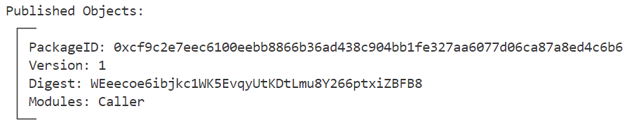
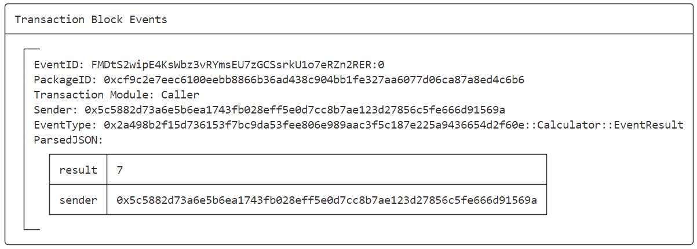
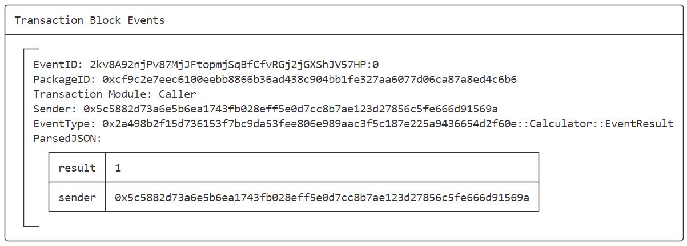

# SUI Move开发必知必会——如何调用外部合约？

*rzexin 2024.03.15*

## 1 前言

本文将准备两个合约，一个已经部署在链上的非本地简单计算器合约（`simple_calculator`），该合约代码已开源在`github`上。另一个用户的业务合约（`calculator_caller`），在该业务合约中，将调用非本地合约中的加（`add`）和减（`subtract`）方法。

## 2 准备远程合约

> 开发一个简单的计算器合约，作为远程部署的合约，在本地合约中去进行调用。

### 2.1 创建合约工程

```bash
sui move new simple_calculator
```

### 2.2 修改Move.toml配置文件

> `[package]`名称即为其他调用者所使用依赖包名称，需要清晰准确定义。

```toml
[package]
name = "Calc"
version = "0.1.0"
```

### 2.3 合约开发

```rust
module simple_calculator::Calculator {

    use sui::event;
    use sui::tx_context::{Self, TxContext};

    const ErrFirstNumberLessThanSecondNumber: u64 = 1;
    const ErrDivideByZero: u64 = 2;

    struct EventResult has  copy, drop {
        sender: address,
        result: u64,
    }

    public entry fun add(a: u64, b: u64, ctx: &TxContext ): u64{
        let sender = tx_context::sender(ctx);
        let result = a + b;
        event::emit(EventResult { sender, result });   
        result
    }

    public entry fun subtract(a: u64, b: u64, ctx: &TxContext ): u64{
        assert!(a >= b, ErrFirstNumberLessThanSecondNumber);
        let sender = tx_context::sender(ctx);
        let result = a - b;
        event::emit(EventResult { sender, result });   
        result
    }
}
```

### 2.4 合约发布

- **执行发布命令**

```bash
sui client publish --gas-budget 100000000
```

- **将`published-at`追加到`[package]`，值为`PackageID`**

> 否则调用者合约部署时，将会报错：
>
> ```bash
> Failed to publish the Move module(s), reason: Package dependency "Calc" does not specify a published address (the Move.toml manifest for "Calc" does not contain a published-at field).
> If this is intentional, you may use the --with-unpublished-dependencies flag to continue publishing these dependencies as part of your package (they won't be linked against existing packages on-chain).
> ```

```toml
[package]
......
published-at = "0x2a498b2f15d736153f7bc9da53fee806e989aac3f5c187e225a9436654d2f60e"
```

- **将`PackageID`记录到`[addresses]`**

> 否则调用者合约部署时，将会报错：
>
> ```bash
> Failed to publish the Move module(s), reason: [warning] Local version of dependency 2a498b2f15d736153f7bc9da53fee806e989aac3f5c187e225a9436654d2f60e::Calculator was not found.
> 
> This may indicate that the on-chain version(s) of your package's dependencies may behave differently than the source version(s) your package was built against.
> 
> Fix this by rebuilding your packages with source versions matching on-chain versions of dependencies, or ignore this warning by re-running with the --skip-dependency-verification flag.
> ```

```toml
[addresses]
simple_calculator = "0x2a498b2f15d736153f7bc9da53fee806e989aac3f5c187e225a9436654d2f60e"
```

### 2.5 提交合约代码到开源仓库

https://github.com/bityoume/how_to_sui/tree/main/simple_calculator

## 3 准备本地业务合约

### 3.1 创建合约工程

```bash
sui move new calculator_caller
```

### 3.2 修改Move.toml配置文件

> 在`dependencies`中增加远程合约所在仓库的地址、子路径和分支

```toml
[dependencies]
......
Calc = { git = "https://github.com/bityoume/how_to_sui.git", subdir = "simple_calculator", rev = "main" }
```

### 3.3 合约开发

> 在本地合约代码中，调用远程合约中的加（`add`）和减（`subtract`）方法。

```rust
module calculator_caller::Caller {
    use simple_calculator::Calculator;
    use sui::tx_context::TxContext;

    public entry fun add(a: u64, b: u64, ctx: &TxContext ) {
        let _ = Calculator::add(a, b, ctx);
    }

    public entry fun subtract(a: u64, b: u64, ctx: &TxContext ) {
        let _ = Calculator::subtract(a, b, ctx);
    }
}
```

### 3.4 合约发布

- **执行发布命令**

```bash
sui client publish --gas-budget 100000000
```

- **将`PackageID`记录到环境变量**

```bash
export PACKAGE_ID=0xcf9c2e7eec6100eebb8866b36ad438c904bb1fe327aa6077d06ca87a8ed4c6b6
```



## 4 远程合约调用测试

> 通过触发的事件，确认合约接口是否被成功调用。

### 4.1 调用add方法

```bash
sui client call --function add --package $PACKAGE_ID --module Caller --args 3 4 --gas-budget 10000000
```



### 4.2 调用subtract方法

- **失败调用**

```bash
sui client call --function subtract --package $PACKAGE_ID --module Caller --args 3 4 --gas-budget 10000000

Error executing transaction: Failure {
    error: "MoveAbort(MoveLocation { module: ModuleId { address: 2a498b2f15d736153f7bc9da53fee806e989aac3f5c187e225a9436654d2f60e, name: Identifier(\"Calculator\") }, function: 1, instruction: 8, function_name: Some(\"subtract\") }, 1) in command 0",
}
```

- **成功调用**

```bash
sui client call --function subtract --package $PACKAGE_ID --module Caller --args 5 4 --gas-budget 10000000
```



## 5 更多

欢迎关注微信公众号：**Move中文**，开启你的 **Sui Move** 之旅！

