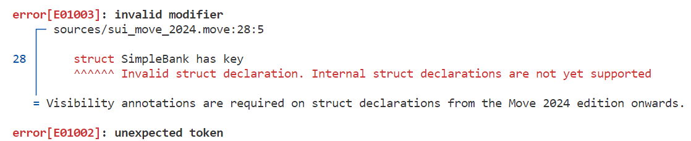
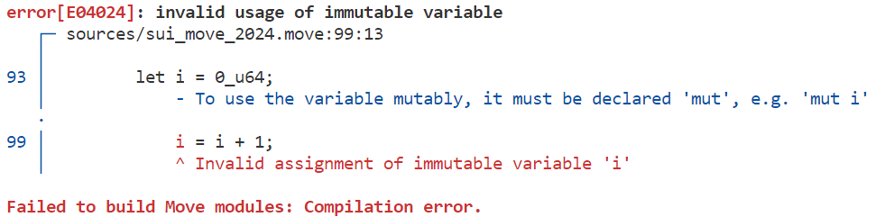

# SUI Move开发必知必会——SUI Move 2024迁移指南及新语法实践

*rzexin 2024.04.04*

## 1 前言

`SUI Move`在`2024`年迎来重大更新，引入了许多新功能，涵盖**新特性**，例如：**方法语法（`method syntax`）**、**位置域（`positional fields`）**、**循环标签（`loop labels`）**等，以及**不兼容更新**，例如：**数据类型可见性（Datatype visibility requirements）**、 **可变性要求（Mutability requirements）** 等。这些更新为`Move`编程语言引入了新的定义数据和调用函数的方式等，使得在`Sui`上构建应用程序更加高效灵活，也为未来要推出的新功能铺平道路。

本文中`SUI Move 2024`新增功能内容参考自：https://blog.sui.io/move-2024-migration-guide/ ，主要包括：

- **新特性（`New features`）**
  > 可以向前兼容的特性，即新旧语法都能进行正常编译
  - **方法语法（Method syntax）**
  - **索引语法（Index syntax）**
  - **位置域（Positional fields）**
  - **可嵌套`use`别名（Nested `use`）**
  - **常用标准库默认引入（standard library defaults）**
  - **等式中的自动引用（Automatic referencing in equality）**
  - **循环标记（Loop labels）**
  - **带值跳出循环（`break` with value）**


- **不兼容更新（`Breaking changes `）**
  > 无法向前兼容，即不再支持旧语法，若编译会报错
  - **数据类型可见性（Datatype visibility requirements）**
  - **可变性要求（Mutability requirements）**
  - **移除`friends`和`public(friend)`**
  - **新关键字（New keywords）**
  - **修订路径和名字空间（Revised paths and namespaces）**

除此之外还有很多新特性在路上，例如：语法宏（`syntactic macros`）、具有模式匹配的枚举（`enums with pattern matching`）和其他用户定义的语法扩展。

## 2 迁移指南

要完成历史传统`Move`合约迁移到`SUI Move 2024`特别的简单，只需要2步：

### 2.1 第一步：升级SUI版本

需要使用`sui 1.22.0`及以上版本。

### 2.2 第二步：执行迁移命令

在合约根目录里执行`sui move migrate`命令

- 终端会显示要进行的更改的合约差异，如果接受更改，会自动将现存 **历史版本（`legacy`）** 的合约，迁移成 **新版合约（`2024.beta`）** 代码，并会更新`Move.toml`文件，同时也会生成一个`migration.patch`文件，将变更差异记录在其中。
- 主要修改的代码就是上面提到的 **不兼容更新（`Breaking changes`）** 部分

### 2.3 自动迁移实操

```bash
$ sui --version
sui 1.22.0-0362997459

$ sui move migrate
Please select one of the following editions:
1) 2024.beta
2) legacy
Selection (default=1): 1

Would you like the Move compiler to migrate your code to Move 2024? (Y/n) 
Generated changes . . .
INCLUDING DEPENDENCY Sui
INCLUDING DEPENDENCY MoveStdlib
BUILDING nfts_num
The following changes will be made.
============================================================
--- sources/num.move
+++ sources/num.move
@@ -7 +7 @@
-    struct Num has key, store {
+    public struct Num has key, store {
@@ -12 +12 @@
-    struct NumIssuerCap has key {
+    public struct NumIssuerCap has key {
============================================================
Apply changes? (Y/n) 

Updating "sources/num.move" . . .

Changes complete
Wrote patchfile out to: ./migration.patch

Recorded edition in 'Move.toml'
```

## 3 新语法实战

> 以下会通过一个合约示例，展示`SUI Move 2024`主要新增的语法特性，考虑到合约实现逻辑的连贯性，会混合使用**新特性**和**不兼容更新**的语法。
>
> 为了一目了然会标题旁做一下标记，以区分：**新特性（🎉）** 和 **不兼容更新（💥）**，并附上官方文档链接，方便大家查阅。

### 3.1 可嵌套`use`别名（Nested `use`）🎉

> [Nested `use` and standard library defaults](https://github.com/tnowacki/sui/blob/main/docs/content/guides/developer/advanced/move-2024-migration.mdx?nested-use-and-standard-library-defaults)

支持嵌套使用别名，可以带来代码编写的简洁。

```rust
module bityoume::sui_move_2024 {
    // legacy code
    // use sui::balance; 
    // use sui::coin::{Self, Coin};

    // Move 2024 code
    use sui::{balance, coin::{Self, Coin}};
}
```

### 3.2 常用标准库默认引入（standard library defaults）🎉

> [Nested `use` and standard library defaults](https://github.com/tnowacki/sui/blob/main/docs/content/guides/developer/advanced/move-2024-migration.mdx?nested-use-and-standard-library-defaults)

以下声明将会自动包含在每个模块中，不需要再写了。这些定义很常用，几乎每个模块都会用到，默认引入，可以减少开发者重复去编写。

```rust
// legacy code
use std::vector;
use std::option::{Self, Option};
use sui::object::{Self, ID, UID};
use sui::transfer;
use sui::tx_context::{Self, TxContext};

// Move 2024 code
<空，默认引入>
```

### 3.3 数据类型可见性（Datatype visibility requirements）💥

> [Datatype visibility requirements](https://github.com/tnowacki/sui/blob/main/docs/content/guides/developer/advanced/move-2024-migration.mdx?nested-use-and-standard-library-defaults#datatype-visibility-requirements)

- `Move 2024`要求所有结构体都必须使用`public`关键字声明，当前`Move`中的所有结构体都是公开的
- 未来的版本可能引入新的可见性标识符，但当前若不使用`public`，编译就会报错
- 由于`UID`和`vector`都已经默认引入了，所以不需要再额外引入，结构体中都能正确使用

```rust
module bityoume::sui_move_2024 {
    use sui::{balance::{Self, Balance}, coin::{Self, Coin}};
    use sui::vec_map::{Self, VecMap};
    use sui::sui::SUI;

    // legacy code
    // struct SimpleBank has key

    // Move 2024 code
    public struct SimpleBank has key {
        id: UID,
        balances: VecMap<address, Balance<SUI>>,
        coin_values: vector<u64>,
    }
}
```

- 这是不兼容更新，如果使用旧的写法将会报错：

  

### 3.4 方法语法（Method syntax）🎉

> [Method syntax](https://github.com/tnowacki/sui/blob/main/docs/content/guides/developer/advanced/move-2024-migration.mdx?ref=blog.sui.io#method-syntax)

- 可以调用与接收器（示例中的`simple_bank`和`amount`）类型相同的模块中定义的任何函数作为方法
- 必要时会自动借用（添加`&`和`&mut`）
- 对于在模块外定义的函数，可以使用`public use fun`和`use fun`声明方法
- 从以下代码对比中，不难看出，新语法实现，代码会简洁不少

```rust
    // legacy code
    public entry fun deposit_legacy (
        simple_bank: &mut SimpleBank, 
        amount: &mut Coin<SUI>, 
        ctx: &mut TxContext) {

        assert!(coin::value(amount) > 0, EInvalidAmount);

        let value = coin::value(amount);
        let paid = coin::split(amount, value, ctx);

        let sender = tx_context::sender(ctx);
        let totalBalance;

        if ( vec_map::contains(&simple_bank.balances, &sender) ) {
            let myBalance = vec_map::get_mut(&mut simple_bank.balances, &sender);
            totalBalance = balance::join(myBalance, coin::into_balance(paid));
        } else {
            vec_map::insert(&mut simple_bank.balances, sender, coin::into_balance(paid));
            totalBalance = value;
        };

        vector::push_back(&mut simple_bank.coin_values, value);
    }

    // Move 2024 code
    public entry fun deposit_2024 (
        simple_bank: &mut SimpleBank, 
        amount: &mut Coin<SUI>, 
        ctx: &mut TxContext) {

        assert!(amount.value() > 0, EInvalidAmount);

        let value = amount.value();
        let paid = amount.split(value, ctx);

        let sender = tx_context::sender(ctx);
        let totalBalance;

        if ( simple_bank.balances.contains(&sender) ) {
            let myBalance = simple_bank.balances.get_mut(&sender);
            totalBalance = myBalance.join(paid.into_balance());
        } else {
            simple_bank.balances.insert(sender, paid.into_balance());
            totalBalance = value
        };

        simple_bank.coin_values.push_back(value);
    }
```

### 3.5 可变性要求（Mutability requirements）💥

> [Mutability requirements](https://github.com/tnowacki/sui/blob/main/docs/content/guides/developer/advanced/move-2024-migration.mdx?ref=blog.sui.io#mutability-requirements)

- 遗产版本所有变量都是隐式可变（`implicitly mutable`）
- 2024版必须显式声明其可变性，否则编译器将会报错：



```rust
    public entry fun increase_coin_values(
        simple_bank: &mut SimpleBank, 
        ctx: &mut TxContext) {
        let total_length = simple_bank.coin_values.length();

        // legacy code
        // let i = 0_u64;

        // Move 2024 code
        let mut i = 0_u64;

        while ( i < total_length ) {
            i = i + 1;
        }
    }
```

### 3.6 索引语法（Index syntax）🎉

> [Index syntax](https://github.com/tnowacki/sui/blob/main/docs/content/guides/developer/advanced/move-2024-migration.mdx?ref=blog.sui.io#index-syntax)

- 可以为函数添加`#[syntax(index)]`注解，这样便能使用`v[i]`风格进行方法调用

- 官方的`vector`库中，有添加该注解的示例：

  ```rust
      #[syntax(index)]
      #[bytecode_instruction]
      /// Acquire an immutable reference to the `i`th element of the vector `v`.
      /// Aborts if `i` is out of bounds.
      native public fun borrow<Element>(v: &vector<Element>, i: u64): &Element;
      
      #[syntax(index)]
      #[bytecode_instruction]
      /// Return a mutable reference to the `i`th element in the vector `v`.
      /// Aborts if `i` is out of bounds.
      native public fun borrow_mut<Element>(v: &mut vector<Element>, i: u64): &mut Element;
  ```

  说明我们可以如下方式进行调用：

  ```rust
  &x[i] // 展开为 x.borrow(i)
  &mut x[i] // 展开为 x.borrow_mut(i)
  ```

- 这种简化后的语法更易于阅读，也避免了使用复杂索引操作容易出现的问题

```rust
    public entry fun increase_coin_values(
        simple_bank: &mut SimpleBank, 
        ctx: &mut TxContext) {
        let total_length = simple_bank.coin_values.length();

        let mut i = 0_u64;
        while ( i < total_length ) {

            // legacy code
            *vector::borrow_mut(&mut simple_bank.coin_values, i) = 
            	*vector::borrow(&simple_bank.coin_values, i) + 1;

            // Move 2024 code
            *&mut simple_bank.coin_values[i] = simple_bank.coin_values[i] + 1;

            i = i + 1;
        }
    }
```

### 3.7 位置域（Positional fields）🎉

> [Positional fields](https://github.com/tnowacki/sui/blob/main/docs/content/guides/developer/advanced/move-2024-migration.mdx?ref=blog.sui.io#positional-fields)

- 2024版可以定义具有位置字段的结构体，这些字段由从零开始的索引访问

```rust
	public struct Pair(address, u64) has copy, drop, store;

    public struct SimpleBank has key {
        id: UID,
        balances: VecMap<address, Balance<SUI>>,
        coin_values: vector<u64>,
        pairs: vector<Pair>,
    }

    public entry fun increase_coin_values(
        simple_bank: &mut SimpleBank, 
        ctx: &mut TxContext) {
        let total_length = simple_bank.coin_values.length();

        let mut i = 0_u64;
        while ( i < total_length ) {
            *&mut simple_bank.coin_values[i] = simple_bank.coin_values[i] + 1;

            // Move 2024 code
            *&mut simple_bank.pairs[i].1 = simple_bank.pairs[i].1 + 1;
            
            event::emit(EventPair {
                sender: simple_bank.pairs[i].0,
                amount: simple_bank.pairs[i].1,
            });

            i = i + 1;
        }
    }
```

### 3.8 等式中的自动引用（Automatic referencing in equality）🎉

> [Automatic referencing in equality](https://github.com/tnowacki/sui/blob/main/docs/content/guides/developer/advanced/move-2024-migration.mdx?ref=blog.sui.io#automatic-referencing-in-equality)

- `==`和`!=`的两侧如果一侧是引用另一边不是，不是的这边会自动转成引用

```rust
    public entry fun increase_coin_values(
        simple_bank: &mut SimpleBank, 
        ctx: &mut TxContext) {
        let total_length = simple_bank.coin_values.length();
        let mut i = 0_u64;
        while ( i < total_length ) {
		    ......
            // Move 2024 code
            check(99, &simple_bank.pairs[i].1);
            i = i + 1;
        }
    }

    fun check(x: u64, r: &u64): bool {
        // legacy code
        // &x == r

        // Move 2024 code
        x == r
    }
```

### 3.9 循环标记（Loop labels）🎉

> [Loop labels](https://github.com/tnowacki/sui/blob/main/docs/content/guides/developer/advanced/move-2024-migration.mdx?ref=blog.sui.io#loop-labels)

- 嵌套循环中，可以直接为外部循环命名，可以直接`break`到外部命名的位置，而无需一层一层的`break`

```rust
    public entry fun loop_break (
        simple_bank: &mut SimpleBank, 
        ctx: &mut TxContext) {

        let total_length = simple_bank.coin_values.length();

        let mut i = 0_u64;
        let mut j = total_length - 1;

        'outer: while ( i < total_length ) {
            while ( j >= 0 ) {

                if (check(i, &j)) {
                    break 'outer
                };

                j = j - 1;
            };

            i = i + 1;
        };
    }
```

### 3.10 带值跳出循环（`break` with value）🎉

> [`break` with value](https://github.com/tnowacki/sui/blob/main/docs/content/guides/developer/advanced/move-2024-migration.mdx?ref=blog.sui.io#break-with-value)

- 在`loop`循环中，可以带值`break`出循环
- 也可以使用循环标记带值`break`出多层循环

```rust
    public entry fun break_with_value (
        simple_bank: &mut SimpleBank, 
        ctx: &mut TxContext) {

        let total_length = simple_bank.coin_values.length();

        // Move 2024: break with value
        let mut i = 0_u64;
        let x: u64 = loop {
            if ( i >= total_length ) {
                break 0
            };

            if (simple_bank.coin_values[i] > 100) {
                break simple_bank.coin_values[i]
            }
        };

        // Move 2024: break with label value
        let mut i = 0_u64;
        let mut j = total_length - 1;

        let y = 'outer: loop {
            while ( j >= 0 ) {

                if (check(simple_bank.coin_values[i], &simple_bank.coin_values[j])) {
                    break 'outer 100
                };

                j = j - 1;
            };

            i = i + 1;

            if (i==total_length-1) break 0
        };
    }
```

### 3.11 移除`friends`和`public(friend)`💥

> [Removing friends and `public(friend)`](https://github.com/tnowacki/sui/blob/main/docs/content/guides/developer/advanced/move-2024-migration.mdx?ref=blog.sui.io#removing-friends-and-publicfriend)

- 以下方式使用方式，在`2024`版将会报错

```rust
module pkg::m {
    friend pkg::a;
    public(friend) fun f() { ... }
}

module pkg::a {
    fun calls_f() { ... pkg::m::f() ... }
}
```

- 如果希望模块方法仅在包内可见，需要使用`public(package)`

```rust
module pkg::m {
    public(package) fun f() { ... }
}

module pkg::a {
    // this now works directly
    fun calls_f() { ... pkg::m::f() ... }
}
```

### 3.12 新关键字（New keywords）💥

> [New keywords](https://github.com/tnowacki/sui/blob/main/docs/content/guides/developer/advanced/move-2024-migration.mdx?ref=blog.sui.io#new-keywords)

- Move 2024 Beta在语言中添加了以下关键字：

  - **`enum`**
  - **`for`**
  - **`match`**
  - **`mut`**
  - **`type`**

- 但是在以前的版本中可能被用作标识符。为了帮助开发者迁移现有代码，新的语法规则允许使用反引号将这些关键字作为标识符使用，例如：

  ```
  let `type` = 0; 
  `type` + 1;
  ```

### 3.13 修订路径和名字空间（Revised paths and namespaces）

> [Revised paths and namespaces](https://github.com/tnowacki/sui/blob/main/docs/content/guides/developer/advanced/move-2024-migration.mdx?ref=blog.sui.io#revised-paths-and-namespaces)

- `Move 2024`为全局限定引入了前缀操作

- 传统版本

  ```rust
  use sui_system::sui_system;
  ...
  #[expected_failure(abort_code = sui_system::validator_set::EInvalidCap)]
  ```

- 2024版本

  ```rust
  use sui_system::sui_system;
  ...
  #[expected_failure(abort_code = ::sui_system::validator_set::EInvalidCap)]
                               // ^ note `::` here
  ```

## 4 更多

欢迎关注微信公众号：**Move中文**，开启你的 **Sui Move** 之旅！

