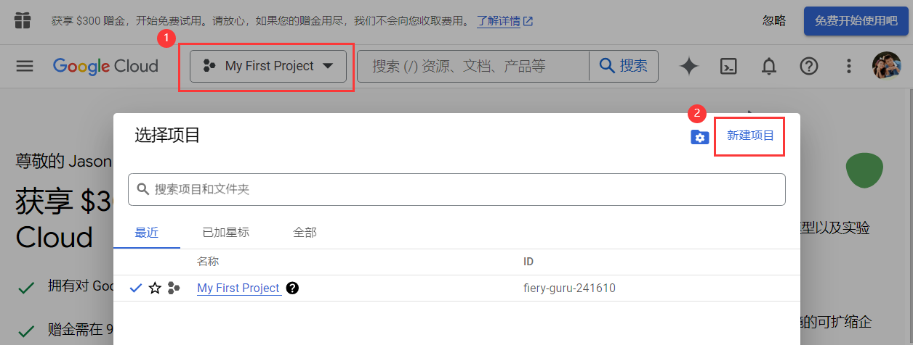
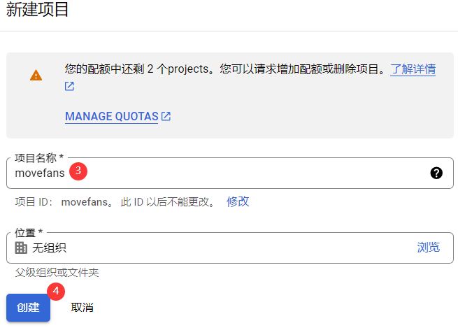
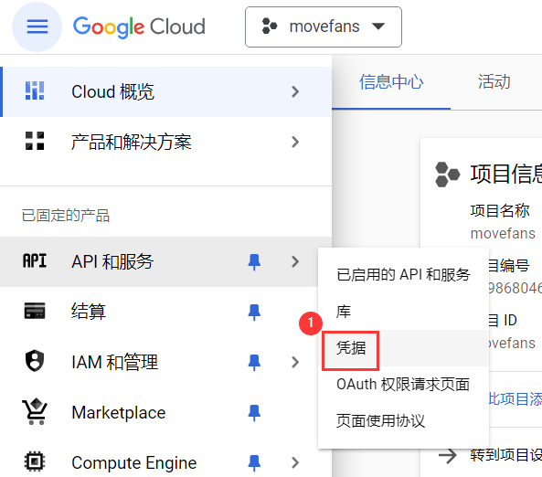
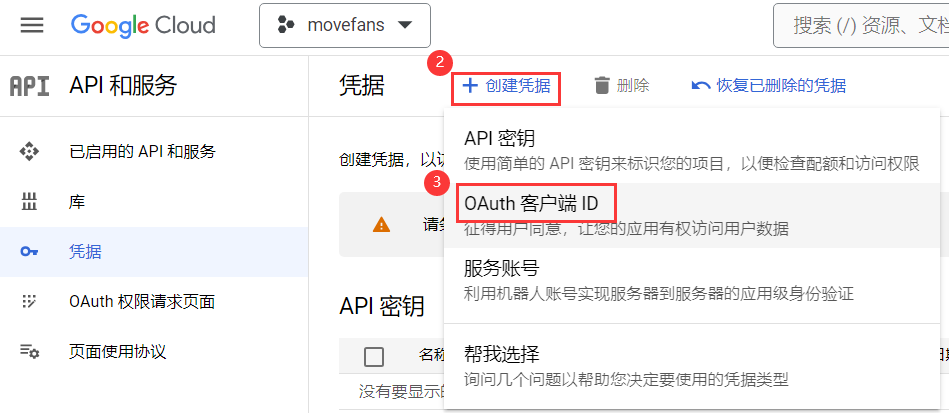
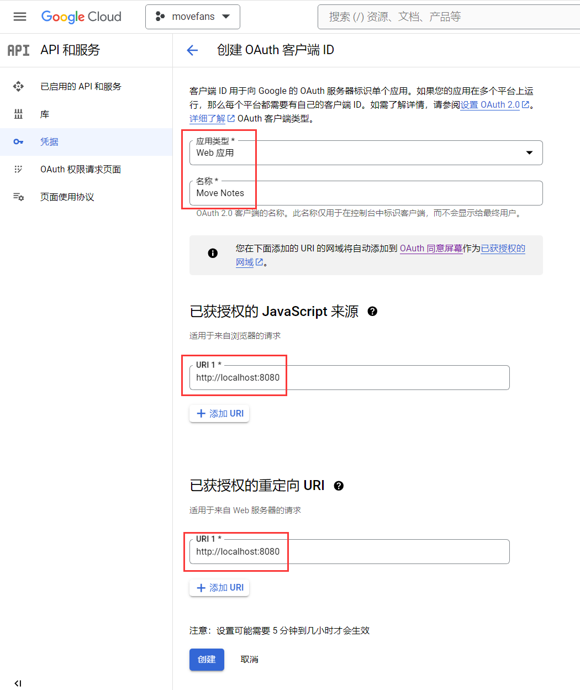
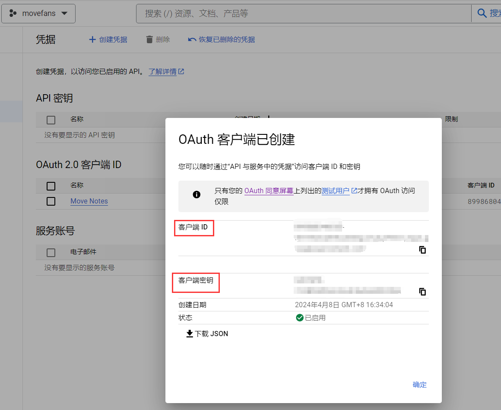

# SUI Move开发必知必会——如何构建一个基于zklogin的SUI Move dApp？

*rzexin 2024.04.08*

## 前言

本文将在`SUI`区块链上使用`React`前端和`Move`合约构建笔记本`Dapp`，笔记本合约允许用户创建和删除笔记，该`Dapp`将集成`zkLogin`，以允许用户使用传统`web2`的登录方式实现安全的用户身份验证。

实践目标：

- 开发一个`React`前端来与`Move`合约进行交互
- 在`Dapp`中集成`zkLogin`以实现安全的用户身份验证
- 了解并利用`zkLogin`的功能进行链上资产访问

本文参考自：https://dacade.org/communities/sui/challenges/19885730-fb83-477a-b95b-4ab265b61438/learning-modules/c9e21ff5-e7b3-4583-b21c-00c7176c10cc

## 依赖准备

### 样板代码获取

#### （1）下载样板代码

```bash
$ git clone https://github.com/dacadeorg/zk-login-boilerplate
```

#### （2）依赖安装

```bash
$ yarn install
```

#### （3）样板代码结构说明

- **代码结构**

```ini
zk-login-boilerplate/
├── download-sui-binaries.sh
├── download_zkey.sh
├── node_modules
├── package.json
├── public
├── README.md
├── src
│   ├── App.css
│   ├── App.js
│   ├── App.test.js
│   ├── assets
│   ├── AuthComponent.js
│   ├── components
│   ├── index.css
│   ├── index.js
│   ├── logo.svg
│   ├── reportWebVitals.js
│   └── setupTests.js
├── tsconfig.json
└── yarn.lock
```

- **功能说明**
  - **`public`**：此目录包含`index.html`文件，它是React应用程序的入口点；`favicon.ico`文件，该文件是出现在浏览器选项卡中的图标
  - **`src`**：此目录包含`index.js`文件，它是`React`应用程序的入口；`App.js`文件，这是`React`的主要组件
  - **`utils`**：此目录将包含用于与合约和`zkLogin`交互的辅助函数
  - **`download_zhkey.sh`**：此文件是下载`zkey.sh`脚本文件，该脚本用户签名交易
  - **`package.json`**：此文件包含`React`应用程序的依赖项和脚本

### 创建应用验证服务

我们将为应用程序设置`Google OAuth`凭据。由于`zkLogin`使用`Oauth`对用户进行身份验证并对交易进行签名，因此这是`zkLogin`工作所必需的。

#### 访问`Google`控制台

https://console.cloud.google.com/

#### 创建项目





#### 创建凭证





根据需要进行配置后，点击【创建】：



#### 记录凭证

> 记录下创建**客户端ID**和**客户端密钥**到安全位置。



#### 配置环境变量

在样板代码工程中，创建`.env`文件，添加以下环境变量：

```ini
REACT_APP_CLIENT_ID="xxx.apps.googleusercontent.com" 
REACT_APP_PROVER_URL="https://prover-dev.mystenlabs.com/v1"
REACT_APP_REDIRECT_URL="http://localhost:8080"
REACT_APP_OPENID_PROVIDER_URL="https://accounts.google.com/.well-known/openid-configuration"
REACT_APP_FULLNODE_URL="https://fullnode.testnet.sui.io:443"
REACT_APP_PACKAGE_ID="0x8a94d111c184ce61ad6a82387fa37170ba3673d2595f27b18089762437e93008"
```

环境变量说明：

- **REACT_APP_CLIENT_ID**：这就是前面创建的**客户端ID**，用于验证用户
- **REACT_APP_PROVER_URL**：这是证明器`URL`，用于验证部分`zkLogin`签名，由`zkLogin`提供。
- **REACT_APP_REDIRECT_URL**：这是重定向URL。重定向URL用于在身份验证后重定向用户。它还用于在用户签名交易后重定向用户
- **REACT_APP_OPENID_PROVIDER_URL**：这是OPENID提供程序URL。OPENID提供器URL用于获取授权端点。授权端点用于对用户进行身份验证
- **REACT_APP_FULLNODE_URL**：这是节点`RPC URL`，即`SUI`区块链地址，这里使用测试网
- **REACT_APP_PACKAGE_ID**：这是合约地址，在合约开发章节中部署合约后得到的`PackageID`

## 合约开发

### 初始化合约工程

```bash
$ sui move new notes
```

### 编写合约代码

这是一个非常简单的笔记合约示例，允许用户创建和删除笔记。

```js
#[lint_allow(self_transfer)]
module bityoume::notes {
    use std::string::String;

    public struct Notes has key {
        id: UID
    }

    public struct Note has key, store {
        id: UID,
        title: String,
        body: String
    }

    #[allow(unused_function)]
    fun init(ctx: &mut TxContext) {
        let notes = Notes{
            id: sui::object::new(ctx),
        };
        transfer::share_object(notes)
    }

    public fun create_note(title: String, body: String, ctx: &mut TxContext) {
        let note = Note {
            id: object::new(ctx),
            title,
            body
        };
        transfer::transfer(note, tx_context::sender(ctx))
    }

    public fun delete_note(note: Note, _ctx: &mut TxContext) {
        let Note {id, title: _, body: _} = note;
        sui::object::delete(id)
    }
}
```

### 部署合约到测试网

```bash
$ sui client publish --gas-budget 100000000


│  ┌──                                                                                             │
│  │ ObjectID: 0xf136c53f32243c6dab22897f4f4afc5c2786b1e061835d7a704a8ecac467fa91                  │
│  │ Sender: 0x5c5882d73a6e5b6ea1743fb028eff5e0d7cc8b7ae123d27856c5fe666d91569a                    │
│  │ Owner: Shared                                                                                 │
│  │ ObjectType: 0x8a94d111c184ce61ad6a82387fa37170ba3673d2595f27b18089762437e93008::notes::Notes  │
│  │ Version: 28078187                                                                             │
│  │ Digest: F4qpSJAe6agFU6dc6dhDL3jMWz9bjcCVWYBh6yDEK5rJ                                          │
│  └──                                                                                             │

│ Published Objects:                                                                               │
│  ┌──                                                                                             │
│  │ PackageID: 0x8a94d111c184ce61ad6a82387fa37170ba3673d2595f27b18089762437e93008                 │
│  │ Version: 1                                                                                    │
│  │ Digest: moGUVjEhcetspYvmAkbnbTutGvu1fdpJFhaQPLJgQNc                                           │
│  │ Modules: notes                                                                                │
│  └──                                                                                             │
```

### 合约基本功能测试

合约比较简单，基本功能测试略。

## 前端开发

### 初始化`SUI`客户端

> `SUI`客户端适用于跟区块链节点进行交互的，会从链上获取状态和签名交易提交上链等。

- **创建文件**

`src/utils/suiClient.ts`

- **添加代码**

```tsx
import { SuiClient } from "@mysten/sui.js/client";

// node rpc url
const FULLNODE_URL = process.env.REACT_APP_FULLNODE_URL;

// the id of the package of a deployed contract
export const PACKAGE_ID = process.env.REACT_APP_PACKAGE_ID;

// 创建SuiClient实例
export const SUI_CLIENT = new SuiClient({ url: FULLNODE_URL });
```

### 创建`SUI`服务

> `SUI`服务是封装了与`SUI`链交互的相关方法，便于上层组件进行使用。

- **创建文件**

`src/utils/suiService.ts`

- **添加代码**

```tsx
import { SUI_CLIENT } from "./suiClient";

export class SuiService {
    
  // 获取钱包余额，单位：SUI，保留2位小数
  async getFormattedBalance(owner: string) {
    const res = await SUI_CLIENT.getBalance({
      owner,
    });
    return Number(Number(res.totalBalance) / 1_000_000_000).toFixed(2);
  }
}
```

### 创建认证服务

- **创建文件**

`src/utils/authService.ts`

- **添加导入代码**

> 说明：
>
> - **axios**：`axios`是一个用于浏览器和`Node.js`的基于`Promise`的`HTTP`客户端。它用于发出`HTTP`请求
> - **SUI_CLIENT**：这是创建的`SUI`客户端
> - **Ed25519Keypair**：这是来自`@mysten/sui.js/keypairs/Ed25519`软件包的`Ed25519`密钥对
> - **generateOnce**：这是`@mysten/zklogin`包中的`generateOnce`函数
> - **generateRandomness**：这是`@mysten/zklogin`包中的`generateRandom`函数
> - **getExtendedEphemeralPublicKey**：这是`@mysten/zklogin`包中的`getExtendedEphemeralPublicKey`函数,将使用它来生成一个扩展的临时公钥（`extended ephemeral public key`）
> - **jwtToAddress**：这是`@mysten/zklogin`包中的`jwtToAddress`函数，将使用它从`JWT`获取地址。`JWT`是用于对用户进行身份验证的令牌
> - **genAddressSeed**：这是`@mysten/zklogin`包中的`genAddressSeed`函数，将使用它来生成地址

```tsx
import axios from "axios";
import { SUI_CLIENT } from "./suiClient";
import { Ed25519Keypair } from "@mysten/sui.js/keypairs/ed25519";
import {
  generateNonce,
  generateRandomness,
  getExtendedEphemeralPublicKey,
} from "@mysten/zklogin";
import { jwtToAddress } from "@mysten/zklogin";
import { genAddressSeed, getZkLoginSignature } from "@mysten/zklogin";
import { jwtDecode } from "jwt-decode";
import { SerializedSignature } from "@mysten/sui.js/cryptography";
```

- **导入环境变量**

```ts
const PROVER_URL = process.env.REACT_APP_PROVER_URL;
const REDIRECT_URL = process.env.REACT_APP_REDIRECT_URL;
const OPENID_PROVIDER_URL = process.env.REACT_APP_OPENID_PROVIDER_URL;
const CLIENT_ID = process.env.REACT_APP_CLIENT_ID;
```

- **实现认证服务**

```tsx
export class AuthService {
  static getAddressSeed() {}

  static getEd25519Keypair(): Ed25519Keypair {}

  static async getPartialZkLoginSignature(): Promise<any> {}

  private static async verifyPartialZkLoginSignature(zkpRequestPayload: any) {}

  static async generateZkLoginSignature(
    userSignature: string
  ): Promise<SerializedSignature> {}

  static getMaxEpoch() {}

  static getRandomness() {}

  private static getJwtData() {}

  private static decodeJwt(): JwtPayload {}

  private static salt() {}

  static walletAddress() {}

  private static claims() {}

  private static hashcode(s: string) {}

  static isAuthenticated() {}

  static jwt() {}

  async login() {}
}
```

- **`getAddressSeed`（获取地址种子）**

> 此函数用于获取地址种子，地址种子用于生成密钥对。
>
> 实现逻辑是：
>
> - 调用`decodeJwt`函数从`sessionStorage`获取`sui_jwt_token`
> - 调用`salt`函数，从`sui_jwt_token`中获取用户`email`地址，通过计算`hashcode`作为其盐值
> - 调用`genAddressSeed`函数，传入所需参数，生成地址种子

```tsx
  static getAddressSeed() {
    const jwt = AuthService.decodeJwt();
    const salt = AuthService.salt();
    return genAddressSeed(
      BigInt(salt!),
      "sub",
      jwt.sub,
      jwt.aud.toString()
    ).toString();
  }

  private static decodeJwt(): JwtPayload {
    const jwt = sessionStorage.getItem("sui_jwt_token");
    return jwtDecode(jwt) as JwtPayload;
  }

  private static salt() {
    const email = AuthService.claims()["email"];
    return AuthService.hashcode(email);
  }

  private static claims() {
    const token = AuthService.jwt();
    if (token) return JSON.parse(atob(token.split(".")[1]));
  }

  static jwt() {
    return sessionStorage.getItem("sui_jwt_token");
  }

  private static hashcode(s: string) {
    var h = 0,
      l = s.length,
      i = 0;
    if (l > 0) while (i < l) h = ((h << 5) - h + s.charCodeAt(i++)) | 0;
    return h.toString();
  }
```

- **`getEd25519Keypair`（获取`keypair`对象）**

> 此函数用于获取`Ed25519 keypair`对象。
>
> 实现逻辑是：
>
> - 调用`getJwtData`函数，从`sessionStorage`获取`jwt_data`
> - 从临时`keypair`对象中读取`publicKey`和`secretKey`
> - 构造`Ed25519Keypair`对象后返回

```tsx
  static getEd25519Keypair(): Ed25519Keypair {
    const jwtData = AuthService.getJwtData();
    const publicKey = new Uint8Array(
      Object.values(jwtData.ephemeralKeyPair.keypair.publicKey)
    );
    const secretKey = new Uint8Array(
      Object.values(jwtData.ephemeralKeyPair.keypair.secretKey)
    );
    return new Ed25519Keypair({ publicKey, secretKey });
  }
  
  private static getJwtData() {
    return JSON.parse(sessionStorage.getItem("jwt_data"));
  }
```

- **`getPartialZkLoginSignature`（获取部分zkLogin签名）**

> 此函数用于获取部分`zkLogin`签名，此签名用于对交易进行签名。
>
> 实现逻辑是：
>
> - 调用`getEd25519Keypair`函数获取到`Ed25519Keypair`对象
> - 调用`getExtendedEphemeralPublicKey`函数生成扩展的临时公钥
> - 构造生成待验证的负载信息（`verificationPayload`），信息包括：`JWT`、扩展的临时公钥、最大纪元、随机数、盐值和声明名称（`keyClaimName`）
> - 调用`getMaxEpoch`获取最大纪元以及调用`getRandomness`获取随机数，都是为了创建`nonce`
> - 调用`verifyPartialZkLoginSignature`接口通过验证部分`zkLogin`签名来验证用户

```tsx
  static async getPartialZkLoginSignature(): Promise<any> {
    const keyPair = AuthService.getEd25519Keypair();
    const extendedEphemeralPublicKey = getExtendedEphemeralPublicKey(
      keyPair.getPublicKey()
    );
    const verificationPayload = {
      jwt: AuthService.jwt(),
      extendedEphemeralPublicKey,
      maxEpoch: this.getMaxEpoch(),
      jwtRandomness: this.getRandomness(),
      salt: AuthService.salt(),
      keyClaimName: "sub",
    };
    return await AuthService.verifyPartialZkLoginSignature(verificationPayload);
  }
  
  static getMaxEpoch() {
    return AuthService.getJwtData().maxEpoch;
  }

  static getRandomness() {
    return AuthService.getJwtData().randomness;
  }

  private static salt() {
    const email = AuthService.claims()["email"];
    return AuthService.hashcode(email);
  }
```

- **`verifyPartialZkLoginSignature`（验证部分`zkLogin`签名）**

> 此函数用于通过验证部分`zkLogin`签名来验证用户。
>
> 实现逻辑：
>
> - 该接口会向**证明器**发起`POST`请求，提供待验证的负载信息（`verificationPayload`）
> - 若成功，会返回签名信息

```tsx
  private static async verifyPartialZkLoginSignature(zkpRequestPayload: any) {
    try {
      const proofResponse = await axios.post(PROVER_URL, zkpRequestPayload, {
        headers: {
          "content-type": "application/json",
        },
      });
      const partialZkLoginSignature =
        proofResponse.data as PartialZkLoginSignature;
      return partialZkLoginSignature;
    } catch (error) {
      console.log("failed to reqeust the partial sig: ", error);
      return {};
    }
  }
```

- **`generateZkLoginSignature`（生成`zkLogin`签名）**

> 此函数用于生成`zkLogin`签名。
>
> 实现逻辑：
>
> - 调用`getPartialZkLoginSignature`函数获取部分`zkLogin`签名
> - 调用`getAddressSeed`获取地址种子
> - 调用`getMaxEpoch`获取最大纪元
> - 最后调用`getZkLoginSignature`函数生成`zkLogin`签名

```tsx
  static async generateZkLoginSignature(
    userSignature: string
  ): Promise<SerializedSignature> {
    const partialZkLoginSignature =
      await AuthService.getPartialZkLoginSignature();
    const addressSeed = AuthService.getAddressSeed();
    const maxEpoch = AuthService.getMaxEpoch();
    return getZkLoginSignature({
      inputs: {
        ...partialZkLoginSignature,
        addressSeed,
      },
      maxEpoch,
      userSignature,
    });
  }
```


## dApp测试