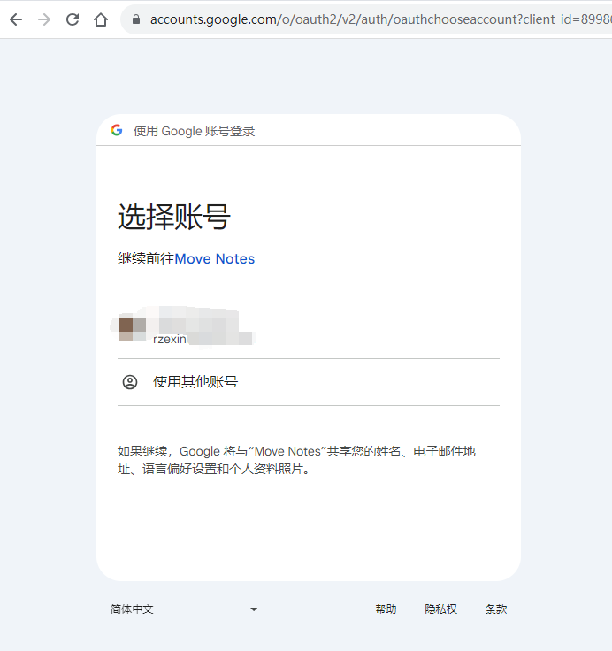

# SUI Move开发必知必会——如何构建一个基于zklogin的SUI Move dApp？

*rzexin 2024.04.08*

## 前言

本文将在`SUI`区块链上使用`React`前端和`Move`合约构建笔记本`Dapp`，笔记本合约允许用户创建和删除笔记，该`Dapp`将集成`zkLogin`，以允许用户使用传统`web2`的登录方式实现安全的用户身份验证。

实践目标：

- 开发一个`React`前端来与`Move`合约进行交互
- 在`Dapp`中集成`zkLogin`以实现安全的用户身份验证
- 了解并利用`zkLogin`的功能进行链上资产访问

本文参考自：https://dacade.org/communities/sui/challenges/19885730-fb83-477a-b95b-4ab265b61438/learning-modules/c9e21ff5-e7b3-4583-b21c-00c7176c10cc

## 依赖准备

### 样板代码获取

#### （1）下载样板代码

```bash
$ git clone https://github.com/dacadeorg/zk-login-boilerplate
```

#### （2）依赖安装

```bash
$ yarn install
```

#### （3）样板代码结构说明

- **代码结构**

```ini
zk-login-boilerplate/
├── download-sui-binaries.sh
├── download_zkey.sh
├── node_modules
├── package.json
├── public
├── README.md
├── src
│   ├── App.css
│   ├── App.js
│   ├── App.test.js
│   ├── assets
│   ├── AuthComponent.js
│   ├── components
│   ├── index.css
│   ├── index.js
│   ├── logo.svg
│   ├── reportWebVitals.js
│   └── setupTests.js
├── tsconfig.json
└── yarn.lock
```

- **功能说明**
  - **`public`**：此目录包含`index.html`文件，它是React应用程序的入口点；`favicon.ico`文件，该文件是出现在浏览器选项卡中的图标
  - **`src`**：此目录包含`index.js`文件，它是`React`应用程序的入口；`App.js`文件，这是`React`的主要组件
  - **`utils`**：此目录将包含用于与合约和`zkLogin`交互的辅助函数
  - **`download_zhkey.sh`**：此文件是下载`zkey.sh`脚本文件，该脚本用户签名交易
  - **`package.json`**：此文件包含`React`应用程序的依赖项和脚本

### 创建应用验证服务

我们将为应用程序设置`Google OAuth`凭据。由于`zkLogin`使用`Oauth`对用户进行身份验证并对交易进行签名，因此这是`zkLogin`工作所必需的。

#### 访问`Google`控制台

https://console.cloud.google.com/

#### 创建项目


#### 创建凭证


根据需要进行配置后，点击【创建】：


#### 记录凭证

> 记录下创建**客户端ID**和**客户端密钥**到安全位置。


#### 配置环境变量

在样板代码工程中，创建`.env`文件，添加以下环境变量：

```ini
REACT_APP_CLIENT_ID="xxx.apps.googleusercontent.com" 
REACT_APP_PROVER_URL="https://prover-dev.mystenlabs.com/v1"
REACT_APP_REDIRECT_URL="http://localhost:8080"
REACT_APP_OPENID_PROVIDER_URL="https://accounts.google.com/.well-known/openid-configuration"
REACT_APP_FULLNODE_URL="https://fullnode.testnet.sui.io:443"
REACT_APP_PACKAGE_ID="0x8a94d111c184ce61ad6a82387fa37170ba3673d2595f27b18089762437e93008"
```

环境变量说明：

- **REACT_APP_CLIENT_ID**：这就是前面创建的**客户端ID**，用于验证用户
- **REACT_APP_PROVER_URL**：这是证明器`URL`，用于验证部分`zkLogin`签名，由`zkLogin`提供。
- **REACT_APP_REDIRECT_URL**：这是重定向URL。重定向URL用于在身份验证后重定向用户。它还用于在用户签名交易后重定向用户
- **REACT_APP_OPENID_PROVIDER_URL**：这是OPENID提供程序URL。OPENID提供器URL用于获取授权端点。授权端点用于对用户进行身份验证
- **REACT_APP_FULLNODE_URL**：这是节点`RPC URL`，即`SUI`区块链地址，这里使用测试网
- **REACT_APP_PACKAGE_ID**：这是合约地址，在合约开发章节中部署合约后得到的`PackageID`

## 合约开发

### 初始化合约工程

```bash
$ sui move new notes
```

### 编写合约代码

这是一个非常简单的笔记合约示例，允许用户创建和删除笔记。

```js
#[lint_allow(self_transfer)]
module bityoume::notes {
    use std::string::String;

    public struct Notes has key {
        id: UID
    }

    public struct Note has key, store {
        id: UID,
        title: String,
        body: String
    }

    #[allow(unused_function)]
    fun init(ctx: &mut TxContext) {
        let notes = Notes{
            id: sui::object::new(ctx),
        };
        transfer::share_object(notes)
    }

    public fun create_note(title: String, body: String, ctx: &mut TxContext) {
        let note = Note {
            id: object::new(ctx),
            title,
            body
        };
        transfer::transfer(note, tx_context::sender(ctx))
    }

    public fun delete_note(note: Note, _ctx: &mut TxContext) {
        let Note {id, title: _, body: _} = note;
        sui::object::delete(id)
    }
}
```

### 部署合约到测试网

```bash
$ sui client publish --gas-budget 100000000


│  ┌──                                                                                             │
│  │ ObjectID: 0xf136c53f32243c6dab22897f4f4afc5c2786b1e061835d7a704a8ecac467fa91                  │
│  │ Sender: 0x5c5882d73a6e5b6ea1743fb028eff5e0d7cc8b7ae123d27856c5fe666d91569a                    │
│  │ Owner: Shared                                                                                 │
│  │ ObjectType: 0x8a94d111c184ce61ad6a82387fa37170ba3673d2595f27b18089762437e93008::notes::Notes  │
│  │ Version: 28078187                                                                             │
│  │ Digest: F4qpSJAe6agFU6dc6dhDL3jMWz9bjcCVWYBh6yDEK5rJ                                          │
│  └──                                                                                             │

│ Published Objects:                                                                               │
│  ┌──                                                                                             │
│  │ PackageID: 0x8a94d111c184ce61ad6a82387fa37170ba3673d2595f27b18089762437e93008                 │
│  │ Version: 1                                                                                    │
│  │ Digest: moGUVjEhcetspYvmAkbnbTutGvu1fdpJFhaQPLJgQNc                                           │
│  │ Modules: notes                                                                                │
│  └──                                                                                             │
```

### 合约基本功能测试

合约比较简单，基本功能测试略。

## 前端开发

### 服务开发

#### 初始化`SUI`客户端

> `SUI`客户端适用于跟区块链节点进行交互的，会从链上获取状态和签名交易提交上链等。

- **创建文件**

`src/utils/suiClient.ts`

- **添加代码**

```tsx
import { SuiClient } from "@mysten/sui.js/client";

// node rpc url
const FULLNODE_URL = process.env.REACT_APP_FULLNODE_URL;

// the id of the package of a deployed contract
export const PACKAGE_ID = process.env.REACT_APP_PACKAGE_ID;

// 创建SuiClient实例
export const SUI_CLIENT = new SuiClient({ url: FULLNODE_URL });
```

#### 创建`SUI`服务

> `SUI`服务是封装了与`SUI`链交互的相关方法，便于上层组件进行使用。

- **创建文件**

`src/utils/suiService.ts`

- **添加代码**

```tsx
import { SUI_CLIENT } from "./suiClient";

export class SuiService {
    
  // 获取钱包余额，单位：SUI，保留2位小数
  async getFormattedBalance(owner: string) {
    const res = await SUI_CLIENT.getBalance({
      owner,
    });
    return Number(Number(res.totalBalance) / 1_000_000_000).toFixed(2);
  }
}
```

#### 创建认证服务

- **创建文件**

`src/utils/authService.ts`

- **导入依赖包**

> 说明：
>
> - **axios**：`axios`是一个用于浏览器和`Node.js`的基于`Promise`的`HTTP`客户端。它用于发出`HTTP`请求
> - **SUI_CLIENT**：这是创建的`SUI`客户端
> - **Ed25519Keypair**：这是来自`@mysten/sui.js/keypairs/Ed25519`软件包的`Ed25519`密钥对
> - **generateOnce**：这是`@mysten/zklogin`包中的`generateOnce`函数
> - **generateRandomness**：这是`@mysten/zklogin`包中的`generateRandom`函数
> - **getExtendedEphemeralPublicKey**：这是`@mysten/zklogin`包中的`getExtendedEphemeralPublicKey`函数,将使用它来生成一个扩展的临时公钥（`extended ephemeral public key`）
> - **jwtToAddress**：这是`@mysten/zklogin`包中的`jwtToAddress`函数，将使用它从`JWT`获取地址。`JWT`是用于对用户进行身份验证的令牌
> - **genAddressSeed**：这是`@mysten/zklogin`包中的`genAddressSeed`函数，将使用它来生成地址

```tsx
import axios from "axios";
import { SUI_CLIENT } from "./suiClient";
import { Ed25519Keypair } from "@mysten/sui.js/keypairs/ed25519";
import {
  generateNonce,
  generateRandomness,
  getExtendedEphemeralPublicKey,
} from "@mysten/zklogin";
import { jwtToAddress } from "@mysten/zklogin";
import { genAddressSeed, getZkLoginSignature } from "@mysten/zklogin";
import { jwtDecode } from "jwt-decode";
import { SerializedSignature } from "@mysten/sui.js/cryptography";
```

- **导入环境变量**

```ts
const PROVER_URL = process.env.REACT_APP_PROVER_URL;
const REDIRECT_URL = process.env.REACT_APP_REDIRECT_URL;
const OPENID_PROVIDER_URL = process.env.REACT_APP_OPENID_PROVIDER_URL;
const CLIENT_ID = process.env.REACT_APP_CLIENT_ID;
```

- **实现认证服务**

```tsx
export class AuthService {
  static getAddressSeed() {}

  static getEd25519Keypair(): Ed25519Keypair {}

  static async getPartialZkLoginSignature(): Promise<any> {}

  private static async verifyPartialZkLoginSignature(zkpRequestPayload: any) {}

  static async generateZkLoginSignature(
    userSignature: string
  ): Promise<SerializedSignature> {}

  static getMaxEpoch() {}

  static getRandomness() {}

  private static getJwtData() {}

  private static decodeJwt(): JwtPayload {}

  private static salt() {}

  static walletAddress() {}

  private static claims() {}

  private static hashcode(s: string) {}

  static isAuthenticated() {}

  static jwt() {}

  async login() {}
}
```

- **`getAddressSeed`（获取地址种子）**

> 此函数用于获取地址种子，地址种子用于生成密钥对。
>
> 实现逻辑是：
>
> - 调用`decodeJwt`函数从`sessionStorage`获取`sui_jwt_token`
> - 调用`salt`函数，从`sui_jwt_token`中获取用户`email`地址，通过计算`hashcode`作为其盐值
> - 调用`genAddressSeed`函数，传入所需参数，生成地址种子

```tsx
  static getAddressSeed() {
    const jwt = AuthService.decodeJwt();
    const salt = AuthService.salt();
    return genAddressSeed(
      BigInt(salt!),
      "sub",
      jwt.sub,
      jwt.aud.toString()
    ).toString();
  }

  private static decodeJwt(): JwtPayload {
    const jwt = sessionStorage.getItem("sui_jwt_token");
    return jwtDecode(jwt) as JwtPayload;
  }

  private static salt() {
    const email = AuthService.claims()["email"];
    return AuthService.hashcode(email);
  }

  private static claims() {
    const token = AuthService.jwt();
    if (token) return JSON.parse(atob(token.split(".")[1]));
  }

  static jwt() {
    return sessionStorage.getItem("sui_jwt_token");
  }

  private static hashcode(s: string) {
    var h = 0,
      l = s.length,
      i = 0;
    if (l > 0) while (i < l) h = ((h << 5) - h + s.charCodeAt(i++)) | 0;
    return h.toString();
  }
```

- **`getEd25519Keypair`（获取`keypair`对象）**

> 此函数用于获取`Ed25519 keypair`对象。
>
> 实现逻辑是：
>
> - 调用`getJwtData`函数，从`sessionStorage`获取`jwt_data`
> - 从临时`keypair`对象中读取`publicKey`和`secretKey`
> - 构造`Ed25519Keypair`对象后返回

```tsx
  static getEd25519Keypair(): Ed25519Keypair {
    const jwtData = AuthService.getJwtData();
    const publicKey = new Uint8Array(
      Object.values(jwtData.ephemeralKeyPair.keypair.publicKey)
    );
    const secretKey = new Uint8Array(
      Object.values(jwtData.ephemeralKeyPair.keypair.secretKey)
    );
    return new Ed25519Keypair({ publicKey, secretKey });
  }
  
  private static getJwtData() {
    return JSON.parse(sessionStorage.getItem("jwt_data"));
  }
```

- **`getPartialZkLoginSignature`（获取部分zkLogin签名）**

> 此函数用于获取部分`zkLogin`签名，此签名用于对交易进行签名。
>
> 实现逻辑是：
>
> - 调用`getEd25519Keypair`函数获取到`Ed25519Keypair`对象
> - 调用`getExtendedEphemeralPublicKey`函数生成扩展的临时公钥
> - 构造生成待验证的负载信息（`verificationPayload`），信息包括：`JWT`、扩展的临时公钥、最大世代、随机数、盐值和声明名称（`keyClaimName`）
> - 调用`getMaxEpoch`获取最大世代以及调用`getRandomness`获取随机数，都是为了创建`nonce`
> - 调用`verifyPartialZkLoginSignature`接口通过验证部分`zkLogin`签名来验证用户

```tsx
  static async getPartialZkLoginSignature(): Promise<any> {
    const keyPair = AuthService.getEd25519Keypair();
    const extendedEphemeralPublicKey = getExtendedEphemeralPublicKey(
      keyPair.getPublicKey()
    );
    const verificationPayload = {
      jwt: AuthService.jwt(),
      extendedEphemeralPublicKey,
      maxEpoch: this.getMaxEpoch(),
      jwtRandomness: this.getRandomness(),
      salt: AuthService.salt(),
      keyClaimName: "sub",
    };
    return await AuthService.verifyPartialZkLoginSignature(verificationPayload);
  }
  
  static getMaxEpoch() {
    return AuthService.getJwtData().maxEpoch;
  }

  static getRandomness() {
    return AuthService.getJwtData().randomness;
  }

  private static salt() {
    const email = AuthService.claims()["email"];
    return AuthService.hashcode(email);
  }
```

- **`verifyPartialZkLoginSignature`（验证部分`zkLogin`签名）**

> 此函数用于通过验证部分`zkLogin`签名来验证用户。
>
> 实现逻辑：
>
> - 该接口会向**证明器**发起`POST`请求，提供待验证的负载信息（`verificationPayload`）
> - 若成功，会返回签名信息

```tsx
  private static async verifyPartialZkLoginSignature(zkpRequestPayload: any) {
    try {
      const proofResponse = await axios.post(PROVER_URL, zkpRequestPayload, {
        headers: {
          "content-type": "application/json",
        },
      });
      const partialZkLoginSignature =
        proofResponse.data as PartialZkLoginSignature;
      return partialZkLoginSignature;
    } catch (error) {
      console.log("failed to reqeust the partial sig: ", error);
      return {};
    }
  }
```

- **`generateZkLoginSignature`（生成`zkLogin`签名）**

> 此函数用于生成`zkLogin`签名。
>
> 实现逻辑：
>
> - 调用`getPartialZkLoginSignature`函数获取部分`zkLogin`签名
> - 调用`getAddressSeed`获取地址种子
> - 调用`getMaxEpoch`获取最大世代
> - 最后调用`getZkLoginSignature`函数生成`zkLogin`签名

```tsx
  static async generateZkLoginSignature(
    userSignature: string
  ): Promise<SerializedSignature> {
    const partialZkLoginSignature =
      await AuthService.getPartialZkLoginSignature();
    const addressSeed = AuthService.getAddressSeed();
    const maxEpoch = AuthService.getMaxEpoch();
    return getZkLoginSignature({
      inputs: {
        ...partialZkLoginSignature,
        addressSeed,
      },
      maxEpoch,
      userSignature,
    });
  }
```

- **`walletAddress`（获取钱包地址）**

> 此函数用于根据用户通过`OAuth`进行身份验证时返回的用户电子邮件获取钱包地址
>
> 实现逻辑：
>
> - 从`sessionStorage`获取`sui_jwt_token`
> - 并获取其中的`email`字段，通过计算`hashcode`作为其盐值
> - 调用`jwtToAddress`函数生成钱包地址，参数是`sui_jwt_token`数据和盐值

```bash
  static walletAddress() {
    const email = AuthService.claims()["email"];
    return jwtToAddress(AuthService.jwt(), AuthService.hashcode(email));
  }
```

- **`isAuthenticated`（检查是否已认证身份）**

> 此函数用于检查用户是否已通过身份验证。
>
> 实现逻辑：
>
> - 从`sessionStorage`获取`sui_jwt_token`，并检查它是否为`null`
> - 不为`null`则用户已通过身份认证，反之则用户未通过身份认证

```tsx
  static isAuthenticated() {
    const token = AuthService.jwt();
    return token && token !== "null";
  }
```

- **`login`（用户登录）**

> 此函数用于用户登录。
>
> 实现逻辑：
>
> - 调用`getLatestSuiSystemState`函数，获取最新的`SUI`链状态，解构出当前的世代
> - 基于当前世代，创建最大世代（`maxEpoch`）
> - 创建`Ed25519Keypair`对象`ephemeralKeyPair`
> - 调用`generateRandomness`函数生成随机数
> - 调用`generateNonce`函数，传入`ephemeralKeyPair`公钥、最大世代、随机数，构造出`nonce`
> - 构造`jwtData`对象，序列化后存储在`sessionStorage`的`jwt_data`中
> - 然后，它向`OpenID`提供者`URL`发出`GET`请求，以获取授权端点
> - 最后将用户重定向到授权端点

```tsx
async login() {
    const { epoch } = await SUI_CLIENT.getLatestSuiSystemState();

    const maxEpoch = Number(epoch) + 2222;
    const ephemeralKeyPair = new Ed25519Keypair();
    const randomness = generateRandomness();
    const nonce = generateNonce(
      ephemeralKeyPair.getPublicKey(),
      maxEpoch,
      randomness
    );
    const jwtData = {
      maxEpoch,
      nonce,
      randomness,
      ephemeralKeyPair,
    };

    console.log({ jwtData });

    sessionStorage.setItem("jwt_data", JSON.stringify(jwtData));

    const params = new URLSearchParams({
      client_id: CLIENT_ID,
      redirect_uri: REDIRECT_URL,
      response_type: "id_token",
      scope: "openid email",
      nonce: nonce,
    });

    console.log({ params });
    try {
      const { data } = await axios.get(OPENID_PROVIDER_URL);
      console.log({ data });
      const authUrl = `${data.authorization_endpoint}?${params}`;
      window.location.href = authUrl;
    } catch (error) {
      console.error("Error initiating Google login:", error);
    }
  }
}
```

- **JWT负载接口定义**

> 在这个接口中，定义了一些标准的 `JWT` 声明，如 `iss`（发行人）、`sub`（主题）、`aud`（受众）等
>
> 这些属性都是可选的

```tsx
export interface JwtPayload {
  iss?: string;
  sub?: string;
  aud?: string[] | string;
  exp?: number;
  nbf?: number;
  iat?: number;
  jti?: string;
}
```

- **部分zkLogin签名的类型定义**

> 这里边定义了部分`zkLogin`签名，较完整`zkLogin`签名类型删除了 `addressSeed` 属性。
>
> 实现逻辑：
>
> - `Parameters` 工具类型返回一个元组（tuple），其中包含了函数参数的类型。`Parameters<typeof getZkLoginSignature>` 返回了 `getZkLoginSignature` 函数的参数类型的元组
> - 使用 `["0"]` 索引操作，我们可以提取这个元组中的第一个元素（即第一个参数的类型）
> - 在获取到第一个参数的类型之后，继续使用 `["inputs"]` 索引操作来获取 `inputs` 属性的类型
> - 通过 `Omit` 类型操作符，从这个类型中删除 `addressSeed` 属性，从而创建一个新的类型 `PartialZkLoginSignature`

```tsx
export type PartialZkLoginSignature = Omit<
  Parameters<typeof getZkLoginSignature>["0"]["inputs"],
  "addressSeed"
>;
```

#### 创建笔记服务

> 该服务封装了跟笔记合约交互的接口

- **创建文件**

`src/utils/notesService.ts`

- **`addNote`（新建笔记）**

> 调用此函数可以创建笔记

```tsx
  async addNote(title: string, body: string) {
    const txb = new TransactionBlock();
    const txData = {
      target: `${PACKAGE_ID}::notes::create_note`,
      arguments: [txb.pure.string(title), txb.pure.string(body)],
    };
    return this.makeMoveCall(txData, txb);
  }
```

- **`getNotes`（查询笔记）**

> 调用此函数可以查询笔记。
>
> 实现逻辑：
>
> - 获取钱包地址
> - 获取该地址所有对象
> - 遍历对象获取对象类型和内容
> - 返回类型是笔记类型的内容，即笔记数据

```tsx
  async getNotes() {
    const sender = AuthService.walletAddress();
    let ownedObjects = await SUI_CLIENT.getOwnedObjects({
      owner: sender,
    });
    let ownedObjectsDetails = await Promise.all(
      ownedObjects.data.map(async (obj) => {
        return await SUI_CLIENT.getObject({
          id: obj.data.objectId,
          options: { showType: true, showContent: true },
        });
      })
    );
    return ownedObjectsDetails
      .filter((obj) => {
        return `${PACKAGE_ID}::notes::Note` === obj.data.type;
      })
      .map((obj) => obj.data.content["fields"]);
  }
```

- **`deleteNote`（删除笔记）**

> 调用此函数可以删除笔记。

```tsx
  async deleteNote(id: any) {
    const sender = AuthService.walletAddress();
    const txb = new TransactionBlock();
    txb.setSender(sender);
    const txData = {
      target: `${PACKAGE_ID}::notes::delete_note`,
      arguments: [txb.object(id.id)],
    };
    await this.makeMoveCall(txData, txb);
  }
```

- **`makeMoveCall`（合约调用）**

> 调用此函数会签名交易，并发起合约调用。
>
> 实现逻辑：
>
> - 调用`AuthService.getEd25519Keypair`获取密钥对`keypair`对象
> - 调用`AuthService.walletAddress()`获取钱包地址，它将交易的发送方设置为用户的钱包地址
> - 构造交易块交易数据，并使用`keypair`私钥签名交易数据，得到用户签名数据`userSignature`
> - 将用户签名数据`userSignature`作为参数，调用`AuthService.generateZkLoginSignature`函数获取到`zkLogin`签名数据`zkLoginSignature`
> - 使用`zkLogin`签名数据`zkLoginSignature`作为交易的真正签名，提交交易上链

```tsx
  private async makeMoveCall(txData: any, txb: TransactionBlock) {
    const keypair = AuthService.getEd25519Keypair();
    const sender = AuthService.walletAddress();
    txb.setSender(sender);
    txb.moveCall(txData);
    const { bytes, signature: userSignature } = await txb.sign({
      client: SUI_CLIENT,
      signer: keypair,
    });
    const zkLoginSignature = await AuthService.generateZkLoginSignature(
      userSignature
    );
    return SUI_CLIENT.executeTransactionBlock({
      transactionBlock: bytes,
      signature: zkLoginSignature,
    });
  }
```

### 组件开发

#### 设置路由

- **修改文件**

`src/index.js`

- **修改后代码**

> 我们设置了2个路由：
>
> - `/notes`：渲染`App`组件
> - `/`：渲染`Callback`组件（当前还没有，进行创建）

```tsx
import React from "react";
import ReactDOM from "react-dom/client";
import { BrowserRouter as Router, Routes, Route } from "react-router-dom";
import "./index.css";
import App from "./App";
import reportWebVitals from "./reportWebVitals";
import "bootstrap-icons/font/bootstrap-icons.css";
import "bootstrap/dist/css/bootstrap.min.css";
import Callback from "./Callback";

const root = ReactDOM.createRoot(document.getElementById("root"));
root.render(
  <Router>
    <Routes>
      <Route path="/notes" element={<App />} />
      <Route path="/" element={<Callback />} />
    </Routes>
  </Router>
);

reportWebVitals();
```

#### 创建`Callback`组件

- **创建文件**

`src/Callback.js`

- **添加代码**

> 此回调组件将用于处理来自身份验证服务的回调。
>
> 实现逻辑：
>
> - 使用`useEffect`钩子函数在加载此页面时触发`handleCallback`函数
> - 该函数从`URL`中获取`JWT`，并将其存储在`sessionStorage`中
> - 再将用户重定向到`/notes`路由

```tsx
import React, { useEffect } from "react";

const Callback = () => {
  useEffect(() => {
    const handleCallback = async () => {
      try {
        const params = new URLSearchParams(window.location.hash.substr(1));
        const jwtToken = params.get("id_token");

        sessionStorage.setItem("sui_jwt_token", jwtToken);
        window.location.href = "/notes";
      } catch (error) {
        console.error("Error handling callback:", error);
      }
    };

    handleCallback();
  }, []);

  return (
    <div>
      <p>Processing callback...</p>
    </div>
  );
};

export default Callback;
```

#### 创建`App`组件

- **修改文件**

`src/App.js`

- **导入依赖包**

```tsx
import React, { useState, useCallback, useEffect } from "react";
import { Container, Nav } from "react-bootstrap";
import Wallet from "./components/Wallet";
import Notes from "./components/notes/Notes";
import Cover from "./components/utils/Cover";
import coverImg from "./assets/img/notebook.jpg";
import { Notification } from "./components/utils/Notifications";
import "./App.css";
import { AuthService } from "./utils/authService";
import { SuiService } from "./utils/suiService";
```

- **创建App组件**

> 实现逻辑：
>
> - 创建`getBalance`函数，用于获取用户钱包余额。若用户已经登录成功（认证成功）将能获取到钱包余额
> - 创建`logout`函数，用于用于退出，将清空`sessionStorage`，并重定向到`/notes`路由
> - `Notification`组件已经实现了，用于展示通知信息
> - 如果用户已经通过身份验证，将呈现钱包组件和`Notes`组件。钱包组件用于显示用户的钱包地址和余额，`Notes`组件用于显示用户笔记（后续将实现该组件）
> - 如果用户未通过身份验证，将呈现`Cover`组件，让用户进行登录，该组件也已实现

```tsx
const App = () => {
  const [balance, setBalance] = useState("0");

  let walletAddress;
  const suiService = new SuiService();

  const getBalance = useCallback(async () => {
    try {
      if (AuthService.isAuthenticated()) {
        setBalance(
          await suiService.getFormattedBalance(AuthService.walletAddress())
        );
      }
    } catch (error) {
      console.log({ error });
    } finally {
    }
  });

  const logout = async () => {
    sessionStorage.clear();

    window.location.href = "/notes";
  };

  if (AuthService.isAuthenticated()) {
    walletAddress = AuthService.walletAddress();
  }

  useEffect(() => {
    getBalance();
  }, [getBalance]);

  return (
    <>
      <Notification />
      {AuthService.isAuthenticated() ? (
        <Container fluid="md">
          <Nav className="justify-content-end pt-3 pb-5">
            <Nav.Item>
              <Wallet
                address={walletAddress}
                amount={balance}
                symbol="SUI"
                destroy={logout}
              />
            </Nav.Item>
          </Nav>
          <main>
            <Notes />
          </main>
        </Container>
      ) : (
        <Cover name="SUI zkLogin Notes" coverImg={coverImg} />
      )}
    </>
  );
};

export default App;
```

#### 创建`Notes`组件

- **创建目录和文件**

> **Notes.js**：此文件是笔记列表展示组件
> **Notes.js**：此文件是单个笔记展示组件
> **AddNote.js**：此文件是添加笔记组件

```
src
├── components
│   ├── notes
│   │   ├── AddNote.js
│   │   ├── Note.js
│   │   └── Notes.js
```

- **创建`Note`组件**

在`src/components/notes/Note.js`中添加以下代码：

```tsx
import React from "react";
import { Card, Button, Col } from "react-bootstrap";

const Note = ({ note, deleteNote }) => {
  const { id, title, body } = note;

  return (
    <Col key={id.id}>
      <Card className=" h-100">
        <Card.Body className="d-flex  flex-column text-center">
          <Card.Title>{title}</Card.Title>
          <Card.Text className="flex-grow-1 ">{body}</Card.Text>
          <Button
            variant="outline-dark"
            onClick={() => deleteNote(id)}
            className="w-100 py-3"
          >
            Delete
          </Button>
        </Card.Body>
      </Card>
    </Col>
  );
};

export default Note;
```

- **创建`AddNote`组件**

在`src/components/notes/AddNote.js`中添加以下代码：

```tsx
import React, { useState } from "react";
import PropTypes from "prop-types";
import { Button, Modal, Form, FloatingLabel } from "react-bootstrap";

const AddNote = ({ save }) => {
  const [title, setTitle] = useState("");
  const [body, setBody] = useState("");
  const isFormFilled = () => title && body;

  const [show, setShow] = useState(false);

  const handleClose = () => setShow(false);
  const handleShow = () => setShow(true);

  return (
    <>
      <Button
        onClick={handleShow}
        variant="dark"
        className="rounded-pill px-0"
        style={{ width: "38px" }}
      >
        <i className="bi bi-plus"></i>
      </Button>
      <Modal show={show} onHide={handleClose} centered>
        <Modal.Header closeButton>
          <Modal.Title>New Note</Modal.Title>
        </Modal.Header>
        <Form>
          <Modal.Body>
            <FloatingLabel
              controlId="inputTitle"
              label="Title"
              className="mb-3"
            >
              <Form.Control
                type="text"
                onChange={(e) => {
                  setTitle(e.target.value);
                }}
                placeholder="Title"
              />
            </FloatingLabel>
            <FloatingLabel
              controlId="inputBody"
              label="Body"
              className="mb-3"
            >
              <Form.Control
                as="textarea"
                placeholder="body"
                style={{ height: "80px" }}
                onChange={(e) => {
                  setBody(e.target.value);
                }}
              />
            </FloatingLabel>
          </Modal.Body>
        </Form>
        <Modal.Footer>
          <Button variant="outline-secondary" onClick={handleClose}>
            Close
          </Button>
          <Button
            variant="dark"
            disabled={!isFormFilled()}
            onClick={() => {
              save({
                title,
                body,
              });
              handleClose();
            }}
          >
            Save note
          </Button>
        </Modal.Footer>
      </Modal>
    </>
  );
};

AddNote.propTypes = {
  save: PropTypes.func.isRequired,
};

export default AddNote;
```

- **创建`Notes`组件**

在`src/components/notes/Notes.js`中添加以下代码：

```tsx
import React, { useEffect, useState, useCallback } from "react";
import { toast } from "react-toastify";
import AddNote from "./AddNote";
import Note from "./Note";
import Loader from "../utils/Loader";
import { Row } from "react-bootstrap";
import { NotificationSuccess, NotificationError } from "../utils/Notifications";
import { NotesService } from "../../utils/notesService";

const Notes = () => {
  const [notes, setNotes] = useState([]);
  const [loading, setLoading] = useState(false);

  const notesService = new NotesService();

  const getNotes = useCallback(async () => {
    try {
      setLoading(true);
      setNotes(await notesService.getNotes());
    } catch (error) {
      console.log({ error });
    } finally {
      setLoading(false);
    }
  });

  const addNote = async (data) => {
    try {
      setLoading(true);
      const { title, body } = data;
      await notesService.addNote(title, body);

      getNotes();
      toast(<NotificationSuccess text="A note added successfully." />);
    } catch (error) {
      console.log({ error });
      toast(<NotificationError text="Failed to create a note." />);
    } finally {
      setLoading(false);
    }
  };

  const deleteNote = async (id) => {
    try {
      await notesService.deleteNote(id);
      getNotes();

      toast(<NotificationSuccess text="Delete the note successfully" />);
    } catch (error) {
      toast(<NotificationError text="Failed to delete the note." />);
    } finally {
      setLoading(false);
    }
  };

  useEffect(() => {
    getNotes();
  }, []);

  return (
    <>
      {!loading ? (
        <>
          <div className="d-flex justify-content-between align-items-center mb-4">
            <h1 className="fs-4 fw-bold mb-0">ZK Login</h1>
            <AddNote save={addNote} />
          </div>
          <Row xs={1} sm={2} lg={3} className="g-3  mb-5 g-xl-4 g-xxl-5">
            {notes.map((_note) => (
              <Note
                note={{
                  ..._note,
                }}
                deleteNote={deleteNote}
              />
            ))}
          </Row>
        </>
      ) : (
        <Loader />
      )}
    </>
  );
};

export default Notes;
```

## dApp测试

### 启动

```bash
$ yarn start
```


### 登录


