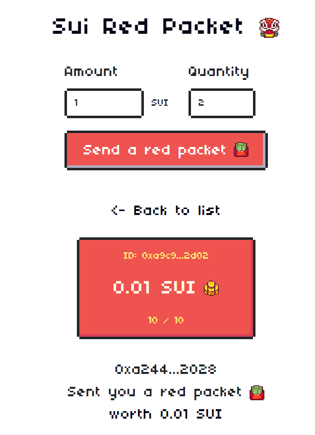
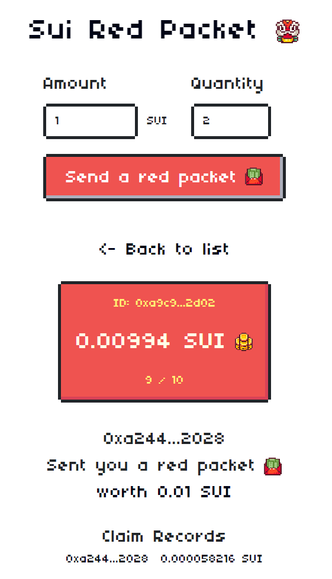
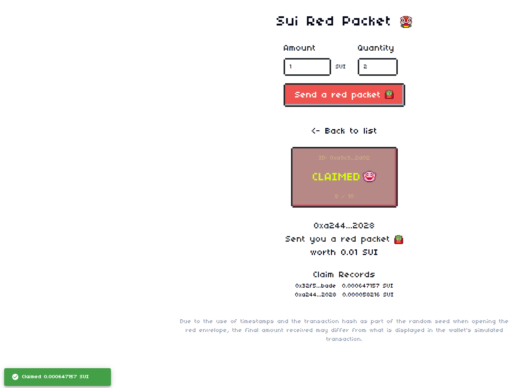

# SUI Move开发必知必会——如何使用Sui TypeScript SDK进行交易发送和事件监听?

*rzexin 2024.04.14*

# 1 前言

`Sui TypeScript SDK`是一个用于与`SUI`区块链交互的模块化工具库。后续提及的`SDK`特指`Sui TypeScript SDK`。

本文将围绕**发送签名交易**和**获取合约事件**介绍涉及到的接口。

将要通过`SDK`进行交互的合约采用先前部署的**抢红包合约**，详细的介绍请参看：[《SUI Move合约学习与实践——抢红包合约（sui-red-packet）》](https://learnblockchain.cn/article/7772)

# 2 SDK介绍

## 2.1 官方文档

`SDK`的详细介绍及用法可以参看官方文档：https://sdk.mystenlabs.com/typescript

## 2.2 SDK包组成

`SDK`包含以下的库，开发者可以根据需要选择使用，本文将会涉及到的库有：`client`、`keypairs`、`transaction`、`utils`。

-   **`@mysten/suit.js/bcs`**：一个`BSC`构建器，具有预定义的`Sui`类型
-   **`@mysten/suit.js/client`**：用于与`Sui RPC`节点交互的客户端库
-   **`@mysten/sui.js/cryptography`**：用于加密的共享类型和类
-   **`@mysten/suit.js/faucet`**：水龙头库
-   **`@mysten/sui.js/keypairs`**：用于特定`KeyPair`实现的模块化导出
-   **`@mysten/sui.js/multisig`**：用于多签的库
-   **`@mysten/sui.js/transaction`**：用于构建交易和与交易交互的库
-   **`@mysten/suit.js/utils`**：工具类库
-   **`@mysten/sui.js/verify`**：用于验证交易和消息的库
-   **`@mysten/sui.js/zklogin`**：用于`zkLogin`库

## 2.3 SDK安装

>   `SDK`安装比较简单，在初始化好的`node.js`工程中执行如下命令安装`@mysten/sui.js`

-   **npm**

```bash
$ npm i @mysten/sui.js
```

-   **pnpm**

```bash
$ pnpm add @mysten/sui.js
```

-   **yarn**

```bash
$ yarn add @mysten/sui.js
```

# 3 交易发送

SDK中提供了两个发送签名交易的接口：`executeTransactionBlock`、`signAndExecuteTransactionBlock`。

前者进行交易签名和交易发送是分开的，后者交易签名和交易发送是二合一的。

将交易签名和交易发送分开，可以用于一些特殊场景，如离线签名、`zkLogin`签名等。

接下来，将具体介绍下这两个方法，再使用这两个方法分别调用抢红包合约中的两个主要合约接口：**发红包（`send_new_red_packet`)** 、 **抢红包（`claim_red_packet`）**。

## 3.1 接口说明

### 3.1.1 `executeTransactionBlock`

#### （1）函数功能

发送已签名交易。

#### （2）函数签名

```tsx
executeTransactionBlock(input: ExecuteTransactionBlockParams): Promise<SuiTransactionBlockResponse>;
```

#### （3）函数入参

-   `transactionBlock`：`BSC`序列化后的交易数据，格式为字节流或`base64`编码的字符串
-   `signature`：交易签名，`base64`编码的字符串
-   `requestType`：取值为`WaitForEffectsCert`或`WaitForLocalExecution`，确定`RPC`节点应何时返回响应
-   `option`：响应是否返回指定的信息，默认值都是`Fasle`，可选值为：`showBalanceChanges`、 `showEffects`、 `showEvents`、 `showInput`、 `showObjectChanges`、 `showRawInput`

```ts
/**
 * Execute the transaction and wait for results if desired. Request types: 1. WaitForEffectsCert: waits
 * for TransactionEffectsCert and then return to client. This mode is a proxy for transaction
 * finality. 2. WaitForLocalExecution: waits for TransactionEffectsCert and make sure the node executed
 * the transaction locally before returning the client. The local execution makes sure this node is
 * aware of this transaction when client fires subsequent queries. However if the node fails to execute
 * the transaction locally in a timely manner, a bool type in the response is set to false to indicated
 * the case. request_type is default to be `WaitForEffectsCert` unless options.show_events or
 * options.show_effects is true
 */
export interface ExecuteTransactionBlockParams {
    /** BCS serialized transaction data bytes without its type tag, as base-64 encoded string. */
    transactionBlock: Uint8Array | string;
    /**
     * A list of signatures (`flag || signature || pubkey` bytes, as base-64 encoded string). Signature is
     * committed to the intent message of the transaction data, as base-64 encoded string.
     */
    signature: string | string[];
    /** options for specifying the content to be returned */
    options?: RpcTypes.SuiTransactionBlockResponseOptions | null | undefined;
    /** The request type, derived from `SuiTransactionBlockResponseOptions` if None */
    requestType?: RpcTypes.ExecuteTransactionRequestType | null | undefined;
}
```

#### （4）函数出参

```tsx
export interface SuiTransactionBlockResponse {
    balanceChanges?: BalanceChange[] | null;
    /**
     * The checkpoint number when this transaction was included and hence finalized. This is only returned
     * in the read api, not in the transaction execution api.
     */
    checkpoint?: string | null;
    confirmedLocalExecution?: boolean | null;
    digest: string;
    effects?: TransactionEffects | null;
    errors?: string[];
    events?: SuiEvent[] | null;
    objectChanges?: SuiObjectChange[] | null;
    /**
     * BCS encoded [SenderSignedData] that includes input object references returns empty array if
     * `show_raw_transaction` is false
     */
    rawTransaction?: string;
    timestampMs?: string | null;
    /** Transaction input data */
    transaction?: SuiTransactionBlock | null;
}
```

### 3.1.2 `signAndExecuteTransactionBlock`

#### （1）函数功能

进行交易签名并发送交易。

#### （2）函数签名

```tsx
signAndExecuteTransactionBlock({ transactionBlock, signer, ...input }: {
        transactionBlock: Uint8Array | TransactionBlock;
        signer: Keypair;
    } & Omit<ExecuteTransactionBlockParams, 'transactionBlock' | 'signature'>): Promise<SuiTransactionBlockResponse>;
```

#### （3）函数入参

-   `transactionBlock`：`BSC`序列化后的交易数据，格式为字节流或`base64`编码的字符串
-   `signer`：`Keypair`对象用于交易签名
-   `requestType`：取值为`WaitForEffectsCert`或`WaitForLocalExecution`，确定`RPC`节点应何时返回响应
-   `option`：响应是否返回指定的信息，默认值都是`Fasle`，可选值为：`showBalanceChanges`、 `showEffects`、 `showEvents`、 `showInput`、 `showObjectChanges`、 `showRawInput`

#### （4）函数出参

同接口`executeTransactionBlock`。

## 3.2 代码说明

### 3.2.1 发红包（`send_new_red_packet`) 

> 使用`executeTransactionBlock`实现发红包。

#### （1）代码实现

```tsx
import { SuiClient } from "@mysten/sui.js/client";
import {
  TransactionBlock,
  TransactionObjectArgument,
} from "@mysten/sui.js/transactions";
import { SUI_TYPE_ARG } from "@mysten/sui.js/utils";
import { Ed25519Keypair } from "@mysten/sui.js/keypairs/ed25519";
import dotenv from "dotenv";
dotenv.config();
export const FULLNODE_URL: string = process.env.FULLNODE_URL!;
const MNEMONIC = process.env.MNEMONIC!;

const keypair = Ed25519Keypair.deriveKeypair(MNEMONIC);
const address = keypair.getPublicKey().toSuiAddress();
const SUI_CLIENT = new SuiClient({ url: FULLNODE_URL });
console.log("Address:", address);

const PACKAGE_ID =
  "0xe5417558cf7edc87840fef347f294dc0fa7bdcd82c043e630c504d233c6b4784";
const WEATHER_ORACLE =
  "0x1aedcca0b67b891c64ca113fce87f89835236b4c77294ba7e2db534ad49a58dc";
const MODULE_NAME = "red_packet";
const SEND_FUNCTION_NAME = "send_new_red_packet";
const CLAIM_FUNCTION_NAME = "claim_red_packet";

const AMOUNT = 10_000_000; // 红包金额
const COUNT = 10; // 红包数量

// executeTransactionBlock
async function send_red_package() {
  let txb = new TransactionBlock();

  let transferCoin: TransactionObjectArgument = txb.gas;

  const send_amount = txb.splitCoins(transferCoin, [AMOUNT]);

  txb.setSender(MoveFan);
  txb.moveCall({
    target: `${PACKAGE_ID}::${MODULE_NAME}::${SEND_FUNCTION_NAME}`,
    arguments: [txb.pure(Number(COUNT)), send_amount],
    typeArguments: [SUI_TYPE_ARG],
  });

  const { bytes, signature } = await txb.sign({
    client: SUI_CLIENT,
    signer: keypair,
  });

  const result = await SUI_CLIENT.executeTransactionBlock({
    transactionBlock: bytes,
    signature,
    requestType: "WaitForLocalExecution",
    options: {
      showEvents: true,
    },
  });

  console.log(
    `executeTransactionBlock result: ${JSON.stringify(result, null, 2)}`
  );
}

async function main() {
  await send_red_package();
}

main();
```

#### （2）执行结果

```tsx
$ ts-node src/red_packet_send.ts 
Address: 0xa244617bc05e4122fb825d3b9c63dbad96dd06fae8183c2f03027b1feff12028
executeTransactionBlock result: {
  "digest": "2vhD9XQqR5MiDkjV3sYvoWciMzZx55QNzBP66z1U3RAu",
  "events": [
    {
      "id": {
        "txDigest": "2vhD9XQqR5MiDkjV3sYvoWciMzZx55QNzBP66z1U3RAu",
        "eventSeq": "0"
      },
      "packageId": "0xe5417558cf7edc87840fef347f294dc0fa7bdcd82c043e630c504d233c6b4784",
      "transactionModule": "red_packet",
      "sender": "0xa244617bc05e4122fb825d3b9c63dbad96dd06fae8183c2f03027b1feff12028",
      "type": "0xe5417558cf7edc87840fef347f294dc0fa7bdcd82c043e630c504d233c6b4784::red_packet::NewRedPacket<0x2::sui::SUI>",
      "parsedJson": {
        "amount": "10",
        "coin_amount": "10000000",
        "coin_type": "0000000000000000000000000000000000000000000000000000000000000002::sui::SUI",
        "red_packet_id": "0xa9c9ca5a0125651548b4ea84b87d2731fdd3f17c05b77d7dc0c4400d55b62d02",
        "sender": "0xa244617bc05e4122fb825d3b9c63dbad96dd06fae8183c2f03027b1feff12028"
      },
      "bcs": "BN9mD4eKtqmAR3KsBq1b97HqRnvC1JHMx53x3N8SvqLQbFJMk1rs7sBkJAmu4prnwSS3DtRmMjZkZYR5P6Yp2q7xpYjQ6VfQPPQBJG5siGqTQbHfpdnFtnwkfz1G1S3UHgHCeHMU6Y8dRouAWjPeA8MxLFBD7mWxEMTt725QRWFoPx27xsJYn5md7Z2gGK986TdXMnpnhPrnGaWaSchm"
    }
  ],
  "confirmedLocalExecution": true
}
```

#### （3）前端页面

> 通过前端页面，也可以看到我们创建好的红包。

https://github-movefuns-sui-red-packet.vercel.app/?redpacket=0xa9c9ca5a0125651548b4ea84b87d2731fdd3f17c05b77d7dc0c4400d55b62d02




### 3.2.2 抢红包（`claim_red_packet`）

> 使用`signAndExecuteTransactionBlock`实现抢红包。

#### （1）代码实现

```tsx
import { SuiClient } from "@mysten/sui.js/client";
import {
  TransactionBlock,
} from "@mysten/sui.js/transactions";
import { SUI_CLOCK_OBJECT_ID, SUI_TYPE_ARG } from "@mysten/sui.js/utils";
import { Ed25519Keypair } from "@mysten/sui.js/keypairs/ed25519";
import dotenv from "dotenv";
dotenv.config();
export const FULLNODE_URL: string = process.env.FULLNODE_URL!;
const MNEMONIC = process.env.MNEMONIC!;

const keypair = Ed25519Keypair.deriveKeypair(MNEMONIC);
const address = keypair.getPublicKey().toSuiAddress();
const SUI_CLIENT = new SuiClient({ url: FULLNODE_URL });
console.log("Address:", address);

const PACKAGE_ID =
  "0xe5417558cf7edc87840fef347f294dc0fa7bdcd82c043e630c504d233c6b4784";
const RED_POCKET =
  "0xa9c9ca5a0125651548b4ea84b87d2731fdd3f17c05b77d7dc0c4400d55b62d02";
const WEATHER_ORACLE =
  "0x1aedcca0b67b891c64ca113fce87f89835236b4c77294ba7e2db534ad49a58dc";
const MODULE_NAME = "red_packet";
const SEND_FUNCTION_NAME = "send_new_red_packet";
const CLAIM_FUNCTION_NAME = "claim_red_packet";

// signAndExecuteTransactionBlock
async function claim_red_packet() {
  let txb = new TransactionBlock();

  txb.moveCall({
    target: `${PACKAGE_ID}::${MODULE_NAME}::${CLAIM_FUNCTION_NAME}`,
    arguments: [
      txb.object(RED_POCKET),
      txb.object(WEATHER_ORACLE),
      txb.object(SUI_CLOCK_OBJECT_ID),
    ],
    typeArguments: [SUI_TYPE_ARG],
  });

  const result = await SUI_CLIENT.signAndExecuteTransactionBlock({
    transactionBlock: txb,
    signer: keypair,
    requestType: "WaitForLocalExecution",
    options: {
      showEvents: true,
    },
  });

  console.log(
    `signAndExecuteTransactionBlock result: ${JSON.stringify(result, null, 2)}`
  );
}

async function main() {
  await claim_red_packet();
}

main();
```

#### （2）执行结果

```tsx
$ ts-node src/red_packet_claim.ts 
Address: 0xa244617bc05e4122fb825d3b9c63dbad96dd06fae8183c2f03027b1feff12028
signAndExecuteTransactionBlock result: {
  "digest": "HmTanCsLztqqWNaRekrUNGZs95Dc2penwKpbxhyVMNUV",
  "events": [
    {
      "id": {
        "txDigest": "HmTanCsLztqqWNaRekrUNGZs95Dc2penwKpbxhyVMNUV",
        "eventSeq": "0"
      },
      "packageId": "0xe5417558cf7edc87840fef347f294dc0fa7bdcd82c043e630c504d233c6b4784",
      "transactionModule": "red_packet",
      "sender": "0xa244617bc05e4122fb825d3b9c63dbad96dd06fae8183c2f03027b1feff12028",
      "type": "0xe5417558cf7edc87840fef347f294dc0fa7bdcd82c043e630c504d233c6b4784::red_packet::ClaimRedPacket<0x2::sui::SUI>",
      "parsedJson": {
        "claim_amount": "58216",
        "claim_coin_type": "0000000000000000000000000000000000000000000000000000000000000002::sui::SUI",
        "claim_red_packet_id": "0xa9c9ca5a0125651548b4ea84b87d2731fdd3f17c05b77d7dc0c4400d55b62d02",
        "claimer": "0xa244617bc05e4122fb825d3b9c63dbad96dd06fae8183c2f03027b1feff12028"
      },
      "bcs": "F3H2iVdGowzEAPDGVzdMR3QdaNWDdB5ozRmNQo4iNa9JwKFptWQAB629nicWbgsoKjotED6BH56Ytnp7NqrVnJoN6iEHwfDPteoTfPUUfqHfP1Ma5ScAcj8hjfLzrTNqWEsMsiXsYDy8cH1cokBk2d5gtUaquz8ZknMWawvDNqV9RdDPjfoxRyXmTbrENZwhcMmGacUt8"
    }
  ],
  "confirmedLocalExecution": true
}
```

#### （3）前端页面

> 通过前端页面，可以看到有红包被领取。

https://github-movefuns-sui-red-packet.vercel.app/?redpacket=0xa9c9ca5a0125651548b4ea84b87d2731fdd3f17c05b77d7dc0c4400d55b62d02




# 4 事件相关

`SDK`中提供了两种获取合约事件的方法，一种 **查询合约事件（`queryEvents`）** 、一种 **订阅合约事件（`subscribeEvent`）** 。

前者采用轮询方式查询特定事件，实时性不高；后者采用`Websocket`连接实时监听并获取链上事件，实时性较高。

但这两种方式可靠性似乎都不高，容易遗漏事件。

## 4.1 查询合约事件

### （1）接口定义

```tsx
    /**
     * Get events for a given query criteria
     */
    queryEvents(input: QueryEventsParams): Promise<PaginatedEvents>;
```

### （2）接口说明

-   该接口将根据给定条件查询事件
-   采用轮训查询方式，实时性不高，且会订阅到重复数据也容易遗漏订阅

### （3）代码实现

```ts
import { SuiClient } from "@mysten/sui.js/client";
import dotenv from "dotenv";
dotenv.config();
export const FULLNODE_URL: string = process.env.FULLNODE_URL!;
export const SUI_CLIENT = new SuiClient({ url: FULLNODE_URL });

async function queryEvents() {
  const eventType =
    "0xe5417558cf7edc87840fef347f294dc0fa7bdcd82c043e630c504d233c6b4784::red_packet::ClaimRedPacket<0x2::sui::SUI>";
  const events = await SUI_CLIENT.queryEvents({
    query: {
      MoveEventType: eventType,
    },
    order: "descending",
    limit: 1,
  });

  events.data.forEach((event, index) => {
    console.log(`\nEvent Index: ${index}`);
    console.log(`    Transaction Digest: ${event.id.txDigest}`);
    console.log(`    Package ID: ${event.packageId}`);
    console.log(`    Event Sequence: ${event.id.eventSeq}`);
    console.log(`    Transaction Module: ${event.transactionModule}`);
    console.log(`    Sender: ${event.sender}`);
    console.log(`    Type: ${event.type}`);
    console.log(`    Parsed JSON: ${JSON.stringify(event.parsedJson)}`);
    console.log(`    BCS: ${event.bcs}`);
    console.log(`    Timestamp: ${event.timestampMs}`);
  });

  setTimeout(queryEvents, 5000);
}

async function main() {
  await queryEvents();
}

main();
```

### （4）执行结果

```bash
Event Index: 0
    Transaction Digest: HmTanCsLztqqWNaRekrUNGZs95Dc2penwKpbxhyVMNUV
    Package ID: 0xe5417558cf7edc87840fef347f294dc0fa7bdcd82c043e630c504d233c6b4784
    Event Sequence: 0
    Transaction Module: red_packet
    Sender: 0xa244617bc05e4122fb825d3b9c63dbad96dd06fae8183c2f03027b1feff12028
    Type: 0xe5417558cf7edc87840fef347f294dc0fa7bdcd82c043e630c504d233c6b4784::red_packet::ClaimRedPacket<0x2::sui::SUI>
    Parsed JSON: {"claim_amount":"58216","claim_coin_type":"0000000000000000000000000000000000000000000000000000000000000002::sui::SUI","claim_red_packet_id":"0xa9c9ca5a0125651548b4ea84b87d2731fdd3f17c05b77d7dc0c4400d55b62d02","claimer":"0xa244617bc05e4122fb825d3b9c63dbad96dd06fae8183c2f03027b1feff12028"}
    BCS: F3H2iVdGowzEAPDGVzdMR3QdaNWDdB5ozRmNQo4iNa9JwKFptWQAB629nicWbgsoKjotED6BH56Ytnp7NqrVnJoN6iEHwfDPteoTfPUUfqHfP1Ma5ScAcj8hjfLzrTNqWEsMsiXsYDy8cH1cokBk2d5gtUaquz8ZknMWawvDNqV9RdDPjfoxRyXmTbrENZwhcMmGacUt8
    Timestamp: 1713363283705
```

## 4.2 订阅合约事件

### （1）接口定义

```tsx
    /**
     * Subscribe to get notifications whenever an event matching the filter occurs
     */
    subscribeEvent(input: SubscribeEventParams & {
        /** function to run when we receive a notification of a new event matching the filter */
        onMessage: (event: SuiEvent) => void;
    }): Promise<Unsubscribe>;
```

### （2）接口说明

-   该接口将建立`Websocket`连接，实时监听链上事件，一旦有相关事件产生，便会触发
-   该接口实时性高，节省资源，但只能订阅实时事件，但可能会出现事件丢失的情况，可靠性不高（希望未来过滤器可以增加区块高度，可以指定从某一个区块开始进行订阅）

### （3）测试代码

```ts
import { SuiClient } from "@mysten/sui.js/client";
import dotenv from "dotenv";
dotenv.config();
export const WSS_URL: string = process.env.WSS_URL!;
export const SUI_WSS_CLIENT = new SuiClient({ url: WSS_URL });

async function subscribeEvent() {
  const eventType =
    "0xe5417558cf7edc87840fef347f294dc0fa7bdcd82c043e630c504d233c6b4784::red_packet::ClaimRedPacket<0x2::sui::SUI>";

  let unsubscribe = await SUI_WSS_CLIENT.subscribeEvent({
    filter: {
      MoveEventType: eventType,
    },
    onMessage: (event) => {
      console.log("Got Event");
      console.log(`    Transaction Digest: ${event.id.txDigest}`);
      console.log(`    Package ID: ${event.packageId}`);
      console.log(`    Event Sequence: ${event.id.eventSeq}`);
      console.log(`    Transaction Module: ${event.transactionModule}`);
      console.log(`    Sender: ${event.sender}`);
      console.log(`    Type: ${event.type}`);
      console.log(`    Parsed JSON: ${JSON.stringify(event.parsedJson)}`);
      console.log(`    BCS: ${event.bcs}`);
      console.log(`    Timestamp: ${event.timestampMs}`);
    },
  });

  process.on("SIGINT", async () => {
    console.log("Interrupted...");
    if (unsubscribe) {
      await unsubscribe();
    }
  });
}

async function main() {
  await subscribeEvent();
}

main();
```

### （4）执行结果

>   去领取一次红包，将会监听到事件

- **领取红包**



- **事件产生**

```bash
Got Event
    Transaction Digest: En5esV8BmfxH26B5jTLGJeoYg4pP8p3LGkZ82bhoXFgN
    Package ID: 0xe5417558cf7edc87840fef347f294dc0fa7bdcd82c043e630c504d233c6b4784
    Event Sequence: 0
    Transaction Module: red_packet
    Sender: 0x32f51dad7fd935f379d0155853c76c0931b209559ef693035b2f3d349712bade
    Type: 0xe5417558cf7edc87840fef347f294dc0fa7bdcd82c043e630c504d233c6b4784::red_packet::ClaimRedPacket<0x2::sui::SUI>
    Parsed JSON: {"claim_amount":"647157","claim_coin_type":"0000000000000000000000000000000000000000000000000000000000000002::sui::SUI","claim_red_packet_id":"0xa9c9ca5a0125651548b4ea84b87d2731fdd3f17c05b77d7dc0c4400d55b62d02","claimer":"0x32f51dad7fd935f379d0155853c76c0931b209559ef693035b2f3d349712bade"}
    BCS: F3H2iVdGowzEAPDGVzdMR3QdaNWDdB5ozRmNQo4iNa9JQLFRErbWpW6JH3rAZFtYs3tvcxHDME448cQzocYyoxeG9HqyavrFw5cW2BwqycKMr7Gk4KH3o7buCNmd9DzutdTzGMYBH7ZcvSs1wcffThxKtmbahe8iE4vW5dG371DCspAHiYPhYJg6NcuMnkvTVF4YJRDRz
    Timestamp: 1713364790731
```

## 5 更多

以上便是使用`Sui TypeScript SDK`**发送签名交易**及**获取合约事件**接口的介绍和实践，希望对大家有所帮助。

欢迎关注微信公众号：**Move中文**，开启你的 **Sui Move** 之旅！


