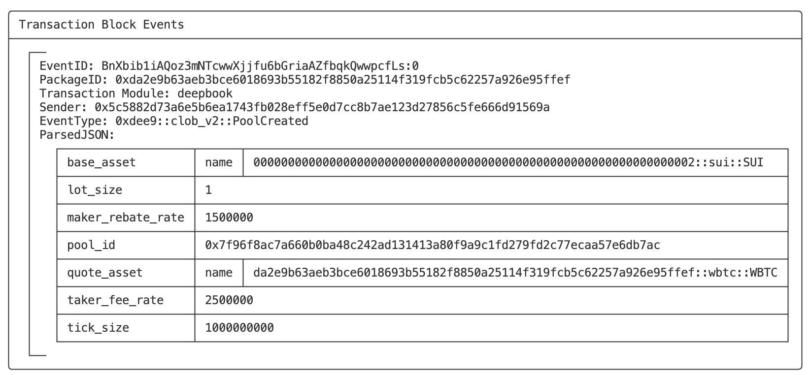
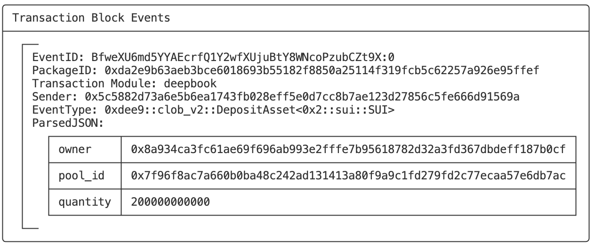

# SUI Move开发必知必会——使用SUI DeepBook构建DEX入门

*rzexin 2024.04.18*

[TOC]

## 前言

`DeepBook`是`SUI`的第一个**原生流动性层**，`DeepBook`为代币交易提供能力支持。通过它可以创建流动性池、处理存款和提款，以及执行各种资产交换等操作。

本文将介绍`DeepBook`合约提供的基本功能，并进行合约开发及交互实践。

主要参考的资料：

-   https://docs.sui.io/standards/deepbook
-   https://github.com/MystenLabs/sui/tree/main/crates/sui-framework/packages/deepbook

-   https://dacade.org/zh/communities/sui/challenges/19885730-fb83-477a-b95b-4ab265b61438/learning-modules/fc2e67a1-520d-4fae-a318-38414babc803

## 基本概念

-   **流动性池（`Liquidity Pool`）**

    流动性池是一种包含**资产储备**的智能合约。从技术上讲，流动性池是锁定在智能合约中的代币集合，用于促进去中心化交易和资产交换。

-   **基础资产（`Base Assets`）和报价资产（`Quote Assets`）**

    基础资产是指正在被交易的资产，而报价资产是用来表示基础资产价值的资产。

    例如：在`BTC/USDT`交易对中，`BTC`是基础资产，表示我们正在交易比特币；而`USDT`是报价资产，表示我们用泰达币来衡量比特币的价值。

-   **托管账户（`Custodian Account`）**

    托管账户是一种特殊的账户，用于代表其他账户持有资产。在`SUI`中，托管账户被用来管理资产，提供安全性和灵活性。

    交易者可以通过调用`create_account`来获得授权他们访问托管账户的`AccountCap`对象，从而生成托管账户。

    `AccountCap`对象代表托管帐户的所有权，如果将此对象转移给其他人，则新所有者可以访问托管帐户中的所有资金和订单。

-   **限价单（`Limit Order`）**

    指以特定价格或更好的价格买卖资产的订单。

-   **市价单（`Market Order`）**

    指以最佳市场价买卖资产的订单。

-   **接单者/买入者（`Taker`）**

    通过接受已有的订单来从市场中获取流动性的参与者。

-   **挂单者/卖出者（`Maker`）**

    通过发布新的买入或卖出订单来为市场提供流动性的参与者。

## DeepBook合约介绍

### 核心结构定义

```rust
struct Pool<phantom BaseAsset, phantom QuoteAsset> has key, store {
    // The key to the following Critbit Tree are order prices.
    id: UID,
    // All open bid orders.
    bids: CritbitTree<TickLevel>,
    // All open ask orders.
    asks: CritbitTree<TickLevel>,
    // Order id of the next bid order, starting from 0.
    next_bid_order_id: u64,
    // Order id of the next ask order, starting from 1<<63.
    next_ask_order_id: u64,
    // Map from AccountCap owner ID -> (map from order id -> order price)
    usr_open_orders: Table<address, LinkedTable<u64, u64>>,
    // taker_fee_rate should be strictly greater than maker_rebate_rate.
    // The difference between taker_fee_rate and maker_rabate_rate goes to the protocol.
    // 10^9 scaling
    taker_fee_rate: u64,
    // 10^9 scaling
    maker_rebate_rate: u64,
    tick_size: u64,
    lot_size: u64,
    // other pool info
    base_custodian: Custodian<BaseAsset>,
    quote_custodian: Custodian<QuoteAsset>,
    // Stores the fee paid to create this pool. These funds are not accessible.
    creation_fee: Balance<SUI>,
    // Deprecated.
    base_asset_trading_fees: Balance<BaseAsset>,
    // Stores the trading fees paid in `QuoteAsset`. These funds are not accessible in the V1 of the Pools, but V2 Pools are accessible.
    quote_asset_trading_fees: Balance<QuoteAsset>,
}
```

### 创建托管账户

-   该账户仅用于限价单，在下限价单之前，交易者需要先创建托管账户存放资产

-   交易者可以通过调用`create_account`来获得授权他们访问托管账户的`AccountCap`对象

```rust
    public fun create_account(ctx: &mut TxContext): AccountCap {
        mint_account_cap(ctx)
    }

    /// Capability granting permission to access an entry in `Custodian.account_balances`.
    /// Calling `mint_account_cap` creates an "admin account cap" such that id == owner with
    /// the permission to both access funds and create new `AccountCap`s.
    /// Calling `create_child_account_cap` creates a "child account cap" such that id != owner
    /// that can access funds, but cannot create new `AccountCap`s.
    public struct AccountCap has key, store {
        id: UID,
        /// The owner of this AccountCap. Note: this is
        /// derived from an object ID, not a user address
        owner: address
    }

    /// Create an admin `AccountCap` that can be used across all DeepBook pools, and has
    /// the permission to create new `AccountCap`s that can access the same source of funds
    public(package) fun mint_account_cap(ctx: &mut TxContext): AccountCap {
        let id = object::new(ctx);
        let owner = object::uid_to_address(&id);
        AccountCap { id, owner }
    }
```

-   从而生成托管账户，`AccountCap`对象代表托管帐户的所有权

```rust
    // Custodian for limit orders.
    public struct Custodian<phantom T> has key, store {
        id: UID,
        /// Map from the owner address of AccountCap object to an Account object
        account_balances: Table<address, Account<T>>,
    }
    
    public struct Account<phantom T> has store {
        available_balance: Balance<T>,
        locked_balance: Balance<T>,
    }
```

-   托管账户链上存储形式


### 创建流动性池

-   在`DeepBook`中创建流动性池子（`create_pool`）时，需要指定的参数有：
    -   `BaseAsset`：基础资产类型
    -   `QuoteAsset`：报价资产的类型
    -   `tick_size`：最小价格变动数量。即价格变动的最小粒度，有助于限制价格的波动，并确保市场的稳定
    -   `lot_size`：最小交易数量。即每笔交易的最小数量，有助于确保市场中的交易量不会过于碎片化
    -   `creation_fee`：创建池子交易费

```rust
    public fun create_pool<BaseAsset, QuoteAsset>(
        tick_size: u64,
        lot_size: u64,
        creation_fee: Coin<SUI>,
        ctx: &mut TxContext,
    ) {
        create_customized_pool<BaseAsset, QuoteAsset>(
            tick_size,
            lot_size,
            REFERENCE_TAKER_FEE_RATE,
            REFERENCE_MAKER_REBATE_RATE,
            creation_fee,
            ctx,
        );
    }
```

-   `create_pool`中调用了`create_customized_pool`，设置了默认的接单者支付手续费率（`taker_fee_rate`）以及挂单者获得的返利费率

```rust
    const REFERENCE_TAKER_FEE_RATE: u64 = 2_500_000;
    const REFERENCE_MAKER_REBATE_RATE: u64 = 1_500_000;

    /// Function for creating pool with customized taker fee rate and maker rebate rate.
    /// The taker_fee_rate should be greater than or equal to the maker_rebate_rate, and both should have a scaling of 10^9.
    /// Taker_fee_rate of 0.25% should be 2_500_000 for example
    public fun create_customized_pool<BaseAsset, QuoteAsset>(
        tick_size: u64,
        lot_size: u64,
        taker_fee_rate: u64,
        maker_rebate_rate: u64,
        creation_fee: Coin<SUI>,
        ctx: &mut TxContext,
    ) {
        create_pool_<BaseAsset, QuoteAsset>(
            taker_fee_rate,
            maker_rebate_rate,
            tick_size,
            lot_size,
            coin::into_balance(creation_fee),
            ctx
        )
    }
```

-   创建的流动性池（`Pool`）为一个共享对象，池子所有者权限（`PoolOwnerCap`）会发送给池子创建者

```rust
    #[allow(lint(self_transfer, share_owned))]
    fun create_pool_<BaseAsset, QuoteAsset>(
        taker_fee_rate: u64,
        maker_rebate_rate: u64,
        tick_size: u64,
        lot_size: u64,
        creation_fee: Balance<SUI>,
        ctx: &mut TxContext,
    ) {
        let (pool, pool_owner_cap) = create_pool_with_return_<BaseAsset, QuoteAsset>(
            taker_fee_rate,
            maker_rebate_rate,
            tick_size,
            lot_size,
            creation_fee,
            ctx
        );

        transfer::public_transfer(pool_owner_cap, tx_context::sender(ctx));
        transfer::share_object(pool);
    }
    
   /// Helper function that all the create pools now call to create pools.
    fun create_pool_with_return_<BaseAsset, QuoteAsset>(
        taker_fee_rate: u64,
        maker_rebate_rate: u64,
        tick_size: u64,
        lot_size: u64,
        creation_fee: Balance<SUI>,
        ctx: &mut TxContext,
    ): (Pool<BaseAsset, QuoteAsset>, PoolOwnerCap) {
        assert!(balance::value(&creation_fee) == FEE_AMOUNT_FOR_CREATE_POOL, EInvalidFee);

        let base_type_name = type_name::get<BaseAsset>();
        let quote_type_name = type_name::get<QuoteAsset>();

        assert!(clob_math::unsafe_mul(lot_size, tick_size) > 0, EInvalidTickSizeLotSize);
        assert!(base_type_name != quote_type_name, EInvalidPair);
        assert!(taker_fee_rate >= maker_rebate_rate, EInvalidFeeRateRebateRate);

        let pool_uid = object::new(ctx);
        let pool_id = *object::uid_as_inner(&pool_uid);

        // Creates the capability to mark a pool owner.
        let id = object::new(ctx);
        let owner = object::uid_to_address(&pool_uid);
        let pool_owner_cap = PoolOwnerCap { id, owner };

        event::emit(PoolCreated {
            pool_id,
            base_asset: base_type_name,
            quote_asset: quote_type_name,
            taker_fee_rate,
            maker_rebate_rate,
            tick_size,
            lot_size,
        });
      
        (Pool<BaseAsset, QuoteAsset> {
            id: pool_uid,
            bids: critbit::new(ctx),
            asks: critbit::new(ctx),
            next_bid_order_id: MIN_BID_ORDER_ID,
            next_ask_order_id: MIN_ASK_ORDER_ID,
            usr_open_orders: table::new(ctx),
            taker_fee_rate,
            maker_rebate_rate,
            tick_size,
            lot_size,
            base_custodian: custodian::new<BaseAsset>(ctx),
            quote_custodian: custodian::new<QuoteAsset>(ctx),
            creation_fee,
            base_asset_trading_fees: balance::zero(),
            quote_asset_trading_fees: balance::zero(),
        }, pool_owner_cap)
    }
```


## 合约开发

>   我们将实现流动性池创建、托管账户管理、限价单和市价单以及资产提取。

### 工程创建

-   **新建项目**

```bash
$ sui move new howtosui_deepbook
```

### WBTC模块构建

>   该文件实现包装比特币（`WBTC`）模块的基本实现，包括：初始化、铸造和销毁功能

```rust
module howtosui::wbtc {
    use sui::coin::{Coin, TreasuryCap, Self};

    public struct WBTC has drop {}

    #[allow(unused_function)]
    fun init(witness: WBTC, ctx: &mut TxContext) {
        let (treasury, metadata) = coin::create_currency(witness, 6, b"WBTC", b"", b"", option::none(), ctx);
        transfer::public_freeze_object(metadata);
        transfer::public_transfer(treasury, tx_context::sender(ctx))
    }

    public entry fun mint(
        treasury_cap: &mut TreasuryCap<WBTC>, amount: u64, recipient: address, ctx: &mut TxContext
    ) {
        treasury_cap.mint_and_transfer(amount, recipient, ctx)
    }

    public entry fun burn(treasury_cap: &mut TreasuryCap<WBTC>, coin: Coin<WBTC>) {
        treasury_cap.burn(coin);
    }
}
```

### SUI DeepBook模块构建

>   该模块实现`SUI DeepBook`的主合约文件，功能包括：创建流动性池、处理存款和提款，以及执行各种资产交换操作

#### （1）依赖引入

-   `deepbook::clob_v2`：该模块提供了创建流动性池、托管账户管理、限价单和市价单以及资产提取等逻辑
-   `deepbook::custodian_v2`：此模块提供托管账户管理的逻辑

```rust
#[lint_allow(self_transfer)]
module howtosui::deepbook {
    use deepbook::clob_v2 as deepbook;
    use deepbook::custodian_v2 as custodian;
    use sui::sui::SUI;
    use sui::coin::{Coin, Self};
    use sui::balance::{Self};
    use sui::clock::Clock;
```

#### （2）创建流动性池

>   使用`deepbook`提供的方法，可以很方便的创建新的流动性池，实现资产的无缝交换。

-   `FLOAT_SCALING`：定义浮动比例常量

-   该方法有两个泛型参数：`Base`、`Quote`，代表了基础和报价两种资产的类型

-   创建新流动池`deepbook::create_pool`方法说明：

    -   **函数签名**

    ```rust
        public fun create_pool<BaseAsset, QuoteAsset>(
            tick_size: u64,
            lot_size: u64,
            creation_fee: Coin<SUI>,
            ctx: &mut TxContext,
    ```

    -   **参数说明**
        -   `tick_size`：流动池初始价格
        -   `lot_size`：流动池初始数量
        -   `creation_fee`：支付收付费的`Coin`
        -   `ctx`：交易上下文

```rust
    const FLOAT_SCALING: u64 = 1_000_000_000;

    public fun new_pool<Base, Quote>(payment: &mut Coin<SUI>, ctx: &mut TxContext) {
        let balance = coin::balance_mut(payment);
        let fee = balance.split(100 * 1_000_000_000);
        let coin = coin::from_balance(fee, ctx);

        deepbook::create_pool<Base, Quote>(
            1 * FLOAT_SCALING,
            1,
            coin,
            ctx
        );
    }
```

#### （3）创建托管账号

>   通过托管账号，可以进行安全和个性化的资产管理。

```rust
    public fun new_custodian_account(ctx: &mut TxContext) {
        transfer::public_transfer(deepbook::create_account(ctx), tx_context::sender(ctx))
    }
```

#### （4）存入资产

-   `deepbook`提供了两个存入资产接口，分别用于存入基础资产（`make_base_deposit`）和报价资产（`make_quote_deposit`）到流动性池中
-   接口参数都是一样的，包括：
    -   `pool`：流动性池的可变引用
    -   `coin`：要存入的基础资产或报价资产
    -   `account_cap`：资产托管账户权限

```rust
    public fun make_base_deposit<Base, Quote>(pool: &mut deepbook::Pool<Base, Quote>, coin: Coin<Base>, account_cap: &custodian::AccountCap) {
        deepbook::deposit_base(pool, coin, account_cap)
    }

    public fun make_quote_deposit<Base, Quote>(pool: &mut deepbook::Pool<Base, Quote>, coin: Coin<Quote>, account_cap: &custodian::AccountCap) {
        deepbook::deposit_quote(pool, coin, account_cap)
    }
```

#### （5）提取资产

-   deepbook同样对应提供了两个提取资产接口，分别用于从流动性池中提取基础资产（`withdraw_base`）和报价资产（`withdraw_quote`）,提取的资产会转移给交易发起人
-   接口参数也都是一样的，包括：
    -   `pool`：流动性池的可变引用
    -   `quantity`：要提取的基础资产和报价资产的数量
    -   `account_cap`：资产托管账户权限
    -   `ctx`：交易上下文

```rust
    public fun withdraw_base<BaseAsset, QuoteAsset>(
        pool: &mut deepbook::Pool<BaseAsset, QuoteAsset>,
        quantity: u64,
        account_cap: &custodian::AccountCap,
        ctx: &mut TxContext
    ) {
        let base = deepbook::withdraw_base(pool, quantity, account_cap, ctx);
        transfer::public_transfer(base, tx_context::sender(ctx));
    }

    public fun withdraw_quote<BaseAsset, QuoteAsset>(
        pool: &mut deepbook::Pool<BaseAsset, QuoteAsset>,
        quantity: u64,
        account_cap: &custodian::AccountCap,
        ctx: &mut TxContext
    ) {
        let quote = deepbook::withdraw_quote(pool, quantity, account_cap, ctx);
        transfer::public_transfer(quote, tx_context::sender(ctx));
    }
```

#### （6）挂限价单

-   交易者可以通过指定价格和数量挂限价单（`place_limit_order`)
-   通过调用`deepbook::place_limit_order`接口向流动性池下发具有指定参数

```rust
    public fun place_limit_order<Base, Quote>(
        pool: &mut deepbook::Pool<Base, Quote>,
        client_order_id: u64,
        price: u64, 
        quantity: u64, 
        self_matching_prevention: u8,
        is_bid: bool,
        expire_timestamp: u64,
        restriction: u8,
        clock: &Clock,
        account_cap: &custodian::AccountCap,
        ctx: &mut TxContext
    ): (u64, u64, bool, u64) {
        deepbook::place_limit_order(
            pool, 
            client_order_id, 
            price, 
            quantity, 
            self_matching_prevention, 
            is_bid, 
            expire_timestamp, 
            restriction, 
            clock, 
            account_cap, 
            ctx
        )
    }
```

#### （7）挂市价单

-   交易者也可以挂市价单以实时价格成交
-   `place_base_market_order`：挂基础资产市价单
-   `place_quote_market_order`：挂报价资产市价单

```rust
    public fun place_base_market_order<Base, Quote>(
        pool: &mut deepbook::Pool<Base, Quote>,
        account_cap: &custodian::AccountCap,
        base_coin: Coin<Base>,
        client_order_id: u64,
        is_bid: bool,
        clock: &Clock,
        ctx: &mut TxContext,
    ) {
        let quote_coin = coin::zero<Quote>(ctx);
        let quantity = coin::value(&base_coin);
        place_market_order(
            pool,
            account_cap,
            client_order_id,
            quantity,
            is_bid,
            base_coin,
            quote_coin,
            clock,
            ctx
        )
    }

    public fun place_quote_market_order<Base, Quote>(
        pool: &mut deepbook::Pool<Base, Quote>,
        account_cap: &custodian::AccountCap,
        quote_coin: Coin<Quote>,
        client_order_id: u64,
        is_bid: bool,
        clock: &Clock,
        ctx: &mut TxContext,
    ) {
        let base_coin = coin::zero<Base>(ctx);
        let quantity = coin::value(&quote_coin);
        place_market_order(
            pool,
            account_cap,
            client_order_id,
            quantity,
            is_bid,
            base_coin,
            quote_coin,
            clock,
            ctx
        )
    }

    fun place_market_order<Base, Quote>(
        pool: &mut deepbook::Pool<Base, Quote>,
        account_cap: &custodian::AccountCap,
        client_order_id: u64,
        quantity: u64,
        is_bid: bool,
        base_coin: Coin<Base>,
        quote_coin: Coin<Quote>,
        clock: &Clock, // @0x6 hardcoded id of the Clock object
        ctx: &mut TxContext,
    ) {
        let (base, quote) = deepbook::place_market_order(
            pool, 
            account_cap, 
            client_order_id, 
            quantity, 
            is_bid, 
            base_coin, 
            quote_coin, 
            clock, 
            ctx
        );
        transfer::public_transfer(base, tx_context::sender(ctx));
        transfer::public_transfer(quote, tx_context::sender(ctx));
    }
```

#### （8）资产交换

-   交易者可以使用精确数量的基础资产交换尽可能多的报价资产（`swap_exact_base_for_quote`）也可以以精确数量的报价资产交换尽可能多的基础资产（`swap_exact_quote_for_base`）
-   交换后的基础资产和报价资产都会转移给交易发起人
-   在`swap_exact_base_for_quote`中创建了一个为`zero`的`quote_coin`，是因为调用`deepbook::swap_exact_base_for_quote`函数需要一个`quote_coin`作为参数，但不能将任何报价资产转移到流动性池中，所以创建了一个为零的`quote_coin`，以便函数调用时能确定报价资产的类型。

```rust
   public fun swap_exact_base_for_quote<Base, Quote>(
        pool: &mut deepbook::Pool<Base, Quote>,
        client_order_id: u64,
        account_cap: &custodian::AccountCap,
        quantity: u64,
        base_coin: Coin<Base>,
        clock: &Clock,
        ctx: &mut TxContext
    ) {
        let quote_coin = coin::zero<Quote>(ctx);
        let (base, quote, _) = deepbook::swap_exact_base_for_quote(
            pool,
            client_order_id,
            account_cap,
            quantity,
            base_coin,
            quote_coin,
            clock,
            ctx
        );
        transfer::public_transfer(base, tx_context::sender(ctx));
        transfer::public_transfer(quote, tx_context::sender(ctx));
    }

    public fun swap_exact_quote_for_base<Base, Quote>(
        pool: &mut deepbook::Pool<Base, Quote>,
        account_cap: &custodian::AccountCap,
        quote_coin: Coin<Quote>,
        client_order_id: u64,
        quantity: u64,
        clock: &Clock,
        ctx: &mut TxContext,
    ) {
        let (base, quote, _) = deepbook::swap_exact_quote_for_base(
            pool,
            client_order_id,
            account_cap,
            quantity,
            clock,
            quote_coin,
            ctx
        );
        transfer::public_transfer(base, tx_context::sender(ctx));
        transfer::public_transfer(quote, tx_context::sender(ctx));
    }
```

## 环境准备

### 启动本地节点

```bash
$ ./target/release/sui-test-validator 
```

### 切换环境为本地节点

```bash
$ sui client switch --env localnet
Active environment switched to [localnet]
```

### 领水

```
$ sui client faucet
Request successful. It can take up to 1 minute to get the coin. Run sui client gas to check your gas coins.

$ sui client gas
╭────────────────────────────────────────────────────────────────────┬────────────────────┬──────────────────╮
│ gasCoinId                                                          │ mistBalance (MIST) │ suiBalance (SUI) │
├────────────────────────────────────────────────────────────────────┼────────────────────┼──────────────────┤
│ 0x1195888886f87cb25fce6f8d07ac25452ccce99f63f913a26650f5deba370d84 │ 200000000000       │ 200.00           │
│ 0x294a7fc9d687bdfc553c9b662842bf78c571e063d24d803320161bd2e305e8ca │ 200000000000       │ 200.00           │
│ 0x526b422b56ca2e763af7d877f9b58da5806c5689d293d401978da1af3570af0d │ 200000000000       │ 200.00           │
│ 0xbc71adb694372b94dfad3ab0344fc3aa790335836a3470ac1077a88c66d2df5d │ 200000000000       │ 200.00           │
│ 0xbf2aca48c7da149cca7cb0f2df835ab8d505b7c4fc05c1eecf218d9a055b7af2 │ 200000000000       │ 200.00           │
╰────────────────────────────────────────────────────────────────────┴────────────────────┴──────────────────╯
```

## 合约测试

>   我们将通过`CLI`和`SDK`的方式进行合约测试。

### 合约部署

```bash
$ sui client publish --gas-budget 100000000

│ Created Objects:                                                                                                        │
│  ┌──                                                                                                                    │
│  │ ObjectID: 0x121c210bba7333871008016ec3b749cbd1fb532aa924e49ae8cb6b7e6cade1b1                                         │
│  │ Sender: 0x5c5882d73a6e5b6ea1743fb028eff5e0d7cc8b7ae123d27856c5fe666d91569a                                           │
│  │ Owner: Account Address ( 0x5c5882d73a6e5b6ea1743fb028eff5e0d7cc8b7ae123d27856c5fe666d91569a )                        │
│  │ ObjectType: 0x2::coin::TreasuryCap<0xda2e9b63aeb3bce6018693b55182f8850a25114f319fcb5c62257a926e95ffef::wbtc::WBTC>   │
│  │ Version: 3                                                                                                           │
│  │ Digest: F6h7bK7ZnyFZMxsbj2UrwuXdND4rbsKegiDCJnktuERQ                                                                 │
│  └──                                                                                                                    │

│  ┌──                                                                                                                    │
│  │ ObjectID: 0x1972493b7996f7dd1269385e8c0cc12156de91dff79957075b80b3e761989efe                                         │
│  │ Sender: 0x5c5882d73a6e5b6ea1743fb028eff5e0d7cc8b7ae123d27856c5fe666d91569a                                           │
│  │ Owner: Immutable                                                                                                     │
│  │ ObjectType: 0x2::coin::CoinMetadata<0xda2e9b63aeb3bce6018693b55182f8850a25114f319fcb5c62257a926e95ffef::wbtc::WBTC>  │
│  │ Version: 3                                                                                                           │
│  │ Digest: 9dD2AuBRPpEsjaTcK7wSW64PxCyVcxcV6NE6x8ZMpM4W                                                                 │
│  └──                                                                                                                    │

│ Published Objects:                                                                                                      │
│  ┌──                                                                                                                    │
│  │ PackageID: 0xda2e9b63aeb3bce6018693b55182f8850a25114f319fcb5c62257a926e95ffef                                        │
│  │ Version: 1                                                                                                           │
│  │ Digest: 497jssmXjafqs3frbtYhrdiFVWQXc9panALxL7YLnUCq                                                                 │
│  │ Modules: deepbook, wbtc                                                                                              │
│  └──                                                                                                                    │
```

### 记录环境变量

```bash
export PACKAGE_ID=0xda2e9b63aeb3bce6018693b55182f8850a25114f319fcb5c62257a926e95ffef
export SUI_FEE_COIN_ID=0x1195888886f87cb25fce6f8d07ac25452ccce99f63f913a26650f5deba370d84
export CLOCK_OBJECT_ID=0x6
export BASE_COIN_TYPE=0x2::sui::SUI
export BASE_COIN_ID=0x526b422b56ca2e763af7d877f9b58da5806c5689d293d401978da1af3570af0d
export QUOTE_COIN_TYPE=0xda2e9b63aeb3bce6018693b55182f8850a25114f319fcb5c62257a926e95ffef::wbtc::WBTC
export WBTC_TREASURY_CAP_ID=0x121c210bba7333871008016ec3b749cbd1fb532aa924e49ae8cb6b7e6cade1b1

# 账户1
export JASON=0x5c5882d73a6e5b6ea1743fb028eff5e0d7cc8b7ae123d27856c5fe666d91569a
# 账户2
export ALICE=0x2d178b9704706393d2630fe6cf9415c2c50b181e9e3c7a977237bb2929f82d19
```

### 创建流动性池

-   **执行命令**

```bash
sui client call --package $PACKAGE_ID --module deepbook --function new_pool --type-args $BASE_COIN_TYPE $QUOTE_COIN_TYPE --args $SUI_FEE_COIN_ID --gas-budget 10000000000
```

-   **关键输出**

```
│ Created Objects:                                                                                  │
│  ┌──                                                                                              │
│  │ ObjectID: 0x5af67672e255c1341091de0db2481e785464fb185135681b49ca835c7dd97458                   │
│  │ Sender: 0x5c5882d73a6e5b6ea1743fb028eff5e0d7cc8b7ae123d27856c5fe666d91569a                     │
│  │ Owner: Account Address ( 0x5c5882d73a6e5b6ea1743fb028eff5e0d7cc8b7ae123d27856c5fe666d91569a )  │
│  │ ObjectType: 0xdee9::clob_v2::PoolOwnerCap                                                      │
│  │ Version: 4                                                                                     │
│  │ Digest: HmmhYmzQiSJm4tQZ4kscup5gi5bLPgotWFsHok1YeLmK                                           │
│  └──                                                                                              │
│  ┌──                                                                                              │
│  │ ObjectID: 0x7f96f8ac7a660b0ba48c242ad131413a80f9a9c1fd279fd2c77ecaa57e6db7ac                   │
│  │ Sender: 0x5c5882d73a6e5b6ea1743fb028eff5e0d7cc8b7ae123d27856c5fe666d91569a                     │
│  │ Owner: Shared                                                                                  │
│  │ ObjectType: 0xdee9::clob_v2::Pool<0x2::sui::SUI, <PACKAGE_ID>::wbtc::WBTC>                     │
│  │ Version: 4                                                                                     │
│  │ Digest: J6kQ1MqQRHhWdSNPJK6dtLz9ZNEXpipwizAfvor2NwgP                                           │
│  └──                                                                                              │
```

-   **抛出事件**



-   **记录输出对象ID**

```bash
export POOL_ID=0x7f96f8ac7a660b0ba48c242ad131413a80f9a9c1fd279fd2c77ecaa57e6db7ac
export POOL_OWNER_CAP=0x5af67672e255c1341091de0db2481e785464fb185135681b49ca835c7dd97458
```

### 创建托管账户

>   为了创建限价单，需要在第一次与特定池交互时创建一个托管帐户，并将资产存入池中。

-   **执行命令**

```bash
$ sui client call --package $PACKAGE_ID  --module deepbook --function new_custodian_account  --gas-budget 10000000000
```

-   **关键输出**

```bash
│ Created Objects:                                                                                 │
│  ┌──                                                                                             │
│  │ ObjectID: 0x8a934ca3fc61ae69f696ab993e2fffe7b95618782d32a3fd367dbdeff187b0cf                  │
│  │ Sender: 0x5c5882d73a6e5b6ea1743fb028eff5e0d7cc8b7ae123d27856c5fe666d91569a                    │
│  │ Owner: Account Address ( 0x5c5882d73a6e5b6ea1743fb028eff5e0d7cc8b7ae123d27856c5fe666d91569a ) │
│  │ ObjectType: 0xdee9::custodian_v2::AccountCap                                                  │
│  │ Version: 5                                                                                    │
│  │ Digest: EMmFUeJ4onboTak6HiM7HBJWCAyEagyjopkuS8L8M3Ey                                          │
│  └──                                                                                             │
```

-   **记录输出对象ID**

```bash
export ACCOUNT1_CAP_ID=0x8a934ca3fc61ae69f696ab993e2fffe7b95618782d32a3fd367dbdeff187b0cf
```

-   **同样为用户2创建托管账户**

```bash
$ sui client switch --address alice
 
$ sui client call --package $PACKAGE_ID  --module deepbook --function new_custodian_account  --gas-budget 10000000000
│ Created Objects:                                                                                 │
│  ┌──                                                                                             │
│  │ ObjectID: 0x7a10e5aada5abee2ad899d0007aa76e0a86671e20682e750dd07359a83b38516                  │
│  │ Sender: 0x2d178b9704706393d2630fe6cf9415c2c50b181e9e3c7a977237bb2929f82d19                    │
│  │ Owner: Account Address ( 0x2d178b9704706393d2630fe6cf9415c2c50b181e9e3c7a977237bb2929f82d19 ) │
│  │ ObjectType: 0xdee9::custodian_v2::AccountCap                                                  │
│  │ Version: 3                                                                                    │
│  │ Digest: GRhcV6NtL1q7Kc27Dcd2R71WG6EErdpRi64gArcojaDg                                          │
│  └──                                                                                             │

export ACCOUNT2_CAP_ID=0x7a10e5aada5abee2ad899d0007aa76e0a86671e20682e750dd07359a83b38516
```

### 铸造WBTC

>   我们需要先铸造一些`WBTC`，以便我们可以存入到流动性池中。

-   **执行命令**

```bash
$ sui client call --function mint --module wbtc --package $PACKAGE_ID  --args $WBTC_TREASURY_CAP_ID "10000000000" $JASON --gas-budget 10000000
```

-   **关键输出**

```bash
│ Created Objects:                                                                                                       │
│  ┌──                                                                                                                   │
│  │ ObjectID: 0x675b6fb455d6c4bb628fb84b5cb2645b99f7fd466bad0af4719c9d98ef98576e                                        │
│  │ Sender: 0x5c5882d73a6e5b6ea1743fb028eff5e0d7cc8b7ae123d27856c5fe666d91569a                                          │
│  │ Owner: Account Address ( 0x5c5882d73a6e5b6ea1743fb028eff5e0d7cc8b7ae123d27856c5fe666d91569a )                       │
│  │ ObjectType: 0x2::coin::Coin<0xda2e9b63aeb3bce6018693b55182f8850a25114f319fcb5c62257a926e95ffef::wbtc::WBTC>         │
│  │ Version: 6                                                                                                          │
│  │ Digest: GuqM77VkmYeqHDAr2FwK3cpW2qAqzKbLWLphtjBa5hyw                                                                │
│  └──                                                                                                                   │
```

-   **记录输出对象**

```bash
export WBTC_ID=0x675b6fb455d6c4bb628fb84b5cb2645b99f7fd466bad0af4719c9d98ef98576e
```

### 存入资产

-   **执行命令**

```
$ sui client call --package $PACKAGE_ID  --module deepbook --function make_base_deposit  --args $POOL_ID $BASE_COIN_ID $ACCOUNT1_CAP_ID --type-args $BASE_COIN_TYPE $QUOTE_COIN_TYPE --gas-budget 10000000000
```

-   **抛出事件**



### 挂市价单

>   切换到用户2，执行以市价单购买资产的命令
>
>   `811`是订单编号，可以为任意数字

-   **执行命令**

```bash
# 拆分出1 SUI（命令可以参考：https://learnblockchain.cn/article/7832）
$ export SUI_COIN_ID=0x43cb6221fcd5dae0f8bfd0182da9c025df87d14dce04ea35b0398dc74a4c12f9

$ sui client call --package $PACKAGE_ID  --module deepbook --function place_base_market_order  --args $POOL_ID $ACCOUNT2_CAP_ID $SUI_COIN_ID 942 "false" $CLOCK_OBJECT_ID --type-args $BASE_COIN_TYPE $QUOTE_COIN_TYPE --gas-budget 10000000000
```

-   **关键输出**

```
│ Created Objects:                                                                                               │
│  ┌──                                                                                                           │
│  │ ObjectID: 0x1c6e955e630f5f03e4e96167120456035ac8914df6f0ac20c9785bec646fd682                                │
│  │ Sender: 0x2d178b9704706393d2630fe6cf9415c2c50b181e9e3c7a977237bb2929f82d19                                  │
│  │ Owner: Account Address ( 0x2d178b9704706393d2630fe6cf9415c2c50b181e9e3c7a977237bb2929f82d19 )               │
│  │ ObjectType: 0x2::coin::Coin<0xda2e9b63aeb3bce6018693b55182f8850a25114f319fcb5c62257a926e95ffef::wbtc::WBTC> │
│  │ Version: 6164                                                                                               │
│  │ Digest: 3W2N6V4M2VbgSKKQMdta4PfAmnSu9DqY6cqG6dFy93p9                                                        │
│  └──                                                                                                           │
```


