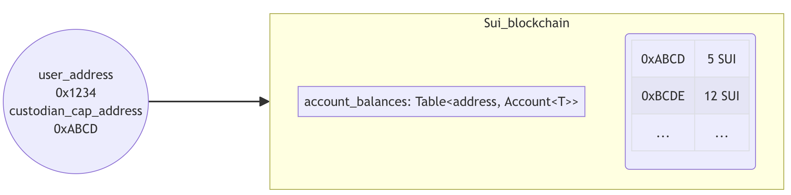

# SUI Move开发必知必会——使用SUI DeepBook构建DEX-1：入门篇

*rzexin 2024.04.18*

[TOC]

## 1 前言

`DeepBook`是`SUI`的第一个**原生流动性层**，`DeepBook`为代币交易提供能力支持。通过它可以创建流动性池、处理存款和提款，以及执行各种资产交换等操作。

本文将介绍`DeepBook`合约的基础功能和方法，在下一篇中将进行合约开发及交互实践。

如果文中有错误或理解不到位的地方，欢迎大家指正。

参考资料：

-   https://docs.sui.io/standards/deepbook
-   https://github.com/MystenLabs/sui/tree/main/crates/sui-framework/packages/deepbook

-   https://dacade.org/zh/communities/sui/challenges/19885730-fb83-477a-b95b-4ab265b61438/learning-modules/fc2e67a1-520d-4fae-a318-38414babc803

## 2 基本概念

-   **流动性池（`Liquidity Pool`）**

    流动性池是一种包含**资产储备**的智能合约。从技术上讲，流动性池是锁定在智能合约中的代币集合，用于促进去中心化交易和资产交换。

-   **基础资产（`Base Assets`）和报价资产（`Quote Assets`）**

    基础资产是指正在被交易的资产，而报价资产是用来表示基础资产价值的资产。

    例如：在`SUI/USDT`交易对中，`SUI`是基础资产，表示我们正在交易`SUI`；而`USDT`是报价资产，表示我们用`USDT`来衡量`SUI`币的价值。

-   **托管账户（`Custodian Account`）**

    托管账户是一种特殊的账户，用于代表其他账户持有资产。在`SUI`中，托管账户被用来管理资产，提供安全性和灵活性。

    交易者可以通过调用`create_account`来获得授权他们访问托管账户的`AccountCap`对象，从而生成托管账户。

    `AccountCap`对象代表托管帐户的所有权，如果将此对象转移给其他人，则新所有者可以访问托管帐户中的所有资金和订单。

-   **限价单（`Limit Order`）**

    指以特定价格或更好的价格买卖资产的订单。

-   **市价单（`Market Order`）**

    指以最佳市场价买卖资产的订单。

-   **接单者/买入者（`Taker`）**

    通过接受已有的订单来从市场中获取流动性的参与者。

-   **挂单者/卖出者（`Maker`）**

    通过发布新的买入或卖出订单来为市场提供流动性的参与者。

## 3 DeepBook核心结构

### 3.1 流动性池结构（`Pool`）

```rust
struct Pool<phantom BaseAsset, phantom QuoteAsset> has key, store {
    // The key to the following Critbit Tree are order prices.
    id: UID,
    // All open bid orders.
    bids: CritbitTree<TickLevel>,
    // All open ask orders.
    asks: CritbitTree<TickLevel>,
    // Order id of the next bid order, starting from 0.
    next_bid_order_id: u64,
    // Order id of the next ask order, starting from 1<<63.
    next_ask_order_id: u64,
    // Map from AccountCap owner ID -> (map from order id -> order price)
    usr_open_orders: Table<address, LinkedTable<u64, u64>>,
    // taker_fee_rate should be strictly greater than maker_rebate_rate.
    // The difference between taker_fee_rate and maker_rabate_rate goes to the protocol.
    // 10^9 scaling
    taker_fee_rate: u64,
    // 10^9 scaling
    maker_rebate_rate: u64,
    tick_size: u64,
    lot_size: u64,
    // other pool info
    base_custodian: Custodian<BaseAsset>,
    quote_custodian: Custodian<QuoteAsset>,
    // Stores the fee paid to create this pool. These funds are not accessible.
    creation_fee: Balance<SUI>,
    // Deprecated.
    base_asset_trading_fees: Balance<BaseAsset>,
    // Stores the trading fees paid in `QuoteAsset`. These funds are not accessible in the V1 of the Pools, but V2 Pools are accessible.
    quote_asset_trading_fees: Balance<QuoteAsset>,
}
```

### 3.2 托管账户结构（`Custodian`）

```rust
    // Custodian for limit orders.
    public struct Custodian<phantom T> has key, store {
        id: UID,
        /// Map from the owner address of AccountCap object to an Account object
        account_balances: Table<address, Account<T>>,
    }
    
    public struct Account<phantom T> has store {
        available_balance: Balance<T>,
        locked_balance: Balance<T>,
    }
```

-   托管账户链上存储结构




### 3.3 订单结构（`Order`）

- 对于每个交易池，订单`ID`对于每个开放订单都是递增且唯一的

- 较早提交的订单具有较低的订单`ID`

- 64位对于订单`ID`来说是足够的，而32位则不够

  > 假设Sui链的最大`TPS`（每秒交易数）为`100K/s`，那么需要 `(1<<63) / 100000 / 3600 / 24 / 365 = 2924712`年才能达到满容量。

- 订单`ID`的最高位用于表示订单类型：**0表示买单，1表示卖单**

```rust
    public struct Order has store, drop {
        // For each pool, order id is incremental and unique for each opening order.
        // Orders that are submitted earlier has lower order ids.
        // 64 bits are sufficient for order ids whereas 32 bits are not.
        // Assuming a maximum TPS of 100K/s of Sui chain, it would take (1<<63) / 100000 / 3600 / 24 / 365 = 2924712 years to reach the full capacity.
        // The highest bit of the order id is used to denote the order type, 0 for bid, 1 for ask.
        order_id: u64,
        client_order_id: u64,
        // Only used for limit orders.
        price: u64,
        // quantity when the order first placed in
        original_quantity: u64,
        // quantity of the order currently held
        quantity: u64,
        is_bid: bool,
        /// Order can only be canceled by the `AccountCap` with this owner ID
        owner: address,
        // Expiration timestamp in ms.
        expire_timestamp: u64,
        // reserved field for prevent self_matching
        self_matching_prevention: u8
    }
```

## 4 DeepBook基础方法

### 4.1 创建流动性池（`create_pool`）

-   在`DeepBook`中创建流动性池子（`create_pool`）时，需要指定的参数有：
    -   `BaseAsset`：基础资产类型
    -   `QuoteAsset`：报价资产的类型
    -   `tick_size`：最小价格变动数量。即价格变动的最小粒度，有助于限制价格的波动，并确保市场的稳定
    -   `lot_size`：最小交易数量。即每笔交易的最小数量，有助于确保市场中的交易量不会过于碎片化
    -   `creation_fee`：创建池子交易费

```rust
    public fun create_pool<BaseAsset, QuoteAsset>(
        tick_size: u64,
        lot_size: u64,
        creation_fee: Coin<SUI>,
        ctx: &mut TxContext,
    ) {
        create_customized_pool<BaseAsset, QuoteAsset>(
            tick_size,
            lot_size,
            REFERENCE_TAKER_FEE_RATE,
            REFERENCE_MAKER_REBATE_RATE,
            creation_fee,
            ctx,
        );
    }
```

-   `create_pool`中调用了`create_customized_pool`，设置了默认的接单者支付手续费率（`taker_fee_rate`）以及挂单者获得的返利费率

```rust
    const REFERENCE_TAKER_FEE_RATE: u64 = 2_500_000;
    const REFERENCE_MAKER_REBATE_RATE: u64 = 1_500_000;

    /// Function for creating pool with customized taker fee rate and maker rebate rate.
    /// The taker_fee_rate should be greater than or equal to the maker_rebate_rate, and both should have a scaling of 10^9.
    /// Taker_fee_rate of 0.25% should be 2_500_000 for example
    public fun create_customized_pool<BaseAsset, QuoteAsset>(
        tick_size: u64,
        lot_size: u64,
        taker_fee_rate: u64,
        maker_rebate_rate: u64,
        creation_fee: Coin<SUI>,
        ctx: &mut TxContext,
    ) {
        create_pool_<BaseAsset, QuoteAsset>(
            taker_fee_rate,
            maker_rebate_rate,
            tick_size,
            lot_size,
            coin::into_balance(creation_fee),
            ctx
        )
    }
```

-   创建的流动性池（`Pool`）为一个共享对象，池子所有者权限（`PoolOwnerCap`）会发送给池子创建者

```rust
    #[allow(lint(self_transfer, share_owned))]
    fun create_pool_<BaseAsset, QuoteAsset>(
        taker_fee_rate: u64,
        maker_rebate_rate: u64,
        tick_size: u64,
        lot_size: u64,
        creation_fee: Balance<SUI>,
        ctx: &mut TxContext,
    ) {
        let (pool, pool_owner_cap) = create_pool_with_return_<BaseAsset, QuoteAsset>(
            taker_fee_rate,
            maker_rebate_rate,
            tick_size,
            lot_size,
            creation_fee,
            ctx
        );

        transfer::public_transfer(pool_owner_cap, tx_context::sender(ctx));
        transfer::share_object(pool);
    }
    
   /// Helper function that all the create pools now call to create pools.
    fun create_pool_with_return_<BaseAsset, QuoteAsset>(
        taker_fee_rate: u64,
        maker_rebate_rate: u64,
        tick_size: u64,
        lot_size: u64,
        creation_fee: Balance<SUI>,
        ctx: &mut TxContext,
    ): (Pool<BaseAsset, QuoteAsset>, PoolOwnerCap) {
        assert!(balance::value(&creation_fee) == FEE_AMOUNT_FOR_CREATE_POOL, EInvalidFee);

        let base_type_name = type_name::get<BaseAsset>();
        let quote_type_name = type_name::get<QuoteAsset>();

        assert!(clob_math::unsafe_mul(lot_size, tick_size) > 0, EInvalidTickSizeLotSize);
        assert!(base_type_name != quote_type_name, EInvalidPair);
        assert!(taker_fee_rate >= maker_rebate_rate, EInvalidFeeRateRebateRate);

        let pool_uid = object::new(ctx);
        let pool_id = *object::uid_as_inner(&pool_uid);

        // Creates the capability to mark a pool owner.
        let id = object::new(ctx);
        let owner = object::uid_to_address(&pool_uid);
        let pool_owner_cap = PoolOwnerCap { id, owner };

        event::emit(PoolCreated {
            pool_id,
            base_asset: base_type_name,
            quote_asset: quote_type_name,
            taker_fee_rate,
            maker_rebate_rate,
            tick_size,
            lot_size,
        });
      
        (Pool<BaseAsset, QuoteAsset> {
            id: pool_uid,
            bids: critbit::new(ctx),
            asks: critbit::new(ctx),
            next_bid_order_id: MIN_BID_ORDER_ID,
            next_ask_order_id: MIN_ASK_ORDER_ID,
            usr_open_orders: table::new(ctx),
            taker_fee_rate,
            maker_rebate_rate,
            tick_size,
            lot_size,
            base_custodian: custodian::new<BaseAsset>(ctx),
            quote_custodian: custodian::new<QuoteAsset>(ctx),
            creation_fee,
            base_asset_trading_fees: balance::zero(),
            quote_asset_trading_fees: balance::zero(),
        }, pool_owner_cap)
    }
```

### 4.2 限价单

#### （1）创建托管账户（`create_account`）

-   该账户仅用于限价单，在下限价单之前，交易者需要先创建托管账户存放资产

-   交易者可以通过调用`create_account`来获得授权他们访问托管账户的`AccountCap`对象，从而生成托管账户

```rust
    public fun create_account(ctx: &mut TxContext): AccountCap {
        mint_account_cap(ctx)
    }

    /// Capability granting permission to access an entry in `Custodian.account_balances`.
    /// Calling `mint_account_cap` creates an "admin account cap" such that id == owner with
    /// the permission to both access funds and create new `AccountCap`s.
    /// Calling `create_child_account_cap` creates a "child account cap" such that id != owner
    /// that can access funds, but cannot create new `AccountCap`s.
    public struct AccountCap has key, store {
        id: UID,
        /// The owner of this AccountCap. Note: this is
        /// derived from an object ID, not a user address
        owner: address
    }

    /// Create an admin `AccountCap` that can be used across all DeepBook pools, and has
    /// the permission to create new `AccountCap`s that can access the same source of funds
    public(package) fun mint_account_cap(ctx: &mut TxContext): AccountCap {
        let id = object::new(ctx);
        let owner = object::uid_to_address(&id);
        AccountCap { id, owner }
    }
```

#### （2）存入资产（`deposit_base`、`deposit_quote`）

- 交易者可以将基础资产或报价资产存入其托管账户，以便日后用于下限价单。包括：
- **存入基础资产**

```rust
 public fun deposit_base<BaseAsset, QuoteAsset>(
        pool: &mut Pool<BaseAsset, QuoteAsset>,
        coin: Coin<BaseAsset>,
        account_cap: &AccountCap
    ) {
        let quantity = coin::value(&coin);
        assert!(quantity != 0, EInsufficientBaseCoin);
        custodian::increase_user_available_balance(
            &mut pool.base_custodian,
            account_owner(account_cap),
            coin::into_balance(coin)
        );
        event::emit(DepositAsset<BaseAsset>{
            pool_id: *object::uid_as_inner(&pool.id),
            quantity,
            owner: account_owner(account_cap)
        })
    }

    public(package) fun increase_user_available_balance<T>(
        custodian: &mut Custodian<T>,
        owner: address,
        quantity: Balance<T>,
    ) {
        let account = borrow_mut_account_balance<T>(custodian, owner);
        balance::join(&mut account.available_balance, quantity);
    }
```

- **存入报价资产**

```rust
    public fun deposit_quote<BaseAsset, QuoteAsset>(
        pool: &mut Pool<BaseAsset, QuoteAsset>,
        coin: Coin<QuoteAsset>,
        account_cap: &AccountCap
    ) {
        let quantity = coin::value(&coin);
        assert!(quantity != 0, EInsufficientQuoteCoin);
        custodian::increase_user_available_balance(
            &mut pool.quote_custodian,
            account_owner(account_cap),
            coin::into_balance(coin)
        );
        event::emit(DepositAsset<QuoteAsset>{
            pool_id: *object::uid_as_inner(&pool.id),
            quantity,
            owner: account_owner(account_cap)
        })
    }
```

#### （3）提取资产（`withdraw_base`、`withdraw_quote`）

- 相应的有2个提取资产的方法

```rust
    public fun withdraw_base<BaseAsset, QuoteAsset>(
        pool: &mut Pool<BaseAsset, QuoteAsset>,
        quantity: u64,
        account_cap: &AccountCap,
        ctx: &mut TxContext
    ): Coin<BaseAsset> {
        assert!(quantity > 0, EInvalidQuantity);
        event::emit(WithdrawAsset<BaseAsset>{
            pool_id: *object::uid_as_inner(&pool.id),
            quantity,
            owner: account_owner(account_cap)
        });
        custodian::withdraw_asset(&mut pool.base_custodian, quantity, account_cap, ctx)
    }

    public fun withdraw_quote<BaseAsset, QuoteAsset>(
        pool: &mut Pool<BaseAsset, QuoteAsset>,
        quantity: u64,
        account_cap: &AccountCap,
        ctx: &mut TxContext
    ): Coin<QuoteAsset> {
        assert!(quantity > 0, EInvalidQuantity);
        event::emit(WithdrawAsset<QuoteAsset>{
            pool_id: *object::uid_as_inner(&pool.id),
            quantity,
            owner: account_owner(account_cap)
        });
        custodian::withdraw_asset(&mut pool.quote_custodian, quantity, account_cap, ctx)
    }
```

#### （4）挂限价单（`place_limit_order`）

- 挂单前需确保已经有了托管账户，并且拥有足够用于交易的基础资产或报价资产
- `is_bid`：表示卖出或买入基础资产
    - `true`表示使用报价资产购买基础资产（即：使用`USDT`购买`SUI`）
    - `false`表示出售基础资产获得报价资产（即：卖出`SUI`获得`USDT`）

- 返回值：成交的基础资产数量、成交的报价资产数量、是否为挂单方订单、挂单方订单的ID
    - 当限价订单未成功匹配时，将返回`false`以表示未成功匹配，并返回一个无意义的订单ID：0
    - 当限价订单成功匹配时，我们将返回`true`以表示成功匹配，并返回相应的订单ID


```rust
    /// Place a limit order to the order book.
    /// Returns (base quantity filled, quote quantity filled, whether a maker order is being placed, order id of the maker order).
    /// When the limit order is not successfully placed, we return false to indicate that and also returns a meaningless order_id 0.
    /// When the limit order is successfully placed, we return true to indicate that and also the corresponding order_id.
    /// So please check that boolean value first before using the order id.
    public fun place_limit_order<BaseAsset, QuoteAsset>(
        pool: &mut Pool<BaseAsset, QuoteAsset>,
        client_order_id: u64,
        price: u64,
        quantity: u64,
        self_matching_prevention: u8,
        is_bid: bool,
        expire_timestamp: u64, // Expiration timestamp in ms in absolute value inclusive.
        restriction: u8,
        clock: &Clock,
        account_cap: &AccountCap,
        ctx: &mut TxContext
    ): (u64, u64, bool, u64) {
        let (base_quantity_filled, quote_quantity_filled, is_success, order_id, _meta_data) = place_limit_order_int(
            pool,
            client_order_id,
            price,
            quantity,
            self_matching_prevention,
            is_bid,
            expire_timestamp, // Expiration timestamp in ms in absolute value inclusive.
            restriction,
            clock,
            account_cap,
            false, // don't compute metadata
            ctx
        );
        (base_quantity_filled, quote_quantity_filled, is_success, order_id)
    }
```

### 4.3 市价单

#### （1）挂市价单（`place_market_order`）

- 挂市价单不需要托管账户

```rust
    /// Place a market order to the order book.
    public fun place_market_order<BaseAsset, QuoteAsset>(
        pool: &mut Pool<BaseAsset, QuoteAsset>,
        account_cap: &AccountCap,
        client_order_id: u64,
        quantity: u64,
        is_bid: bool,
        base_coin: Coin<BaseAsset>,
        quote_coin: Coin<QuoteAsset>,
        clock: &Clock,
        ctx: &mut TxContext,
    ): (Coin<BaseAsset>, Coin<QuoteAsset>) {
        let (base_coin, quote_coin, _metadata) = place_market_order_int(
            pool,
            account_cap,
            client_order_id,
            quantity,
            is_bid,
            base_coin,
            quote_coin,
            clock,
            false, // don't return metadata
            ctx
        );
        (base_coin, quote_coin)
    }
```

### 4.4 资产交换

#### （1）基础资产兑换成报价资产（`swap_exact_base_for_quote`）

```rust
    // for smart routing
    public fun swap_exact_base_for_quote<BaseAsset, QuoteAsset>(
        pool: &mut Pool<BaseAsset, QuoteAsset>,
        client_order_id: u64,
        account_cap: &AccountCap,
        quantity: u64,
        base_coin: Coin<BaseAsset>,
        quote_coin: Coin<QuoteAsset>,
        clock: &Clock,
        ctx: &mut TxContext,
    ): (Coin<BaseAsset>, Coin<QuoteAsset>, u64) {
        assert!(quantity > 0, EInvalidQuantity);
        assert!(coin::value(&base_coin) >= quantity, EInsufficientBaseCoin);
        let original_val = coin::value(&quote_coin);
        let (ret_base_coin, ret_quote_coin) = place_market_order(
            pool,
            account_cap,
            client_order_id,
            quantity,
            false,
            base_coin,
            quote_coin,
            clock,
            ctx
        );
        let ret_val = coin::value(&ret_quote_coin);
        (ret_base_coin, ret_quote_coin, ret_val - original_val)
    }
```

#### （2）报价资产兑换成基础资产（`swap_exact_quote_for_base`）

```rust
    // for smart routing
    public fun swap_exact_quote_for_base<BaseAsset, QuoteAsset>(
        pool: &mut Pool<BaseAsset, QuoteAsset>,
        client_order_id: u64,
        account_cap: &AccountCap,
        quantity: u64,
        clock: &Clock,
        quote_coin: Coin<QuoteAsset>,
        ctx: &mut TxContext,
    ): (Coin<BaseAsset>, Coin<QuoteAsset>, u64) {
        assert!(quantity > 0, EInvalidQuantity);
        assert!(coin::value(&quote_coin) >= quantity, EInsufficientQuoteCoin);
        let (base_asset_balance, quote_asset_balance, _matched_order_metadata) = match_bid_with_quote_quantity(
            pool,
            account_cap,
            client_order_id,
            quantity,
            MAX_PRICE,
            clock::timestamp_ms(clock),
            coin::into_balance(quote_coin),
            false // don't return metadata
        );
        let val = balance::value(&base_asset_balance);
        (coin::from_balance(base_asset_balance, ctx), coin::from_balance(quote_asset_balance, ctx), val)
    }
```

## 5 更多

欢迎关注微信公众号：**Move中文**，开启你的 **Sui Move** 之旅！


