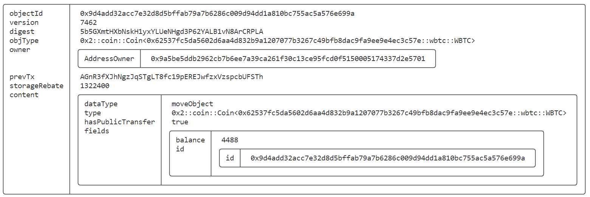

# SUI Move开发必知必会——使用SUI DeepBook构建DEX入门

*rzexin 2024.04.18*

[TOC]

## 1 前言

`DeepBook`是`SUI`的第一个**原生流动性层**，`DeepBook`为代币交易提供能力支持。通过它可以创建流动性池、处理存款和提款，以及执行各种资产交换等操作。

本文将介绍`DeepBook`合约的基础功能和方法，并进行合约开发及交互实践。

参考资料：

-   https://docs.sui.io/standards/deepbook
-   https://github.com/MystenLabs/sui/tree/main/crates/sui-framework/packages/deepbook

-   https://dacade.org/zh/communities/sui/challenges/19885730-fb83-477a-b95b-4ab265b61438/learning-modules/fc2e67a1-520d-4fae-a318-38414babc803

## 2 基本概念

-   **流动性池（`Liquidity Pool`）**

    流动性池是一种包含**资产储备**的智能合约。从技术上讲，流动性池是锁定在智能合约中的代币集合，用于促进去中心化交易和资产交换。

-   **基础资产（`Base Assets`）和报价资产（`Quote Assets`）**

    基础资产是指正在被交易的资产，而报价资产是用来表示基础资产价值的资产。

    例如：在`BTC/USDT`交易对中，`BTC`是基础资产，表示我们正在交易比特币；而`USDT`是报价资产，表示我们用泰达币来衡量比特币的价值。

-   **托管账户（`Custodian Account`）**

    托管账户是一种特殊的账户，用于代表其他账户持有资产。在`SUI`中，托管账户被用来管理资产，提供安全性和灵活性。

    交易者可以通过调用`create_account`来获得授权他们访问托管账户的`AccountCap`对象，从而生成托管账户。

    `AccountCap`对象代表托管帐户的所有权，如果将此对象转移给其他人，则新所有者可以访问托管帐户中的所有资金和订单。

-   **限价单（`Limit Order`）**

    指以特定价格或更好的价格买卖资产的订单。

-   **市价单（`Market Order`）**

    指以最佳市场价买卖资产的订单。

-   **接单者/买入者（`Taker`）**

    通过接受已有的订单来从市场中获取流动性的参与者。

-   **挂单者/卖出者（`Maker`）**

    通过发布新的买入或卖出订单来为市场提供流动性的参与者。

## 3 DeepBook核心结构

### 3.1 流动性池结构（`Pool`）

```rust
struct Pool<phantom BaseAsset, phantom QuoteAsset> has key, store {
    // The key to the following Critbit Tree are order prices.
    id: UID,
    // All open bid orders.
    bids: CritbitTree<TickLevel>,
    // All open ask orders.
    asks: CritbitTree<TickLevel>,
    // Order id of the next bid order, starting from 0.
    next_bid_order_id: u64,
    // Order id of the next ask order, starting from 1<<63.
    next_ask_order_id: u64,
    // Map from AccountCap owner ID -> (map from order id -> order price)
    usr_open_orders: Table<address, LinkedTable<u64, u64>>,
    // taker_fee_rate should be strictly greater than maker_rebate_rate.
    // The difference between taker_fee_rate and maker_rabate_rate goes to the protocol.
    // 10^9 scaling
    taker_fee_rate: u64,
    // 10^9 scaling
    maker_rebate_rate: u64,
    tick_size: u64,
    lot_size: u64,
    // other pool info
    base_custodian: Custodian<BaseAsset>,
    quote_custodian: Custodian<QuoteAsset>,
    // Stores the fee paid to create this pool. These funds are not accessible.
    creation_fee: Balance<SUI>,
    // Deprecated.
    base_asset_trading_fees: Balance<BaseAsset>,
    // Stores the trading fees paid in `QuoteAsset`. These funds are not accessible in the V1 of the Pools, but V2 Pools are accessible.
    quote_asset_trading_fees: Balance<QuoteAsset>,
}
```

### 3.2 托管账户结构（`Custodian`）

```rust
    // Custodian for limit orders.
    public struct Custodian<phantom T> has key, store {
        id: UID,
        /// Map from the owner address of AccountCap object to an Account object
        account_balances: Table<address, Account<T>>,
    }
    
    public struct Account<phantom T> has store {
        available_balance: Balance<T>,
        locked_balance: Balance<T>,
    }
```

-   托管账户链上存储结构


### 3.3 订单结构（`Order`）

- 对于每个交易池，订单`ID`对于每个开放订单都是递增且唯一的

- 较早提交的订单具有较低的订单`ID`

- 64位对于订单`ID`来说是足够的，而32位则不够

  > 假设Sui链的最大`TPS`（每秒交易数）为`100K/s`，那么需要 `(1<<63) / 100000 / 3600 / 24 / 365 = 2924712`年才能达到满容量。

- 订单`ID`的最高位用于表示订单类型：**0表示买单，1表示卖单**

```rust
    public struct Order has store, drop {
        // For each pool, order id is incremental and unique for each opening order.
        // Orders that are submitted earlier has lower order ids.
        // 64 bits are sufficient for order ids whereas 32 bits are not.
        // Assuming a maximum TPS of 100K/s of Sui chain, it would take (1<<63) / 100000 / 3600 / 24 / 365 = 2924712 years to reach the full capacity.
        // The highest bit of the order id is used to denote the order type, 0 for bid, 1 for ask.
        order_id: u64,
        client_order_id: u64,
        // Only used for limit orders.
        price: u64,
        // quantity when the order first placed in
        original_quantity: u64,
        // quantity of the order currently held
        quantity: u64,
        is_bid: bool,
        /// Order can only be canceled by the `AccountCap` with this owner ID
        owner: address,
        // Expiration timestamp in ms.
        expire_timestamp: u64,
        // reserved field for prevent self_matching
        self_matching_prevention: u8
    }
```

## 4 DeepBook基础方法

### 4.1 创建流动性池（`create_pool`）

-   在`DeepBook`中创建流动性池子（`create_pool`）时，需要指定的参数有：
    -   `BaseAsset`：基础资产类型
    -   `QuoteAsset`：报价资产的类型
    -   `tick_size`：最小价格变动数量。即价格变动的最小粒度，有助于限制价格的波动，并确保市场的稳定
    -   `lot_size`：最小交易数量。即每笔交易的最小数量，有助于确保市场中的交易量不会过于碎片化
    -   `creation_fee`：创建池子交易费

```rust
    public fun create_pool<BaseAsset, QuoteAsset>(
        tick_size: u64,
        lot_size: u64,
        creation_fee: Coin<SUI>,
        ctx: &mut TxContext,
    ) {
        create_customized_pool<BaseAsset, QuoteAsset>(
            tick_size,
            lot_size,
            REFERENCE_TAKER_FEE_RATE,
            REFERENCE_MAKER_REBATE_RATE,
            creation_fee,
            ctx,
        );
    }
```

-   `create_pool`中调用了`create_customized_pool`，设置了默认的接单者支付手续费率（`taker_fee_rate`）以及挂单者获得的返利费率

```rust
    const REFERENCE_TAKER_FEE_RATE: u64 = 2_500_000;
    const REFERENCE_MAKER_REBATE_RATE: u64 = 1_500_000;

    /// Function for creating pool with customized taker fee rate and maker rebate rate.
    /// The taker_fee_rate should be greater than or equal to the maker_rebate_rate, and both should have a scaling of 10^9.
    /// Taker_fee_rate of 0.25% should be 2_500_000 for example
    public fun create_customized_pool<BaseAsset, QuoteAsset>(
        tick_size: u64,
        lot_size: u64,
        taker_fee_rate: u64,
        maker_rebate_rate: u64,
        creation_fee: Coin<SUI>,
        ctx: &mut TxContext,
    ) {
        create_pool_<BaseAsset, QuoteAsset>(
            taker_fee_rate,
            maker_rebate_rate,
            tick_size,
            lot_size,
            coin::into_balance(creation_fee),
            ctx
        )
    }
```

-   创建的流动性池（`Pool`）为一个共享对象，池子所有者权限（`PoolOwnerCap`）会发送给池子创建者

```rust
    #[allow(lint(self_transfer, share_owned))]
    fun create_pool_<BaseAsset, QuoteAsset>(
        taker_fee_rate: u64,
        maker_rebate_rate: u64,
        tick_size: u64,
        lot_size: u64,
        creation_fee: Balance<SUI>,
        ctx: &mut TxContext,
    ) {
        let (pool, pool_owner_cap) = create_pool_with_return_<BaseAsset, QuoteAsset>(
            taker_fee_rate,
            maker_rebate_rate,
            tick_size,
            lot_size,
            creation_fee,
            ctx
        );

        transfer::public_transfer(pool_owner_cap, tx_context::sender(ctx));
        transfer::share_object(pool);
    }
    
   /// Helper function that all the create pools now call to create pools.
    fun create_pool_with_return_<BaseAsset, QuoteAsset>(
        taker_fee_rate: u64,
        maker_rebate_rate: u64,
        tick_size: u64,
        lot_size: u64,
        creation_fee: Balance<SUI>,
        ctx: &mut TxContext,
    ): (Pool<BaseAsset, QuoteAsset>, PoolOwnerCap) {
        assert!(balance::value(&creation_fee) == FEE_AMOUNT_FOR_CREATE_POOL, EInvalidFee);

        let base_type_name = type_name::get<BaseAsset>();
        let quote_type_name = type_name::get<QuoteAsset>();

        assert!(clob_math::unsafe_mul(lot_size, tick_size) > 0, EInvalidTickSizeLotSize);
        assert!(base_type_name != quote_type_name, EInvalidPair);
        assert!(taker_fee_rate >= maker_rebate_rate, EInvalidFeeRateRebateRate);

        let pool_uid = object::new(ctx);
        let pool_id = *object::uid_as_inner(&pool_uid);

        // Creates the capability to mark a pool owner.
        let id = object::new(ctx);
        let owner = object::uid_to_address(&pool_uid);
        let pool_owner_cap = PoolOwnerCap { id, owner };

        event::emit(PoolCreated {
            pool_id,
            base_asset: base_type_name,
            quote_asset: quote_type_name,
            taker_fee_rate,
            maker_rebate_rate,
            tick_size,
            lot_size,
        });
      
        (Pool<BaseAsset, QuoteAsset> {
            id: pool_uid,
            bids: critbit::new(ctx),
            asks: critbit::new(ctx),
            next_bid_order_id: MIN_BID_ORDER_ID,
            next_ask_order_id: MIN_ASK_ORDER_ID,
            usr_open_orders: table::new(ctx),
            taker_fee_rate,
            maker_rebate_rate,
            tick_size,
            lot_size,
            base_custodian: custodian::new<BaseAsset>(ctx),
            quote_custodian: custodian::new<QuoteAsset>(ctx),
            creation_fee,
            base_asset_trading_fees: balance::zero(),
            quote_asset_trading_fees: balance::zero(),
        }, pool_owner_cap)
    }
```

### 4.2 限价单

#### （1）创建托管账户（`create_account`）

-   该账户仅用于限价单，在下限价单之前，交易者需要先创建托管账户存放资产

-   交易者可以通过调用`create_account`来获得授权他们访问托管账户的`AccountCap`对象，从而生成托管账户

```rust
    public fun create_account(ctx: &mut TxContext): AccountCap {
        mint_account_cap(ctx)
    }

    /// Capability granting permission to access an entry in `Custodian.account_balances`.
    /// Calling `mint_account_cap` creates an "admin account cap" such that id == owner with
    /// the permission to both access funds and create new `AccountCap`s.
    /// Calling `create_child_account_cap` creates a "child account cap" such that id != owner
    /// that can access funds, but cannot create new `AccountCap`s.
    public struct AccountCap has key, store {
        id: UID,
        /// The owner of this AccountCap. Note: this is
        /// derived from an object ID, not a user address
        owner: address
    }

    /// Create an admin `AccountCap` that can be used across all DeepBook pools, and has
    /// the permission to create new `AccountCap`s that can access the same source of funds
    public(package) fun mint_account_cap(ctx: &mut TxContext): AccountCap {
        let id = object::new(ctx);
        let owner = object::uid_to_address(&id);
        AccountCap { id, owner }
    }
```

#### （2）存入资产（`deposit_base`、`deposit_quote`）

- 交易者可以将基础资产或报价资产存入其托管账户，以便日后用于下限价单。包括：
- **存入基础资产**

```rust
 public fun deposit_base<BaseAsset, QuoteAsset>(
        pool: &mut Pool<BaseAsset, QuoteAsset>,
        coin: Coin<BaseAsset>,
        account_cap: &AccountCap
    ) {
        let quantity = coin::value(&coin);
        assert!(quantity != 0, EInsufficientBaseCoin);
        custodian::increase_user_available_balance(
            &mut pool.base_custodian,
            account_owner(account_cap),
            coin::into_balance(coin)
        );
        event::emit(DepositAsset<BaseAsset>{
            pool_id: *object::uid_as_inner(&pool.id),
            quantity,
            owner: account_owner(account_cap)
        })
    }

    public(package) fun increase_user_available_balance<T>(
        custodian: &mut Custodian<T>,
        owner: address,
        quantity: Balance<T>,
    ) {
        let account = borrow_mut_account_balance<T>(custodian, owner);
        balance::join(&mut account.available_balance, quantity);
    }
```

- **存入报价资产**

```rust
    public fun deposit_quote<BaseAsset, QuoteAsset>(
        pool: &mut Pool<BaseAsset, QuoteAsset>,
        coin: Coin<QuoteAsset>,
        account_cap: &AccountCap
    ) {
        let quantity = coin::value(&coin);
        assert!(quantity != 0, EInsufficientQuoteCoin);
        custodian::increase_user_available_balance(
            &mut pool.quote_custodian,
            account_owner(account_cap),
            coin::into_balance(coin)
        );
        event::emit(DepositAsset<QuoteAsset>{
            pool_id: *object::uid_as_inner(&pool.id),
            quantity,
            owner: account_owner(account_cap)
        })
    }
```

#### （3）提取资产（`withdraw_base`、`withdraw_quote`）

- 相应的有2个提取资产的方法

```rust
    public fun withdraw_base<BaseAsset, QuoteAsset>(
        pool: &mut Pool<BaseAsset, QuoteAsset>,
        quantity: u64,
        account_cap: &AccountCap,
        ctx: &mut TxContext
    ): Coin<BaseAsset> {
        assert!(quantity > 0, EInvalidQuantity);
        event::emit(WithdrawAsset<BaseAsset>{
            pool_id: *object::uid_as_inner(&pool.id),
            quantity,
            owner: account_owner(account_cap)
        });
        custodian::withdraw_asset(&mut pool.base_custodian, quantity, account_cap, ctx)
    }

    public fun withdraw_quote<BaseAsset, QuoteAsset>(
        pool: &mut Pool<BaseAsset, QuoteAsset>,
        quantity: u64,
        account_cap: &AccountCap,
        ctx: &mut TxContext
    ): Coin<QuoteAsset> {
        assert!(quantity > 0, EInvalidQuantity);
        event::emit(WithdrawAsset<QuoteAsset>{
            pool_id: *object::uid_as_inner(&pool.id),
            quantity,
            owner: account_owner(account_cap)
        });
        custodian::withdraw_asset(&mut pool.quote_custodian, quantity, account_cap, ctx)
    }
```

#### （4）挂限价单（`place_limit_order`）

- 挂单前需确保已经有了托管账户，并且拥有足够用于交易的基础资产或报价资产
- 返回值：成交的基础资产数量、成交的报价资产数量、是否为挂单方订单、挂单方订单的ID
- 当限价订单未成功匹配时，将返回`false`以表示未成功匹配，并返回一个无意义的订单ID：0
- 当限价订单成功匹配时，我们将返回`true`以表示成功匹配，并返回相应的订单ID

```rust
    /// Place a limit order to the order book.
    /// Returns (base quantity filled, quote quantity filled, whether a maker order is being placed, order id of the maker order).
    /// When the limit order is not successfully placed, we return false to indicate that and also returns a meaningless order_id 0.
    /// When the limit order is successfully placed, we return true to indicate that and also the corresponding order_id.
    /// So please check that boolean value first before using the order id.
    public fun place_limit_order<BaseAsset, QuoteAsset>(
        pool: &mut Pool<BaseAsset, QuoteAsset>,
        client_order_id: u64,
        price: u64,
        quantity: u64,
        self_matching_prevention: u8,
        is_bid: bool,
        expire_timestamp: u64, // Expiration timestamp in ms in absolute value inclusive.
        restriction: u8,
        clock: &Clock,
        account_cap: &AccountCap,
        ctx: &mut TxContext
    ): (u64, u64, bool, u64) {
        let (base_quantity_filled, quote_quantity_filled, is_success, order_id, _meta_data) = place_limit_order_int(
            pool,
            client_order_id,
            price,
            quantity,
            self_matching_prevention,
            is_bid,
            expire_timestamp, // Expiration timestamp in ms in absolute value inclusive.
            restriction,
            clock,
            account_cap,
            false, // don't compute metadata
            ctx
        );
        (base_quantity_filled, quote_quantity_filled, is_success, order_id)
    }
```

### 4.3 市价单

#### （1）挂市价单（`place_market_order`）

- 挂市价单不需要托管账户

```rust
    /// Place a market order to the order book.
    public fun place_market_order<BaseAsset, QuoteAsset>(
        pool: &mut Pool<BaseAsset, QuoteAsset>,
        account_cap: &AccountCap,
        client_order_id: u64,
        quantity: u64,
        is_bid: bool,
        base_coin: Coin<BaseAsset>,
        quote_coin: Coin<QuoteAsset>,
        clock: &Clock,
        ctx: &mut TxContext,
    ): (Coin<BaseAsset>, Coin<QuoteAsset>) {
        let (base_coin, quote_coin, _metadata) = place_market_order_int(
            pool,
            account_cap,
            client_order_id,
            quantity,
            is_bid,
            base_coin,
            quote_coin,
            clock,
            false, // don't return metadata
            ctx
        );
        (base_coin, quote_coin)
    }
```

### 4.4 资产交换

#### （1）基础资产兑换成报价资产（`swap_exact_base_for_quote`）

```rust
    // for smart routing
    public fun swap_exact_base_for_quote<BaseAsset, QuoteAsset>(
        pool: &mut Pool<BaseAsset, QuoteAsset>,
        client_order_id: u64,
        account_cap: &AccountCap,
        quantity: u64,
        base_coin: Coin<BaseAsset>,
        quote_coin: Coin<QuoteAsset>,
        clock: &Clock,
        ctx: &mut TxContext,
    ): (Coin<BaseAsset>, Coin<QuoteAsset>, u64) {
        assert!(quantity > 0, EInvalidQuantity);
        assert!(coin::value(&base_coin) >= quantity, EInsufficientBaseCoin);
        let original_val = coin::value(&quote_coin);
        let (ret_base_coin, ret_quote_coin) = place_market_order(
            pool,
            account_cap,
            client_order_id,
            quantity,
            false,
            base_coin,
            quote_coin,
            clock,
            ctx
        );
        let ret_val = coin::value(&ret_quote_coin);
        (ret_base_coin, ret_quote_coin, ret_val - original_val)
    }
```

#### （2）报价资产兑换成基础资产（`swap_exact_quote_for_base`）

```rust
    // for smart routing
    public fun swap_exact_quote_for_base<BaseAsset, QuoteAsset>(
        pool: &mut Pool<BaseAsset, QuoteAsset>,
        client_order_id: u64,
        account_cap: &AccountCap,
        quantity: u64,
        clock: &Clock,
        quote_coin: Coin<QuoteAsset>,
        ctx: &mut TxContext,
    ): (Coin<BaseAsset>, Coin<QuoteAsset>, u64) {
        assert!(quantity > 0, EInvalidQuantity);
        assert!(coin::value(&quote_coin) >= quantity, EInsufficientQuoteCoin);
        let (base_asset_balance, quote_asset_balance, _matched_order_metadata) = match_bid_with_quote_quantity(
            pool,
            account_cap,
            client_order_id,
            quantity,
            MAX_PRICE,
            clock::timestamp_ms(clock),
            coin::into_balance(quote_coin),
            false // don't return metadata
        );
        let val = balance::value(&base_asset_balance);
        (coin::from_balance(base_asset_balance, ctx), coin::from_balance(quote_asset_balance, ctx), val)
    }
```

## 5 合约开发

>   我们将实现流动性池创建、托管账户管理、限价单和市价单以及资产交换。

### 5.1 工程创建

-   **新建项目**

```bash
$ sui move new howtosui_deepbook
```

### 5.2 WBTC模块构建

>   该文件实现包装比特币（`WBTC`）模块的基本实现，包括：初始化、铸造和销毁功能

```rust
module howtosui::wbtc {
    use sui::coin::{Coin, TreasuryCap, Self};

    public struct WBTC has drop {}

    #[allow(unused_function)]
    fun init(witness: WBTC, ctx: &mut TxContext) {
        let (treasury, metadata) = coin::create_currency(witness, 6, b"WBTC", b"", b"", option::none(), ctx);
        transfer::public_freeze_object(metadata);
        transfer::public_transfer(treasury, tx_context::sender(ctx))
    }

    public entry fun mint(
        treasury_cap: &mut TreasuryCap<WBTC>, amount: u64, recipient: address, ctx: &mut TxContext
    ) {
        treasury_cap.mint_and_transfer(amount, recipient, ctx)
    }

    public entry fun burn(treasury_cap: &mut TreasuryCap<WBTC>, coin: Coin<WBTC>) {
        treasury_cap.burn(coin);
    }
}
```

### 5.3 SUI DeepBook模块构建

>   该模块实现`SUI DeepBook`的主合约文件，功能包括：创建流动性池、处理存款和提款，以及执行各种资产交换操作

#### （1）依赖引入

-   `deepbook::clob_v2`：该模块提供了创建流动性池、托管账户管理、限价单和市价单以及资产提取等逻辑
-   `deepbook::custodian_v2`：此模块提供托管账户管理的逻辑

```rust
#[lint_allow(self_transfer)]
module howtosui::deepbook {
    use deepbook::clob_v2 as deepbook;
    use deepbook::custodian_v2 as custodian;
    use sui::sui::SUI;
    use sui::coin::{Coin, Self};
    use sui::balance::{Self};
    use sui::clock::Clock;
```

#### （2）创建流动性池

>   使用`deepbook`提供的方法，可以很方便的创建新的流动性池，实现资产的无缝交换。

-   `FLOAT_SCALING`：定义浮动比例常量

-   该方法有两个泛型参数：`Base`、`Quote`，代表了基础和报价两种资产的类型

-   创建新流动池`deepbook::create_pool`方法说明：

    -   **函数签名**

    ```rust
        public fun create_pool<BaseAsset, QuoteAsset>(
            tick_size: u64,
            lot_size: u64,
            creation_fee: Coin<SUI>,
            ctx: &mut TxContext,
    ```

    -   **参数说明**
        -   `tick_size`：流动池初始价格
        -   `lot_size`：流动池初始数量
        -   `creation_fee`：支付收付费的`Coin`
        -   `ctx`：交易上下文

```rust
    const FLOAT_SCALING: u64 = 1_000_000_000;

    public fun new_pool<Base, Quote>(payment: &mut Coin<SUI>, ctx: &mut TxContext) {
        let balance = coin::balance_mut(payment);
        let fee = balance.split(100 * 1_000_000_000);
        let coin = coin::from_balance(fee, ctx);

        deepbook::create_pool<Base, Quote>(
            1 * FLOAT_SCALING,
            1,
            coin,
            ctx
        );
    }
```

#### （3）创建托管账号

>   通过托管账号，可以进行安全和个性化的资产管理。

```rust
    public fun new_custodian_account(ctx: &mut TxContext) {
        transfer::public_transfer(deepbook::create_account(ctx), tx_context::sender(ctx))
    }
```

#### （4）存入资产

-   `deepbook`提供了两个存入资产接口，分别用于存入基础资产（`make_base_deposit`）和报价资产（`make_quote_deposit`）到流动性池中
-   接口参数都是一样的，包括：
    -   `pool`：流动性池的可变引用
    -   `coin`：要存入的基础资产或报价资产
    -   `account_cap`：资产托管账户权限

```rust
    public fun make_base_deposit<Base, Quote>(pool: &mut deepbook::Pool<Base, Quote>, coin: Coin<Base>, account_cap: &custodian::AccountCap) {
        deepbook::deposit_base(pool, coin, account_cap)
    }

    public fun make_quote_deposit<Base, Quote>(pool: &mut deepbook::Pool<Base, Quote>, coin: Coin<Quote>, account_cap: &custodian::AccountCap) {
        deepbook::deposit_quote(pool, coin, account_cap)
    }
```

#### （5）提取资产

-   deepbook同样对应提供了两个提取资产接口，分别用于从流动性池中提取基础资产（`withdraw_base`）和报价资产（`withdraw_quote`）,提取的资产会转移给交易发起人
-   接口参数也都是一样的，包括：
    -   `pool`：流动性池的可变引用
    -   `quantity`：要提取的基础资产和报价资产的数量
    -   `account_cap`：资产托管账户权限
    -   `ctx`：交易上下文

```rust
    public fun withdraw_base<BaseAsset, QuoteAsset>(
        pool: &mut deepbook::Pool<BaseAsset, QuoteAsset>,
        quantity: u64,
        account_cap: &custodian::AccountCap,
        ctx: &mut TxContext
    ) {
        let base = deepbook::withdraw_base(pool, quantity, account_cap, ctx);
        transfer::public_transfer(base, tx_context::sender(ctx));
    }

    public fun withdraw_quote<BaseAsset, QuoteAsset>(
        pool: &mut deepbook::Pool<BaseAsset, QuoteAsset>,
        quantity: u64,
        account_cap: &custodian::AccountCap,
        ctx: &mut TxContext
    ) {
        let quote = deepbook::withdraw_quote(pool, quantity, account_cap, ctx);
        transfer::public_transfer(quote, tx_context::sender(ctx));
    }
```

#### （6）挂限价单

-   交易者可以通过指定价格和数量挂限价单（`place_limit_order`)
-   通过调用`deepbook::place_limit_order`接口向流动性池下发具有指定参数

```rust
    public fun place_limit_order<Base, Quote>(
        pool: &mut deepbook::Pool<Base, Quote>,
        client_order_id: u64,
        price: u64, 
        quantity: u64, 
        self_matching_prevention: u8,
        is_bid: bool,
        expire_timestamp: u64,
        restriction: u8,
        clock: &Clock,
        account_cap: &custodian::AccountCap,
        ctx: &mut TxContext
    ): (u64, u64, bool, u64) {
        deepbook::place_limit_order(
            pool, 
            client_order_id, 
            price, 
            quantity, 
            self_matching_prevention, 
            is_bid, 
            expire_timestamp, 
            restriction, 
            clock, 
            account_cap, 
            ctx
        )
    }
```

#### （7）挂市价单

-   交易者也可以挂市价单以实时价格成交
-   `place_base_market_order`：挂基础资产市价单
-   `place_quote_market_order`：挂报价资产市价单

```rust
    public fun place_base_market_order<Base, Quote>(
        pool: &mut deepbook::Pool<Base, Quote>,
        account_cap: &custodian::AccountCap,
        base_coin: Coin<Base>,
        client_order_id: u64,
        is_bid: bool,
        clock: &Clock,
        ctx: &mut TxContext,
    ) {
        let quote_coin = coin::zero<Quote>(ctx);
        let quantity = coin::value(&base_coin);
        place_market_order(
            pool,
            account_cap,
            client_order_id,
            quantity,
            is_bid,
            base_coin,
            quote_coin,
            clock,
            ctx
        )
    }

    public fun place_quote_market_order<Base, Quote>(
        pool: &mut deepbook::Pool<Base, Quote>,
        account_cap: &custodian::AccountCap,
        quote_coin: Coin<Quote>,
        client_order_id: u64,
        is_bid: bool,
        clock: &Clock,
        ctx: &mut TxContext,
    ) {
        let base_coin = coin::zero<Base>(ctx);
        let quantity = coin::value(&quote_coin);
        place_market_order(
            pool,
            account_cap,
            client_order_id,
            quantity,
            is_bid,
            base_coin,
            quote_coin,
            clock,
            ctx
        )
    }

    fun place_market_order<Base, Quote>(
        pool: &mut deepbook::Pool<Base, Quote>,
        account_cap: &custodian::AccountCap,
        client_order_id: u64,
        quantity: u64,
        is_bid: bool,
        base_coin: Coin<Base>,
        quote_coin: Coin<Quote>,
        clock: &Clock, // @0x6 hardcoded id of the Clock object
        ctx: &mut TxContext,
    ) {
        let (base, quote) = deepbook::place_market_order(
            pool, 
            account_cap, 
            client_order_id, 
            quantity, 
            is_bid, 
            base_coin, 
            quote_coin, 
            clock, 
            ctx
        );
        transfer::public_transfer(base, tx_context::sender(ctx));
        transfer::public_transfer(quote, tx_context::sender(ctx));
    }
```

#### （8）资产交换

-   交易者可以使用精确数量的基础资产交换尽可能多的报价资产（`swap_exact_base_for_quote`）也可以以精确数量的报价资产交换尽可能多的基础资产（`swap_exact_quote_for_base`）
-   交换后的基础资产和报价资产都会转移给交易发起人
-   在`swap_exact_base_for_quote`中创建了一个为`zero`的`quote_coin`，是因为调用`deepbook::swap_exact_base_for_quote`函数需要一个`quote_coin`作为参数，但不能将任何报价资产转移到流动性池中，所以创建了一个为零的`quote_coin`，以便函数调用时能确定报价资产的类型。

```rust
   public fun swap_exact_base_for_quote<Base, Quote>(
        pool: &mut deepbook::Pool<Base, Quote>,
        client_order_id: u64,
        account_cap: &custodian::AccountCap,
        quantity: u64,
        base_coin: Coin<Base>,
        clock: &Clock,
        ctx: &mut TxContext
    ) {
        let quote_coin = coin::zero<Quote>(ctx);
        let (base, quote, _) = deepbook::swap_exact_base_for_quote(
            pool,
            client_order_id,
            account_cap,
            quantity,
            base_coin,
            quote_coin,
            clock,
            ctx
        );
        transfer::public_transfer(base, tx_context::sender(ctx));
        transfer::public_transfer(quote, tx_context::sender(ctx));
    }

    public fun swap_exact_quote_for_base<Base, Quote>(
        pool: &mut deepbook::Pool<Base, Quote>,
        account_cap: &custodian::AccountCap,
        quote_coin: Coin<Quote>,
        client_order_id: u64,
        quantity: u64,
        clock: &Clock,
        ctx: &mut TxContext,
    ) {
        let (base, quote, _) = deepbook::swap_exact_quote_for_base(
            pool,
            client_order_id,
            account_cap,
            quantity,
            clock,
            quote_coin,
            ctx
        );
        transfer::public_transfer(base, tx_context::sender(ctx));
        transfer::public_transfer(quote, tx_context::sender(ctx));
    }
```

## 6 环境准备

### 6.1 创建帐号

- **创建两个帐号**

```bash
# 帐号1：yasmine
$ sui client new-address ed25519 yasmine

# 帐号2：yoyo
$ sui client new-address ed25519 yoyo
```

- **记录地址到环境变量**

```bash
export YASMINE=0x74617c7691c3795e1cc30ee32472e480ca967ea3090d973c31dda4803b6ca366
export YOYO=0x9a5be5ddb2962cb7b6ee7a39ca261f30c13ce95fcd0f5150005174337d2e5701
```

### 6.2 启动本地节点

```bash
$ ./target/release/sui-test-validator 
```

### 6.3 切换环境为本地节点

```bash
$ sui client switch --env localnet
Active environment switched to [localnet]
```

### 6.4 帐号领水

> 分别为两个帐号进行领水

```bash
$ sui client switch --address yasmine
Active address switched to 0x74617c7691c3795e1cc30ee32472e480ca967ea3090d973c31dda4803b6ca366

$ sui client faucet
Request successful. It can take up to 1 minute to get the coin. Run sui client gas to check your gas coins.

$ sui client switch --address yoyo
Active address switched to 0x9a5be5ddb2962cb7b6ee7a39ca261f30c13ce95fcd0f5150005174337d2e5701

$ sui client faucet
Request successful. It can take up to 1 minute to get the coin. Run sui client gas to check your gas coins.
```

## 7 合约测试

### 7.1 合约部署

> 切换到帐号1进行合约部署

```bash
$ sui client switch --address yasmine
$ sui client publish --gas-budget 100000000
```

- **关键日志**

```bash
│ Created Objects:                                                                                                        │
│  ┌──                                                                                                                    │
│  │ ObjectID: 0x249ffa3da2b2169bfb24a1eb6dba75198eb02b22be4ded8d70c4d68bff2a0eb9                                         │
│  │ Sender: 0x74617c7691c3795e1cc30ee32472e480ca967ea3090d973c31dda4803b6ca366                                           │
│  │ Owner: Account Address ( 0x74617c7691c3795e1cc30ee32472e480ca967ea3090d973c31dda4803b6ca366 )                        │
│  │ ObjectType: 0x2::coin::TreasuryCap<0x62537fc5da5602d6aa4d832b9a1207077b3267c49bfb8dac9fa9ee9e4ec3c57e::wbtc::WBTC>   │
│  │ Version: 3                                                                                                           │
│  │ Digest: HtsjY2miT6udzLH3KDMKTMX7z4T43H7zPxUWAcd1Y3qm                                                                 │
│  └──                                                                                                                    │

│  ┌──                                                                                                                    │
│  │ ObjectID: 0xd654fd3c07ec481e6f2dfde500a506f15cd21e6aae9ef5b4fc1c3af383a67fcc                                         │
│  │ Sender: 0x74617c7691c3795e1cc30ee32472e480ca967ea3090d973c31dda4803b6ca366                                           │
│  │ Owner: Immutable                                                                                                     │
│  │ ObjectType: 0x2::coin::CoinMetadata<0x62537fc5da5602d6aa4d832b9a1207077b3267c49bfb8dac9fa9ee9e4ec3c57e::wbtc::WBTC>  │
│  │ Version: 3                                                                                                           │
│  │ Digest: EcuzFjHWWeTqn38dZxrzG2kQy9Zuzh8M5DFDrK4GC3kD                                                                 │
│  └──                                                                                                                    │

│ Published Objects:                                                                                                      │
│  ┌──                                                                                                                    │
│  │ PackageID: 0x62537fc5da5602d6aa4d832b9a1207077b3267c49bfb8dac9fa9ee9e4ec3c57e                                        │
│  │ Version: 1                                                                                                           │
│  │ Digest: AVJsvHkedSzYdxL52L7VbvMELyfBCHqtokrsDU5u6d4S                                                                 │
│  │ Modules: deepbook, wbtc                                                                                              │
│  └──                                                                                                                    │
```

- **记录关键信息到环境变量**

```bash
export PACKAGE_ID=0x62537fc5da5602d6aa4d832b9a1207077b3267c49bfb8dac9fa9ee9e4ec3c57e
export WBTC_TREASURY_CAP_ID=0x249ffa3da2b2169bfb24a1eb6dba75198eb02b22be4ded8d70c4d68bff2a0eb9

# 报价资产类型
export QUOTE_COIN_TYPE=$PACKAGE_ID::wbtc::WBTC

# 基础资产类型
export BASE_COIN_TYPE=0x2::sui::SUI
```

### 7.2 创建流动性池

> 帐号1创建流动性池，需要获取该地址下的`COIN ID`用于支付创建流动性池的手续费

-   **执行命令**

```bash
export YASMINE_SUI_FEE_COIN_ID=0xffdcfffa2eb625c890d5571630d7f74844be5384f0079528995a1b647ef91c9d
sui client call --package $PACKAGE_ID --module deepbook --function new_pool --type-args $BASE_COIN_TYPE $QUOTE_COIN_TYPE --args $YASMINE_SUI_FEE_COIN_ID --gas-budget 10000000000
```

-   **关键日志**

```
│ Created Objects:                                                                                  │   
│  ┌──                                                                                              │   
│  │ ObjectID: 0x8129d70e149d2a8e94c58232904bd43f99ff9dbe49ff0f8d078a0db6b11bfd59                   │   
│  │ Sender: 0x74617c7691c3795e1cc30ee32472e480ca967ea3090d973c31dda4803b6ca366                     │   
│  │ Owner: Account Address ( 0x74617c7691c3795e1cc30ee32472e480ca967ea3090d973c31dda4803b6ca366 )  │
│  │ ObjectType: 0xdee9::clob_v2::PoolOwnerCap                                                      │   
│  │ Version: 4                                                                                     │   
│  │ Digest: 33xMVeDCy3TdoGG3BfgzjYC2cYrG8tSPDx8ta1yGFhhf                                           │   
│  └──                                                                                              │   
│  ┌──                                                                                              │   
│  │ ObjectID: 0xd3779782c4e6058839a6aeed790e664dafa842beb5e41345c786726e38e7f609                   │   
│  │ Sender: 0x74617c7691c3795e1cc30ee32472e480ca967ea3090d973c31dda4803b6ca366                     │   
│  │ Owner: Shared                                                                                  │   
│  │ ObjectType: 0xdee9::clob_v2::Pool<0x2::sui::SUI, <PACKAGE_ID>::wbtc::WBTC>                     │   
│  │ Version: 4                                                                                     │   
│  │ Digest: 2WxcXKwUQ9t7rwHfwFvhTZ3DtnVMAzRqbXKPVPLqJtyS                                           │   
│  └──                                                                                              │   
```

-   **抛出事件**


-   **记录关键信息到环境变量**

```bash
export POOL_ID=0xd3779782c4e6058839a6aeed790e664dafa842beb5e41345c786726e38e7f609
export POOL_OWNER_CAP=0x8129d70e149d2a8e94c58232904bd43f99ff9dbe49ff0f8d078a0db6b11bfd59
```

### 7.3 创建托管账户

>   分别为两个帐号创建托管账户

-   **执行命令**

```bash
$ sui client switch --address yasmine
$ sui client call --package $PACKAGE_ID  --module deepbook --function new_custodian_account  --gas-budget 10000000000
```

-   **关键日志**

```bash
│ Created Objects:                                                                                 │
│  ┌──                                                                                             │
│  │ ObjectID: 0xf63669a4d1a7afcec4ae6ebc00a6f03e2df354e167b2d5c7737155d562396b8a                  │
│  │ Sender: 0x74617c7691c3795e1cc30ee32472e480ca967ea3090d973c31dda4803b6ca366                    │
│  │ Owner: Account Address ( 0x74617c7691c3795e1cc30ee32472e480ca967ea3090d973c31dda4803b6ca366 ) │
│  │ ObjectType: 0xdee9::custodian_v2::AccountCap                                                  │
│  │ Version: 5                                                                                    │
│  │ Digest: DQXpqv848yJVw5xphZk3TdzszGnfETwgWKMP8jcAfyyQ                                          │
│  └──                                                                                             │
```

-   **记录关键信息到环境变量**

```bash
export YASMINE_ACCOUNT_CAP_ID=0xf63669a4d1a7afcec4ae6ebc00a6f03e2df354e167b2d5c7737155d562396b8a
```

-   **同样为用户2创建托管账户**

```bash
$ sui client switch --address yoyo
 
$ sui client call --package $PACKAGE_ID  --module deepbook --function new_custodian_account  --gas-budget 10000000000
│ Created Objects:                                                                                 │
│  ┌──                                                                                             │
│  │ ObjectID: 0xb27024d108af1d60e674d9bb555ed793caef0225d4870b7319b2d8c6d69db3ce                  │
│  │ Sender: 0x9a5be5ddb2962cb7b6ee7a39ca261f30c13ce95fcd0f5150005174337d2e5701                    │
│  │ Owner: Account Address ( 0x9a5be5ddb2962cb7b6ee7a39ca261f30c13ce95fcd0f5150005174337d2e5701 ) │
│  │ ObjectType: 0xdee9::custodian_v2::AccountCap                                                  │
│  │ Version: 3                                                                                    │
│  │ Digest: BjLqHJYU8yFzD7Q3JBm4KQvespHHpLegaRcUq4ThM1Ax                                          │
│  └──                                                                                             │

export YOYO_ACCOUNT_CAP_ID=0xb27024d108af1d60e674d9bb555ed793caef0225d4870b7319b2d8c6d69db3ce
```

### 7.4 铸造WBTC

>   我们需要先铸造一些`WBTC`，以便我们可以存入到流动性池中。
>
>   切换到合约部署者（帐号1），分别为两个帐号进行铸造

-   **执行命令**

```bash
$ sui client call --function mint --module wbtc --package $PACKAGE_ID  --args $WBTC_TREASURY_CAP_ID "10000000000" $YASMINE --gas-budget 10000000

$ sui client call --function mint --module wbtc --package $PACKAGE_ID  --args $WBTC_TREASURY_CAP_ID "10000000000" $YOYO --gas-budget 10000000
```

-   **关键日志**

```bash
# 帐号1
│ Created Objects:                                                                                                       │
│  ┌──                                                                                                                   │
│  │ ObjectID: 0x8c77cf2d7edcc8a88ef6425fee4a1697e5bf279e6f1e6c4a51053f62ac0890c9                                        │
│  │ Sender: 0x74617c7691c3795e1cc30ee32472e480ca967ea3090d973c31dda4803b6ca366                                          │
│  │ Owner: Account Address ( 0x74617c7691c3795e1cc30ee32472e480ca967ea3090d973c31dda4803b6ca366 )                       │
│  │ ObjectType: 0x2::coin::Coin<0x62537fc5da5602d6aa4d832b9a1207077b3267c49bfb8dac9fa9ee9e4ec3c57e::wbtc::WBTC>         │
│  │ Version: 6                                                                                                          │
│  │ Digest: DXVEVq8c9EUxy2mFHMGptQtWtUsbUzriP9UJcksM6mu5                                                                │
│  └──                                                                                                                   │

# 帐号2
│ Created Objects:                                                                                                       │
│  ┌──                                                                                                                   │
│  │ ObjectID: 0x6dad061ce67422b4125ab86014248a22320414fa43c7fcd4575af02ac5b2eeaf                                        │
│  │ Sender: 0x74617c7691c3795e1cc30ee32472e480ca967ea3090d973c31dda4803b6ca366                                          │
│  │ Owner: Account Address ( 0x9a5be5ddb2962cb7b6ee7a39ca261f30c13ce95fcd0f5150005174337d2e5701 )                       │
│  │ ObjectType: 0x2::coin::Coin<0x62537fc5da5602d6aa4d832b9a1207077b3267c49bfb8dac9fa9ee9e4ec3c57e::wbtc::WBTC>         │
│  │ Version: 7                                                                                                          │
│  │ Digest: HJV5Vjnw9aAL272Srf23gKmnQHgHxc4mKvzV76uFaRsb                                                                │
│  └──                                                                                                                   │
```

-   **记录关键信息到环境变量**

```bash
export YASMINE_WBTC_OBJECT_ID=0x8c77cf2d7edcc8a88ef6425fee4a1697e5bf279e6f1e6c4a51053f62ac0890c9

export YOYO_WBTC_OBJECT_ID=0x6dad061ce67422b4125ab86014248a22320414fa43c7fcd4575af02ac5b2eeaf
```

### 7.5 存入资产

> 切换到帐号1，分别存入基础资产和报价资产到帐号1的托管账户中

#### （1）存入基础资产

-   **执行命令**

```bash
$ export YASMINE_BASE_COIN_ID=0xffdcfffa2eb625c890d5571630d7f74844be5384f0079528995a1b647ef91c9d

$ sui client call --package $PACKAGE_ID  --module deepbook --function make_base_deposit --args $POOL_ID $YASMINE_BASE_COIN_ID $YASMINE_ACCOUNT_CAP_ID --type-args $BASE_COIN_TYPE $QUOTE_COIN_TYPE --gas-budget 10000000000
```

-   **关键日志**

```
│ Created Objects:                                                                                   │   
│  ┌──                                                                                               │   
│  │ ObjectID: 0xd4d90d0fd00de7ad09fc8f385e800b48b57967726652596f3314cf3b1ba4e710                    │   
│  │ Sender: 0x74617c7691c3795e1cc30ee32472e480ca967ea3090d973c31dda4803b6ca366                      │   
│  │ Owner: Object ID: ( 0xdfd29c838491e289ec4dcbfe47e061a68d51d5a70620c2e710b4df72fd344bd2 )        │   
│  │ ObjectType: 0x2::dynamic_field::Field<address, 0xdee9::custodian_v2::Account<0x2::sui::SUI>>    │   
│  │ Version: 8                                                                                      │   
│  │ Digest: HkU7mAjn5bvTnCKf5JM46y9xQAjcEfbqBJZUPbFMvgPd                                            │   
│  └──                                                                                               │ 
```

-   **抛出事件**


#### （2）存入报价资产

-   **执行命令**

```bash
$ sui client call --package $PACKAGE_ID  --module deepbook --function make_quote_deposit --args $POOL_ID $YASMINE_WBTC_OBJECT_ID $YASMINE_ACCOUNT_CAP_ID --type-args $BASE_COIN_TYPE $QUOTE_COIN_TYPE --gas-budget 10000000000
```

-   **关键日志**

```
│ Created Objects:                                                                                          │  
│  ┌──                                                                                                      │  
│  │ ObjectID: 0x3507725f8c9c4908a20f003842c7cb4fef5f5407bd14e2b3100ab9cb6ff4b2d5                           │  
│  │ Sender: 0x74617c7691c3795e1cc30ee32472e480ca967ea3090d973c31dda4803b6ca366                             │
│  │ Owner: Object ID: ( 0xd17a491f7a2c29af7abe1ced81a57d301355a99712b1d34bf13715327729e3df )               │
│  │ ObjectType: 0x2::dynamic_field::Field<address, 0xdee9::custodian_v2::Account<PACKAGE_ID::wbtc::WBTC>>  │
│  │ Version: 10                                                                                            │  
│  │ Digest: FmQn9EHUzzewbrQ7Et18wpQk2HatXU2VfcyABsDFeXpq                                                   │  
│  └──                                                                                                      │  
```

-   **抛出事件**


### 7.6 挂限价单

#### （1）挂限价单1

- **执行命令**

> 注：42是订单ID，可以为任意数字

```bash
# 获取2小时后的毫秒级别时间戳
export EXPIRE_TIMESTAMP=`date -d "2 hours" +%s%3N`
export CLOCK_OBJECT_ID=0x6

$ sui client call --package $PACKAGE_ID  --module deepbook --function place_limit_order --args $POOL_ID 42 5000000000 200 0 true $EXPIRE_TIMESTAMP 0 $CLOCK_OBJECT_ID $YASMINE_ACCOUNT_CAP_ID --type-args $BASE_COIN_TYPE $QUOTE_COIN_TYPE --gas-budget 10000000000
```

- **关键日志**

```bash
│ Created Objects:                                                                                         │   
│  ┌──                                                                                                     │   
│  │ ObjectID: 0x53fad535193de914743351ab634ad14c889e363070313e06d9949827f993e426                          │   
│  │ Sender: 0x74617c7691c3795e1cc30ee32472e480ca967ea3090d973c31dda4803b6ca366                            │   
│  │ Owner: Object ID: ( 0x762018d21f8620646083f7f6a554241426dbf236e43441df8b35e02a623901de )              │   
│  │ ObjectType: 0x2::dynamic_field::Field<address, 0x2::linked_table::LinkedTable<u64, u64>>              │   
│  │ Version: 5701                                                                                         │   
│  │ Digest: HkkweKZ5xjeP2sodBCS1cKsgoMBg1ML8pKJoC6AS1UfJ                                                  │   
│  └──                                                                                                     │   
│  ┌──                                                                                                     │   
│  │ ObjectID: 0x8453a0e6d60822d3f0c2598467196adbf4d55ba13fac26a019d2fbf42b0b6376                          │   
│  │ Sender: 0x74617c7691c3795e1cc30ee32472e480ca967ea3090d973c31dda4803b6ca366                            │   
│  │ Owner: Object ID: ( 0xf4d87d2cb7c951dbd235949d908e47271347d6c159bdbdd4cd4cd0b5143e7a57 )              │   
│  │ ObjectType: 0x2::dynamic_field::Field<u64, 0xdee9::critbit::Leaf<0xdee9::clob_v2::TickLevel>>         │   
│  │ Version: 5701                                                                                         │   
│  │ Digest: 7kD2GVaaCKaSCgji1BGditpCXUHJ91T9cV4K2WBZFcrP                                                  │   
│  └──                                                                                                     │   
│  ┌──                                                                                                     │   
│  │ ObjectID: 0xd84d03e8bfe97a1e86843fb036b1f5529bed0315e295f8a0dd60777b3f4f6279                          │   
│  │ Sender: 0x74617c7691c3795e1cc30ee32472e480ca967ea3090d973c31dda4803b6ca366                            │   
│  │ Owner: Object ID: ( 0x16ae6a802f7207699611e611df5db701ddceabd0c553e4a03c822581283fea94 )              │   
│  │ ObjectType: 0x2::dynamic_field::Field<u64, 0x2::linked_table::Node<u64, u64>>                         │   
│  │ Version: 5701                                                                                         │   
│  │ Digest: 297k98VY5i3G1kUUEqJ2pfMmiHQAwqzqUpN5M7XL9Mgz                                                  │   
│  └──                                                                                                     │   
│  ┌──                                                                                                     │   
│  │ ObjectID: 0xe89e36022d209bbf612d8f42cd5f28a7a77a5534830871980f811ad2d7c26507                          │   
│  │ Sender: 0x74617c7691c3795e1cc30ee32472e480ca967ea3090d973c31dda4803b6ca366                            │   
│  │ Owner: Object ID: ( 0x1db3cf070eed73dbe3acbcefb347140a0e98e285b5055b57e1a4be1354ae7d82 )              │   
│  │ ObjectType: 0x2::dynamic_field::Field<u64, 0x2::linked_table::Node<u64, 0xdee9::clob_v2::Order>>      │   
│  │ Version: 5701                                                                                         │   
│  │ Digest: FTRG2viMk6fmRomvWS8MDBWyyBJxh6bDa6WP4zv2Q4WN                                                  │   
│  └──                                                                                                     │  
```

- **抛出事件**


#### （2）挂限价单2

- **执行命令**

```bash
$ sui client call --package $PACKAGE_ID  --module deepbook --function place_limit_order --args $POOL_ID 42 5000000000 300 0 true $EXPIRE_TIMESTAMP 0 $CLOCK_OBJECT_ID $YASMINE_ACCOUNT_CAP_ID --type-args $BASE_COIN_TYPE $QUOTE_COIN_TYPE --gas-budget 10000000000
```

- **关键日志**

```bash
│ Created Objects:                                                                                           │   
│  ┌──                                                                                                       │   
│  │ ObjectID: 0x22ba85cbcddc806bc061d699cdf114525e5c67871f317f353c553aed5ae8571b                            │   
│  │ Sender: 0x74617c7691c3795e1cc30ee32472e480ca967ea3090d973c31dda4803b6ca366                              │   
│  │ Owner: Object ID: ( 0x16ae6a802f7207699611e611df5db701ddceabd0c553e4a03c822581283fea94 )                │   
│  │ ObjectType: 0x2::dynamic_field::Field<u64, 0x2::linked_table::Node<u64, u64>>                           │   
│  │ Version: 6230                                                                                           │   
│  │ Digest: 7AtEdG3fKAyQcYMk8A5BMLiwNqk7jBbijPAditvxZ8C1                                                    │   
│  └──                                                                                                       │   
│  ┌──                                                                                                       │   
│  │ ObjectID: 0x88f85172068a061df40383845ecdeaa67516b9a1f3a6ba5e8fc1de17e4708a95                            │   
│  │ Sender: 0x74617c7691c3795e1cc30ee32472e480ca967ea3090d973c31dda4803b6ca366                              │   
│  │ Owner: Object ID: ( 0x1db3cf070eed73dbe3acbcefb347140a0e98e285b5055b57e1a4be1354ae7d82 )                │   
│  │ ObjectType: 0x2::dynamic_field::Field<u64, 0x2::linked_table::Node<u64, 0xdee9::clob_v2::Order>>        │   
│  │ Version: 6230                                                                                           │   
│  │ Digest: 6HKRkb7mnzBeokNgiT3GTGPe26aQouqGSkQhBzPqR5C5                                                    │   
│  └──                                                                                                       │  
```

- **抛出事件**


#### （3）挂限价单3

- **执行命令**

```bash
$ sui client call --package $PACKAGE_ID  --module deepbook --function place_limit_order --args $POOL_ID 42 2000000000 1000 0 true $EXPIRE_TIMESTAMP 0 $CLOCK_OBJECT_ID $YASMINE_ACCOUNT_CAP_ID --type-args $BASE_COIN_TYPE $QUOTE_COIN_TYPE --gas-budget 10000000000
```

- **关键日志**

```bash
│ Created Objects:                                                                                         │   
│  ┌──                                                                                                     │   
│  │ ObjectID: 0x47612a505c06cede145234098376e2c31f551d383d0c672cb993594357f160fb                          │   
│  │ Sender: 0x74617c7691c3795e1cc30ee32472e480ca967ea3090d973c31dda4803b6ca366                            │   
│  │ Owner: Object ID: ( 0xf4d87d2cb7c951dbd235949d908e47271347d6c159bdbdd4cd4cd0b5143e7a57 )              │   
│  │ ObjectType: 0x2::dynamic_field::Field<u64, 0xdee9::critbit::Leaf<0xdee9::clob_v2::TickLevel>>         │   
│  │ Version: 6637                                                                                         │   
│  │ Digest: BMSS95R4Heomip3xvbLoDFxBZgSzSkSXvS6WgZPWMysH                                                  │   
│  └──                                                                                                     │   
│  ┌──                                                                                                     │   
│  │ ObjectID: 0xa3e3df40cc16e826310a9d72fc885249ede8c5e1a0ed341fd3d7e0811036e30e                          │   
│  │ Sender: 0x74617c7691c3795e1cc30ee32472e480ca967ea3090d973c31dda4803b6ca366                            │   
│  │ Owner: Object ID: ( 0x76194a712388aed3b444b807f681c1b98622b8c0ca6c4f1296a609d3f9e46ce9 )              │   
│  │ ObjectType: 0x2::dynamic_field::Field<u64, 0xdee9::critbit::InternalNode>                             │   
│  │ Version: 6637                                                                                         │   
│  │ Digest: 41ENTGqPS3NF9KpWUpzokzpfgqPZB3GeTRoTipJPpGMf                                                  │   
│  └──                                                                                                     │   
│  ┌──                                                                                                     │   
│  │ ObjectID: 0xa43eb624b66434b06bf99143e90706eeb72b8ec407d6bd5d6d0569c00c8cb7e9                          │   
│  │ Sender: 0x74617c7691c3795e1cc30ee32472e480ca967ea3090d973c31dda4803b6ca366                            │   
│  │ Owner: Object ID: ( 0x16ae6a802f7207699611e611df5db701ddceabd0c553e4a03c822581283fea94 )              │   
│  │ ObjectType: 0x2::dynamic_field::Field<u64, 0x2::linked_table::Node<u64, u64>>                         │   
│  │ Version: 6637                                                                                         │   
│  │ Digest: oBL5gmVDKJK6teLvJK9T1BCpvHH15HdbND3GxNDph9W                                                   │   
│  └──                                                                                                     │   
│  ┌──                                                                                                     │   
│  │ ObjectID: 0xbb1f1bf59fe289d9b20489e4a37336cc383f37c431f4bdd529240c6b6295fe88                          │   
│  │ Sender: 0x74617c7691c3795e1cc30ee32472e480ca967ea3090d973c31dda4803b6ca366                            │   
│  │ Owner: Object ID: ( 0x6d72c8e7dee73ee419459043866717579b769f914fc91f1e3f4f85f384fa73d6 )              │   
│  │ ObjectType: 0x2::dynamic_field::Field<u64, 0x2::linked_table::Node<u64, 0xdee9::clob_v2::Order>>      │   
│  │ Version: 6637                                                                                         │   
│  │ Digest: EiUfG2KJmr5gQaPghumoagrXgY6aph5c8AcqoR5NyqSD                                                  │   
│  └──                                                                                                     │    
```

- **抛出事件**


#### （4）挂限价单4

- **执行命令**

```bash
$ sui client call --package $PACKAGE_ID  --module deepbook --function place_limit_order --args $POOL_ID 42 20000000000 1000 0 false $EXPIRE_TIMESTAMP 0 $CLOCK_OBJECT_ID $YASMINE_ACCOUNT_CAP_ID --type-args $BASE_COIN_TYPE $QUOTE_COIN_TYPE --gas-budget 10000000000
```

- **关键日志**

```bash
│ Created Objects:                                                                                       │   
│  ┌──                                                                                                   │   
│  │ ObjectID: 0x130e85287e3b0629b6c2b0c9d13303df140b4f1b08ddacace4079bdf502c3ac7                        │   
│  │ Sender: 0x74617c7691c3795e1cc30ee32472e480ca967ea3090d973c31dda4803b6ca366                          │   
│  │ Owner: Object ID: ( 0x38346eb44155d1604703b4ba1b1aa62c026afc6a334fd3b059f678a1201adb94 )            │   
│  │ ObjectType: 0x2::dynamic_field::Field<u64, 0xdee9::critbit::Leaf<0xdee9::clob_v2::TickLevel>>       │   
│  │ Version: 6832                                                                                       │   
│  │ Digest: Chc6MpL2eUA2tLcqiqzwP7V3BUAvUnq6i6vbyVeQZWat                                                │   
│  └──                                                                                                   │   
│  ┌──                                                                                                   │   
│  │ ObjectID: 0x41fb3b2175437f8b0d1b546ea17550e29a9ec3ddd6e72b69af2b8c50404ad466                        │   
│  │ Sender: 0x74617c7691c3795e1cc30ee32472e480ca967ea3090d973c31dda4803b6ca366                          │   
│  │ Owner: Object ID: ( 0x16ae6a802f7207699611e611df5db701ddceabd0c553e4a03c822581283fea94 )            │   
│  │ ObjectType: 0x2::dynamic_field::Field<u64, 0x2::linked_table::Node<u64, u64>>                       │   
│  │ Version: 6832                                                                                       │   
│  │ Digest: DW6dHeqT3rtCPSrGiuKmyGNuhsjJKfZpGr5Y4SNYbwwC                                                │   
│  └──                                                                                                   │   
│  ┌──                                                                                                   │   
│  │ ObjectID: 0x740e9597112e08974eba647700a9db37a741e800d055d6441fc6d95d6043a3dd                        │   
│  │ Sender: 0x74617c7691c3795e1cc30ee32472e480ca967ea3090d973c31dda4803b6ca366                          │   
│  │ Owner: Object ID: ( 0x27ddf06f606483693348bceaaec260694ab71276a92b4bc57f287ad0ac37f224 )            │   
│  │ ObjectType: 0x2::dynamic_field::Field<u64, 0x2::linked_table::Node<u64, 0xdee9::clob_v2::Order>>    │   
│  │ Version: 6832                                                                                       │   
│  │ Digest: 91iVe5BQoqM3MaLnpCMHb1L5wnU2tDpRb8ZQaMFggdz4                                                │   
│  └──                                                                                                   │ 
```

- **抛出事件**


### 7.7 挂市价单

>   切换到用户2，执行以市价单购买资产的命令
>
>   `942`是用户自定义订单编号，可以为任意数字

-   **执行命令**

```bash
$ sui client switch --address yoyo

# 拆分出10 SUI（命令详细介绍请参考：https://learnblockchain.cn/article/7832）
$ sui client split-coin --coin-id 0xdfb1b1c6c394ad2bfa0f628c59742053a7445ba472143ae5b0d53f167fe8669a --amounts 10000000000 --gas-budget 100000000

$ export YOYO_SUI_COIN_ID=0x5a3b795d2008c2522490f1b4da1d53ef30c71b9e7e201881468aca7d3b9c1f95

$ sui client call --package $PACKAGE_ID  --module deepbook --function place_base_market_order  --args $POOL_ID $YOYO_ACCOUNT_CAP_ID $YOYO_SUI_COIN_ID 942 "false" $CLOCK_OBJECT_ID --type-args $BASE_COIN_TYPE $QUOTE_COIN_TYPE --gas-budget 10000000000
```

-   **关键输出**

```
│ Created Objects:                                                                                                 │   
│  ┌──                                                                                                             │   
│  │ ObjectID: 0x9d4add32acc7e32d8d5bffab79a7b6286c009d94dd1a810bc755ac5a576e699a                                  │   
│  │ Sender: 0x9a5be5ddb2962cb7b6ee7a39ca261f30c13ce95fcd0f5150005174337d2e5701                                    │   
│  │ Owner: Account Address ( 0x9a5be5ddb2962cb7b6ee7a39ca261f30c13ce95fcd0f5150005174337d2e5701 )                 │   
│  │ ObjectType: 0x2::coin::Coin<0x62537fc5da5602d6aa4d832b9a1207077b3267c49bfb8dac9fa9ee9e4ec3c57e::wbtc::WBTC>   │   
│  │ Version: 7462                                                                                                 │   
│  │ Digest: 5b5GXmtHXbNskH1yxYLUeNHgd3P62YALB1vN8ArCRPLA                                                          │   
│  └──                                                                                                             │ 
```

- **查看购买到的代币**



### 7.8 资产交换

- **执行命令**

> 依然是在账户2执行资产交换命令，使用报价资产（`WBTC`）兑换基础资产（`SUI`）

```bash
$ sui client call --package $PACKAGE_ID  --module deepbook --function swap_exact_quote_for_base  --args $POOL_ID  $YOYO_ACCOUNT_CAP_ID $YOYO_WBTC_OBJECT_ID 42 300000 $CLOCK_OBJECT_ID --type-args $BASE_COIN_TYPE $QUOTE_COIN_TYPE --gas-budget 10000000000
```

- **关键日志**

```bash
│ Created Objects:                                                                                              │   
│  ┌──                                                                                                          │     
│  │ ObjectID: 0x02e78b21725adc7fbd40587c6b19d4e6c54b0650526496529bbf5ac7e548a603                               │   
│  │ Sender: 0x9a5be5ddb2962cb7b6ee7a39ca261f30c13ce95fcd0f5150005174337d2e5701                                 │   
│  │ Owner: Account Address ( 0x9a5be5ddb2962cb7b6ee7a39ca261f30c13ce95fcd0f5150005174337d2e5701 )              │   
│  │ ObjectType: 0x2::coin::Coin<0x62537fc5da5602d6aa4d832b9a1207077b3267c49bfb8dac9fa9ee9e4ec3c57e::wbtc::WBTC>│
│  │ Version: 9204                                                                                              │   
│  │ Digest: 9PmYbueNBN777uGQh4717bL4f23w47cJaaqx9HsZoUug                                                       │   
│  └──                                                                                                          │
│  ┌──                                                                                                          │
│  │ ObjectID: 0x19317d90abea71a6c448c11a6b516bd1250dae1c162a425704241e9ddca95d96                               │   
│  │ Sender: 0x9a5be5ddb2962cb7b6ee7a39ca261f30c13ce95fcd0f5150005174337d2e5701                                 │   
│  │ Owner: Account Address ( 0x9a5be5ddb2962cb7b6ee7a39ca261f30c13ce95fcd0f5150005174337d2e5701 )              │   
│  │ ObjectType: 0x2::coin::Coin<0x2::sui::SUI>                                                                 │   
│  │ Version: 9204                                                                                              │   
│  │ Digest: D39TMU2SNAEuN2D5xCPAJJuYiRSj7dBQru1qjo9gX1CG                                                       │   
│  └──                                                                                                          │
```

- **抛出事件**


- **查看兑换到的代币**

报价代币：


基础代币：


