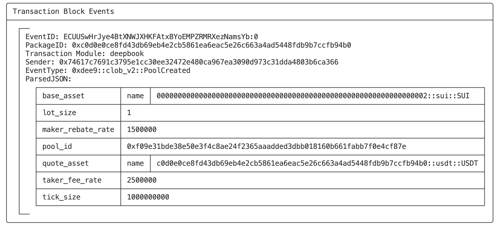
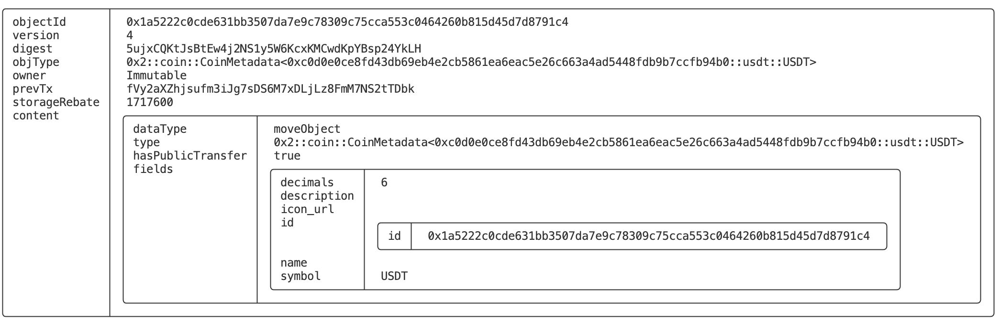
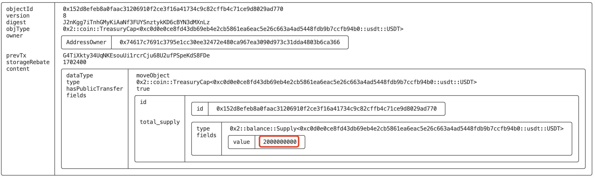
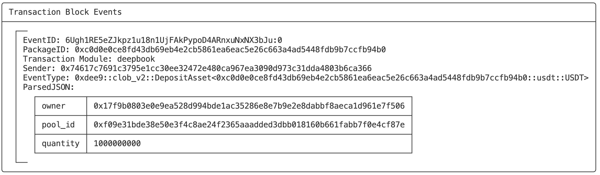
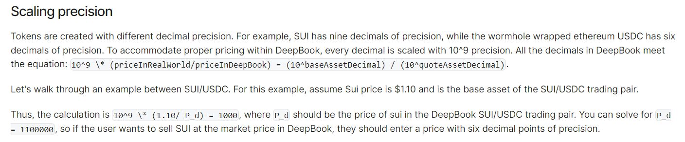
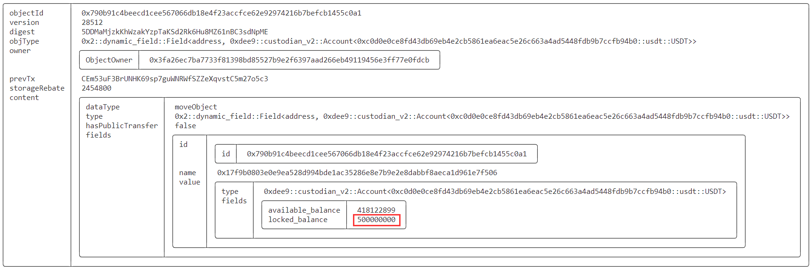
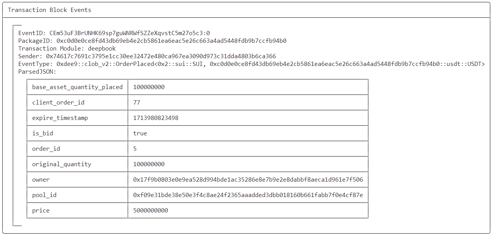
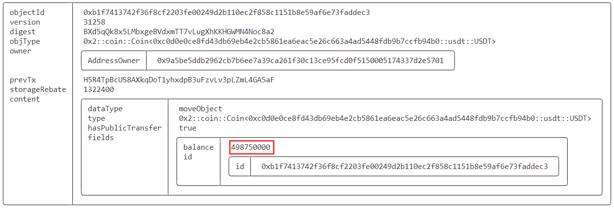
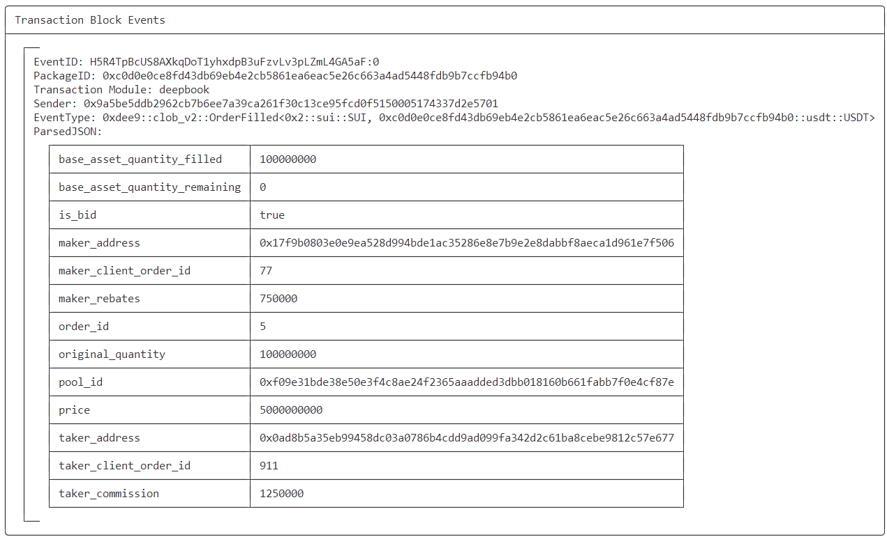

# SUI Move开发必知必会——使用SUI DeepBook构建DEX-2：实践篇

*rzexin 2024.04.18*

[TOC]

## 1 前言

在上一篇[《SUI Move开发必知必会——使用SUI DeepBook构建DEX-1：入门篇》](https://learnblockchain.cn/article/7997)，介绍`DeepBook`合约的基础功能和方法，接下来就将进行合约开发及交互实践。

## 2 合约开发

>   我们将实现流动性池创建、托管账户管理、限价单和市价单以及资产交换。

### 2.1 工程创建

-   **新建项目**

```bash
$ sui move new howtosui_deepbook
```

### 2.2 USDT模块构建

>   该文件是`USDT`模块的基本实现，包括：初始化、铸造和销毁功能。我们将用来作为报价资产。

```rust
module howtosui::usdt {
    use sui::coin::{Coin, TreasuryCap, Self};

    public struct USDT has drop {}

    #[allow(unused_function)]
    fun init(witness: USDT, ctx: &mut TxContext) {
        let (treasury, metadata) = coin::create_currency(witness, 6, b"USDT", b"", b"", option::none(), ctx);
        transfer::public_freeze_object(metadata);
        transfer::public_transfer(treasury, tx_context::sender(ctx))
    }

    public entry fun mint(
        treasury_cap: &mut TreasuryCap<USDT>, amount: u64, recipient: address, ctx: &mut TxContext
    ) {
        treasury_cap.mint_and_transfer(amount, recipient, ctx)
    }

    public entry fun burn(treasury_cap: &mut TreasuryCap<USDT>, coin: Coin<USDT>) {
        treasury_cap.burn(coin);
    }
}
```

### 2.3 SUI DeepBook模块构建

>   该模块实现`SUI DeepBook`的主合约文件，功能包括：创建流动性池、处理存款和提款，以及执行各种资产交换操作

#### （1）依赖引入

-   `deepbook::clob_v2`：该模块提供了创建流动性池、托管账户管理、限价单和市价单以及资产提取等逻辑
-   `deepbook::custodian_v2`：此模块提供托管账户管理的逻辑

```rust
#[lint_allow(self_transfer)]
module howtosui::deepbook {
    use deepbook::clob_v2 as deepbook;
    use deepbook::custodian_v2 as custodian;
    use sui::sui::SUI;
    use sui::coin::{Coin, Self};
    use sui::balance::{Self};
    use sui::clock::Clock;
```

#### （2）创建流动性池

>   使用`deepbook`提供的方法，可以很方便的创建新的流动性池，实现资产的无缝交换。

-   `FLOAT_SCALING`：定义浮动比例常量

-   该方法有两个泛型参数：`Base`、`Quote`，代表了基础和报价两种资产的类型

-   创建新流动池`deepbook::create_pool`方法说明：

    -   **函数签名**

    ```rust
        public fun create_pool<BaseAsset, QuoteAsset>(
            tick_size: u64,
            lot_size: u64,
            creation_fee: Coin<SUI>,
            ctx: &mut TxContext,
    ```

    -   **参数说明**
        -   `tick_size`：流动池初始价格
        -   `lot_size`：流动池初始数量
        -   `creation_fee`：支付收付费的`Coin`
        -   `ctx`：交易上下文

```rust
    const FLOAT_SCALING: u64 = 1_000_000_000;

    public fun new_pool<Base, Quote>(payment: &mut Coin<SUI>, ctx: &mut TxContext) {
        let balance = coin::balance_mut(payment);
        let fee = balance.split(100 * 1_000_000_000);
        let coin = coin::from_balance(fee, ctx);

        deepbook::create_pool<Base, Quote>(
            1 * FLOAT_SCALING,
            1,
            coin,
            ctx
        );
    }
```

#### （3）创建托管账号

>   通过托管账号，可以进行安全和个性化的资产管理。

```rust
    public fun new_custodian_account(ctx: &mut TxContext) {
        transfer::public_transfer(deepbook::create_account(ctx), tx_context::sender(ctx))
    }
```

#### （4）存入资产

-   `deepbook`提供了两个存入资产接口，分别用于存入基础资产（`make_base_deposit`）和报价资产（`make_quote_deposit`）到流动性池中
-   接口参数都是一样的，包括：
    -   `pool`：流动性池的可变引用
    -   `coin`：要存入的基础资产或报价资产
    -   `account_cap`：资产托管账户权限

```rust
    public fun make_base_deposit<Base, Quote>(pool: &mut deepbook::Pool<Base, Quote>, coin: Coin<Base>, account_cap: &custodian::AccountCap) {
        deepbook::deposit_base(pool, coin, account_cap)
    }

    public fun make_quote_deposit<Base, Quote>(pool: &mut deepbook::Pool<Base, Quote>, coin: Coin<Quote>, account_cap: &custodian::AccountCap) {
        deepbook::deposit_quote(pool, coin, account_cap)
    }
```

#### （5）提取资产

-   deepbook同样对应提供了两个提取资产接口，分别用于从流动性池中提取基础资产（`withdraw_base`）和报价资产（`withdraw_quote`）,提取的资产会转移给交易发起人
-   接口参数也都是一样的，包括：
    -   `pool`：流动性池的可变引用
    -   `quantity`：要提取的基础资产和报价资产的数量
    -   `account_cap`：资产托管账户权限
    -   `ctx`：交易上下文

```rust
    public fun withdraw_base<BaseAsset, QuoteAsset>(
        pool: &mut deepbook::Pool<BaseAsset, QuoteAsset>,
        quantity: u64,
        account_cap: &custodian::AccountCap,
        ctx: &mut TxContext
    ) {
        let base = deepbook::withdraw_base(pool, quantity, account_cap, ctx);
        transfer::public_transfer(base, tx_context::sender(ctx));
    }

    public fun withdraw_quote<BaseAsset, QuoteAsset>(
        pool: &mut deepbook::Pool<BaseAsset, QuoteAsset>,
        quantity: u64,
        account_cap: &custodian::AccountCap,
        ctx: &mut TxContext
    ) {
        let quote = deepbook::withdraw_quote(pool, quantity, account_cap, ctx);
        transfer::public_transfer(quote, tx_context::sender(ctx));
    }
```

#### （6）挂限价单

-   交易者可以通过指定价格和数量挂限价单（`place_limit_order`)
-   通过调用`deepbook::place_limit_order`接口向流动性池下发具有指定参数

```rust
    public fun place_limit_order<Base, Quote>(
        pool: &mut deepbook::Pool<Base, Quote>,
        client_order_id: u64,
        price: u64, 
        quantity: u64, 
        self_matching_prevention: u8,
        is_bid: bool,
        expire_timestamp: u64,
        restriction: u8,
        clock: &Clock,
        account_cap: &custodian::AccountCap,
        ctx: &mut TxContext
    ): (u64, u64, bool, u64) {
        deepbook::place_limit_order(
            pool, 
            client_order_id, 
            price, 
            quantity, 
            self_matching_prevention, 
            is_bid, 
            expire_timestamp, 
            restriction, 
            clock, 
            account_cap, 
            ctx
        )
    }
```

#### （7）挂市价单

-   交易者也可以挂市价单以实时价格成交
-   `place_base_market_order`：挂基础资产市价单
-   `place_quote_market_order`：挂报价资产市价单

```rust
    public fun place_base_market_order<Base, Quote>(
        pool: &mut deepbook::Pool<Base, Quote>,
        account_cap: &custodian::AccountCap,
        base_coin: Coin<Base>,
        client_order_id: u64,
        is_bid: bool,
        clock: &Clock,
        ctx: &mut TxContext,
    ) {
        let quote_coin = coin::zero<Quote>(ctx);
        let quantity = coin::value(&base_coin);
        place_market_order(
            pool,
            account_cap,
            client_order_id,
            quantity,
            is_bid,
            base_coin,
            quote_coin,
            clock,
            ctx
        )
    }

    public fun place_quote_market_order<Base, Quote>(
        pool: &mut deepbook::Pool<Base, Quote>,
        account_cap: &custodian::AccountCap,
        quote_coin: Coin<Quote>,
        client_order_id: u64,
        is_bid: bool,
        clock: &Clock,
        ctx: &mut TxContext,
    ) {
        let base_coin = coin::zero<Base>(ctx);
        let quantity = coin::value(&quote_coin);
        place_market_order(
            pool,
            account_cap,
            client_order_id,
            quantity,
            is_bid,
            base_coin,
            quote_coin,
            clock,
            ctx
        )
    }

    fun place_market_order<Base, Quote>(
        pool: &mut deepbook::Pool<Base, Quote>,
        account_cap: &custodian::AccountCap,
        client_order_id: u64,
        quantity: u64,
        is_bid: bool,
        base_coin: Coin<Base>,
        quote_coin: Coin<Quote>,
        clock: &Clock, // @0x6 hardcoded id of the Clock object
        ctx: &mut TxContext,
    ) {
        let (base, quote) = deepbook::place_market_order(
            pool, 
            account_cap, 
            client_order_id, 
            quantity, 
            is_bid, 
            base_coin, 
            quote_coin, 
            clock, 
            ctx
        );
        transfer::public_transfer(base, tx_context::sender(ctx));
        transfer::public_transfer(quote, tx_context::sender(ctx));
    }
```

#### （8）资产交换

-   交易者可以使用精确数量的基础资产交换尽可能多的报价资产（`swap_exact_base_for_quote`）也可以以精确数量的报价资产交换尽可能多的基础资产（`swap_exact_quote_for_base`）
-   交换后的基础资产和报价资产都会转移给交易发起人
-   在`swap_exact_base_for_quote`中创建了一个为`zero`的`quote_coin`，是因为调用`deepbook::swap_exact_base_for_quote`函数需要一个`quote_coin`作为参数，但不能将任何报价资产转移到流动性池中，所以创建了一个为零的`quote_coin`，以便函数调用时能确定报价资产的类型。

```rust
   public fun swap_exact_base_for_quote<Base, Quote>(
        pool: &mut deepbook::Pool<Base, Quote>,
        client_order_id: u64,
        account_cap: &custodian::AccountCap,
        quantity: u64,
        base_coin: Coin<Base>,
        clock: &Clock,
        ctx: &mut TxContext
    ) {
        let quote_coin = coin::zero<Quote>(ctx);
        let (base, quote, _) = deepbook::swap_exact_base_for_quote(
            pool,
            client_order_id,
            account_cap,
            quantity,
            base_coin,
            quote_coin,
            clock,
            ctx
        );
        transfer::public_transfer(base, tx_context::sender(ctx));
        transfer::public_transfer(quote, tx_context::sender(ctx));
    }

    public fun swap_exact_quote_for_base<Base, Quote>(
        pool: &mut deepbook::Pool<Base, Quote>,
        account_cap: &custodian::AccountCap,
        quote_coin: Coin<Quote>,
        client_order_id: u64,
        quantity: u64,
        clock: &Clock,
        ctx: &mut TxContext,
    ) {
        let (base, quote, _) = deepbook::swap_exact_quote_for_base(
            pool,
            client_order_id,
            account_cap,
            quantity,
            clock,
            quote_coin,
            ctx
        );
        transfer::public_transfer(base, tx_context::sender(ctx));
        transfer::public_transfer(quote, tx_context::sender(ctx));
    }
```

## 3 环境准备

### 3.1 创建帐号

- **创建两个帐号**

```bash
# 帐号1：yasmine
$ sui client new-address ed25519 yasmine

# 帐号2：yoyo
$ sui client new-address ed25519 yoyo
```

- **记录地址到环境变量**

```bash
export YASMINE=0x74617c7691c3795e1cc30ee32472e480ca967ea3090d973c31dda4803b6ca366
export YOYO=0x9a5be5ddb2962cb7b6ee7a39ca261f30c13ce95fcd0f5150005174337d2e5701
```

### 3.2 启动本地节点

```bash
$ ./target/release/sui-test-validator 
```

### 3.3 切换环境为本地节点

```bash
$ sui client switch --env localnet
Active environment switched to [localnet]
```

### 3.4 帐号领水

> 分别为两个帐号进行领水

```bash
$ sui client switch --address yasmine
Active address switched to 0x74617c7691c3795e1cc30ee32472e480ca967ea3090d973c31dda4803b6ca366

$ sui client faucet
Request successful. It can take up to 1 minute to get the coin. Run sui client gas to check your gas coins.

$ sui client switch --address yoyo
Active address switched to 0x9a5be5ddb2962cb7b6ee7a39ca261f30c13ce95fcd0f5150005174337d2e5701

$ sui client faucet
Request successful. It can take up to 1 minute to get the coin. Run sui client gas to check your gas coins.
```

## 4 合约测试

### 4.1 合约部署

> 切换到帐号1进行合约部署

```bash
$ sui client switch --address yasmine
$ sui client publish --gas-budget 100000000
```

- **关键日志**

```bash
╭─────────────────────────────────────────────────────────────────────────────────────────────────────────────────────────╮
│ Object Changes                                                                                                          │
├─────────────────────────────────────────────────────────────────────────────────────────────────────────────────────────┤
│ Created Objects:                                                                                                        │
│  ┌──                                                                                                                    │
│  │ ObjectID: 0x152d8efeb8a0faac31206910f2ce3f16a41734c9c82cffb4c71ce9d8029ad770                                         │
│  │ Sender: 0x74617c7691c3795e1cc30ee32472e480ca967ea3090d973c31dda4803b6ca366                                           │
│  │ Owner: Account Address ( 0x74617c7691c3795e1cc30ee32472e480ca967ea3090d973c31dda4803b6ca366 )                        │
│  │ ObjectType: 0x2::coin::TreasuryCap<0xc0d0e0ce8fd43db69eb4e2cb5861ea6eac5e26c663a4ad5448fdb9b7ccfb94b0::usdt::USDT>   │
│  │ Version: 4                                                                                                           │
│  │ Digest: 8EjahBU3MKMkv33avPr9YnHsi2F3QXeaMCv5GHigf22n                                                                 │
│  └──                                                                                                                    │
│  ┌──                                                                                                                    │
│  │ ObjectID: 0x1a5222c0cde631bb3507da7e9c78309c75cca553c0464260b815d45d7d8791c4                                         │
│  │ Sender: 0x74617c7691c3795e1cc30ee32472e480ca967ea3090d973c31dda4803b6ca366                                           │
│  │ Owner: Immutable                                                                                                     │
│  │ ObjectType: 0x2::coin::CoinMetadata<0xc0d0e0ce8fd43db69eb4e2cb5861ea6eac5e26c663a4ad5448fdb9b7ccfb94b0::usdt::USDT>  │
│  │ Version: 4                                                                                                           │
│  │ Digest: 5ujxCQKtJsBtEw4j2NS1y5W6KcxKMCwdKpYBsp24YkLH                                                                 │
│  └──                                                                                                                    │
│  ┌──                                                                                                                    │
│  │ ObjectID: 0x7c08e546f67a1f73ee80012aa6284478fcfea2f37407340b8d4d9e3e53e09c51                                         │
│  │ Sender: 0x74617c7691c3795e1cc30ee32472e480ca967ea3090d973c31dda4803b6ca366                                           │
│  │ Owner: Account Address ( 0x74617c7691c3795e1cc30ee32472e480ca967ea3090d973c31dda4803b6ca366 )                        │
│  │ ObjectType: 0x2::package::UpgradeCap                                                                                 │
│  │ Version: 4                                                                                                           │
│  │ Digest: 3iNjS3eMs3q2YTFmURVvi3e5nDduRZ2y8jK2EAbx5ZkK                                                                 │
│  └──                                                                                                                    │
│ Mutated Objects:                                                                                                        │
│  ┌──                                                                                                                    │
│  │ ObjectID: 0x113097be235f27cde37ea6fec4355e23fd4de231d61083b42374be85192815ab                                         │
│  │ Sender: 0x74617c7691c3795e1cc30ee32472e480ca967ea3090d973c31dda4803b6ca366                                           │
│  │ Owner: Account Address ( 0x74617c7691c3795e1cc30ee32472e480ca967ea3090d973c31dda4803b6ca366 )                        │
│  │ ObjectType: 0x2::coin::Coin<0x2::sui::SUI>                                                                           │
│  │ Version: 4                                                                                                           │
│  │ Digest: 69bZtfC6KWuRGnJ3G9PXd3qbpA6mouGTutaVCrA3PnCG                                                                 │
│  └──                                                                                                                    │
│ Published Objects:                                                                                                      │
│  ┌──                                                                                                                    │
│  │ PackageID: 0xc0d0e0ce8fd43db69eb4e2cb5861ea6eac5e26c663a4ad5448fdb9b7ccfb94b0                                        │
│  │ Version: 1                                                                                                           │
│  │ Digest: ETWcANd79c2m9chFLPVtXhLZzB7HUQSfGiAu9ekCvaUo                                                                 │
│  │ Modules: deepbook, usdt                                                                                              │
│  └──                                                                                                                    │
╰─────────────────────────────────────────────────────────────────────────────────────────────────────────────────────────╯
```

- **记录关键信息到环境变量**

```bash
export PACKAGE_ID=0xc0d0e0ce8fd43db69eb4e2cb5861ea6eac5e26c663a4ad5448fdb9b7ccfb94b0
export USDT_TREASURY_CAP_ID=0x152d8efeb8a0faac31206910f2ce3f16a41734c9c82cffb4c71ce9d8029ad770

# 报价资产类型
export QUOTE_COIN_TYPE=$PACKAGE_ID::usdt::USDT

# 基础资产类型
export BASE_COIN_TYPE=0x2::sui::SUI
```

### 4.2 创建流动性池

> 帐号1创建流动性池，需要获取该地址下的`COIN ID`用于支付创建流动性池的手续费

-   **执行命令**

```bash
# 取用户1最后一个gasCoin作为创建流动性池的手续费
export YASMINE_SUI_FEE_COIN_ID=`sui client gas --json | jq '.[-1].gasCoinId' -r`

sui client call --package $PACKAGE_ID --module deepbook --function new_pool --type-args $BASE_COIN_TYPE $QUOTE_COIN_TYPE --args $YASMINE_SUI_FEE_COIN_ID --gas-budget 10000000000
```

-   **关键日志**

```
╭──────────────────────────────────────────────────────────────────────────────────────────────────────────╮
│ Object Changes                                                                                           │
├──────────────────────────────────────────────────────────────────────────────────────────────────────────┤
│ Created Objects:                                                                                         │
│  ┌──                                                                                                     │
│  │ ObjectID: 0x23c171bf58172ad1ce97967eb06dd635e389eba4cda3ff3eb76bd8ca9544878b                          │
│  │ Sender: 0x74617c7691c3795e1cc30ee32472e480ca967ea3090d973c31dda4803b6ca366                            │
│  │ Owner: Account Address ( 0x74617c7691c3795e1cc30ee32472e480ca967ea3090d973c31dda4803b6ca366 )         │
│  │ ObjectType: 0xdee9::clob_v2::PoolOwnerCap                                                             │
│  │ Version: 5                                                                                            │
│  │ Digest: 5KPCMWwF5iNResZpJmMrJombNpfDQ9WkYDxHYxEuCR7W                                                  │
│  └──                                                                                                     │
│  ┌──                                                                                                     │
│  │ ObjectID: 0xf09e31bde38e50e3f4c8ae24f2365aaadded3dbb018160b661fabb7f0e4cf87e                          │
│  │ Sender: 0x74617c7691c3795e1cc30ee32472e480ca967ea3090d973c31dda4803b6ca366                            │
│  │ Owner: Shared                                                                                         │
│  │ ObjectType: 0xdee9::clob_v2::Pool<0x2::sui::SUI, PACKAGE_ID::usdt::USDT>                              │
│  │ Version: 5                                                                                            │
│  │ Digest: FKqVU7LP6w6hkRPPk5jN9Wmupn3CtetvBfEckcG8rPE                                                   │
│  └──                                                                                                     │
│ Mutated Objects:                                                                                         │
│  ┌──                                                                                                     │
│  │ ObjectID: 0x113097be235f27cde37ea6fec4355e23fd4de231d61083b42374be85192815ab                          │
│  │ Sender: 0x74617c7691c3795e1cc30ee32472e480ca967ea3090d973c31dda4803b6ca366                            │
│  │ Owner: Account Address ( 0x74617c7691c3795e1cc30ee32472e480ca967ea3090d973c31dda4803b6ca366 )         │
│  │ ObjectType: 0x2::coin::Coin<0x2::sui::SUI>                                                            │
│  │ Version: 5                                                                                            │
│  │ Digest: 2ivwac7frHvnEcBzvLLq1792KdpFriurirJsSZ2V7V4q                                                  │
│  └──                                                                                                     │
│  ┌──                                                                                                     │
│  │ ObjectID: 0xfb083ce5f886cd552d516c78c45bca9e611e5cf3f4a178ed4c09fd96ea6d1557                          │
│  │ Sender: 0x74617c7691c3795e1cc30ee32472e480ca967ea3090d973c31dda4803b6ca366                            │
│  │ Owner: Account Address ( 0x74617c7691c3795e1cc30ee32472e480ca967ea3090d973c31dda4803b6ca366 )         │
│  │ ObjectType: 0x2::coin::Coin<0x2::sui::SUI>                                                            │
│  │ Version: 5                                                                                            │
│  │ Digest: 7JEuVYPdqnyryPLj7bZjahyYpPffBjyketzU8Z1bNLDb                                                  │
│  └──                                                                                                     │
╰──────────────────────────────────────────────────────────────────────────────────────────────────────────╯
```

-   **抛出事件**



**字段说明：**

| 字段名 | 含义 | 取值 |
| ------ | ---- | ---- |
| **pool_id**       | 流动池对象ID | 0xf09e31bde38e50e3f4c8ae24f2365aaadded3dbb018160b661fabb7f0e4cf87e|
| **base_asset**    | 基础资产 | 0x2::sui::SUI   						  |
| **quote_asset**   | 报价资产 | <PACKAGE_ID>::usdt::USDT                                          |
| **tick_size**     | 价格变动的最小粒度 | 1000000000                                                        |
| **lot_size**      | 每笔交易的最小数量 | 1                                                                 |
| **taker_fee_rate** | 买入者支付费率：0.25% | 2500000                                                           |
| **maker_rebate_rate** | 卖出者盈利费率：0.15% | 1500000                                                           |

-   **记录关键信息到环境变量**

```bash
export POOL_ID=0xf09e31bde38e50e3f4c8ae24f2365aaadded3dbb018160b661fabb7f0e4cf87e
```

### 4.3 创建托管账户

>   分别为两个帐号创建托管账户

-   **执行命令**

```bash
sui client switch --address yasmine
sui client call --package $PACKAGE_ID  --module deepbook --function new_custodian_account  --gas-budget 10000000000
```

-   **关键日志**

```bash
╭──────────────────────────────────────────────────────────────────────────────────────────────────╮
│ Object Changes                                                                                   │
├──────────────────────────────────────────────────────────────────────────────────────────────────┤
│ Created Objects:                                                                                 │
│  ┌──                                                                                             │
│  │ ObjectID: 0x17f9b0803e0e9ea528d994bde1ac35286e8e7b9e2e8dabbf8aeca1d961e7f506                  │
│  │ Sender: 0x74617c7691c3795e1cc30ee32472e480ca967ea3090d973c31dda4803b6ca366                    │
│  │ Owner: Account Address ( 0x74617c7691c3795e1cc30ee32472e480ca967ea3090d973c31dda4803b6ca366 ) │
│  │ ObjectType: 0xdee9::custodian_v2::AccountCap                                                  │
│  │ Version: 6                                                                                    │
│  │ Digest: 2WhPzwi4dW9iWSrvoFRX8U1Le8B1mHGyVehbZPdmsTzw                                          │
│  └──                                                                                             │
│ Mutated Objects:                                                                                 │
│  ┌──                                                                                             │
│  │ ObjectID: 0x113097be235f27cde37ea6fec4355e23fd4de231d61083b42374be85192815ab                  │
│  │ Sender: 0x74617c7691c3795e1cc30ee32472e480ca967ea3090d973c31dda4803b6ca366                    │
│  │ Owner: Account Address ( 0x74617c7691c3795e1cc30ee32472e480ca967ea3090d973c31dda4803b6ca366 ) │
│  │ ObjectType: 0x2::coin::Coin<0x2::sui::SUI>                                                    │
│  │ Version: 6                                                                                    │
│  │ Digest: 8WwBfhYrWgZ6xCeswnmzdG6QAkkyEvZUeHPFbDhaqR1B                                          │
│  └──                                                                                             │
╰──────────────────────────────────────────────────────────────────────────────────────────────────╯
```

-   **记录关键信息到环境变量**

```bash
export YASMINE_ACCOUNT_CAP_ID=0x17f9b0803e0e9ea528d994bde1ac35286e8e7b9e2e8dabbf8aeca1d961e7f506
```

-   **同样为用户2创建托管账户**

```bash
sui client switch --address yoyo
 
sui client call --package $PACKAGE_ID  --module deepbook --function new_custodian_account  --gas-budget 10000000000
╭──────────────────────────────────────────────────────────────────────────────────────────────────╮
│ Object Changes                                                                                   │
├──────────────────────────────────────────────────────────────────────────────────────────────────┤
│ Created Objects:                                                                                 │
│  ┌──                                                                                             │
│  │ ObjectID: 0x0ad8b5a35eb99458dc03a0786b4cdd9ad099fa342d2c61ba8cebe9812c57e677                  │
│  │ Sender: 0x9a5be5ddb2962cb7b6ee7a39ca261f30c13ce95fcd0f5150005174337d2e5701                    │
│  │ Owner: Account Address ( 0x9a5be5ddb2962cb7b6ee7a39ca261f30c13ce95fcd0f5150005174337d2e5701 ) │
│  │ ObjectType: 0xdee9::custodian_v2::AccountCap                                                  │
│  │ Version: 3                                                                                    │
│  │ Digest: 7igQ3L5LukbsGGZY14JnxK7jeuDisVEdN9fS6vLxpFKE                                          │
│  └──                                                                                             │
│ Mutated Objects:                                                                                 │
│  ┌──                                                                                             │
│  │ ObjectID: 0x427debe85ee3e35af794c661b19ff781a9d3f8b5488b0274ad83747f4cbb7b8b                  │
│  │ Sender: 0x9a5be5ddb2962cb7b6ee7a39ca261f30c13ce95fcd0f5150005174337d2e5701                    │
│  │ Owner: Account Address ( 0x9a5be5ddb2962cb7b6ee7a39ca261f30c13ce95fcd0f5150005174337d2e5701 ) │
│  │ ObjectType: 0x2::coin::Coin<0x2::sui::SUI>                                                    │
│  │ Version: 3                                                                                    │
│  │ Digest: A9vsmdCvXahWThf7tNAfmYZr8sqWhiMsDDBZkgkGw43a                                          │
│  └──                                                                                             │
╰──────────────────────────────────────────────────────────────────────────────────────────────────╯

export YOYO_ACCOUNT_CAP_ID=0x0ad8b5a35eb99458dc03a0786b4cdd9ad099fa342d2c61ba8cebe9812c57e677
```

### 4.4 铸造USDT

>   我们需要先铸造一些`USDT`，以便我们可以存入到流动性池中。
>
>   切换到合约部署者（帐号1），分别为两个帐号进行铸造

-   **执行命令**

>   因`USDT`代币精度是`6`，以下命令将为每个用户铸造`1000 USDT`
>
>   

```bash
sui client call --function mint --module usdt --package $PACKAGE_ID  --args $USDT_TREASURY_CAP_ID 1000000000 $YASMINE --gas-budget 10000000

sui client call --function mint --module usdt --package $PACKAGE_ID  --args $USDT_TREASURY_CAP_ID 1000000000 $YOYO --gas-budget 10000000
```

-   **关键日志**

```bash
# 帐号1
╭────────────────────────────────────────────────────────────────────────────────────────────────────────────────────────╮
│ Object Changes                                                                                                         │
├────────────────────────────────────────────────────────────────────────────────────────────────────────────────────────┤
│ Created Objects:                                                                                                       │
│  ┌──                                                                                                                   │
│  │ ObjectID: 0x7ebc1adbf59194a80ca6ea9bc05e6cbe11f4a08c36a18e2d18bc1ebc6abc665a                                        │
│  │ Sender: 0x74617c7691c3795e1cc30ee32472e480ca967ea3090d973c31dda4803b6ca366                                          │
│  │ Owner: Account Address ( 0x74617c7691c3795e1cc30ee32472e480ca967ea3090d973c31dda4803b6ca366 )                       │
│  │ ObjectType: 0x2::coin::Coin<0xc0d0e0ce8fd43db69eb4e2cb5861ea6eac5e26c663a4ad5448fdb9b7ccfb94b0::usdt::USDT>         │
│  │ Version: 7                                                                                                          │
│  │ Digest: 4BnWLwkPjHSnRmDV4sbP5jfH2YufuF9U9jbBYGMCmzAj                                                                │
│  └──                                                                                                                   │
│ Mutated Objects:                                                                                                       │
│  ┌──                                                                                                                   │
│  │ ObjectID: 0x113097be235f27cde37ea6fec4355e23fd4de231d61083b42374be85192815ab                                        │
│  │ Sender: 0x74617c7691c3795e1cc30ee32472e480ca967ea3090d973c31dda4803b6ca366                                          │
│  │ Owner: Account Address ( 0x74617c7691c3795e1cc30ee32472e480ca967ea3090d973c31dda4803b6ca366 )                       │
│  │ ObjectType: 0x2::coin::Coin<0x2::sui::SUI>                                                                          │
│  │ Version: 7                                                                                                          │
│  │ Digest: HuGWcNXdqkCgJAY5CzdDBtT7zZvWHi66CqduiFThrSn2                                                                │
│  └──                                                                                                                   │
│  ┌──                                                                                                                   │
│  │ ObjectID: 0x152d8efeb8a0faac31206910f2ce3f16a41734c9c82cffb4c71ce9d8029ad770                                        │
│  │ Sender: 0x74617c7691c3795e1cc30ee32472e480ca967ea3090d973c31dda4803b6ca366                                          │
│  │ Owner: Account Address ( 0x74617c7691c3795e1cc30ee32472e480ca967ea3090d973c31dda4803b6ca366 )                       │
│  │ ObjectType: 0x2::coin::TreasuryCap<0xc0d0e0ce8fd43db69eb4e2cb5861ea6eac5e26c663a4ad5448fdb9b7ccfb94b0::usdt::USDT>  │
│  │ Version: 7                                                                                                          │
│  │ Digest: 2mX3ZnSn3HZCQtkZchKy2KCM3DC3Rg19SDFBKPfaRemU                                                                │
│  └──                                                                                                                   │
╰────────────────────────────────────────────────────────────────────────────────────────────────────────────────────────╯

# 帐号2
╭────────────────────────────────────────────────────────────────────────────────────────────────────────────────────────╮
│ Object Changes                                                                                                         │
├────────────────────────────────────────────────────────────────────────────────────────────────────────────────────────┤
│ Created Objects:                                                                                                       │
│  ┌──                                                                                                                   │
│  │ ObjectID: 0x8c1023114ea2a57aefd57ea53f619bd8f8f226ddddb59c7a802e4cb9958fd735                                        │
│  │ Sender: 0x74617c7691c3795e1cc30ee32472e480ca967ea3090d973c31dda4803b6ca366                                          │
│  │ Owner: Account Address ( 0x9a5be5ddb2962cb7b6ee7a39ca261f30c13ce95fcd0f5150005174337d2e5701 )                       │
│  │ ObjectType: 0x2::coin::Coin<0xc0d0e0ce8fd43db69eb4e2cb5861ea6eac5e26c663a4ad5448fdb9b7ccfb94b0::usdt::USDT>         │
│  │ Version: 8                                                                                                          │
│  │ Digest: 3Ju4vyWMm7M82QFRsbprgLQtQnBqZB2bkMnBy4esqaAK                                                                │
│  └──                                                                                                                   │
│ Mutated Objects:                                                                                                       │
│  ┌──                                                                                                                   │
│  │ ObjectID: 0x113097be235f27cde37ea6fec4355e23fd4de231d61083b42374be85192815ab                                        │
│  │ Sender: 0x74617c7691c3795e1cc30ee32472e480ca967ea3090d973c31dda4803b6ca366                                          │
│  │ Owner: Account Address ( 0x74617c7691c3795e1cc30ee32472e480ca967ea3090d973c31dda4803b6ca366 )                       │
│  │ ObjectType: 0x2::coin::Coin<0x2::sui::SUI>                                                                          │
│  │ Version: 8                                                                                                          │
│  │ Digest: AFs5ybJtDFAgi5kZ6DxmzQiem9tmv3u2wB1PVhUDYQaH                                                                │
│  └──                                                                                                                   │
│  ┌──                                                                                                                   │
│  │ ObjectID: 0x152d8efeb8a0faac31206910f2ce3f16a41734c9c82cffb4c71ce9d8029ad770                                        │
│  │ Sender: 0x74617c7691c3795e1cc30ee32472e480ca967ea3090d973c31dda4803b6ca366                                          │
│  │ Owner: Account Address ( 0x74617c7691c3795e1cc30ee32472e480ca967ea3090d973c31dda4803b6ca366 )                       │
│  │ ObjectType: 0x2::coin::TreasuryCap<0xc0d0e0ce8fd43db69eb4e2cb5861ea6eac5e26c663a4ad5448fdb9b7ccfb94b0::usdt::USDT>  │
│  │ Version: 8                                                                                                          │
│  │ Digest: J2nKgg7iTnhGMyKiAaNf3FUYSnztykKD6cBYN3dMXnLz                                                                │
│  └──                                                                                                                   │
╰────────────────────────────────────────────────────────────────────────────────────────────────────────────────────────╯
```

-   **查看`USDT`的总发行量**



-   **记录关键信息到环境变量**

```bash
export YASMINE_USDT_OBJECT_ID=0x7ebc1adbf59194a80ca6ea9bc05e6cbe11f4a08c36a18e2d18bc1ebc6abc665a

export YOYO_USDT_OBJECT_ID=0x8c1023114ea2a57aefd57ea53f619bd8f8f226ddddb59c7a802e4cb9958fd735
```

### 4.5 存入资产

> 切换到帐号1，分别存入基础资产和报价资产到帐号1的托管账户中

#### （1）存入基础资产

-   **执行命令**

>   执行该命令，将存入`100 SUI`到账户1的托管账号中

```bash
export YASMINE_BASE_COIN_ID=`sui client gas --json | jq '.[-1].gasCoinId' -r`

sui client call --package $PACKAGE_ID  --module deepbook --function make_base_deposit --args $POOL_ID $YASMINE_BASE_COIN_ID $YASMINE_ACCOUNT_CAP_ID --type-args $BASE_COIN_TYPE $QUOTE_COIN_TYPE --gas-budget 10000000000
```

-   **关键日志**

```
╭───────────────────────────────────────────────────────────────────────────────────────────────────╮
│ Object Changes                                                                                    │
├───────────────────────────────────────────────────────────────────────────────────────────────────┤
│ Created Objects:                                                                                  │
│  ┌──                                                                                              │
│  │ ObjectID: 0x0b7ef9a9f2f3d47936f289c4d13f6016331f5b31143983660f43e2f781e648ad                   │
│  │ Sender: 0x74617c7691c3795e1cc30ee32472e480ca967ea3090d973c31dda4803b6ca366                     │
│  │ Owner: Object ID: ( 0x63faf764758ca13d2eb7fe6a4a7f2a9b4cc3601870c56c8415d02f10a2f1eca2 )       │
│  │ ObjectType: 0x2::dynamic_field::Field<address, 0xdee9::custodian_v2::Account<0x2::sui::SUI>>   │
│  │ Version: 9                                                                                     │
│  │ Digest: DEdgGp8Ds7mr79yBS9T2Hjzutc376NQKt3uHxmtGUJ6x                                           │
│  └──                                                                                              │
│ Mutated Objects:                                                                                  │
│  ┌──                                                                                              │
│  │ ObjectID: 0x113097be235f27cde37ea6fec4355e23fd4de231d61083b42374be85192815ab                   │
│  │ Sender: 0x74617c7691c3795e1cc30ee32472e480ca967ea3090d973c31dda4803b6ca366                     │
│  │ Owner: Account Address ( 0x74617c7691c3795e1cc30ee32472e480ca967ea3090d973c31dda4803b6ca366 )  │
│  │ ObjectType: 0x2::coin::Coin<0x2::sui::SUI>                                                     │
│  │ Version: 9                                                                                     │
│  │ Digest: 9QCeFiq9eY66iV7RtyUvxwMbFSpW2QcCKV7xs2bZovVF                                           │
│  └──                                                                                              │
│  ┌──                                                                                              │
│  │ ObjectID: 0x17f9b0803e0e9ea528d994bde1ac35286e8e7b9e2e8dabbf8aeca1d961e7f506                   │
│  │ Sender: 0x74617c7691c3795e1cc30ee32472e480ca967ea3090d973c31dda4803b6ca366                     │
│  │ Owner: Account Address ( 0x74617c7691c3795e1cc30ee32472e480ca967ea3090d973c31dda4803b6ca366 )  │
│  │ ObjectType: 0xdee9::custodian_v2::AccountCap                                                   │
│  │ Version: 9                                                                                     │
│  │ Digest: CQ2usuYExFWdz6nwDXBU7mHRx4VdzKfPwLQ3STQ29Xjp                                           │
│  └──                                                                                              │
│  ┌──                                                                                              │
│  │ ObjectID: 0xf09e31bde38e50e3f4c8ae24f2365aaadded3dbb018160b661fabb7f0e4cf87e                   │
│  │ Sender: 0x74617c7691c3795e1cc30ee32472e480ca967ea3090d973c31dda4803b6ca366                     │
│  │ Owner: Shared                                                                                  │
│  │ ObjectType: 0xdee9::clob_v2::Pool<0x2::sui::SUI, PACKAGE_ID::usdt::USDT>                       │
│  │ Version: 9                                                                                     │
│  │ Digest: 5n886pmBszk4duXgHxwvahatGXtTJNQ4itZEch6z3CcE                                           │
│  └──                                                                                              │
╰───────────────────────────────────────────────────────────────────────────────────────────────────╯
```

-   **抛出事件**


#### （2）存入报价资产

-   **执行命令**

>   执行以下命令，将`1000 USDT`作为报价资产存入

```bash
$ sui client call --package $PACKAGE_ID  --module deepbook --function make_quote_deposit --args $POOL_ID $YASMINE_USDT_OBJECT_ID $YASMINE_ACCOUNT_CAP_ID --type-args $BASE_COIN_TYPE $QUOTE_COIN_TYPE --gas-budget 10000000000
```

-   **关键日志**

```
╭─────────────────────────────────────────────────────────────────────────────────────────────────────────────╮
│ Object Changes                                                                                              │
├─────────────────────────────────────────────────────────────────────────────────────────────────────────────┤
│ Created Objects:                                                                                            │
│  ┌──                                                                                                        │
│  │ ObjectID: 0x790b91c4beecd1cee567066db18e4f23accfce62e92974216b7befcb1455c0a1                             │
│  │ Sender: 0x74617c7691c3795e1cc30ee32472e480ca967ea3090d973c31dda4803b6ca366                               │
│  │ Owner: Object ID: ( 0x3fa26ec7ba7733f81398bd85527b9e2f6397aad266eb49119456e3ff77e0fdcb )                 │
│  │ ObjectType: 0x2::dynamic_field::Field<address, 0xdee9::custodian_v2::Account<PACKAGE_ID::usdt::USDT>>    │
│  │ Version: 10                                                                                              │
│  │ Digest: 2cJN2dv5PNZKZ44KiepN174mAwkDv8suNeZV7sQAVs17                                                     │
│  └──                                                                                                        │
│ Mutated Objects:                                                                                            │
│  ┌──                                                                                                        │
│  │ ObjectID: 0x113097be235f27cde37ea6fec4355e23fd4de231d61083b42374be85192815ab                             │
│  │ Sender: 0x74617c7691c3795e1cc30ee32472e480ca967ea3090d973c31dda4803b6ca366                               │
│  │ Owner: Account Address ( 0x74617c7691c3795e1cc30ee32472e480ca967ea3090d973c31dda4803b6ca366 )            │
│  │ ObjectType: 0x2::coin::Coin<0x2::sui::SUI>                                                               │
│  │ Version: 10                                                                                              │
│  │ Digest: 2NG7iwzmXGCTRb6VKDLLSfifHrgB7xPoeey4V7bG1DWT                                                     │
│  └──                                                                                                        │
│  ┌──                                                                                                        │
│  │ ObjectID: 0x17f9b0803e0e9ea528d994bde1ac35286e8e7b9e2e8dabbf8aeca1d961e7f506                             │
│  │ Sender: 0x74617c7691c3795e1cc30ee32472e480ca967ea3090d973c31dda4803b6ca366                               │
│  │ Owner: Account Address ( 0x74617c7691c3795e1cc30ee32472e480ca967ea3090d973c31dda4803b6ca366 )            │
│  │ ObjectType: 0xdee9::custodian_v2::AccountCap                                                             │
│  │ Version: 10                                                                                              │
│  │ Digest: HXnihRHkrVicWoaW52XXaHzM3TmQL2f62EBykBbJqWtz                                                     │
│  └──                                                                                                        │
│  ┌──                                                                                                        │
│  │ ObjectID: 0xf09e31bde38e50e3f4c8ae24f2365aaadded3dbb018160b661fabb7f0e4cf87e                             │
│  │ Sender: 0x74617c7691c3795e1cc30ee32472e480ca967ea3090d973c31dda4803b6ca366                               │
│  │ Owner: Shared                                                                                            │
│  │ ObjectType: 0xdee9::clob_v2::Pool<0x2::sui::SUI, PACKAGE_ID::usdt::USDT>                                 │
│  │ Version: 10                                                                                              │
│  │ Digest: FDBSTkwwuaLcHFkoMgdjo2FFso6MCzyCUhVXg4TRUkEU                                                     │
│  └──                                                                                                        │
╰─────────────────────────────────────────────────────────────────────────────────────────────────────────────╯
```

-   **抛出事件**



### 4.6 挂限价单

- **执行命令**

> 注：77是链下订单ID，可以为任意数字
>
> 执行该命令，将下限价单，挂限价`5 USDT（5000000000）`的单价欲购买 `100 SUI（100000000）`
>
> 关于精度缩放的解释：
>
> 

```bash
# 获取2小时后的毫秒级别时间戳
export EXPIRE_TIMESTAMP=`date -d "2 hours" +%s%3N`
export CLOCK_OBJECT_ID=0x6

sui client call --package $PACKAGE_ID --module deepbook --function place_limit_order --args $POOL_ID 77 5000000000 100000000 0 true $EXPIRE_TIMESTAMP 0 $CLOCK_OBJECT_ID $YASMINE_ACCOUNT_CAP_ID --type-args $BASE_COIN_TYPE $QUOTE_COIN_TYPE --gas-budget 10000000000
```

执行该命令后，可以看到托管账户的资产已经被锁定，锁定金额为：`5 U * 100 = 5_000_000 * 100 = 500_000_000`



- **关键日志**

```bash
╭────────────────────────────────────────────────────────────────────────────────────────────────────────────────╮
│ Object Changes                                                                                                 │
├────────────────────────────────────────────────────────────────────────────────────────────────────────────────┤
│ Created Objects:                                                                                               │
│  ┌──                                                                                                           │
│  │ ObjectID: 0x064fada87c59bd27ec5151cc75b6093831a48236804c283e0adb825e68106ff5                                │
│  │ Sender: 0x74617c7691c3795e1cc30ee32472e480ca967ea3090d973c31dda4803b6ca366                                  │
│  │ Owner: Object ID: ( 0x3bdf32a7e9c1c4f1b1176ab13e289f03b52b0f3a9e510fc35891f05932955019 )                    │
│  │ ObjectType: 0x2::dynamic_field::Field<u64, 0x2::linked_table::Node<u64, 0xdee9::clob_v2::Order>>            │
│  │ Version: 28512                                                                                              │
│  │ Digest: DRr97QGhoCHm3M4rjPEVVK6A3YXrR4keYsQ3NMWGtPe5                                                        │
│  └──                                                                                                           │
│  ┌──                                                                                                           │
│  │ ObjectID: 0xad13f560da3ab5b9062239227d359eb9d9a61f633b281cb85094508f46bfc339                                │
│  │ Sender: 0x74617c7691c3795e1cc30ee32472e480ca967ea3090d973c31dda4803b6ca366                                  │
│  │ Owner: Object ID: ( 0x20f438c446cc6759fb221e6e0ab91a6ede54db4d15969edafa6ac8d5df1e4dd0 )                    │
│  │ ObjectType: 0x2::dynamic_field::Field<u64, 0xdee9::critbit::Leaf<0xdee9::clob_v2::TickLevel>>               │
│  │ Version: 28512                                                                                              │
│  │ Digest: 5KTntbNWYTPmxwsz7hDkmFxgCzJs4Bk3hUmqYQ7xS9C                                                         │
│  └──                                                                                                           │
│  ┌──                                                                                                           │
│  │ ObjectID: 0xaeb3cd1d70f2eb88ff965821cd89131359b39fd282350cc1cdbd811c61aca06a                                │
│  │ Sender: 0x74617c7691c3795e1cc30ee32472e480ca967ea3090d973c31dda4803b6ca366                                  │
│  │ Owner: Object ID: ( 0x8fdd6bbc54bab7732b247d31cb585b1e3a74f16afd3e3d734c26cb3282e71ddb )                    │
│  │ ObjectType: 0x2::dynamic_field::Field<u64, 0x2::linked_table::Node<u64, u64>>                               │
│  │ Version: 28512                                                                                              │
│  │ Digest: GpVCHKunYCxmwuXmgBqaMGdRcv5Gd4qKJy9LutNi8AuE                                                        │
│  └──                                                                                                           │
│ Mutated Objects:                                                                                               │
│  ┌──                                                                                                           │
│  │ ObjectID: 0x0b7ef9a9f2f3d47936f289c4d13f6016331f5b31143983660f43e2f781e648ad                                │
│  │ Sender: 0x74617c7691c3795e1cc30ee32472e480ca967ea3090d973c31dda4803b6ca366                                  │
│  │ Owner: Object ID: ( 0x63faf764758ca13d2eb7fe6a4a7f2a9b4cc3601870c56c8415d02f10a2f1eca2 )                    │
│  │ ObjectType: 0x2::dynamic_field::Field<address, 0xdee9::custodian_v2::Account<0x2::sui::SUI>>                │
│  │ Version: 28512                                                                                              │
│  │ Digest: 59HeMQzizCL71HYRmgjbjuNzkhrnv35xmp3Afrky7ZCZ                                                        │
│  └──                                                                                                           │
│  ┌──                                                                                                           │
│  │ ObjectID: 0x113097be235f27cde37ea6fec4355e23fd4de231d61083b42374be85192815ab                                │
│  │ Sender: 0x74617c7691c3795e1cc30ee32472e480ca967ea3090d973c31dda4803b6ca366                                  │
│  │ Owner: Account Address ( 0x74617c7691c3795e1cc30ee32472e480ca967ea3090d973c31dda4803b6ca366 )               │
│  │ ObjectType: 0x2::coin::Coin<0x2::sui::SUI>                                                                  │
│  │ Version: 28512                                                                                              │
│  │ Digest: uEF1KwyvWNHDPCNg8Qo3PaxKBQWwf3sY7bw6E4wxjuc                                                         │
│  └──                                                                                                           │
│  ┌──                                                                                                           │
│  │ ObjectID: 0x17f9b0803e0e9ea528d994bde1ac35286e8e7b9e2e8dabbf8aeca1d961e7f506                                │
│  │ Sender: 0x74617c7691c3795e1cc30ee32472e480ca967ea3090d973c31dda4803b6ca366                                  │
│  │ Owner: Account Address ( 0x74617c7691c3795e1cc30ee32472e480ca967ea3090d973c31dda4803b6ca366 )               │
│  │ ObjectType: 0xdee9::custodian_v2::AccountCap                                                                │
│  │ Version: 28512                                                                                              │
│  │ Digest: 33rmx64DRqTDsbEySDurcQkavFQvNx5cvUYpA9Qaqz2C                                                        │
│  └──                                                                                                           │
│  ┌──                                                                                                           │
│  │ ObjectID: 0x790b91c4beecd1cee567066db18e4f23accfce62e92974216b7befcb1455c0a1                                │
│  │ Sender: 0x74617c7691c3795e1cc30ee32472e480ca967ea3090d973c31dda4803b6ca366                                  │
│  │ Owner: Object ID: ( 0x3fa26ec7ba7733f81398bd85527b9e2f6397aad266eb49119456e3ff77e0fdcb )                    │
│  │ ObjectType: 0x2::dynamic_field::Field<address, 0xdee9::custodian_v2::Account<PACKAGE_ID::usdt::USDT>>       │
│  │ Version: 28512                                                                                              │
│  │ Digest: 5DDMaMjzkKhWzakYzpTaKSd2Rk6Hu8MZ61nBC3sdNpME                                                        │
│  └──                                                                                                           │
│  ┌──                                                                                                           │
│  │ ObjectID: 0xa187b3996b914083bac3db6d40a27f2f4f427d4cfd217487d4d220b45d39e3df                                │
│  │ Sender: 0x74617c7691c3795e1cc30ee32472e480ca967ea3090d973c31dda4803b6ca366                                  │
│  │ Owner: Object ID: ( 0xaeed95142ed44f22bbc6b9139b52ae3250aafabf41ea843ca3555b278d7d79dd )                    │
│  │ ObjectType: 0x2::dynamic_field::Field<address, 0x2::linked_table::LinkedTable<u64, u64>>                    │
│  │ Version: 28512                                                                                              │
│  │ Digest: JDXhvu96BU1C3BZc67DTKuYEAZEmSbyt2THJBdTjyd4C                                                        │
│  └──                                                                                                           │
│  ┌──                                                                                                           │
│  │ ObjectID: 0xf09e31bde38e50e3f4c8ae24f2365aaadded3dbb018160b661fabb7f0e4cf87e                                │
│  │ Sender: 0x74617c7691c3795e1cc30ee32472e480ca967ea3090d973c31dda4803b6ca366                                  │
│  │ Owner: Shared                                                                                               │
│  │ ObjectType: 0xdee9::clob_v2::Pool<0x2::sui::SUI, PACKAGE_ID::usdt::USDT>                                    │
│  │ Version: 28512                                                                                              │
│  │ Digest: F7tYYeTqvWEBHuT6jKYG4K3F1vVQxZbjvbTPEiUUpW4G                                                        │
│  └──                                                                                                           │
╰────────────────────────────────────────────────────────────────────────────────────────────────────────────────╯
```

- **抛出事件**



### 4.7 挂市价单

>   切换到用户2，执行以市价单卖出`100 SUI`的命令
>
>   `811`是用户自定义订单编号，可以为任意数字

-   **执行命令**

```bash
$ sui client switch --address yoyo

# 拆分出2 SUI（命令详细介绍请参考：https://learnblockchain.cn/article/7832）
export COIN_ID=`sui client gas --json | jq '.[-1].gasCoinId' -r`
export YOYO_SUI_COIN_ID=`sui client split-coin --coin-id $COIN_ID  --amounts 100000000000 --gas-budget 100000000 --json | jq '.objectChanges | .[] | select(.type=="created") | .objectId' -r`


sui client call --package $PACKAGE_ID  --module deepbook --function place_base_market_order  --args $POOL_ID $YOYO_ACCOUNT_CAP_ID $YOYO_SUI_COIN_ID 911 "false" $CLOCK_OBJECT_ID --type-args $BASE_COIN_TYPE $QUOTE_COIN_TYPE --gas-budget 10000000000
```

-   **关键输出**

```
│ Created Objects:                                                                                                  │
│  ┌──                                                                                                              │
│  │ ObjectID: 0xb1f7413742f36f8cf2203fe00249d2b110ec2f858c1151b8e59af6e73faddec3                                   │
│  │ Sender: 0x9a5be5ddb2962cb7b6ee7a39ca261f30c13ce95fcd0f5150005174337d2e5701                                     │
│  │ Owner: Account Address ( 0x9a5be5ddb2962cb7b6ee7a39ca261f30c13ce95fcd0f5150005174337d2e5701 )                  │
│  │ ObjectType: 0x2::coin::Coin<0xc0d0e0ce8fd43db69eb4e2cb5861ea6eac5e26c663a4ad5448fdb9b7ccfb94b0::usdt::USDT>    │
│  │ Version: 31258                                                                                                 │
│  │ Digest: BXd5qQk8x5LMbxgeBVdxmTT7vLugXhKKHGWMN4Noc8a2                                                           │
│  └──                                                                                                              │
```

- **查看到出售100 SUI代币，得到的USTD**

> 与用户1支付的500_000_000的差额即为手续费



- **抛出事件**



## 5 更多

欢迎关注微信公众号：**Move中文**，开启你的 **Sui Move** 之旅！


