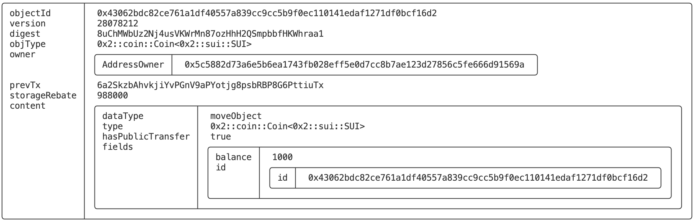
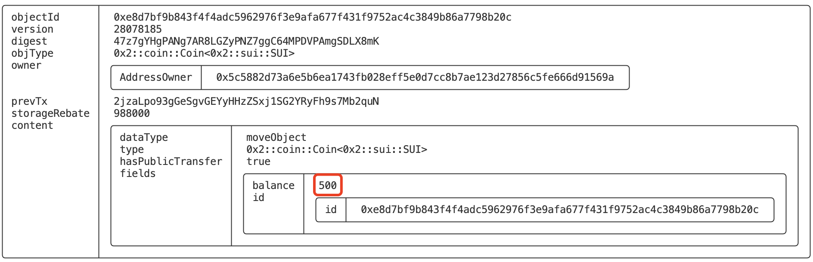
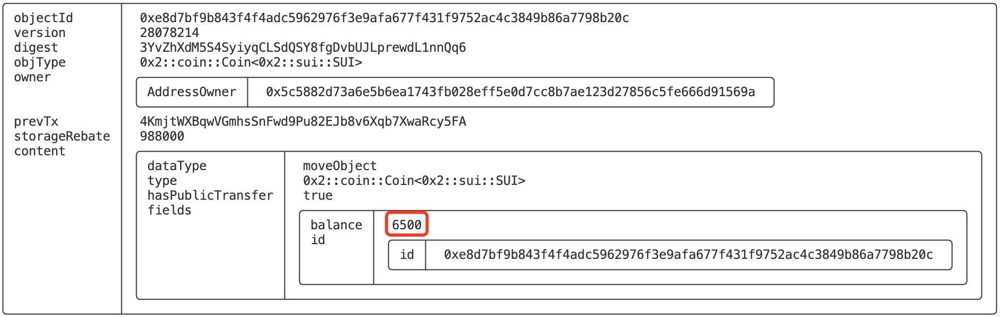
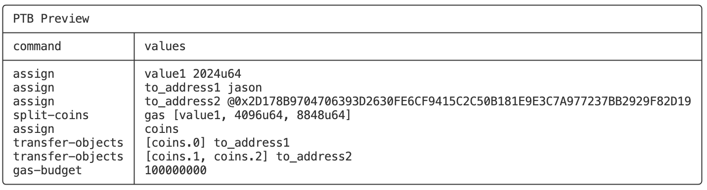
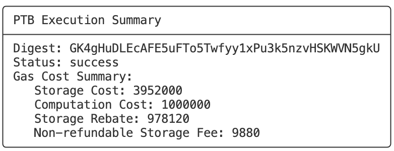
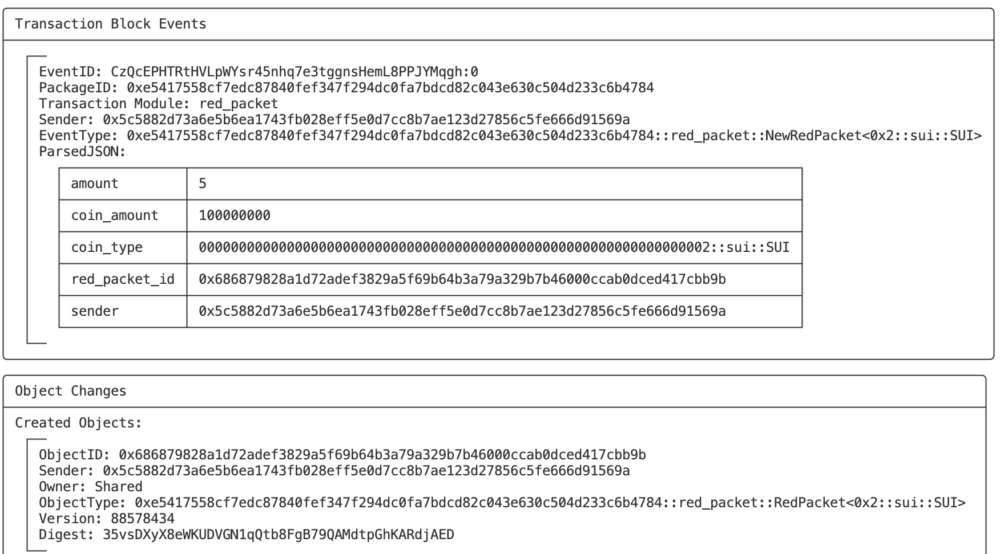
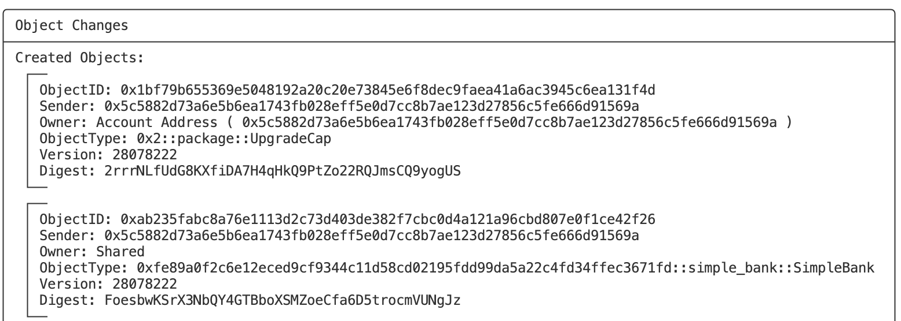

# SUI CLI常用命令解析2——Client PTB

*rzexin 2024.05.18*

## 1 前言

`SUI`的命令行工具（`CLI`）提供了构建和执行 **可编程交易块（`PTB`）** 的方法。

`PTB`是`SUI`提供的一个非常强大的一个功能，它允许在一个交易中执行多种操作，甚至去调用不同的合约。

直接通过命令行脚本的方式去创建和执行`PTB`，可以方便开发人员在不用通过`SDK`写代码的情况下便能构建和执行`PTB`，也为自动化任务场景提供了很大的灵活性和便利性。

本文使用的`SUI`版本为：`sui 1.26.0`

## 2 命令清单

通过`-h`获取`sui client ptb`所有可用参数：

```bash
$ sui client ptb -h
Build, preview, and execute programmable transaction blocks. Depending on your shell, you might have to use quotes around arrays or other passed values. Use --help to see examples for how to use the core functionality of
this command.

Usage: sui client ptb [OPTIONS]

Options:
      --assign <NAME> <VALUE>                                         Assign a value to a variable name to use later in the PTB.
      --dry-run                                                       Perform a dry run of the PTB instead of executing it.
      --gas-coin <ID>                                                 The object ID of the gas coin to use. If not specified, it will try to use the first gas coin that it finds that has at least the requested gas-budget
                                                                      balance.
      --gas-budget <MIST>                                             An optional gas budget for this PTB (in MIST). If gas budget is not provided, the tool will first perform a dry run to estimate the gas cost, and then it
                                                                      will execute the transaction. Please note that this incurs a small cost in performance due to the additional dry run call.
      --make-move-vec <TYPE> <[VALUES]>                               Given n-values of the same type, it constructs a vector. For non objects or an empty vector, the type tag must be specified.
      --merge-coins <INTO_COIN> <[COIN OBJECTS]>                      Merge N coins into the provided coin.
      --move-call <PACKAGE::MODULE::FUNCTION> <TYPE> <FUNCTION_ARGS>  Make a move call to a function.
      --split-coins <COIN> <[AMOUNT]>                                 Split the coin into N coins as per the given array of amounts.
      --transfer-objects <[OBJECTS]> <TO>                             Transfer objects to the specified address.
      --publish <MOVE_PACKAGE_PATH>                                   Publish the Move package. It takes as input the folder where the package exists.
      --upgrade <MOVE_PACKAGE_PATH>                                   Upgrade the move package. It takes as input the folder where the package exists.
      --preview                                                       Preview the list of PTB transactions instead of executing them.
      --serialize-unsigned-transaction                                Instead of executing the transaction, serialize the bcs bytes of the unsigned transaction data using base64 encoding.
      --serialize-signed-transaction                                  Instead of executing the transaction, serialize the bcs bytes of the signed transaction data using base64 encoding.
      --summary                                                       Show only a short summary (digest, execution status, gas cost). Do not use this flag when you need all the transaction data and the execution effects.
      --warn-shadows                                                  Enable shadow warning when the same variable name is declared multiple times. Off by default.
      --json                                                          Return command outputs in json format.
  -h, --help                                                          Print help (see more with '--help')
```

## 3 命令解析

### 3.1 变量绑定（`--assign`）

可以使用`--assign`参数将值绑定到变量。

-   **命令用法**

```bash
--assign <NAME> <VALUE>
	Assign a value to a variable name to use later in the PTB.
```

-   **使用示例**

    -   **用法1：为变量赋值**

        ```bash
        --assign value 1000
        ```

    -   **用法2：将上一个命令的结果绑定到变量**

        ```bash
        --split-coins gas [1000] \
        --assign coin
        ```

### 3.2 地址和对象ID的表达（`@`）

-   地址和对象`ID`前需要添加**`@`**，以便和普通十六进制数值区分开
-   对于本地钱包中的地址，可以使用**别名**，不用添加`@`

### 3.3 转移对象（`--transfer-objects`）

可以使用`--transfer-objects`参数转移对象。

-   **命令用法**

```bash
--transfer-objects <[OBJECTS]> <TO> 
	Transfer objects to the specified address.
```

-   **使用示例**

>   注：命令中`Coin`对象`ID`和地址均需使用`@`开头，以跟普通十六进制数值区分开

```bash
sui client ptb \
  --assign coin @0x75794e86466c09edbe26a814c2e2f46a64f0391a05a7e9725dfad1bed2229b36 \
  --transfer-objects [coin] @0x5c5882d73a6e5b6ea1743fb028eff5e0d7cc8b7ae123d27856c5fe666d91569a
```

### 3.4 拆分代币（`--split-coins`）

使用`--split-coins`参数可以拆分代币。

-   **命令用法**

```bash
--split-coins <COIN> <[AMOUNT]>
	Split the coin into N coins as per the given array of amounts.
```

-   **使用示例**

    -   **从Gas中拆分**

        ```bash
        sui client ptb \
        	--split-coins gas [1000] \
        	--assign coins \
        	--transfer-objects [coins] jason
        ```

        

    -   **从Coin对象中拆分**

        ```bash
        sui client ptb \
        	--split-coins @0x1c8bbc2765028d99fbeba11caa5d7a7e13c110bbe0f4c9afb53c9f2f51cb897c [1000] \
        	--assign coins \
        	--transfer-objects [coins] jason
        ```

### 3.5 合并代币（`--merge-coins`）

-   **命令用法**

```bash
--merge-coins <INTO_COIN> <[COIN OBJECTS]>
	Merge N coins into the provided coin.
```

-   **使用示例**

```bash
sui client ptb \
  --assign base_coin @0xe8d7bf9b843f4f4adc5962976f3e9afa677f431f9752ac4c3849b86a7798b20c\
	--split-coins gas [1000, 2000, 3000] \
	--assign coins \
	--merge-coins base_coin [coins.0, coins.1, coins.2] \
	--transfer-objects [coins] jason
```

-   **执行前**



-   **执行后**



### 3.6 交易预览（`--preview`）

如果构造了复杂的PTB，可以使用`--preview`参数来预览PTB交易执行列表而非执行它。

-   **命令用法**

```bash
--preview
	Preview the list of PTB transactions instead of executing them.
```

-   **使用示例**

```bash
sui client ptb \
	--assign value1 2024 \
  --assign to_address1 jason \
  --assign to_address2 @0x2d178b9704706393d2630fe6cf9415c2c50b181e9e3c7a977237bb2929f82d19 \
  --split-coins gas [value1,4096,8848] \
  --assign coins \
  --transfer-objects [coins.0] to_address1 \
  --transfer-objects [coins.1, coins.2] to_address2 \
  --gas-budget 100000000 \
  --preview
```



### 3.7 摘要展示（`--summary`）

使用`--summary`参数，可以进行简短的摘要展示，包括：交易哈希、执行状态、`Gas`消耗。

-   **命令用法**

```bash
--summary
	Show only a short summary (digest, execution status, gas cost). Do not use this flag when you need all the transaction data and the execution effects.
```

-   **使用示例**

```bash
sui client ptb \
	--assign value1 2024 \
  --assign to_address1 jason \
  --assign to_address2 @0x2d178b9704706393d2630fe6cf9415c2c50b181e9e3c7a977237bb2929f82d19 \
  --split-coins gas [value1,4096,8848] \
  --assign coins \
  --transfer-objects [coins.0] to_address1 \
  --transfer-objects [coins.1, coins.2] to_address2 \
  --gas-budget 100000000 \
  --summary
```



### 3.8 试运行（`dry-run`）

使用`--dry-run`参数，可以试运行`PTB`，输出执行信息，但非实际上链执行。

-   **命令用法**

```bash
--dry-run
	Perform a dry run of the PTB instead of executing it.
```

-   **使用示例**

```bash
sui client ptb \
	--assign value1 2024 \
  --assign to_address1 jason \
  --assign to_address2 @0x2d178b9704706393d2630fe6cf9415c2c50b181e9e3c7a977237bb2929f82d19 \
  --split-coins gas [value1,4096,8848] \
  --assign coins \
  --transfer-objects [coins.0] to_address1 \
  --transfer-objects [coins.1, coins.2] to_address2 \
  --gas-budget 100000000 \
  --dry-run
```

### 3.9 对象数组（`--make-move-vec`）

使用`--make-move-vec`参数，可以构造一个对象数组，可以在`MoveCall`中使用。

-   **命令用法**

```bash
--make-move-vec <TYPE> <[VALUES]>
	Given n-values of the same type, it constructs a vector. For non objects or an empty vector, the type tag must be specified.
```

-   **使用示例**

```bash
sui client ptb \
	--make-move-vec "<u64>" [1111, 2222] \
	--make-move-vec "<address>" [jason, @0x2d178b9704706393d2630fe6cf9415c2c50b181e9e3c7a977237bb2929f82d19]
```

### 3.10 方法调用（`--move-call`）

使用`--move-call`参数，可以调用合约中的方法。

-   **命令用法**

```bash
--move-call <PACKAGE::MODULE::FUNCTION> <TYPE> <FUNCTION_ARGS>
	Make a move call to a function.
```

-   **使用示例**

>   以红包合约创建红包接口（`send_new_red_packet`）调用为例（详见：https://learnblockchain.cn/article/7772）。
>
>   之前我们在命令行下，为了创建一个红包很繁琐的使用了多条命令，现在使用`PTB`只需要一条命令就能轻松搞定。

以下命令，将创建5个拼手气红包，总金额0.1 SUI

```bash
sui client ptb \
  --assign PACKAGE_ID @0xe5417558cf7edc87840fef347f294dc0fa7bdcd82c043e630c504d233c6b4784 \
  --assign COUNT 5 \
  --assign AMOUNT 100000000 \
  --split-coins gas [AMOUNT] \
  --assign coins \
  --move-call PACKAGE_ID::red_packet::send_new_red_packet "<0x2::sui::SUI>" COUNT coins.0
```



### 3.11 部署包（`--publish`）

使用`--publish`参数可以部署`Move`包，和`sui client publish`命令相比，`sui client ptb --publish`命令必须显式的转移创建包成功后产生的`UpgradeCap`对象。

-   **命令用法**

```bash
--publish <MOVE_PACKAGE_PATH>
	Publish the Move package. It takes as input the folder where the package exists.
```

-   **使用示例**

```bash
sui client ptb \
  --move-call sui::tx_context::sender \
  --assign sender \
  --publish "." \
  --assign upgrade_cap \
  --transfer-objects [upgrade_cap] sender \
  --gas-budget 100000000
```



## 4 参考资料

https://docs.sui.io/references/cli/ptb

https://medium.com/sui-network-cn/%E4%BD%BF%E7%94%A8sui-cli%E5%9C%A8sui%E4%B8%8A%E5%88%9B%E5%BB%BA%E5%92%8C%E6%89%A7%E8%A1%8Cptbs-0e09c0324dc8

## 5 更多

欢迎关注微信公众号：**Move中文**，开启你的 **Sui Move** 之旅！


