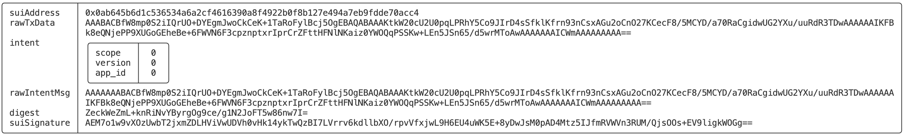

# SUI CLI最全命令详解3——Keytool基础命令

*rzexin 2024.05.25*

## 1 前言

`SUI`的命令行工具（`CLI`）`Keytool`提供了一些列的命令，用于管理和生成地址以及处理私钥、签名或 `zkLogin` 等功能。

## 2 命令清单

通过`-h`获取`sui keytool`所有命令参数：

```bash
$ sui --version
sui 1.27.0-b6887716b4da

$ sui keytool -h
Sui keystore tool

Usage: sui keytool [OPTIONS] <COMMAND>

Commands:
  update-alias                             Update an old alias to a new one. If a new alias is not provided, a random one will be generated
  convert                                  Convert private key in Hex or Base64 to new format (Bech32 encoded 33 byte flag || private key starting with "suiprivkey"). Hex private key
                                               format import and export are both deprecated in Sui Wallet and Sui CLI Keystore. Use `sui keytool import` if you wish to import a key to Sui
                                               Keystore
  decode-or-verify-tx                      Given a Base64 encoded transaction bytes, decode its components. If a signature is provided, verify the signature against the transaction and
                                               output the result
  decode-multi-sig                         Given a Base64 encoded MultiSig signature, decode its components. If tx_bytes is passed in, verify the multisig
  generate                                 Generate a new keypair with key scheme flag {ed25519 | secp256k1 | secp256r1} with optional derivation path, default to m/44'/784'/0'/0'/0' for
                                               ed25519 or m/54'/784'/0'/0/0 for secp256k1 or m/74'/784'/0'/0/0 for secp256r1. Word length can be { word12 | word15 | word18 | word21 | word24}
                                               default to word12 if not specified
  import                                   Add a new key to Sui CLI Keystore using either the input mnemonic phrase or a Bech32 encoded 33-byte `flag || privkey` starting with
                                               "suiprivkey", the key scheme flag {ed25519 | secp256k1 | secp256r1} and an optional derivation path, default to m/44'/784'/0'/0'/0' for ed25519
                                               or m/54'/784'/0'/0/0 for secp256k1 or m/74'/784'/0'/0/0 for secp256r1. Supports mnemonic phrase of word length 12, 15, 18, 21, 24. Set an alias
                                               for the key with the --alias flag. If no alias is provided, the tool will automatically generate one
  export                                   Output the private key of the given key identity in Sui CLI Keystore as Bech32 encoded string starting with `suiprivkey`
  list                                     List all keys by its Sui address, Base64 encoded public key, key scheme name in sui.keystore
  load-keypair                             This reads the content at the provided file path. The accepted format can be [enum SuiKeyPair] (Base64 encoded of 33-byte `flag || privkey`) or
                                               `type AuthorityKeyPair` (Base64 encoded `privkey`). This prints out the account keypair as Base64 encoded `flag || privkey`, the network keypair,
                                               worker keypair, protocol keypair as Base64 encoded `privkey`
  multi-sig-address                        To MultiSig Sui Address. Pass in a list of all public keys `flag || pk` in Base64. See `keytool list` for example public keys
  multi-sig-combine-partial-sig            Provides a list of participating signatures (`flag || sig || pk` encoded in Base64), threshold, a list of all public keys and a list of their
                                               weights that define the MultiSig address. Returns a valid MultiSig signature and its sender address. The result can be used as signature field
                                               for `sui client execute-signed-tx`. The sum of weights of all signatures must be >= the threshold
  multi-sig-combine-partial-sig-legacy     
  show                                     Read the content at the provided file path. The accepted format can be [enum SuiKeyPair] (Base64 encoded of 33-byte `flag || privkey`) or `type
                                               AuthorityKeyPair` (Base64 encoded `privkey`). It prints its Base64 encoded public key and the key scheme flag
  sign                                     Create signature using the private key for for the given address (or its alias) in sui keystore. Any signature commits to a [struct
                                               IntentMessage] consisting of the Base64 encoded of the BCS serialized transaction bytes itself and its intent. If intent is absent, default will
                                               be used
  sign-kms                                 Creates a signature by leveraging AWS KMS. Pass in a key-id to leverage Amazon KMS to sign a message and the base64 pubkey. Generate PubKey from
                                               pem using MystenLabs/base64pemkey Any signature commits to a [struct IntentMessage] consisting of the Base64 encoded of the BCS serialized
                                               transaction bytes itself and its intent. If intent is absent, default will be used
  unpack                                   This takes [enum SuiKeyPair] of Base64 encoded of 33-byte `flag || privkey`). It outputs the keypair into a file at the current directory where
                                               the address is the filename, and prints out its Sui address, Base64 encoded public key, the key scheme, and the key scheme flag
  zk-login-sign-and-execute-tx             Given the max_epoch, generate an OAuth url, ask user to paste the redirect with id_token, call salt server, then call the prover server, create a
                                               test transaction, use the ephemeral key to sign and execute it by assembling to a serialized zkLogin signature
  zk-login-enter-token                     A workaround to the above command because sometimes token pasting does not work (for Facebook). All the inputs required here are printed from the
                                               command above
  zk-login-sig-verify                      Given a zkLogin signature, parse it if valid. If `bytes` provided, parse it as either as TransactionData or PersonalMessage based on
                                               `intent_scope`. It verifies the zkLogin signature based its latest JWK fetched. Example request: sui keytool zk-login-sig-verify --sig
                                               $SERIALIZED_ZKLOGIN_SIG --bytes $BYTES --intent-scope 0 --network devnet --curr-epoch 10
  zk-login-insecure-sign-personal-message  TESTING ONLY: Generate a fixed ephemeral key and its JWT token with test issuer. Produce a zklogin signature for the given data and max epoch.
                                               e.g. sui keytool zk-login-insecure-sign-personal-message --data "hello" --max-epoch 5
  help                                     Print this message or the help of the given subcommand(s)
```

## 3 密钥对类

### 3.1 `generate`：生成密钥对

#### （1）说明

```
Generate a new keypair with key scheme flag {ed25519 | secp256k1 | secp256r1} with optional derivation path, default to m/44'/784'/0'/0'/0' for ed25519 or m/54'/784'/0'/0/0 for secp256k1 or m/74'/784'/0'/0/0 for secp256r1. Word length can be { word12 | word15 | word18 | word21 | word24} default to word12 if not specified
```

| KEY SCHEME  | DEFAULT DERIVATION PATH |
| ----------- | ----------------------- |
| `ed25519`   | `m/44'/784'/0'/0'/0'`   |
| `secp256k1` | `m/54'/784'/0'/0/0`     |
| `secp256r1` | `m/74'/784'/0'/0/0`     |

#### （2）用法

```bash
Usage: sui keytool generate [OPTIONS] <KEY_SCHEME> [DERIVATION_PATH] [WORD_LENGTH]

Arguments:
  <KEY_SCHEME>       
  [DERIVATION_PATH]  
  [WORD_LENGTH]   
```

#### （3）使用

-   **直接创建**

```bash
$ sui keytool generate ed25519
╭─────────────────┬────────────────────────────────────────────────────────────────────────────────────────────╮
│ alias           │                                                                                            │
│ suiAddress      │  0x0ab645b6d1c536534a6a2cf4616390a8f4922b0f8b127e494a7eb9fdde70acc4                        │
│ publicBase64Key │  AGwzSkAPgy3Pkgl+ZFVZWfdFQz9COw46z4RX2WKCRY4a                                              │
│ keyScheme       │  ed25519                                                                                   │
│ flag            │  0                                                                                         │
│ mnemonic        │  fetch mushroom celery actress capital clip update neutral kangaroo deal picture identify  │
│ peerId          │  6c334a400f832dcf92097e64555959f745433f423b0e3acf8457d96282458e1a                          │
╰─────────────────┴────────────────────────────────────────────────────────────────────────────────────────────╯

# 本地生成私钥文件
$ cat 0x0ab645b6d1c536534a6a2cf4616390a8f4922b0f8b127e494a7eb9fdde70acc4.key 
AEXleFEKuJrNh9E3kpvwLqdsfeQfuliUQQ61cvJVfq4N
```

-   **指定派生路径和助记词长度创建**

```bash
$ sui keytool generate secp256k1 "m/54'/784'/0'/0/0" word15
╭─────────────────┬────────────────────────────────────────────────────────────────────────────────────────────────────────╮
│ alias           │                                                                                                        │
│ suiAddress      │  0x5f5bc9a9d12da2210ad43be0d8120989c280a409e2bed53691a05ca505c8f93a                                    │
│ publicBase64Key │  AQNxN3EAZbPLFUNT9z8HgnaNlRumUvGSmawdr1igYMVCrg==                                                      │
│ keyScheme       │  secp256k1                                                                                             │
│ flag            │  1                                                                                                     │
│ mnemonic        │  over shaft village combine puzzle muscle fantasy relief early select acquire boy tourist hybrid fine  │
│ peerId          │                                                                                                        │
╰─────────────────┴────────────────────────────────────────────────────────────────────────────────────────────────────────╯

# 本地生成私钥文件
$ cat 0x5f5bc9a9d12da2210ad43be0d8120989c280a409e2bed53691a05ca505c8f93a.key 
Af+2Y9EdQuFUUePBcUfbJHduivR+cg794FrmrvBS1rXf
```

### 3.2 `show`：查看密钥

#### （1）说明

该命令可以读取指定路径的私钥文件，并打印`Base64`编码公钥、密钥方案等信息。

```
Read the content at the provided file path. The accepted format can be [enum SuiKeyPair] (Base64 encoded of 33-byte `flag || privkey`) or `type AuthorityKeyPair` (Base64 encoded `privkey`). It prints its Base64 encoded public key and the key scheme flag
```

#### （2）用法

```bash
Usage: sui keytool show [OPTIONS] <FILE>

Arguments:
  <FILE>  
```

#### （3）使用

>   输出内容跟`generate`生成的一致。

```bash
$ sui keytool show ./0x0ab645b6d1c536534a6a2cf4616390a8f4922b0f8b127e494a7eb9fdde70acc4.key 
╭─────────────────┬──────────────────────────────────────────────────────────────────────╮
│ alias           │                                                                      │
│ suiAddress      │  0x0ab645b6d1c536534a6a2cf4616390a8f4922b0f8b127e494a7eb9fdde70acc4  │
│ publicBase64Key │  AGwzSkAPgy3Pkgl+ZFVZWfdFQz9COw46z4RX2WKCRY4a                        │
│ keyScheme       │  ed25519                                                             │
│ flag            │  0                                                                   │
│ peerId          │  6c334a400f832dcf92097e64555959f745433f423b0e3acf8457d96282458e1a    │
╰─────────────────┴──────────────────────────────────────────────────────────────────────╯
```

### 3.3 `convert`：密钥格式转换

#### （1）说明

通过该命令可以将私钥从十六进制或`Base64`编码的格式，转换为新格式。

```
Convert private key in Hex or Base64 to new format (Bech32 encoded 33 byte flag || private key starting with "suiprivkey"). Hex private key format import and export are both deprecated in Sui Wallet and Sui
CLI Keystore. Use `sui keytool import` if you wish to import a key to Sui Keystore
```

#### （2）用法

```bash
Usage: sui keytool convert [OPTIONS] <VALUE>

Arguments:
  <VALUE>  
```

#### （3）使用

```bash
$ sui keytool  convert AEXleFEKuJrNh9E3kpvwLqdsfeQfuliUQQ61cvJVfq4N
╭────────────────┬──────────────────────────────────────────────────────────────────────────╮
│ bech32WithFlag │  suiprivkey1qpz727z3p2uf4nv86yme9xls96nkcl0yr7a939zpp66h9uj406hq6myd3l7  │
│ base64WithFlag │  AEXleFEKuJrNh9E3kpvwLqdsfeQfuliUQQ61cvJVfq4N                            │
│ hexWithoutFlag │  45e578510ab89acd87d137929bf02ea76c7de41fba5894410eb572f2557eae0d        │
│ scheme         │  ed25519                                                                 │
╰────────────────┴──────────────────────────────────────────────────────────────────────────╯
```

### 3.4 `import`：导入私钥到`SUI CLI Keystore`

#### （1）说明

该命令可以添加私钥到`SUI`命令行的`Keystore`中。可以使用助记词、编码后的私钥作为输入字符串，并指定密钥方案，及可选的派生路径。还可支持指定别名，若未指定，将随机生成别名。

```
Add a new key to Sui CLI Keystore using either the input mnemonic phrase or a Bech32 encoded 33-byte `flag || privkey` starting with "suiprivkey", the key scheme flag {ed25519 | secp256k1 | secp256r1} and an
optional derivation path, default to m/44'/784'/0'/0'/0' for ed25519 or m/54'/784'/0'/0/0 for secp256k1 or m/74'/784'/0'/0/0 for secp256r1. Supports mnemonic phrase of word length 12, 15, 18, 21, 24. Set an
alias for the key with the --alias flag. If no alias is provided, the tool will automatically generate one
```

#### （2）用法

```bash
Usage: sui keytool import [OPTIONS] <INPUT_STRING> <KEY_SCHEME> [DERIVATION_PATH]

Arguments:
  <INPUT_STRING>     
  <KEY_SCHEME>       
  [DERIVATION_PATH]  

Options:
      --alias <ALIAS>  Sets an alias for this address. The alias must start with a letter and can contain only letters, digits, hyphens (-), or underscores (_)
```

#### （3）使用

-   **使用已编码私钥导入**

>   注：需要使用新格式的私钥，可以使用`convert`命令进行转换得到。

```bash
$ sui keytool import --alias yas suiprivkey1qpz727z3p2uf4nv86yme9xls96nkcl0yr7a939zpp66h9uj406hq6myd3l7 ed25519

$ sui keytool list
╭────────────────────────────────────────────────────────────────────────────────────────────╮
│ ╭─────────────────┬──────────────────────────────────────────────────────────────────────╮ │
│ │ alias           │  yas                                                                 │ │
│ │ suiAddress      │  0x0ab645b6d1c536534a6a2cf4616390a8f4922b0f8b127e494a7eb9fdde70acc4  │ │
│ │ publicBase64Key │  AGwzSkAPgy3Pkgl+ZFVZWfdFQz9COw46z4RX2WKCRY4a                        │ │
│ │ keyScheme       │  ed25519                                                             │ │
│ │ flag            │  0                                                                   │ │
│ │ peerId          │  6c334a400f832dcf92097e64555959f745433f423b0e3acf8457d96282458e1a    │ │
│ ╰─────────────────┴──────────────────────────────────────────────────────────────────────╯ │
╰────────────────────────────────────────────────────────────────────────────────────────────╯
```

-   **使用助记词导入**

>   注：当前版本（`04ed3b62103cf5cef07bba9416679cf55715c22b`）如果导入助记词，`--alias`参数不生效，已提`PR`： [#17935](https://github.com/MystenLabs/sui/pull/17935)

```bash
$ sui keytool import --alias yoy "over shaft village combine puzzle muscle fantasy relief early select acquire boy tourist hybrid fine" secp256k1

$ sui keytool list
╭────────────────────────────────────────────────────────────────────────────────────────────╮
│ ╭─────────────────┬──────────────────────────────────────────────────────────────────────╮ │
│ │ alias           │  yas                                                                 │ │
│ │ suiAddress      │  0x0ab645b6d1c536534a6a2cf4616390a8f4922b0f8b127e494a7eb9fdde70acc4  │ │
│ │ publicBase64Key │  AGwzSkAPgy3Pkgl+ZFVZWfdFQz9COw46z4RX2WKCRY4a                        │ │
│ │ keyScheme       │  ed25519                                                             │ │
│ │ flag            │  0                                                                   │ │
│ │ peerId          │  6c334a400f832dcf92097e64555959f745433f423b0e3acf8457d96282458e1a    │ │
│ ╰─────────────────┴──────────────────────────────────────────────────────────────────────╯ │
│ ╭─────────────────┬──────────────────────────────────────────────────────────────────────╮ │
│ │ alias           │  yoy                                                                 │ │
│ │ suiAddress      │  0x5f5bc9a9d12da2210ad43be0d8120989c280a409e2bed53691a05ca505c8f93a  │ │
│ │ publicBase64Key │  AQNxN3EAZbPLFUNT9z8HgnaNlRumUvGSmawdr1igYMVCrg==                    │ │
│ │ keyScheme       │  secp256k1                                                           │ │
│ │ flag            │  1                                                                   │ │
│ │ peerId          │                                                                      │ │
│ ╰─────────────────┴──────────────────────────────────────────────────────────────────────╯ │
╰────────────────────────────────────────────────────────────────────────────────────────────╯
```

### 3.5 `export`：导出私钥

#### （1）说明

根据密钥标识（**别名or地址**）导出`SUI CLI Keystore`中私钥，以及公钥等信息。

```
Output the private key of the given key identity in Sui CLI Keystore as Bech32 encoded string starting with `suiprivkey`
```

#### （2）用法

```bash
Usage: sui keytool export [OPTIONS] --key-identity <KEY_IDENTITY>

Options:
      --key-identity <KEY_IDENTITY>  
```

#### （3）使用

-   **使用别名**

```
$ sui keytool export --key-identity yas
╭────────────────────┬────────────────────────────────────────────────────────────────────────────────────────────╮
│ exportedPrivateKey │  suiprivkey1qpz727z3p2uf4nv86yme9xls96nkcl0yr7a939zpp66h9uj406hq6myd3l7                    │
│ key                │ ╭─────────────────┬──────────────────────────────────────────────────────────────────────╮ │
│                    │ │ alias           │  yas                                                                 │ │
│                    │ │ suiAddress      │  0x0ab645b6d1c536534a6a2cf4616390a8f4922b0f8b127e494a7eb9fdde70acc4  │ │
│                    │ │ publicBase64Key │  AGwzSkAPgy3Pkgl+ZFVZWfdFQz9COw46z4RX2WKCRY4a                        │ │
│                    │ │ keyScheme       │  ed25519                                                             │ │
│                    │ │ flag            │  0                                                                   │ │
│                    │ │ peerId          │  6c334a400f832dcf92097e64555959f745433f423b0e3acf8457d96282458e1a    │ │
│                    │ ╰─────────────────┴──────────────────────────────────────────────────────────────────────╯ │
╰────────────────────┴────────────────────────────────────────────────────────────────────────────────────────────╯
```

-   **使用地址**

```bash
$ sui keytool export --key-identity 0x0ab645b6d1c536534a6a2cf4616390a8f4922b0f8b127e494a7eb9fdde70acc4
╭────────────────────┬────────────────────────────────────────────────────────────────────────────────────────────╮
│ exportedPrivateKey │  suiprivkey1qpz727z3p2uf4nv86yme9xls96nkcl0yr7a939zpp66h9uj406hq6myd3l7                    │
│ key                │ ╭─────────────────┬──────────────────────────────────────────────────────────────────────╮ │
│                    │ │ alias           │  yas                                                                 │ │
│                    │ │ suiAddress      │  0x0ab645b6d1c536534a6a2cf4616390a8f4922b0f8b127e494a7eb9fdde70acc4  │ │
│                    │ │ publicBase64Key │  AGwzSkAPgy3Pkgl+ZFVZWfdFQz9COw46z4RX2WKCRY4a                        │ │
│                    │ │ keyScheme       │  ed25519                                                             │ │
│                    │ │ flag            │  0                                                                   │ │
│                    │ │ peerId          │  6c334a400f832dcf92097e64555959f745433f423b0e3acf8457d96282458e1a    │ │
│                    │ ╰─────────────────┴──────────────────────────────────────────────────────────────────────╯ │
╰────────────────────┴────────────────────────────────────────────────────────────────────────────────────────────╯
```

### 3.6 `list`：列出本地`Keystore`所有私钥对应的地址及公钥等信息

#### （1）说明

使用该命令可以列出本地`SUI Keystore`中，默认路径：`~/.sui/sui_config/sui.keystore`，所有私钥对应的地址、公钥等信息。

```
List all keys by its Sui address, Base64 encoded public key, key scheme name in sui.keystore
```

#### （2）用法

```bash
Usage: sui keytool list [OPTIONS]

Options:
  -s, --sort-by-alias  Sort by alias
```

#### （3）使用

```bash
$ sui keytool list
╭────────────────────────────────────────────────────────────────────────────────────────────╮
│ ╭─────────────────┬──────────────────────────────────────────────────────────────────────╮ │
│ │ alias           │  yas                                                                 │ │
│ │ suiAddress      │  0x0ab645b6d1c536534a6a2cf4616390a8f4922b0f8b127e494a7eb9fdde70acc4  │ │
│ │ publicBase64Key │  AGwzSkAPgy3Pkgl+ZFVZWfdFQz9COw46z4RX2WKCRY4a                        │ │
│ │ keyScheme       │  ed25519                                                             │ │
│ │ flag            │  0                                                                   │ │
│ │ peerId          │  6c334a400f832dcf92097e64555959f745433f423b0e3acf8457d96282458e1a    │ │
│ ╰─────────────────┴──────────────────────────────────────────────────────────────────────╯ │
╰────────────────────────────────────────────────────────────────────────────────────────────╯
```

### 3.7 `update-alias`：更新别名

#### （1）说明

使用该命令可以修改别名，如果没有指定，将使用随机别名。

```
Update an old alias to a new one. If a new alias is not provided, a random one will be generated
```

#### （2）用法

```bash
Usage: sui keytool update-alias [OPTIONS] <OLD_ALIAS> [NEW_ALIAS]

Arguments:
  <OLD_ALIAS>  
  [NEW_ALIAS]  The alias must start with a letter and can contain only letters, digits, dots, hyphens (-), or underscores (_)
```

#### （3）使用

-   **修改为指定别名**

```bash
$ sui keytool update-alias yas yasmine
Old alias yas was updated to yasmine

$ sui keytool list
╭────────────────────────────────────────────────────────────────────────────────────────────╮
│ ╭─────────────────┬──────────────────────────────────────────────────────────────────────╮ │
│ │ alias           │  yasmine                                                             │ │
│ │ suiAddress      │  0x0ab645b6d1c536534a6a2cf4616390a8f4922b0f8b127e494a7eb9fdde70acc4  │ │
│ │ publicBase64Key │  AGwzSkAPgy3Pkgl+ZFVZWfdFQz9COw46z4RX2WKCRY4a                        │ │
│ │ keyScheme       │  ed25519                                                             │ │
│ │ flag            │  0                                                                   │ │
│ │ peerId          │  6c334a400f832dcf92097e64555959f745433f423b0e3acf8457d96282458e1a    │ │
│ ╰─────────────────┴──────────────────────────────────────────────────────────────────────╯ │
╰────────────────────────────────────────────────────────────────────────────────────────────╯
```

-   **修改为随机别名**

```bash
$ sui keytool update-alias yoy
Old alias yoy was updated to festive-quartz

$ sui keytool list
╭────────────────────────────────────────────────────────────────────────────────────────────╮
│ ╭─────────────────┬──────────────────────────────────────────────────────────────────────╮ │
│ │ alias           │  festive-quartz                                                      │ │
│ │ suiAddress      │  0x5f5bc9a9d12da2210ad43be0d8120989c280a409e2bed53691a05ca505c8f93a  │ │
│ │ publicBase64Key │  AQNxN3EAZbPLFUNT9z8HgnaNlRumUvGSmawdr1igYMVCrg==                    │ │
│ │ keyScheme       │  secp256k1                                                           │ │
│ │ flag            │  1                                                                   │ │
│ │ peerId          │                                                                      │ │
│ ╰─────────────────┴──────────────────────────────────────────────────────────────────────╯ │
╰────────────────────────────────────────────────────────────────────────────────────────────╯
```

### 3.8 `load-keypair`：加载多种类型的密钥对

#### （1）说明

通过该命令可以加载多种类型的密钥对。

```
This reads the content at the provided file path. The accepted format can be [enum SuiKeyPair] (Base64 encoded of 33-byte `flag || privkey`) or `type AuthorityKeyPair` (Base64 encoded `privkey`). 

This prints out the account keypair as Base64 encoded `flag || privkey`, the network keypair, worker keypair, protocol keypair as Base64 encoded `privkey`
```

#### （2）用法

```bash
Usage: sui keytool load-keypair [OPTIONS] <FILE>

Arguments:
  <FILE>  
```

#### （3）使用

```bash
$ sui keytool  load-keypair  ~/0x0ab645b6d1c536534a6a2cf4616390a8f4922b0f8b127e494a7eb9fdde70acc4.key 
╭────────────────┬────────────────────────────────────────────────╮
│ accountKeypair │  AEXleFEKuJrNh9E3kpvwLqdsfeQfuliUQQ61cvJVfq4N  │
│ networkKeypair │  ReV4UQq4ms2H0TeSm/Aup2x95B+6WJRBDrVy8lV+rg0=  │
│ workerKeypair  │  ReV4UQq4ms2H0TeSm/Aup2x95B+6WJRBDrVy8lV+rg0=  │
│ keyScheme      │  ed25519                                       │
╰────────────────┴────────────────────────────────────────────────╯
```

## 4 签名验签类

### 4.1 `sign`：交易签名

#### （1）说明

该命令会使用`Keystone`中地址或别名对应的私钥进行交易签名。

```
Create signature using the private key for for the given address (or its alias) in sui keystore. 

Any signature commits to a [struct IntentMessage] consisting of the Base64 encoded of the BCS serialized transaction bytes itself and its intent. If intent is absent, default will be used 
```

#### （2）用法

```bash
Usage: sui keytool sign [OPTIONS] --address <ADDRESS> --data <DATA>

Options:
      --address <ADDRESS>  
      --data <DATA>        
      --json               Return command outputs in json format
      --intent <INTENT>   
```

#### （3）使用

-   **构造待签名数据**

```bash
$ sui client pay-all-sui --input-coins 0xaeda80a73b6eca09e705f3fe4c0980ff6bbd11682822770506d985eefeeb9175 --recip
ient yoy --gas-budget 10000000 --serialize-unsigned-transaction

AAABACBfW8mp0S2iIQrUO+DYEgmJwoCkCeK+1TaRoFylBcj5OgEBAQABAAAKtkW20cU2U0pqLPRhY5Co9JIrD4sSfklKfrn93nCsxAGu2oCnO27KCecF8/5MCYD/a70RaCgidwUG2YXu/uuRdR3TDwAAAAAAIKFBk8eQNjePP9XUGoGEheBe+6FWVN6F3cpznptxrIprCrZFttHFNlNKaiz0YWOQqPSSKw+LEn5JSn65/d5wrMToAwAAAAAAAICWmAAAAAAAAA==
```

-   **交易签名**

```bash
$ sui keytool sign --address yas --data AAABACBfW8mp0S2iIQrUO+DYEgmJwoCkCeK+1TaRoFylBcj5OgEBAQABAAAKtkW20cU2U0pqLPRhY5Co9JIrD4sSfklKfrn93nCsxAGu2oCnO27KCecF8/5MCYD/a70RaCgidwUG2YXu/uuRdR3TDwAAAAAAIKFBk8eQNjePP9XUGoGEheBe+6FWVN6F3cpznptxrIprCrZFttHFNlNKaiz0YWOQqPSSKw+LEn5JSn65/d5wrMToAwAAAAAAAICWmAAAAAAAAA==

╭──────────────┬──────────────────────────────────────────────────────────────────────────────────────────────────────────────────────────────────────────────────────────────────╮
│ suiAddress   │ 0x0ab645b6d1c536534a6a2cf4616390a8f4922b0f8b127e494a7eb9fdde70acc4                                                                                               │
│ rawTxData    │ AAABACBfW8mp0S2iIQrUO+DYEgmJwoCkCeK+1TaRoFylBcj5OgEBAQABAAAKtkW20cU2U0pqLPRhY5Co9JIrD4sSfklKfrn93nCsxAGu2oCnO27KCecF8/5MCYD/a70RaCgidwUG2YXu/uuRdR3TDwAAAAAAIKFB │
│              │ k8eQNjePP9XUGoGEheBe+6FWVN6F3cpznptxrIprCrZFttHFNlNKaiz0YWOQqPSSKw+LEn5JSn65/d5wrMToAwAAAAAAAICWmAAAAAAAAA==                                                     │
│ intent       │ ╭─────────┬─────╮                                                                                                                                                │
│              │ │ scope   │  0  │                                                                                                                                                │
│              │ │ version │  0  │                                                                                                                                                │
│              │ │ app_id  │  0  │                                                                                                                                                │
│              │ ╰─────────┴─────╯                                                                                                                                                │
│ rawIntentMsg │ AAAAAAABACBfW8mp0S2iIQrUO+DYEgmJwoCkCeK+1TaRoFylBcj5OgEBAQABAAAKtkW20cU2U0pqLPRhY5Co9JIrD4sSfklKfrn93nCsxAGu2oCnO27KCecF8/5MCYD/a70RaCgidwUG2YXu/uuRdR3TDwAAAAAA │
│              │ IKFBk8eQNjePP9XUGoGEheBe+6FWVN6F3cpznptxrIprCrZFttHFNlNKaiz0YWOQqPSSKw+LEn5JSn65/d5wrMToAwAAAAAAAICWmAAAAAAAAA==                                                 │
│ digest       │ ZeckWeZmL+knRiNvYByrgOg9ce/g1N2JoFT5w86nw7I=                                                                                                                     │
│ suiSignature │ AEM7o1w9vXOzUwbT2jxmZDLHViVwUDVh0vHk14ykTwQzBI7LVrrv6kdllbXO/rpvVfxjwL9H6EU4uWK5E+8yDwJsM0pAD4Mtz5IJfmRVWVn3RUM/QjsOOs+EV9ligkWOGg==                             │
╰──────────────┴──────────────────────────────────────────────────────────────────────────────────────────────────────────────────────────────────────────────────────────────────╯
```



### 4.2 `decode-or-verify-tx`：交易解码或签名交易验签

#### （1）说明

该命令会对`Base64`编码的交易进行解码，如果提供了签名信息，还会进行交易验签，并输出验签结果。

```
Given a Base64 encoded transaction bytes, decode its components. 

If a signature is provided, verify the signature against the transaction and output the result
```

#### （2）用法

```bash
Usage: sui keytool decode-or-verify-tx [OPTIONS] --tx-bytes <TX_BYTES>

Options:
      --tx-bytes <TX_BYTES>    
      --json                   Return command outputs in json format
      --sig <SIG>              
      --cur-epoch <CUR_EPOCH>  [default: 0]
```

#### （3）使用

-   **交易解码**

```bash
$ sui keytool decode-or-verify-tx --tx-bytes AAABACBfW8mp0S2iIQrUO+DYEgmJwoCkCeK+1TaRoFylBcj5OgEBAQABAAAKtkW20cU2U0pqLPRhY5Co9JIrD4sSfklKfrn93nCsxAGu2oCnO27KCecF8/5MCYD/a70RaCgidwUG2YXu/uuRdR3TDwAAAAAAIKFBk8eQNjePP9XUGoGEheBe+6FWVN6F3cpznptxrIprCrZFttHFNlNKaiz0YWOQqPSSKw+LEn5JSn65/d5wrMToAwAAAAAAAICWmAAAAAAAAA== 
```


-   **交易解码及验签**

```bash
$ sui keytool decode-or-verify-tx --tx-bytes AAABACBfW8mp0S2iIQrUO+DYEgmJwoCkCeK+1TaRoFylBcj5OgEBAQABAAAKtkW20cU2U0pqLPRhY5Co9JIrD4sSfklKfrn93nCsxAGu2oCnO27KCecF8/5MCYD/a70RaCgidwUG2YXu/uuRdR3TDwAAAAAAIKFBk8eQNjePP9XUGoGEheBe+6FWVN6F3cpznptxrIprCrZFttHFNlNKaiz0YWOQqPSSKw+LEn5JSn65/d5wrMToAwAAAAAAAICWmAAAAAAAAA== --sig AEM7o1w9vXOzUwbT2jxmZDLHViVwUDVh0vHk14ykTwQzBI7LVrrv6kdllbXO/rpvVfxjwL9H6EU4uWK5E+8yDwJsM0pAD4Mtz5IJfmRVWVn3RUM/QjsOOs+EV9ligkWOGg==
```

>   输出中上半部分是交易解码后的内容，下半部分是验签结果：


## 5 更多

欢迎关注微信公众号：**Move中文**，开启你的 **Sui Move** 之旅！


