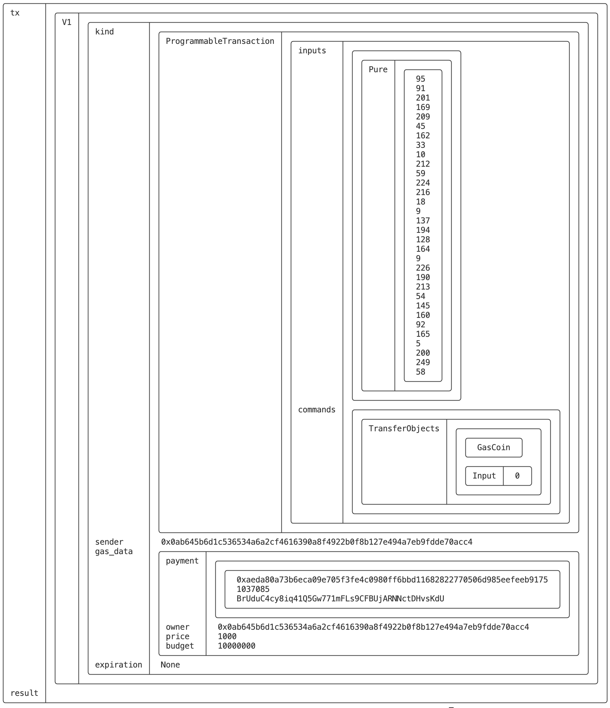
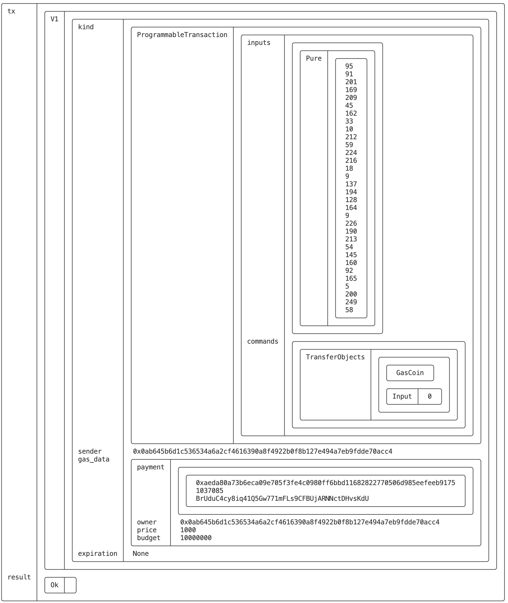
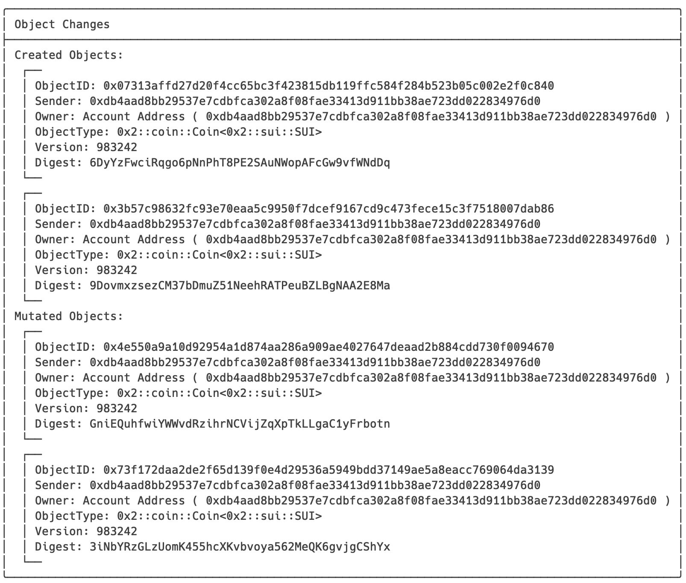
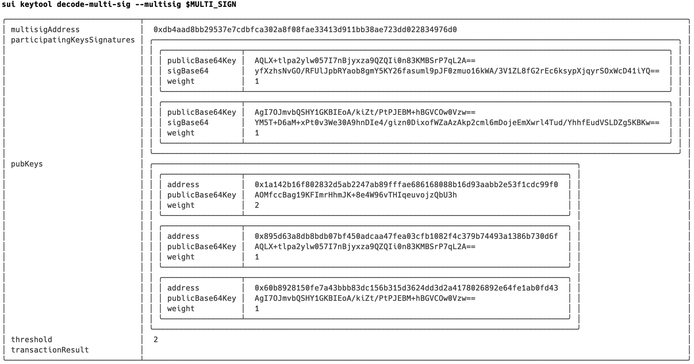
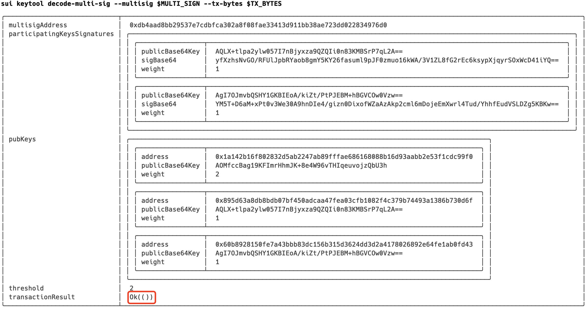

# SUI CLI最全命令详解4——Keytool之单签多签类 @SUI Move开发必知必会

*rzexin 2024.05.26*

## 1 前言

`SUI`的命令行工具（`CLI`）的`keytool`命令提供了一些列的子命令，用于生成私钥、管理地址、签名验签、多签及`zkLogin`相关功能。

在[《SUI CLI最全命令详解3——Keytool之密钥对类》](https://learnblockchain.cn/article/8203)已介绍了**密钥对类**，本篇将接着介绍**单签类**和**多签类**。

## 2 单签类

### 2.1 `sign`：交易签名

#### （1）说明

该命令会使用`Keystone`中地址或别名对应的私钥进行交易签名。

```
Create signature using the private key for for the given address (or its alias) in sui keystore. 

Any signature commits to a [struct IntentMessage] consisting of the Base64 encoded of the BCS serialized transaction bytes itself and its intent. If intent is absent, default will be used 
```

#### （2）用法

```bash
Usage: sui keytool sign [OPTIONS] --address <ADDRESS> --data <DATA>

Options:
      --address <ADDRESS>  
      --data <DATA>        
      --json               Return command outputs in json format
      --intent <INTENT>   
```

#### （3）使用

-   **构造待签名数据**

```bash
$ sui client pay-all-sui --input-coins 0xaeda80a73b6eca09e705f3fe4c0980ff6bbd11682822770506d985eefeeb9175 --recip
ient yoy --gas-budget 10000000 --serialize-unsigned-transaction

AAABACBfW8mp0S2iIQrUO+DYEgmJwoCkCeK+1TaRoFylBcj5OgEBAQABAAAKtkW20cU2U0pqLPRhY5Co9JIrD4sSfklKfrn93nCsxAGu2oCnO27KCecF8/5MCYD/a70RaCgidwUG2YXu/uuRdR3TDwAAAAAAIKFBk8eQNjePP9XUGoGEheBe+6FWVN6F3cpznptxrIprCrZFttHFNlNKaiz0YWOQqPSSKw+LEn5JSn65/d5wrMToAwAAAAAAAICWmAAAAAAAAA==
```

-   **交易签名**

```bash
$ sui keytool sign --address yas --data AAABACBfW8mp0S2iIQrUO+DYEgmJwoCkCeK+1TaRoFylBcj5OgEBAQABAAAKtkW20cU2U0pqLPRhY5Co9JIrD4sSfklKfrn93nCsxAGu2oCnO27KCecF8/5MCYD/a70RaCgidwUG2YXu/uuRdR3TDwAAAAAAIKFBk8eQNjePP9XUGoGEheBe+6FWVN6F3cpznptxrIprCrZFttHFNlNKaiz0YWOQqPSSKw+LEn5JSn65/d5wrMToAwAAAAAAAICWmAAAAAAAAA==

╭──────────────┬──────────────────────────────────────────────────────────────────────────────────────────────────────────────────────────────────────────────────────────────────╮
│ suiAddress   │ 0x0ab645b6d1c536534a6a2cf4616390a8f4922b0f8b127e494a7eb9fdde70acc4                                                                                               │
│ rawTxData    │ AAABACBfW8mp0S2iIQrUO+DYEgmJwoCkCeK+1TaRoFylBcj5OgEBAQABAAAKtkW20cU2U0pqLPRhY5Co9JIrD4sSfklKfrn93nCsxAGu2oCnO27KCecF8/5MCYD/a70RaCgidwUG2YXu/uuRdR3TDwAAAAAAIKFB │
│              │ k8eQNjePP9XUGoGEheBe+6FWVN6F3cpznptxrIprCrZFttHFNlNKaiz0YWOQqPSSKw+LEn5JSn65/d5wrMToAwAAAAAAAICWmAAAAAAAAA==                                                     │
│ intent       │ ╭─────────┬─────╮                                                                                                                                                │
│              │ │ scope   │  0  │                                                                                                                                                │
│              │ │ version │  0  │                                                                                                                                                │
│              │ │ app_id  │  0  │                                                                                                                                                │
│              │ ╰─────────┴─────╯                                                                                                                                                │
│ rawIntentMsg │ AAAAAAABACBfW8mp0S2iIQrUO+DYEgmJwoCkCeK+1TaRoFylBcj5OgEBAQABAAAKtkW20cU2U0pqLPRhY5Co9JIrD4sSfklKfrn93nCsxAGu2oCnO27KCecF8/5MCYD/a70RaCgidwUG2YXu/uuRdR3TDwAAAAAA │
│              │ IKFBk8eQNjePP9XUGoGEheBe+6FWVN6F3cpznptxrIprCrZFttHFNlNKaiz0YWOQqPSSKw+LEn5JSn65/d5wrMToAwAAAAAAAICWmAAAAAAAAA==                                                 │
│ digest       │ ZeckWeZmL+knRiNvYByrgOg9ce/g1N2JoFT5w86nw7I=                                                                                                                     │
│ suiSignature │ AEM7o1w9vXOzUwbT2jxmZDLHViVwUDVh0vHk14ykTwQzBI7LVrrv6kdllbXO/rpvVfxjwL9H6EU4uWK5E+8yDwJsM0pAD4Mtz5IJfmRVWVn3RUM/QjsOOs+EV9ligkWOGg==                             │
╰──────────────┴──────────────────────────────────────────────────────────────────────────────────────────────────────────────────────────────────────────────────────────────────╯
```


### 2.2 `decode-or-verify-tx`：交易解码或签名交易验签

#### （1）说明

该命令会对`Base64`编码的交易进行解码，如果提供了签名信息，还会进行交易验签，并输出验签结果。

```
Given a Base64 encoded transaction bytes, decode its components. 

If a signature is provided, verify the signature against the transaction and output the result
```

#### （2）用法

```bash
Usage: sui keytool decode-or-verify-tx [OPTIONS] --tx-bytes <TX_BYTES>

Options:
      --tx-bytes <TX_BYTES>    
      --json                   Return command outputs in json format
      --sig <SIG>              
      --cur-epoch <CUR_EPOCH>  [default: 0]
```

#### （3）使用

-   **交易解码**

```bash
$ sui keytool decode-or-verify-tx --tx-bytes AAABACBfW8mp0S2iIQrUO+DYEgmJwoCkCeK+1TaRoFylBcj5OgEBAQABAAAKtkW20cU2U0pqLPRhY5Co9JIrD4sSfklKfrn93nCsxAGu2oCnO27KCecF8/5MCYD/a70RaCgidwUG2YXu/uuRdR3TDwAAAAAAIKFBk8eQNjePP9XUGoGEheBe+6FWVN6F3cpznptxrIprCrZFttHFNlNKaiz0YWOQqPSSKw+LEn5JSn65/d5wrMToAwAAAAAAAICWmAAAAAAAAA== 
```



-   **交易解码及验签**

```bash
$ sui keytool decode-or-verify-tx --tx-bytes AAABACBfW8mp0S2iIQrUO+DYEgmJwoCkCeK+1TaRoFylBcj5OgEBAQABAAAKtkW20cU2U0pqLPRhY5Co9JIrD4sSfklKfrn93nCsxAGu2oCnO27KCecF8/5MCYD/a70RaCgidwUG2YXu/uuRdR3TDwAAAAAAIKFBk8eQNjePP9XUGoGEheBe+6FWVN6F3cpznptxrIprCrZFttHFNlNKaiz0YWOQqPSSKw+LEn5JSn65/d5wrMToAwAAAAAAAICWmAAAAAAAAA== --sig AEM7o1w9vXOzUwbT2jxmZDLHViVwUDVh0vHk14ykTwQzBI7LVrrv6kdllbXO/rpvVfxjwL9H6EU4uWK5E+8yDwJsM0pAD4Mtz5IJfmRVWVn3RUM/QjsOOs+EV9ligkWOGg==
```

>   输出中上半部分是交易解码后的内容，下半部分是验签结果：



## 3 多签类

>   `SUI` 支持多重签名（`multisig`）交易，这需要多个密钥进行授权，而不是单密钥签名。
>
>   `SUI` 支持 `k` 对 `n` 多重签名交易，其中 `k` 是阈值，`n` 是所有参与方的总权重。最大参与方数量为 `10`。
>
>   多重签名的有效参与密钥是纯 `Ed25519`、`ECDSA Secp256k1` 和 `ECDSA Secp256r1`。
>
>   如果序列化的多重签名包含足够数量的有效签名，其权重之和超过阈值，`SUI` 将视为多重签名有效，并执行交易。

### 3.1 `multi-sig-address`：创建多重签名地址

#### （1）说明

```bash
To MultiSig Sui Address. Pass in a list of all public keys `flag || pk` in Base64. See `keytool list` for example public keys
```

#### （2）用法

```bash
Usage: sui keytool multi-sig-address [OPTIONS] --threshold <THRESHOLD>

Options:
      --threshold <THRESHOLD>  
      --json                   Return command outputs in json format
      --pks <PKS>...           
      --weights <WEIGHTS>... 
```

#### （3）使用

-   **创建3个不同密钥方案的地址**

```bash
$ sui client new-address ed25519 js1
╭──────────────────────────────────────────────────────────────────────────────────────────────────────╮
│ Created new keypair and saved it to keystore.                                                        │
├────────────────┬─────────────────────────────────────────────────────────────────────────────────────┤
│ alias          │ js1                                                                                 │
│ address        │ 0x1a142b16f802832d5ab2247ab89fffae686168088b16d93aabb2e53f1cdc99f0                  │
│ keyScheme      │ ed25519                                                                             │
│ recoveryPhrase │ wait virtual cushion tornado cover grain excuse warfare dwarf runway satisfy crater │
╰────────────────┴─────────────────────────────────────────────────────────────────────────────────────╯

$ sui client new-address secp256k1 js2
╭───────────────────────────────────────────────────────────────────────────────────────────────────╮
│ Created new keypair and saved it to keystore.                                                     │
├────────────────┬──────────────────────────────────────────────────────────────────────────────────┤
│ alias          │ js2                                                                              │
│ address        │ 0x895d63a8db8bdb07bf450adcaa47fea03cfb1082f4c379b74493a1386b730d6f               │
│ keyScheme      │ secp256k1                                                                        │
│ recoveryPhrase │ disorder fiber mention december scrap wreck curtain option emotion any keen away │
╰────────────────┴──────────────────────────────────────────────────────────────────────────────────╯

$ sui client new-address secp256r1 js3
╭─────────────────────────────────────────────────────────────────────────────────────────╮
│ Created new keypair and saved it to keystore.                                           │
├────────────────┬────────────────────────────────────────────────────────────────────────┤
│ alias          │ js3                                                                    │
│ address        │ 0x60b8928150fe7a43bbb83dc156b315d3624dd3d2a4178026892e64fe1ab0fd43     │
│ keyScheme      │ secp256r1                                                              │
│ recoveryPhrase │ steak lake dune ski banner eternal debate pond figure tell leave faith │
╰────────────────┴────────────────────────────────────────────────────────────────────────╯
```

-   **将地址添加到环境变量**

```bash
export JS1=0x1a142b16f802832d5ab2247ab89fffae686168088b16d93aabb2e53f1cdc99f0
export JS2=0x895d63a8db8bdb07bf450adcaa47fea03cfb1082f4c379b74493a1386b730d6f
export JS3=0x60b8928150fe7a43bbb83dc156b315d3624dd3d2a4178026892e64fe1ab0fd43
```

-   **查看本地keystore**

```bash
sui keytool list
╭────────────────────────────────────────────────────────────────────────────────────────────╮
│ ╭─────────────────┬──────────────────────────────────────────────────────────────────────╮ │
│ │ alias           │  js1                                                                 │ │
│ │ suiAddress      │  0x1a142b16f802832d5ab2247ab89fffae686168088b16d93aabb2e53f1cdc99f0  │ │
│ │ publicBase64Key │  AOMfccBag19KFImrHhmJK+8e4W96vTHIqeuvojzQbU3h                        │ │
│ │ keyScheme       │  ed25519                                                             │ │
│ │ flag            │  0                                                                   │ │
│ │ peerId          │  e31f71c05a835f4a1489ab1e19892bef1ee16f7abd31c8a9ebafa23cd06d4de1    │ │
│ ╰─────────────────┴──────────────────────────────────────────────────────────────────────╯ │
│ ╭─────────────────┬──────────────────────────────────────────────────────────────────────╮ │
│ │ alias           │  js3                                                                 │ │
│ │ suiAddress      │  0x60b8928150fe7a43bbb83dc156b315d3624dd3d2a4178026892e64fe1ab0fd43  │ │
│ │ publicBase64Key │  AgI7OJmvbQSHY1GKBIEoA/kiZt/PtPJEBM+hBGVCOw0Vzw==                    │ │
│ │ keyScheme       │  secp256r1                                                           │ │
│ │ flag            │  2                                                                   │ │
│ │ peerId          │                                                                      │ │
│ ╰─────────────────┴──────────────────────────────────────────────────────────────────────╯ │
│ ╭─────────────────┬──────────────────────────────────────────────────────────────────────╮ │
│ │ alias           │  js2                                                                 │ │
│ │ suiAddress      │  0x895d63a8db8bdb07bf450adcaa47fea03cfb1082f4c379b74493a1386b730d6f  │ │
│ │ publicBase64Key │  AQLX+tlpa2ylw057I7nBjyxza9QZQIi0n83KMBSrP7qL2A==                    │ │
│ │ keyScheme       │  secp256k1                                                           │ │
│ │ flag            │  1                                                                   │ │
│ │ peerId          │                                                                      │ │
│ ╰─────────────────┴──────────────────────────────────────────────────────────────────────╯ │
╰────────────────────────────────────────────────────────────────────────────────────────────╯
```

-   **创建多重签名**

```bash
export PK1=AOMfccBag19KFImrHhmJK+8e4W96vTHIqeuvojzQbU3h
export PK2=AQLX+tlpa2ylw057I7nBjyxza9QZQIi0n83KMBSrP7qL2A==
export PK3=AgI7OJmvbQSHY1GKBIEoA/kiZt/PtPJEBM+hBGVCOw0Vzw== 

$ sui keytool multi-sig-address --pks $PK1 $PK2 $PK3 --weights 2 1 1 --threshold 2
╭─────────────────┬────────────────────────────────────────────────────────────────────────────────────────────────╮
│ multisigAddress │  0xdb4aad8bb29537e7cdbfca302a8f08fae33413d911bb38ae723dd022834976d0                            │
│ multisig        │ ╭────────────────────────────────────────────────────────────────────────────────────────────╮ │
│                 │ │ ╭─────────────────┬──────────────────────────────────────────────────────────────────────╮ │ │
│                 │ │ │ address         │  0x1a142b16f802832d5ab2247ab89fffae686168088b16d93aabb2e53f1cdc99f0  │ │ │
│                 │ │ │ publicBase64Key │  AOMfccBag19KFImrHhmJK+8e4W96vTHIqeuvojzQbU3h                        │ │ │
│                 │ │ │ weight          │  2                                                                   │ │ │
│                 │ │ ╰─────────────────┴──────────────────────────────────────────────────────────────────────╯ │ │
│                 │ │ ╭─────────────────┬──────────────────────────────────────────────────────────────────────╮ │ │
│                 │ │ │ address         │  0x895d63a8db8bdb07bf450adcaa47fea03cfb1082f4c379b74493a1386b730d6f  │ │ │
│                 │ │ │ publicBase64Key │  AQLX+tlpa2ylw057I7nBjyxza9QZQIi0n83KMBSrP7qL2A==                    │ │ │
│                 │ │ │ weight          │  1                                                                   │ │ │
│                 │ │ ╰─────────────────┴──────────────────────────────────────────────────────────────────────╯ │ │
│                 │ │ ╭─────────────────┬──────────────────────────────────────────────────────────────────────╮ │ │
│                 │ │ │ address         │  0x60b8928150fe7a43bbb83dc156b315d3624dd3d2a4178026892e64fe1ab0fd43  │ │ │
│                 │ │ │ publicBase64Key │  AgI7OJmvbQSHY1GKBIEoA/kiZt/PtPJEBM+hBGVCOw0Vzw==                    │ │ │
│                 │ │ │ weight          │  1                                                                   │ │ │
│                 │ │ ╰─────────────────┴──────────────────────────────────────────────────────────────────────╯ │ │
│                 │ ╰────────────────────────────────────────────────────────────────────────────────────────────╯ │
╰─────────────────┴────────────────────────────────────────────────────────────────────────────────────────────────╯

$ export MULT_ADDR=0xdb4aad8bb29537e7cdbfca302a8f08fae33413d911bb38ae723dd022834976d0
```

-   **查看余额**

>   通过领水或其他账户转入资金到多签地址。

```bash
$ sui client gas $MULT_ADDR
╭────────────────────────────────────────────────────────────────────┬────────────────────┬──────────────────╮
│ gasCoinId                                                          │ mistBalance (MIST) │ suiBalance (SUI) │
├────────────────────────────────────────────────────────────────────┼────────────────────┼──────────────────┤
│ 0x4e550a9a10d92954a1d874aa286a909ae4027647deaad2b884cdd730f0094670 │ 1000000000         │ 1.00             │
│ 0x73f172daa2de2f65d139f0e4d29536a5949bdd37149ae5a8eacc769064da3139 │ 1000000000         │ 1.00             │
╰────────────────────────────────────────────────────────────────────┴────────────────────┴──────────────────╯
```

### 3.2 `multi-sig-combine-partial-sig`：合并签名

#### （1）说明

```bash
Provides a list of participating signatures (`flag || sig || pk` encoded in Base64), threshold, a list of all public keys and a list of their weights that define the MultiSig address. 

Returns a valid MultiSig signature and its sender address. The result can be used as signature field for `sui client execute-signed-tx`. The sum of weights of all signatures must be >= the threshold
```

#### （2）用法

```bash
Usage: sui keytool multi-sig-address [OPTIONS] --threshold <THRESHOLD>

Options:
      --threshold <THRESHOLD>  
      --json                   Return command outputs in json format
      --pks <PKS>...           
      --weights <WEIGHTS>... 
```

#### （3）使用

-   **序列化交易**

>   使用`--serialize-unsigned-transaction`标志以输出`Base64`编码的交易
>
>   注：需要通过`--gas`参数指定多签地址支付Gas的对象，否则会报错：
>
>   ```bash
>   Cannot find gas coin for signer address 0x4acf728ebb248340e135386c7e030a29dfc002b7383819b792b2d79c3e897986 with amount sufficient for the required gas budget 100000000. If you are using the pay or transfer commands, you can use pay-sui or transfer-sui commands instead, which will use the only object as gas payment.
>   ```

```bash
$ export COIN=0x73f172daa2de2f65d139f0e4d29536a5949bdd37149ae5a8eacc769064da3139
$ export GAS=0x4e550a9a10d92954a1d874aa286a909ae4027647deaad2b884cdd730f0094670

$ sui client split-coin --coin-id $COIN --amounts 10000 20000 --gas-budget 100000000 --gas $GAS --serialize-unsigned-transaction
AAACAQBz8XLaot4vZdE58OTSlTallJvdNxSa5ajqzHaQZNoxOWfXDQAAAAAAILYJ4ZUHGvglO3LahPvKGQ1oA0F7Z0wcJthFl37yCe5XABECECcAAAAAAAAgTgAAAAAAAAEAAAAAAAAAAAAAAAAAAAAAAAAAAAAAAAAAAAAAAAAAAAIDcGF5CXNwbGl0X3ZlYwEHAAAAAAAAAAAAAAAAAAAAAAAAAAAAAAAAAAAAAAAAAAIDc3VpA1NVSQACAQAAAQEA20qti7KVN+fNv8owKo8I+uM0E9kRuziucj3QIoNJdtABTlUKmhDZKVSh2HSqKGqQmuQCdkfeqtK4hM3XMPAJRnDJAA8AAAAAACDh/18LfCtSaf0IBHcvy1GsTrIhjZCzLdn/V01COkNOE9tKrYuylTfnzb/KMCqPCPrjNBPZEbs4rnI90CKDSXbQ6AMAAAAAAAAA4fUFAAAAAAA=
```

-   **记录序列化后的交易到环境变量**

```bash
$ export TX_BYTES=AAACAQBz8XLaot4vZdE58OTSlTallJvdNxSa5ajqzHaQZNoxOWfXDQAAAAAAILYJ4ZUHGvglO3LahPvKGQ1oA0F7Z0wcJthFl37yCe5XABECECcAAAAAAAAgTgAAAAAAAAEAAAAAAAAAAAAAAAAAAAAAAAAAAAAAAAAAAAAAAAAAAAIDcGF5CXNwbGl0X3ZlYwEHAAAAAAAAAAAAAAAAAAAAAAAAAAAAAAAAAAAAAAAAAAIDc3VpA1NVSQACAQAAAQEA20qti7KVN+fNv8owKo8I+uM0E9kRuziucj3QIoNJdtABTlUKmhDZKVSh2HSqKGqQmuQCdkfeqtK4hM3XMPAJRnDJAA8AAAAAACDh/18LfCtSaf0IBHcvy1GsTrIhjZCzLdn/V01COkNOE9tKrYuylTfnzb/KMCqPCPrjNBPZEbs4rnI90CKDSXbQ6AMAAAAAAAAA4fUFAAAAAAA=
```

-   **JS2签名交易**

>   根据前面我们设置的权重和阀值，要么`JS1`单签名即可，要么`JS2`和`JS3`多签。我们看多签的情形，分别使用`JS2`和`JS3`的私钥进行多签。

```bash
$ sui keytool sign --address $JS2 --data $TX_BYTES --json
{
  "suiAddress": "0x895d63a8db8bdb07bf450adcaa47fea03cfb1082f4c379b74493a1386b730d6f",
  "rawTxData": "AAACAQBz8XLaot4vZdE58OTSlTallJvdNxSa5ajqzHaQZNoxOWfXDQAAAAAAILYJ4ZUHGvglO3LahPvKGQ1oA0F7Z0wcJthFl37yCe5XABECECcAAAAAAAAgTgAAAAAAAAEAAAAAAAAAAAAAAAAAAAAAAAAAAAAAAAAAAAAAAAAAAAIDcGF5CXNwbGl0X3ZlYwEHAAAAAAAAAAAAAAAAAAAAAAAAAAAAAAAAAAAAAAAAAAIDc3VpA1NVSQACAQAAAQEA20qti7KVN+fNv8owKo8I+uM0E9kRuziucj3QIoNJdtABTlUKmhDZKVSh2HSqKGqQmuQCdkfeqtK4hM3XMPAJRnDJAA8AAAAAACDh/18LfCtSaf0IBHcvy1GsTrIhjZCzLdn/V01COkNOE9tKrYuylTfnzb/KMCqPCPrjNBPZEbs4rnI90CKDSXbQ6AMAAAAAAAAA4fUFAAAAAAA=",
  "intent": {
    "scope": 0,
    "version": 0,
    "app_id": 0
  },
  "rawIntentMsg": "AAAAAAACAQBz8XLaot4vZdE58OTSlTallJvdNxSa5ajqzHaQZNoxOWfXDQAAAAAAILYJ4ZUHGvglO3LahPvKGQ1oA0F7Z0wcJthFl37yCe5XABECECcAAAAAAAAgTgAAAAAAAAEAAAAAAAAAAAAAAAAAAAAAAAAAAAAAAAAAAAAAAAAAAAIDcGF5CXNwbGl0X3ZlYwEHAAAAAAAAAAAAAAAAAAAAAAAAAAAAAAAAAAAAAAAAAAIDc3VpA1NVSQACAQAAAQEA20qti7KVN+fNv8owKo8I+uM0E9kRuziucj3QIoNJdtABTlUKmhDZKVSh2HSqKGqQmuQCdkfeqtK4hM3XMPAJRnDJAA8AAAAAACDh/18LfCtSaf0IBHcvy1GsTrIhjZCzLdn/V01COkNOE9tKrYuylTfnzb/KMCqPCPrjNBPZEbs4rnI90CKDSXbQ6AMAAAAAAAAA4fUFAAAAAAA=",
  "digest": "umxieFeADI2TcONrVrVYfohzEAndWuxX1UMvqKwojJ0=",
  "suiSignature": "Acn184bDbxjv0RVJSaW0WGqG/IJmOSmNun2rLppfaSRdM5rqNepFgP91dWS/HxtqxHOpLMqV46sq0jsVnA+NYmEC1/rZaWtspcNOeyO5wY8sc2vUGUCItJ/NyjAUqz+6i9g="
}
```

-   **JS3签名交易**

```bash
$ sui keytool sign --address $JS3 --data $TX_BYTES --json
sui keytool sign --address $JS3 --data $TX_BYTES --json
{
  "suiAddress": "0x60b8928150fe7a43bbb83dc156b315d3624dd3d2a4178026892e64fe1ab0fd43",
  "rawTxData": "AAACAQBz8XLaot4vZdE58OTSlTallJvdNxSa5ajqzHaQZNoxOWfXDQAAAAAAILYJ4ZUHGvglO3LahPvKGQ1oA0F7Z0wcJthFl37yCe5XABECECcAAAAAAAAgTgAAAAAAAAEAAAAAAAAAAAAAAAAAAAAAAAAAAAAAAAAAAAAAAAAAAAIDcGF5CXNwbGl0X3ZlYwEHAAAAAAAAAAAAAAAAAAAAAAAAAAAAAAAAAAAAAAAAAAIDc3VpA1NVSQACAQAAAQEA20qti7KVN+fNv8owKo8I+uM0E9kRuziucj3QIoNJdtABTlUKmhDZKVSh2HSqKGqQmuQCdkfeqtK4hM3XMPAJRnDJAA8AAAAAACDh/18LfCtSaf0IBHcvy1GsTrIhjZCzLdn/V01COkNOE9tKrYuylTfnzb/KMCqPCPrjNBPZEbs4rnI90CKDSXbQ6AMAAAAAAAAA4fUFAAAAAAA=",
  "intent": {
    "scope": 0,
    "version": 0,
    "app_id": 0
  },
  "rawIntentMsg": "AAAAAAACAQBz8XLaot4vZdE58OTSlTallJvdNxSa5ajqzHaQZNoxOWfXDQAAAAAAILYJ4ZUHGvglO3LahPvKGQ1oA0F7Z0wcJthFl37yCe5XABECECcAAAAAAAAgTgAAAAAAAAEAAAAAAAAAAAAAAAAAAAAAAAAAAAAAAAAAAAAAAAAAAAIDcGF5CXNwbGl0X3ZlYwEHAAAAAAAAAAAAAAAAAAAAAAAAAAAAAAAAAAAAAAAAAAIDc3VpA1NVSQACAQAAAQEA20qti7KVN+fNv8owKo8I+uM0E9kRuziucj3QIoNJdtABTlUKmhDZKVSh2HSqKGqQmuQCdkfeqtK4hM3XMPAJRnDJAA8AAAAAACDh/18LfCtSaf0IBHcvy1GsTrIhjZCzLdn/V01COkNOE9tKrYuylTfnzb/KMCqPCPrjNBPZEbs4rnI90CKDSXbQ6AMAAAAAAAAA4fUFAAAAAAA=",
  "digest": "umxieFeADI2TcONrVrVYfohzEAndWuxX1UMvqKwojJ0=",
  "suiSignature": "AmDOU/g+mjPsT7dL91nt9APYZwyHuP4Is59A4saH1mWgMwJKdnJpepg6I3hJl8K5eE7nf2IYXxLnVUiw2YOSgSsCOziZr20Eh2NRigSBKAP5Imbfz7TyRATPoQRlQjsNFc8="
}
```

-   **将签名信息记录到环境变量**

```bash
export SIG2=Acn184bDbxjv0RVJSaW0WGqG/IJmOSmNun2rLppfaSRdM5rqNepFgP91dWS/HxtqxHOpLMqV46sq0jsVnA+NYmEC1/rZaWtspcNOeyO5wY8sc2vUGUCItJ/NyjAUqz+6i9g=

export SIG3=AmDOU/g+mjPsT7dL91nt9APYZwyHuP4Is59A4saH1mWgMwJKdnJpepg6I3hJl8K5eE7nf2IYXxLnVUiw2YOSgSsCOziZr20Eh2NRigSBKAP5Imbfz7TyRATPoQRlQjsNFc8=
```

-   **合并签名**

>   执行该命令需要提供需要超过阀值的所有签名，以及所有公钥、权重、定义多签地址的阈值

```bash
$ sui keytool multi-sig-combine-partial-sig --pks $PK1 $PK2 $PK3 --weights 2 1 1 --threshold 2 --sigs $SIG2 $SIG3 --json
{
  "multisigAddress": "0xdb4aad8bb29537e7cdbfca302a8f08fae33413d911bb38ae723dd022834976d0",
  "multisigParsed": "AwIByfXzhsNvGO/RFUlJpbRYaob8gmY5KY26fasuml9pJF0zmuo16kWA/3V1ZL8fG2rEc6ksypXjqyrSOxWcD41iYQJgzlP4Ppoz7E+3S/dZ7fQD2GcMh7j+CLOfQOLGh9ZloDMCSnZyaXqYOiN4SZfCuXhO539iGF8S51VIsNmDkoErBgADAOMfccBag19KFImrHhmJK+8e4W96vTHIqeuvojzQbU3hAgEC1/rZaWtspcNOeyO5wY8sc2vUGUCItJ/NyjAUqz+6i9gBAgI7OJmvbQSHY1GKBIEoA/kiZt/PtPJEBM+hBGVCOw0VzwECAA==",
  "multisigSerialized": "AwIByfXzhsNvGO/RFUlJpbRYaob8gmY5KY26fasuml9pJF0zmuo16kWA/3V1ZL8fG2rEc6ksypXjqyrSOxWcD41iYQJgzlP4Ppoz7E+3S/dZ7fQD2GcMh7j+CLOfQOLGh9ZloDMCSnZyaXqYOiN4SZfCuXhO539iGF8S51VIsNmDkoErBgADAOMfccBag19KFImrHhmJK+8e4W96vTHIqeuvojzQbU3hAgEC1/rZaWtspcNOeyO5wY8sc2vUGUCItJ/NyjAUqz+6i9gBAgI7OJmvbQSHY1GKBIEoA/kiZt/PtPJEBM+hBGVCOw0VzwECAA=="
}
```

-   **执行多签交易**

```bash
export MULTI_SIGN=AwIByfXzhsNvGO/RFUlJpbRYaob8gmY5KY26fasuml9pJF0zmuo16kWA/3V1ZL8fG2rEc6ksypXjqyrSOxWcD41iYQJgzlP4Ppoz7E+3S/dZ7fQD2GcMh7j+CLOfQOLGh9ZloDMCSnZyaXqYOiN4SZfCuXhO539iGF8S51VIsNmDkoErBgADAOMfccBag19KFImrHhmJK+8e4W96vTHIqeuvojzQbU3hAgEC1/rZaWtspcNOeyO5wY8sc2vUGUCItJ/NyjAUqz+6i9gBAgI7OJmvbQSHY1GKBIEoA/kiZt/PtPJEBM+hBGVCOw0VzwECAA==

sui client execute-signed-tx --tx-bytes $TX_BYTES --signatures $MULTI_SIGN
```



-   **执行成功**

>   多签交易成功执行，代币已经拆分。


### 3.3 `decode-multi-sig`：多签解码

#### （1）说明

使用该命令可以将多重签名进行反序列化成人类可读的信息，如果传入了`tx_bytes`信息，还会进行验签。

```bash
Given a Base64 encoded MultiSig signature, decode its components. If tx_bytes is passed in, verify the multisig
```

#### （2）用法

```bash
Usage: sui keytool decode-multi-sig [OPTIONS] --multisig <MULTISIG>

Options:
      --multisig <MULTISIG>
      --json                   Return command outputs in json format
      --tx-bytes <TX_BYTES>
      --cur-epoch <CUR_EPOCH>  [default: 0]
```

#### （3）使用

-   **多签解码**

```bash
$ sui keytool decode-multi-sig --multisig $MULTI_SIG
```



-   **多签解码及验签**

```bash
$ sui keytool decode-multi-sig --multisig $MULTI_SIGN --tx-bytes $TX_BYTES
```



## 4 更多

欢迎关注微信公众号：**Move中文**，开启你的 **Sui Move** 之旅！


