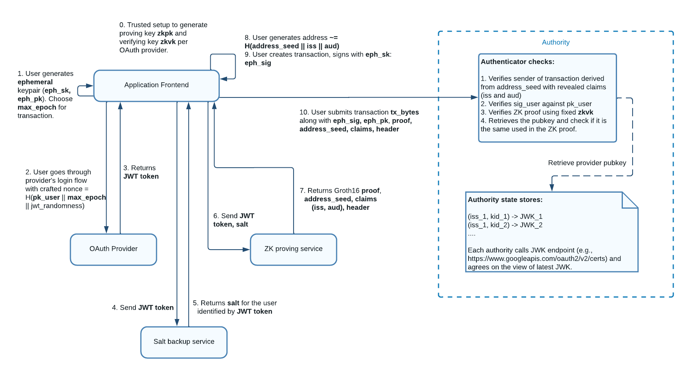
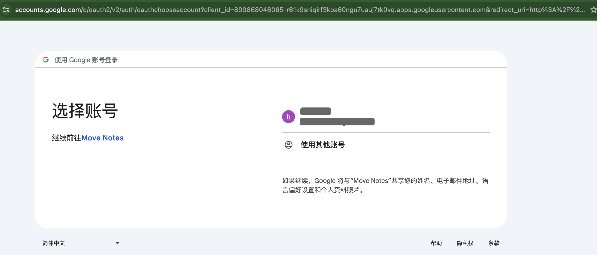
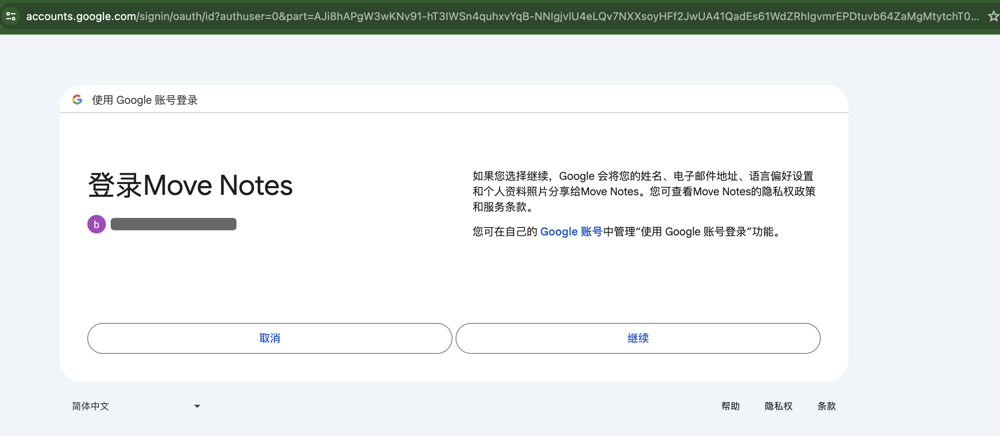
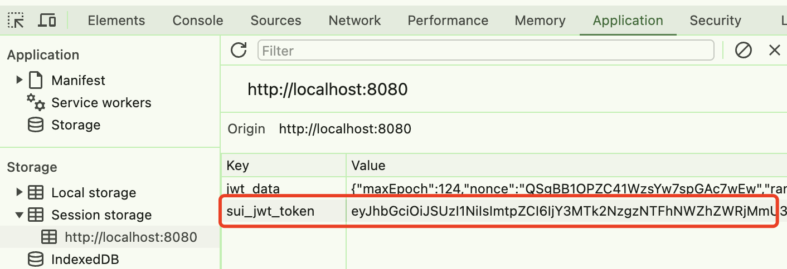
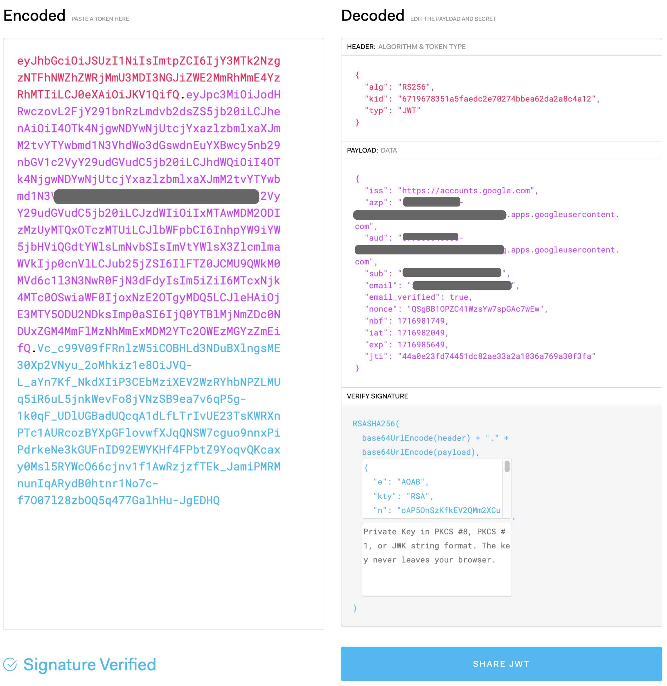

# Sui zkLogin核心交互逻辑拆解 @SUI Move开发必知必会

*rzexin 2024.05.28*

[TOC]

## 1 前言

本文将介绍`Sui zkLogin`的基本概念、原理及核心交互逻辑的拆解。

## 2 概念篇

### （1）OpenID

`OpenID`是一种允许用户使用单一的全局身份证明他们自己的系统，而不需要每个网站都有不同的用户名和密码。

### （2）OpenID provider (OP)

它是提供`OpenID`身份验证的服务提供商。`OpenID`提供商就是存储用户的`OpenID`身份信息（如用户名和密码）并确认这些信息的服务商。当用户试图登录使用`OpenID`进行身份验证的网站时，该网站会将用户重定向到其`OpenID`提供商进行身份验证。

它使用`JWT`中`iss`字段进行标识。

### （3）Relying party (RP)

它是指在`OpenID`身份验证过程中依赖`OpenID`提供商（`OP`）进行用户身份验证的网站或应用程序，即需要验证用户身份的那一方。

当用户尝试使用`OpenID`登录到依赖方网站时，该网站会将用户重定向到其`OpenID`提供商进行身份验证。一旦`OpenID`提供商确认了用户的身份，它会将用户重定向回依赖方网站，并向其提供关于用户身份的相关信息。依赖方网站根据从`OpenID`提供商获取的信息来确定用户是否可以访问其服务。这种方式允许用户使用单一的登录凭据访问多个网站，而不需要为每个网站创建单独的用户名和密码。

它使用`JWT`中的`aud`字段进行标识。代表了任何启用了`zkLogin`的钱包或应用。

### （4）Subject identifier (sub)

它是由`OpenID`提供商（`OP`）为用户生成的唯一标识符。`Sui`使用此作为派生用户地址的密钥声明。

### （5）JSON Web Key (JWK)

它表示`OpenID`提供商（`OP`）的一组公钥。可公开查询到（例如：https://www.googleapis.com/oauth2/v3/certs），用以得到应用对应的有效公钥。

### （6）JSON Web Token (JWT)

它是一种紧凑、`URL`安全的方式，用于在各方之间传递声明（`claims`）。它是一个开放标准（`RFC 7519`），主要用于身份验证和授权场景。在身份验证和授权过程中，`JWT`在客户端和服务器之间安全地传递用户信息。服务器可以使用签名和密钥验证JWT的完整性和真实性，而无需与发行者进行实时通信。

`JWT`由三部分组成：

- **头部（Header）**：包含令牌的类型和使用的加密算法的元数据

  | 字段名  | 示例            | 说明                                       |
  | ------- | --------------- | ------------------------------------------ |
  | **alg** | RS256           | `zkLogin` 只支持`RS256` (`RSA + SHA-256`). |
  | **kid** | c3afe7...2e5979 | 标识应用于验证 `JWT` 的 `JWK`              |
  | **typ** | JWT             | `zkLogin`只支持 `JWT`                      |

- **负载（Payload）**：包含一组声明（`claims`），这些声明是关于用户的信息和其他相关数据。声明可以是预定义的（如`iss`，`exp`，`sub`等）或自定义的

  | 字段名    | 示例                           | 说明                                                         |
  | --------- | ------------------------------ | ------------------------------------------------------------ |
  | **iss**   | https://accounts.google.com    | `OpenID`提供商唯一标识符                                     |
  | **aud**   | xxx.apps.googleusercontent.com | 依赖方的唯一标识                                             |
  | **nonce** | hTPpgF7XAKbW37rEUS6pEVZqmoI    | 由依赖方设置的值。支持 `zkLogin` 的钱包需要将其设置为**临时公钥的哈希值、到期时间和随机性**。 |
  | **sub**   | 110463452167303000000          | 用户唯一标识符                                               |

- **签名（Signature）**：用于验证`JWT`的发送者并确保令牌在传输过程中未被篡改。签名是通过将编码后的头部和负载连接在一起，并使用头部中指定的算法和一个密钥进行加密生成的

## 3 原理篇

### 3.1 实体

#### （1）Application frontend（应用前端）

它是支持`zkLogin`的钱包或前端应用。功能有：

- 存储临时私钥
- 指导用户完成 `OAuth`登录流程
- 创建和签署`zkLogin`交易

#### （2）Salt Backup Service（盐值备份服务）

它是一个后端服务，负责为每个唯一用户创建并管理对应的盐值。这样就无需用户自己去记忆这个盐值。

#### （3）ZK Proving Service（零知识证明服务）

它也是一个后端服务，负责根据`JWT`、`JWT`随机数、用户盐值和最大纪元生成`ZK`证明。该证明与 `zkLogin` 交易的临时签名一起在链上提交。

### 3.2 流程说明



（1）用户本地生成临时密钥对(`eph_sk, eph_pk`)，并制定`max_epoch`

（2）将`eph_pk`、到期时间（`max_epoch`）和随机数 (`jwt_randomness`)拼接后计算其哈希作为`nonce`值后，发起登录操作

（3）用户完成 `OAuth` 登录流程后，可以在应用程序的重定向 `URL` 中得到 `JWT`

（4）应用前端发送`JWT`到盐值服务上获取盐值

（5）盐值服务在校验`JWT`通过后，会基于 `iss, aud, sub` 创建唯一的用户盐值 `user_salt` ，并返回

（6）用户向零知识证明服务发送`JWT`、用户盐值、临时公钥、`JWT`随机数、密钥声明名称（即：`sub`）。证明服务生成一个零知识证明，将这些作为私有输入，并执行以下操作：

- 检查随机数是否按照定义正确派生
- 检查密钥声明值是否与 `JWT` 中的相应字段匹配
- 验证来自 `JWT` 上 `OP` 的 `RSA` 签名
- 地址与密钥声明值和用户盐值是否一致

（7）返回零知识证明信息

（8）应用前端根据`iss`、`aud`、`sub`计算用户地址。只要应用程序具有有效的 `JWT`，就可以独立完成此步骤

（9）用户创建交易，使用临时私钥对交易进行签名，以生成临时签名

（10）用户将交易连通临时签名、临时公钥、零知识证明等信息提交给`Sui`节点。`Sui`节点会根据存储的 `JWK` 验证零知识证明以及临时签名是否正确

## 4 拆解篇

将`zkLogin`集成到前端应用的核心流程如下：

-   在应用中创建临时密钥对

-   应用提示用户使用与临时公钥对应的随机数完成 `OAuth` 登录流程

-   应用从回调中得到`JWT`后

-   应用根据`JWT`获取唯一的用户盐值，并计算`zkLogin Sui`地址
-   获取零知识证明

-   应用使用临时私钥签名交易

-   应用提交带有临时签名和零知识证明的交易到节点

接下来将通过代码展开介绍具体实现细节。

### 4.1 获取随机数

```tsx
import { Ed25519Keypair } from "@mysten/sui.js/keypairs/ed25519";
import { generateNonce, generateRandomness} from "@mysten/zklogin";

async function getNonce() {
  const { epoch } = await SUI_CLIENT.getLatestSuiSystemState();

  // 设置临时密钥对的过期时间(2天后过期)
  const maxEpoch = Number(epoch) + 2;

  // 创建临时密钥对
  const ephemeralKeyPair = new Ed25519Keypair();

  // 本地生成随机数
  const randomness = generateRandomness();

  // 生成Nonce
  const nonce = generateNonce(
    ephemeralKeyPair.getPublicKey(),
    maxEpoch,
    randomness
  );
  console.log("Nonce: ", { nonce });

  // 创建并存储jwtData后续会使用
  const jwtData = {
    maxEpoch,
    nonce,
    randomness,
    ephemeralKeyPair,
  };
  console.log("JWT Data: ", { jwtData });
  sessionStorage.setItem("jwt_data", JSON.stringify(jwtData));

  return nonce;
}

// 提供查询JWT Data配套的辅助方法
function getJwtData() {
  return JSON.parse(sessionStorage.getItem("jwt_data"));
}

function getMaxEpoch() {
  return getJwtData().maxEpoch;
}

function getRandomness() {
  return getJwtData().randomness;
}
```

-   **Nonce示例**

```
QjLb9zrqXv5ZtYNrYUQAvsV9aWQ
```

-   **JWT Data示例**

```json
{
	"maxEpoch": 81,
	"nonce": "QjLb9zrqXv5ZtYNrYUQAvsV9aWQ",
	"randomness": "272374730697089327731405285391353007171",
	"ephemeralKeyPair": {
		"keypair": {
			"publicKey": {"0":253,"1":122,"2":42,"3":206,"4":200,"5":151,"6":161,"7":167,"8":103,"9":67,"10":228,"11":190,"12":225,"13":179,"14":209,"15":75,"16":251,"17":236,"18":214,"19":97,"20":60,"21":42,"22":124,"23":164,"24":89,"25":251,"26":178,"27":243,"28":166,"29":135,"30":77,"31":28},
			"secretKey":{"0":150,"1":13,"2":84,"3":28,"4":101,"5":45,"6":138,"7":181,"8":219,"9":56,"10":24,"11":5,"12":2,"13":187,"14":100,"15":32,"16":80,"17":29,"18":195,"19":117,"20":43,"21":59,"22":92,"23":120,"24":132,"25":44,"26":52,"27":71,"28":233,"29":113,"30":234,"31":211,"32":253,"33":122,"34":42,"35":206,"36":200,"37":151,"38":161,"39":167,"40":103,"41":67,"42":228,"43":190,"44":225,"45":179,"46":209,"47":75,"48":251,"49":236,"50":214,"51":97,"52":60,"53":42,"54":124,"55":164,"56":89,"57":251,"58":178,"59":243,"60":166,"61":135,"62":77,"63":28}
			}
   }
}
```

### 4.2 获取`JWT`

#### （1）触发OAuth认证流程

```tsx
async function getJWT(nonce: string) {
    const params = new URLSearchParams({
      client_id: CLIENT_ID,
      redirect_uri: REDIRECT_URL,
      response_type: "id_token",
      scope: "openid email",
      nonce: nonce,
    });

    console.log({ params });
  
    try {
      // 获取OpenId提供者信息
      const { data } = await axios.get(OPENID_PROVIDER_URL);
      console.log("openid provider info:", { data });
      
      // 构造OAuth认证URL
      const authUrl = `${data.authorization_endpoint}?${params}`;
      console.log("authUrl: ", { authUrl });
      
      // 触发OAuth认证流程
      window.location.href = authUrl;
      
    } catch (error) {
      console.error("Error initiating Google login:", error);
    }
}
```

-   **OpenId提供方信息**

>   我们查询`OpenId`提供方信息，主要是为获取其中的`authorization_endpoint`信息，用于拼接OAuth认证`URL`

```json
{
    "data": {
        "issuer": "https://accounts.google.com",
        "authorization_endpoint": "https://accounts.google.com/o/oauth2/v2/auth",
        "device_authorization_endpoint": "https://oauth2.googleapis.com/device/code",
        "token_endpoint": "https://oauth2.googleapis.com/token",
        "userinfo_endpoint": "https://openidconnect.googleapis.com/v1/userinfo",
        "revocation_endpoint": "https://oauth2.googleapis.com/revoke",
        "jwks_uri": "https://www.googleapis.com/oauth2/v3/certs",
        "response_types_supported": [
            "code",
            "token",
            "id_token",
            "code token",
            "code id_token",
            "token id_token",
            "code token id_token",
            "none"
        ],
        "subject_types_supported": [
            "public"
        ],
        "id_token_signing_alg_values_supported": [
            "RS256"
        ],
        "scopes_supported": [
            "openid",
            "email",
            "profile"
        ],
        "token_endpoint_auth_methods_supported": [
            "client_secret_post",
            "client_secret_basic"
        ],
        "claims_supported": [
            "aud",
            "email",
            "email_verified",
            "exp",
            "family_name",
            "given_name",
            "iat",
            "iss",
            "name",
            "picture",
            "sub"
        ],
        "code_challenge_methods_supported": [
            "plain",
            "S256"
        ],
        "grant_types_supported": [
            "authorization_code",
            "refresh_token",
            "urn:ietf:params:oauth:grant-type:device_code",
            "urn:ietf:params:oauth:grant-type:jwt-bearer"
        ]
    }
}
```

-   **authUrl示例**

```bash
https://accounts.google.com/o/oauth2/v2/auth?client_id=899868046065-r61k9sniqirf3koa60ngu7uauj7tk0vq.apps.googleusercontent.com&redirect_uri=http%3A%2F%2Flocalhost%3A8080&response_type=id_token&scope=openid+email&nonce=QjLb9zrqXv5ZtYNrYUQAvsV9aWQ
```

-   **触发OAuth认证流程**

>   将会弹出谷歌账户登录页面进行授权认证。





#### （2）获得`JWT`

>   一旦用户点击【继续】，确认使用谷歌账号登录后，便会得到回调，在回调`URL`中便包含了`JWT`信息

```bash
http://localhost:8080/#id_token=eyJhbGciOiJSUzI1NiIsImtpZCI6IjY3MTk2NzgzNTFhNWZhZWRjMmU3MDI3NGJiZWE2MmRhMmE4YzRhMTIiLCJ0eXAiOiJKV1QifQ.eyJpc3MiO~~~~~~dhNTg0YWU2YWViOWQifQ.OOnzpGs~~~~~~JhU3kxUVNWWnlid18
```

#### （3）存储`JWT`

>   在我们的应用中，需要处理回调，存储`JWT`信息

```tsx
const Callback = () => {
  useEffect(() => {
    const handleCallback = async () => {
      try {
        // 提取URL中id_token信息，即JWT数据
        const params = new URLSearchParams(window.location.hash.substr(1));
        const jwtToken = params.get("id_token");
        sessionStorage.setItem("sui_jwt_token", jwtToken);
        
        // 重定向到主页
        window.location.href = "/notes";
      } catch (error) {
        console.error("Error handling callback:", error);
      }
    };

    handleCallback();
  }, []);

  return (
    <div>
      <p>Processing callback...</p>
    </div>
  );
};

export default Callback;
```

-   **查看会话存储**

存储`JWT`成功后，我们可以在浏览器的会话存储中，拿到的`JWT`数据



-   **验证JWT**

可以在https://jwt.io/上，验证JWT的正确性：



#### （4）解码`JWT`

提供解码和获取JWT的方法，方便后续使用。

```tsx
export interface JwtPayload {
  iss?: string;
  sub?: string;
  aud?: string[] | string;
  exp?: number;
  nbf?: number;
  iat?: number;
  jti?: string;
}

function decodeJwt(): JwtPayload {
  const jwt = sessionStorage.getItem("sui_jwt_token");
  return jwtDecode(jwt) as JwtPayload;
}

function getJwt() {
  return sessionStorage.getItem("sui_jwt_token");
}
```

#### （5）获取`JWT`声明

`JWT`第二部分`Payload`信息中包含了`JWT`的声明（`claims`），我们将其进行`base64`解码后再转换成 `JavaScript`对象后返回。

```tsx
function claims() {
  const token = getJwt();
  if (token) return JSON.parse(atob(token.split(".")[1]));
}
```

### 4.3 获取用户盐值

`zkLogin`使用用户盐值来计算`zkLogin Sui`地址，有多种方式来创建：

-   钱包访问期间请求用户输入盐值（类似输入密码）
-   提供后端服务接口，管理用户与唯一盐值的映射

本示例中使用最简单的但不安全创建方式，用户盐值直接使用用户邮箱地址的哈希。

```tsx
function getSalt() {
  const email = getClaims()["email"];
  return hashcode(email);
}

function hashcode(s: string) {
  var h = 0,
    l = s.length,
    i = 0;
  if (l > 0) while (i < l) h = ((h << 5) - h + s.charCodeAt(i++)) | 0;
  return h.toString();
}
```

### 4.4 获取钱包地址

根据`JWT`和用户盐值可以计算得到`zkLogin`钱包地址：

```tsx
function getWalletAddress() {
  return jwtToAddress(getJwt(), getSalt());
}
```

### 4.5 获取零知识证明

该零知识证明是对临时密钥的证明，证明临时密钥是有效的。

#### （1）读取本地缓存的临时公钥和私钥

```tsx
function getEd25519Keypair(): Ed25519Keypair {
  const jwtData = getJwtData();
  const publicKey = new Uint8Array(
    Object.values(jwtData.ephemeralKeyPair.keypair.publicKey)
  );
  const secretKey = new Uint8Array(
    Object.values(jwtData.ephemeralKeyPair.keypair.secretKey)
  );
  return new Ed25519Keypair({ publicKey, secretKey });
}
```

#### （2）创建扩展临时公钥并构造零知识证明输入参数

```tsx
async function getPartialZkLoginSignature(): Promise<any> {
  const keyPair = getEd25519Keypair();
  const extendedEphemeralPublicKey = getExtendedEphemeralPublicKey(
    keyPair.getPublicKey()
  );
  const verificationPayload = {
    jwt: getJwt(),
    extendedEphemeralPublicKey,
    maxEpoch: getMaxEpoch(),
    jwtRandomness: getRandomness(),
    salt: getSalt(),
    keyClaimName: "sub",
  };

  return await verifyPartialZkLoginSignature(verificationPayload);
}
```

#### （3）发送请求到官方零知识证明服务获取零知识证明

```tsx
export type PartialZkLoginSignature = Omit<
  Parameters<typeof getZkLoginSignature>["0"]["inputs"],
  "addressSeed"
>;

async function verifyPartialZkLoginSignature(zkpRequestPayload: any) {
  try {
    const proofResponse = await axios.post(PROVER_URL, zkpRequestPayload, {
      headers: {
        "content-type": "application/json",
      },
    });
    const partialZkLoginSignature =
      proofResponse.data as PartialZkLoginSignature;
    return partialZkLoginSignature;
  } catch (error) {
    console.log("failed to reqeust the partial sig: ", error);
    return {};
  }
}
```

-   **获取到的零知识证明文件示例**

```json
{
  "proofPoints": {
    "a": [
      "17925336591841781284615651367405547572846272615826149243635878249044985055500",
      "12279218835873630013101684568683920004882401243723168340085453954637969728785",
      "1"
    ],
    "b": [
      [
        "9141770754945539006128827895194584204490459760275526514370152073714435760918",
        "15173589429221913961582463392253313555977669323316529601112428325964148100767"
      ],
      [
        "12580443653553164532707300651763166293379524130544795535318197661172461207094",
        "12870711157791514465643395695225557611672398621850553262649232711407595987086"
      ],
      [
        "1",
        "0"
      ]
    ],
    "c": [
      "17286175413872502507381131109205152210125604732772158615343210960118794252096",
      "11677883706790684404152653570455528043546266825635107820843294128794683097083",
      "1"
    ]
  },
  "issBase64Details": {
    "value": "yJpc3MiOiJodHRwczovL2FjY291bnRzLmdvb2dsZS5jb20iLC",
    "indexMod4": 1
  },
  "headerBase64": "eyJhbGciOiJSUzI1NiIsImtpZCI6IjY3MTk2NzgzNTFhNWZhZWRjMmU3MDI3NGJiZWE2MmRhMmE4YzRhMTIiLCJ0eXAiOiJKV1QifQ"
}
```

### 4.6 组装zkLogin签名和提交交易

#### （1）使用临时密钥对交易字节签名

```tsx
  private async makeMoveCall(txData: any, txb: TransactionBlock) {
    const keypair = getEd25519Keypair();
    const sender = getWalletAddress();
    txb.setSender(sender);
    txb.moveCall(txData);

    const { bytes, signature: userSignature } = await txb.sign({
      client: SUI_CLIENT,
      signer: keypair,
    });
		......
  }
```

#### （2）计算地址种子

结合用户盐值、`sub`、`aud`进行生成

```ts
function getAddressSeed() {
  const jwt = decodeJwt();
  const salt = getSalt();
  return genAddressSeed(
    BigInt(salt!),
    "sub",
    jwt.sub,
    jwt.aud.toString()
  ).toString();
}
```

#### （3）生成zkLogin签名

>   本示例中，每笔交易都会去获取一次零知识证明，是比较耗时的。实际上，由于每个零知识证明都与一个临时密钥对相关联。因此可以重复使用该证明来签署任意数量的交易，直到临时密钥对过期。

```tsx
export async function generateZkLoginSignature(
  userSignature: string
): Promise<SerializedSignature> {
  // 获取零知识证明
  const partialZkLoginSignature = await getPartialZkLoginSignature();
  const addressSeed = getAddressSeed();
  const maxEpoch = getMaxEpoch();
  
  // 获取zkLogin签名
  return getZkLoginSignature({
    inputs: {
      ...partialZkLoginSignature,
      addressSeed,
    },
    maxEpoch,
    userSignature,
  });
}
```

#### （4）提交交易

```ts
  private async makeMoveCall(txData: any, txb: TransactionBlock) {
    const keypair = getEd25519Keypair();
    const sender = getWalletAddress();
    txb.setSender(sender);
    txb.moveCall(txData);

    // 使用临时密钥对交易字节签名
    const { bytes, signature: userSignature } = await txb.sign({
      client: SUI_CLIENT,
      signer: keypair,
    });

    // 生成zkLogin签名
    const zkLoginSignature = await generateZkLoginSignature(userSignature);

		// 提交交易
    return SUI_CLIENT.executeTransactionBlock({
      transactionBlock: bytes,
      signature: zkLoginSignature,
    });
  }
```

## 5 更多

本文主要参考资料：

https://docs.sui.io/concepts/cryptography/zklogin

https://docs.sui.io/guides/developer/cryptography/zklogin-integration

https://learnblockchain.cn/article/7858

欢迎关注微信公众号：**Move中文**，开启你的 **Sui Move** 之旅！

