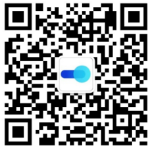

# Sui zkLogin原理与实践 @SUI Move开发必知必会

*rzexin 2024.05.28*

[TOC]

## 1 前言

本文将介绍`Sui zkLogin`的基本概念、原理及使用实践，希望对初学者有所帮助。

## 2 概念篇

### （1）OpenID

`OpenID`是一种允许用户使用单一的全局身份证明他们自己的系统，而不需要每个网站都有不同的用户名和密码。

### （2）OpenID provider (OP)

它是提供`OpenID`身份验证的服务提供商。`OpenID`提供商就是存储用户的`OpenID`身份信息（如用户名和密码）并确认这些信息的服务商。当用户试图登录使用`OpenID`进行身份验证的网站时，该网站会将用户重定向到其`OpenID`提供商进行身份验证。

它使用`JWT`中`iss`字段进行标识。

### （3）Relying party (RP)

它是指在`OpenID`身份验证过程中依赖`OpenID`提供商（`OP`）进行用户身份验证的网站或应用程序，即需要验证用户身份的那一方。

当用户尝试使用`OpenID`登录到依赖方网站时，该网站会将用户重定向到其`OpenID`提供商进行身份验证。一旦`OpenID`提供商确认了用户的身份，它会将用户重定向回依赖方网站，并向其提供关于用户身份的相关信息。依赖方网站根据从`OpenID`提供商获取的信息来确定用户是否可以访问其服务。这种方式允许用户使用单一的登录凭据访问多个网站，而不需要为每个网站创建单独的用户名和密码。

它使用`JWT`中的`aud`字段进行标识。代表了任何启用了`zkLogin`的钱包或应用。

### （4）Subject identifier (sub)

它是由`OpenID`提供商（`OP`）为用户生成的唯一标识符。`Sui`使用此作为派生用户地址的密钥声明。

### （5）JSON Web Key (JWK)

它表示`OpenID`提供商（`OP`）的一组公钥。可公开查询到（例如：https://www.googleapis.com/oauth2/v3/certs），用以得到应用对应的有效公钥。

### （6）JSON Web Token (JWT)

它是一种紧凑、`URL`安全的方式，用于在各方之间传递声明（`claims`）。它是一个开放标准（`RFC 7519`），主要用于身份验证和授权场景。在身份验证和授权过程中，`JWT`在客户端和服务器之间安全地传递用户信息。服务器可以使用签名和密钥验证JWT的完整性和真实性，而无需与发行者进行实时通信。

`JWT`由三部分组成：

- **头部（Header）**：包含令牌的类型和使用的加密算法的元数据

  | 字段名  | 示例            | 说明                                       |
  | ------- | --------------- | ------------------------------------------ |
  | **alg** | RS256           | `zkLogin` 只支持`RS256` (`RSA + SHA-256`). |
  | **kid** | c3afe7...2e5979 | 标识应用于验证 `JWT` 的 `JWK`              |
  | **typ** | JWT             | `zkLogin`只支持 `JWT`                      |

- **负载（Payload）**：包含一组声明（`claims`），这些声明是关于用户的信息和其他相关数据。声明可以是预定义的（如`iss`，`exp`，`sub`等）或自定义的

  | 字段名    | 示例                           | 说明                                                         |
  | --------- | ------------------------------ | ------------------------------------------------------------ |
  | **iss**   | https://accounts.google.com    | `OpenID`提供商唯一标识符                                     |
  | **aud**   | xxx.apps.googleusercontent.com | 依赖方的唯一标识                                             |
  | **nonce** | hTPpgF7XAKbW37rEUS6pEVZqmoI    | 由依赖方设置的值。支持 `zkLogin` 的钱包需要将其设置为**临时公钥的哈希值、到期时间和随机性**。 |
  | **sub**   | 110463452167303000000          | 用户唯一标识符                                               |

- **签名（Signature）**：用于验证`JWT`的发送者并确保令牌在传输过程中未被篡改。签名是通过将编码后的头部和负载连接在一起，并使用头部中指定的算法和一个密钥进行加密生成的

## 3 原理篇

### 3.1 实体

#### （1）Application frontend（应用前端）

它是支持`zkLogin`的钱包或前端应用。功能有：

- 存储临时私钥
- 指导用户完成 `OAuth`登录流程
- 创建和签署`zkLogin`交易

#### （2）Salt Backup Service（盐值备份服务）

它是一个后端服务，负责为每个唯一用户创建并管理对应的盐值。这样就无需用户自己去记忆这个盐值。

#### （3）ZK Proving Service（零知识证明服务）

它也是一个后端服务，负责根据JWT、JWT随机数、用户盐值和最大纪元生成`ZK`证明。该证明与 `zkLogin` 交易的临时签名一起在链上提交。

### 3.2 流程说明

（1）用户本地生成临时密钥对(`eph_sk, eph_pk`)，并制定`max_epoch`

（2）将`eph_pk`、到期时间（`max_epoch`）和随机数 (`jwt_randomness`)拼接后计算其哈希作为`nonce`值后，发起登录操作

（3）户完成 `OAuth` 登录流程后，可以在应用程序的重定向 `URL` 中找到 `JWT`

（4）应用前端发送`JWT`到盐值服务上

（5）盐值服务在校验`JWT`通过后，会基于 `iss, aud, sub` 创建唯一的用户盐值 `user_salt` ，并返回

（6）用户向ZK证明服务发送`JWT`、用户盐值、临时公钥、`JWT`随机数、密钥声明名（即：`sub`）。证明服务生成一个零知识证明，将这些作为私有输入，并执行以下操作：

- 检查随机数是否按照定义正确派生
- 检查密钥声明值是否与 `JWT` 中的相应字段匹配
- 验证来自 `JWT` 上 `OP` 的 `RSA` 签名
- 地址与密钥声明值和用户盐值是否一致

（7）返回零知识证明信息

（8）应用前端根据`iss`、`aud`、`sub`计算用户地址。只要应用程序具有有效的 `JWT`，就可以独立完成此步骤

（9）用户创建交易，使用临时私钥对交易进行签名，以生成临时签名

（10）用户将交易连通临时签名、临时公钥、`ZK`证明等信息提交给`Sui`节点。`Sui`节点会根据存储的 `JWK` 验证 `ZK` 证明以及临时签名

## 4 实践篇

## 5 更多

本文主要参考资料：

https://docs.sui.io/concepts/cryptography/zklogin

https://docs.sui.io/guides/developer/cryptography/zklogin-integration

欢迎关注微信公众号：**Move中文**，加入社群，开启你的 **Sui Move** 之旅！

