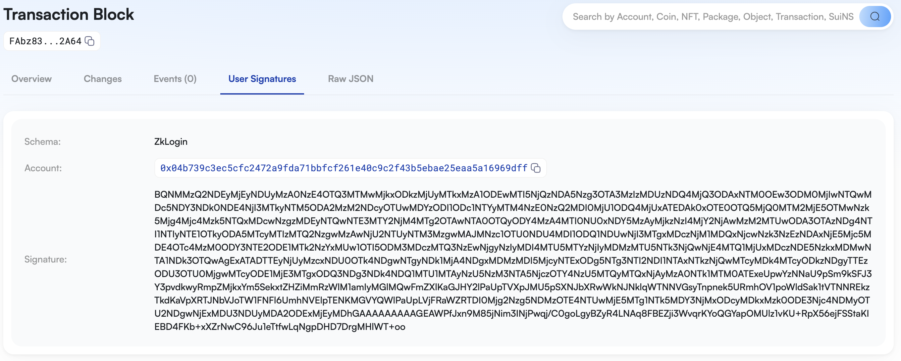
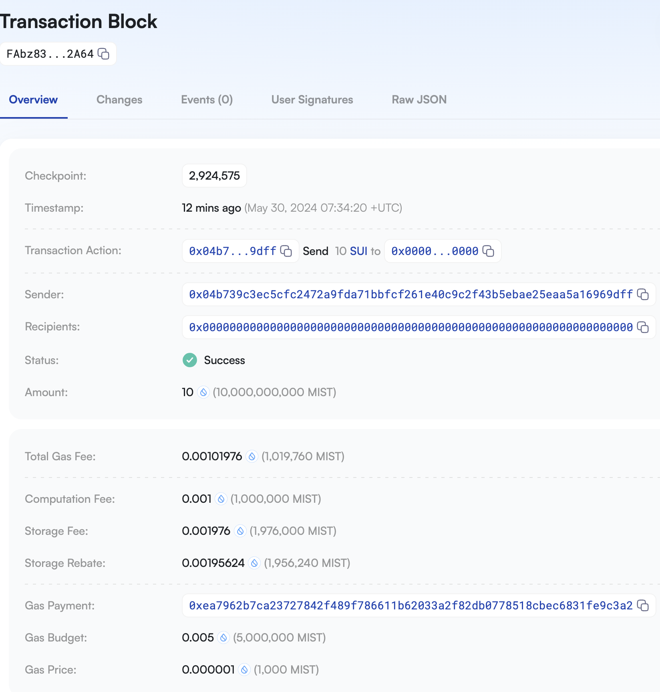

# SUI CLI最全命令详解5——Keytool之zkLogin类 @SUI Move开发必知必会

*rzexin 2024.05.30*

## 1 前言

`SUI`的命令行工具（`CLI`）的`keytool`命令提供了一些列的子命令，用于生成私钥、管理地址、签名验签、多签及`zkLogin`相关功能。

之前的文章我们已经介绍了：

- **密钥对类**（[《SUI CLI最全命令详解3——Keytool之密钥对类》](https://learnblockchain.cn/article/8203)）
- **单签多签类**（[《SUI CLI最全命令详解4——Keytool之单签多签类》](https://learnblockchain.cn/article/8235)）

本文将介绍`keytool`命令集中的最后一类**zkLogin类**。

>   关于`zkLogin`的介绍可以参看：
> 
> - [《Sui zkLogin核心交互逻辑拆解》](https://learnblockchain.cn/article/8252)
> - [《如何构建一个基于zkLogin的SUI Move dApp》](https://learnblockchain.cn/article/7858)

## 2 zkLogin类

### 2.1 `zk-login-sign-and-execute-tx `：zkLogin登录、验签、执行接口

#### （1）说明

这个接口感觉没有实际意义，只是用来体验`zkLogin`的整个流程，包括：

- 创建`OAuth`授权连接
- 用户登录后，获取并填入回调连接
- 访问官方盐值服务器获取盐值
- 访问零知识证明服务器获取零知识证明
- 领水
- 创建测试转账交易
- 使用临时私钥签名交易
- 获取零知识证明签名（`partialZkLoginSignature`）
- 组装成`zkLogin`签名（`zkLoginSignature`）

```
Given the max_epoch, generate an OAuth url, ask user to paste the redirect with id_token, call salt server, then call the prover server, create a test transaction, use the ephemeral key to sign and execute it by assembling to a serialized zkLogin signature
```

#### （2）用法

- 若设置`--test-multisig `将使用多签地址（`zkLogin`地址+普通公钥地址）
- 若设置`--sign-with-sk`将使用传统私钥签名，否则使用`zkLogin`签名

```bash
Usage: sui keytool zk-login-sign-and-execute-tx [OPTIONS] --max-epoch <MAX_EPOCH>

Options:
      --max-epoch <MAX_EPOCH>  
      --json                   Return command outputs in json format
      --network <NETWORK>      [default: devnet]
      --fixed                  
      --test-multisig          
      --sign-with-sk      
```

#### （3）使用

执行命令后，会依次经历以下步骤：

```bash
$ sui keytool zk-login-sign-and-execute-tx --max-epoch 70
```

- **创建本地临时公私钥对**

```bash
Ephemeral keypair: Ok("suiprivkey1qr45fwuwmjnjehprdxkvhwkyjmf6qk00mhqdl3xk267q74rgfy7c7er5xmx")
Ephemeral key identifier: 0x73a6b62b367842dfabd4e504b3a0908e41556031a82ec0ca7a4a8be02653ec35
Keys saved as Base64 with 33 bytes `flag || privkey` ($BASE64_STR). 
        To see Bech32 format encoding, use `sui keytool export $SUI_ADDRESS` where 
        $SUI_ADDRESS can be found with `sui keytool list`. Or use `sui keytool convert $BASE64_STR`.
Ephemeral pubkey (BigInt): 28052518987115222205950885460171773646293850437629977637885534225349525629480
```

- **创建随机数**

```bash
Jwt randomness: 101460194016860753987736196028199365769
```

- **创建OAuth认证URL**

```bash
Visit URL (Google): https://accounts.google.com/o/oauth2/v2/auth?client_id=25769832374-famecqrhe2gkebt5fvqms2263046lj96.apps.googleusercontent.com&response_type=id_token&redirect_uri=https://sui.io/&scope=openid&nonce=3-QOndCJH1FxFKKWagDYtp55tNY
Visit URL (Twitch): https://id.twitch.tv/oauth2/authorize?client_id=rs1bh065i9ya4ydvifixl4kss0uhpt&force_verify=true&lang=en&login_type=login&redirect_uri=https://sui.io/&response_type=id_token&scope=openid&nonce=3-QOndCJH1FxFKKWagDYtp55tNY
Visit URL (Facebook): https://www.facebook.com/v17.0/dialog/oauth?client_id=233307156352917&redirect_uri=https://sui.io/&scope=openid&nonce=3-QOndCJH1FxFKKWagDYtp55tNY&response_type=id_token
Visit URL (Kakao): https://kauth.kakao.com/oauth/authorize?response_type=code&client_id=aa6bddf393b54d4e0d42ae0014edfd2f&redirect_uri=https://sui.io/&nonce=3-QOndCJH1FxFKKWagDYtp55tNY
Token exchange URL (Kakao): https://kauth.kakao.com/oauth/token?grant_type=authorization_code&client_id=aa6bddf393b54d4e0d42ae0014edfd2f&redirect_uri=https://sui.io/&code=$YOUR_AUTH_CODE
Visit URL (Apple): https://appleid.apple.com/auth/authorize?client_id=nl.digkas.wallet.client&redirect_uri=https://sui.io/&scope=email&response_mode=form_post&response_type=code%20id_token&nonce=3-QOndCJH1FxFKKWagDYtp55tNY
Visit URL (Slack): https://slack.com/openid/connect/authorize?response_type=code&client_id=2426087588661.5742457039348&redirect_uri=https://sui.io/&nonce=3-QOndCJH1FxFKKWagDYtp55tNY&scope=openid
Token exchange URL (Slack): https://slack.com/api/openid.connect.token?code=$YOUR_AUTH_CODE&client_id=2426087588661.5742457039348&client_secret=39b955a118f2f21110939bf3dff1de90
Visit URL (AWS): https://zklogin-example.auth.us-east-1.amazoncognito.com/login?response_type=token&client_id=6c56t7re6ekgmv23o7to8r0sic&redirect_uri=https://www.sui.io/&nonce=3-QOndCJH1FxFKKWagDYtp55tNY
Visit URL (Microsoft): https://login.microsoftonline.com/common/oauth2/v2.0/authorize?client_id=2e3e87cb-bf24-4399-ab98-48343d457124&scope=openid&response_type=id_token&redirect_uri=https://www.sui.io&nonce=3-QOndCJH1FxFKKWagDYtp55tNY
Visit URL (KarrierOne): https://openid.karrier.one/Account/PhoneLogin?ReturnUrl=/connect/authorize?nonce=3-QOndCJH1FxFKKWagDYtp55tNY&redirect_uri=https://sui.io/&response_type=id_token&scope=openid&client_id=kns-dev
Visit URL (Credenza3): https://accounts.credenza3.com/oauth2/authorize?client_id=65954ec5d03dba0198ac343a&response_type=token&scope=openid+profile+email+phone&redirect_uri=https://example.com/callback&nonce=3-QOndCJH1FxFKKWagDYtp55tNY&state=state
Finish login and paste the entire URL here (e.g. https://sui.io/#id_token=...):
```

- **拷贝地址在浏览器上完成登录授权，将回调URL拷贝到终端**

```bash
https://sui.io/#id_token=eyJhbGciOiJSUzI1NiIsImtpZCI6IjY3MTk2NzgzNTFhNWZhZWRjMmU3MDI3NGJiZWE2MmRhMmE4YzRhMTIiLCJ0eXAiOiJKV1QifQ.eyJpc3MiOiJodHRwczovL2FjY291bnRzLmdvb2dsZS5j~~~~~~Zjc1YmIwIn0.SjG7u1Sl~~~~~~FMUpRM0UyWjNsUFQwUjVUUV8
```

- **创建用户盐值**

```bash
User salt: 129390038577185583942388216820280642146
```

- **创建零知识证明**

```bash
ZkLogin inputs:
"{\"proofPoints\":{\"a\":[\"3464122124523047189471302918932521913058101296434097879073230534482478015348\",\"7834220540079467494418627192539806336472950063825875562138714746024255848251\",\"1\"],\"b\":[[\"19149492441362199307992882783995410707830125405171666381869005049428683081245\",\"14693022937282666003361508079034885255225159928091721231467803006565525373800\"],[\"7759544580258454506271810736350416707977134016192790189783348675168151967611\",\"5929837073147710682722028159163622033159597640618145251073419791030505497940\"],[\"1\",\"0\"]],\"c\":[\"12652371454998480582495208481033029272511889587526425501593640172098172893482\",\"13857954280172815217181847487498445155102759737509673968759142141602304595134\",\"1\"]},\"issBase64Details\":{\"value\":\"yJpc3MiOiJodHRwczovL2FjY291bnRzLmdvb2dsZS5jb20iLC\",\"indexMod4\":1},\"headerBase64\":\"eyJhbGciOiJSUzI1NiIsImtpZCI6IjY3MTk2NzgzNTFhNWZhZWRjMmU3MDI3NGJiZWE2MmRhMmE4YzRhMTIiLCJ0eXAiOiJKV1QifQ\"}"
test_multisig false
```

- **创建zkLogin地址，领水并发送测试交易**

>   这里会输出交易字节和`zkLogin`签名，在下一个命令将会用到。

```bash
Use single zklogin address as sender
Sender: 0x04b739c3ec5cfc2472a9fda71bbfcf261e40c9c2f43b5ebae25eaa5a16969dff
Faucet requested and created test transaction: "AAACACAAAAAAAAAAAAAAAAAAAAAAAAAAAAAAAAAAAAAAAAAAAAEAhGXLkarOWmgp60zvUy95QCT9D5A+7TsN8WhKxF7oRmdDAAAAAAAAACDhMXD7Qkf8UQ26YbD5oNs05wGgpH+7a487cyX8W52kgQEBAQEBAAEAAAS3OcPsXPwkcqn9pxu/zyYeQMnC9DteuuJeqloWlp3/Aep5YrfKI3J4QvSJ94ZhG2IDOi+C2wd4UYy+xoMf6cOiQwAAAAAAAAAgVXax1zcQvqU+P64xElQ/xBcbAuiNeGu9UHh4GhgugIgEtznD7Fz8JHKp/acbv88mHkDJwvQ7XrriXqpaFpad/+gDAAAAAAAAQEtMAAAAAAAA"
Single zklogin sig Serialized: "BQNMMzQ2NDEyMjEyNDUyMzA0NzE4OTQ3MTMwMjkxODkzMjUyMTkxMzA1ODEwMTI5NjQzNDA5Nzg3OTA3MzIzMDUzNDQ4MjQ3ODAxNTM0OEw3ODM0MjIwNTQwMDc5NDY3NDk0NDE4NjI3MTkyNTM5ODA2MzM2NDcyOTUwMDYzODI1ODc1NTYyMTM4NzE0NzQ2MDI0MjU1ODQ4MjUxATEDAk0xOTE0OTQ5MjQ0MTM2MjE5OTMwNzk5Mjg4Mjc4Mzk5NTQxMDcwNzgzMDEyNTQwNTE3MTY2NjM4MTg2OTAwNTA0OTQyODY4MzA4MTI0NU0xNDY5MzAyMjkzNzI4MjY2NjAwMzM2MTUwODA3OTAzNDg4NTI1NTIyNTE1OTkyODA5MTcyMTIzMTQ2NzgwMzAwNjU2NTUyNTM3MzgwMAJMNzc1OTU0NDU4MDI1ODQ1NDUwNjI3MTgxMDczNjM1MDQxNjcwNzk3NzEzNDAxNjE5Mjc5MDE4OTc4MzM0ODY3NTE2ODE1MTk2NzYxMUw1OTI5ODM3MDczMTQ3NzEwNjgyNzIyMDI4MTU5MTYzNjIyMDMzMTU5NTk3NjQwNjE4MTQ1MjUxMDczNDE5NzkxMDMwNTA1NDk3OTQwAgExATADTTEyNjUyMzcxNDU0OTk4NDgwNTgyNDk1MjA4NDgxMDMzMDI5MjcyNTExODg5NTg3NTI2NDI1NTAxNTkzNjQwMTcyMDk4MTcyODkzNDgyTTEzODU3OTU0MjgwMTcyODE1MjE3MTgxODQ3NDg3NDk4NDQ1MTU1MTAyNzU5NzM3NTA5NjczOTY4NzU5MTQyMTQxNjAyMzA0NTk1MTM0ATExeUpwYzNNaU9pSm9kSFJ3Y3pvdkwyRmpZMjkxYm5SekxtZHZiMmRzWlM1amIyMGlMQwFmZXlKaGJHY2lPaUpTVXpJMU5pSXNJbXRwWkNJNklqWTNNVGsyTnpnek5URmhOV1poWldSak1tVTNNREkzTkdKaVpXRTJNbVJoTW1FNFl6UmhNVElpTENKMGVYQWlPaUpLVjFRaWZRTDI0Mjg2Nzg5NDMzOTE4NTUwMjE5MTg1NTk5MDY3NjMxODcyMDkxMzk0ODE3Njc4NDMyOTU2NDgwNjExMDU3NDUyMDA2ODExMjEyMDhGAAAAAAAAAGEAWPfJxn9M85jNim3INjPwqj/C0goLgyBZyR4LNAq8FBEZji3WvqrKYoQGYapOMUlz1vKU+RpX56ejFSStaKIEBD4FKb+xXZrNwC96Ju1eTtfwLqNgpDHD7DrgMHlWT+oo"
╭──────────┬────────────────────────────────────────────────╮
│ txDigest │  FAbz83Q1PhKHJSw1Kj1oWBfCTegzFoHnMdRM88dE2A64  │
╰──────────┴────────────────────────────────────────────────╯
```

- **浏览器查看交易**

https://devnet.suivision.xyz/txblock/FAbz83Q1PhKHJSw1Kj1oWBfCTegzFoHnMdRM88dE2A64?tab=User+Signatures





### 2.2 `zk-login-sig-verify `：zkLogin签名验证

#### （1）说明

```
Given a zkLogin signature, parse it if valid. 

If `bytes` provided, parse it as either as TransactionData or PersonalMessage based on `intent_scope`. It verifies the zkLogin signature based its latest JWK fetched.

Example request: sui
keytool zk-login-sig-verify --sig $SERIALIZED_ZKLOGIN_SIG --bytes $BYTES --intent-scope 0 --network devnet --curr-epoch 10
```

#### （2）用法

```bash
Usage: sui keytool zk-login-sig-verify [OPTIONS] --sig <SIG> --intent-scope <INTENT_SCOPE>

Options:
      --sig <SIG>                    The Base64 of the serialized zkLogin signature
      --bytes <BYTES>                The Base64 of the BCS encoded TransactionData or PersonalMessage
      --json                         Return command outputs in json format
      --intent-scope <INTENT_SCOPE>  Either 0 for TransactionData or 3 for PersonalMessage
      --cur-epoch <CUR_EPOCH>        The current epoch for the network to verify the signature's max_epoch against
      --network <NETWORK>            The network to verify the signature for, determines ZkLoginEnv [default: devnet]
```

#### （3）使用

>   将`zk-login-sign-and-execute-tx `命令输出的交易字节和签名作为参数传入。

```json
sui keytool zk-login-sig-verify --sig BQNMMzQ2NDEyMjEyNDUyMzA0NzE4OTQ3MTMwMjkxODkzMjUyMTkxMzA1ODEwMTI5NjQzNDA5Nzg3OTA3MzIzMDUzNDQ4MjQ3ODAxNTM0OEw3ODM0MjIwNTQwMDc5NDY3NDk0NDE4NjI3MTkyNTM5ODA2MzM2NDcyOTUwMDYzODI1ODc1NTYyMTM4NzE0NzQ2MDI0MjU1ODQ4MjUxATEDAk0xOTE0OTQ5MjQ0MTM2MjE5OTMwNzk5Mjg4Mjc4Mzk5NTQxMDcwNzgzMDEyNTQwNTE3MTY2NjM4MTg2OTAwNTA0OTQyODY4MzA4MTI0NU0xNDY5MzAyMjkzNzI4MjY2NjAwMzM2MTUwODA3OTAzNDg4NTI1NTIyNTE1OTkyODA5MTcyMTIzMTQ2NzgwMzAwNjU2NTUyNTM3MzgwMAJMNzc1OTU0NDU4MDI1ODQ1NDUwNjI3MTgxMDczNjM1MDQxNjcwNzk3NzEzNDAxNjE5Mjc5MDE4OTc4MzM0ODY3NTE2ODE1MTk2NzYxMUw1OTI5ODM3MDczMTQ3NzEwNjgyNzIyMDI4MTU5MTYzNjIyMDMzMTU5NTk3NjQwNjE4MTQ1MjUxMDczNDE5NzkxMDMwNTA1NDk3OTQwAgExATADTTEyNjUyMzcxNDU0OTk4NDgwNTgyNDk1MjA4NDgxMDMzMDI5MjcyNTExODg5NTg3NTI2NDI1NTAxNTkzNjQwMTcyMDk4MTcyODkzNDgyTTEzODU3OTU0MjgwMTcyODE1MjE3MTgxODQ3NDg3NDk4NDQ1MTU1MTAyNzU5NzM3NTA5NjczOTY4NzU5MTQyMTQxNjAyMzA0NTk1MTM0ATExeUpwYzNNaU9pSm9kSFJ3Y3pvdkwyRmpZMjkxYm5SekxtZHZiMmRzWlM1amIyMGlMQwFmZXlKaGJHY2lPaUpTVXpJMU5pSXNJbXRwWkNJNklqWTNNVGsyTnpnek5URmhOV1poWldSak1tVTNNREkzTkdKaVpXRTJNbVJoTW1FNFl6UmhNVElpTENKMGVYQWlPaUpLVjFRaWZRTDI0Mjg2Nzg5NDMzOTE4NTUwMjE5MTg1NTk5MDY3NjMxODcyMDkxMzk0ODE3Njc4NDMyOTU2NDgwNjExMDU3NDUyMDA2ODExMjEyMDhGAAAAAAAAAGEAWPfJxn9M85jNim3INjPwqj/C0goLgyBZyR4LNAq8FBEZji3WvqrKYoQGYapOMUlz1vKU+RpX56ejFSStaKIEBD4FKb+xXZrNwC96Ju1eTtfwLqNgpDHD7DrgMHlWT+oo --bytes AAACACAAAAAAAAAAAAAAAAAAAAAAAAAAAAAAAAAAAAAAAAAAAAEAhGXLkarOWmgp60zvUy95QCT9D5A+7TsN8WhKxF7oRmdDAAAAAAAAACDhMXD7Qkf8UQ26YbD5oNs05wGgpH+7a487cyX8W52kgQEBAQEBAAEAAAS3OcPsXPwkcqn9pxu/zyYeQMnC9DteuuJeqloWlp3/Aep5YrfKI3J4QvSJ94ZhG2IDOi+C2wd4UYy+xoMf6cOiQwAAAAAAAAAgVXax1zcQvqU+P64xElQ/xBcbAuiNeGu9UHh4GhgugIgEtznD7Fz8JHKp/acbv88mHkDJwvQ7XrriXqpaFpad/+gDAAAAAAAAQEtMAAAAAAAA --intent-scope 0 --json
{
  "data": null,
  "parsed": "{\"inputs\":{\"proofPoints\":{\"a\":[\"3464122124523047189471302918932521913058101296434097879073230534482478015348\",\"7834220540079467494418627192539806336472950063825875562138714746024255848251\",\"1\"],\"b\":[[\"19149492441362199307992882783995410707830125405171666381869005049428683081245\",\"14693022937282666003361508079034885255225159928091721231467803006565525373800\"],[\"7759544580258454506271810736350416707977134016192790189783348675168151967611\",\"5929837073147710682722028159163622033159597640618145251073419791030505497940\"],[\"1\",\"0\"]],\"c\":[\"12652371454998480582495208481033029272511889587526425501593640172098172893482\",\"13857954280172815217181847487498445155102759737509673968759142141602304595134\",\"1\"]},\"issBase64Details\":{\"value\":\"yJpc3MiOiJodHRwczovL2FjY291bnRzLmdvb2dsZS5jb20iLC\",\"indexMod4\":1},\"headerBase64\":\"eyJhbGciOiJSUzI1NiIsImtpZCI6IjY3MTk2NzgzNTFhNWZhZWRjMmU3MDI3NGJiZWE2MmRhMmE4YzRhMTIiLCJ0eXAiOiJKV1QifQ\",\"addressSeed\":\"2428678943391855021918559906763187209139481767843295648061105745200681121208\"},\"maxEpoch\":70,\"userSignature\":\"AFj3ycZ/TPOYzYptyDYz8Ko/wtIKC4MgWckeCzQKvBQRGY4t1r6qymKEBmGqTjFJc9bylPkaV+enoxUkrWiiBAQ+BSm/sV2azcAveibtXk7X8C6jYKQxw+w64DB5Vk/qKA==\"}",
  "jwks": null,
  "res": null
}
```

## 3 更多

欢迎关注微信公众号：**Move中文**，开启你的 **Sui Move** 之旅！


