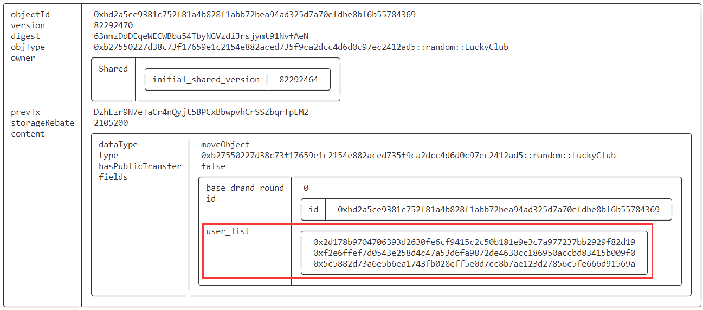
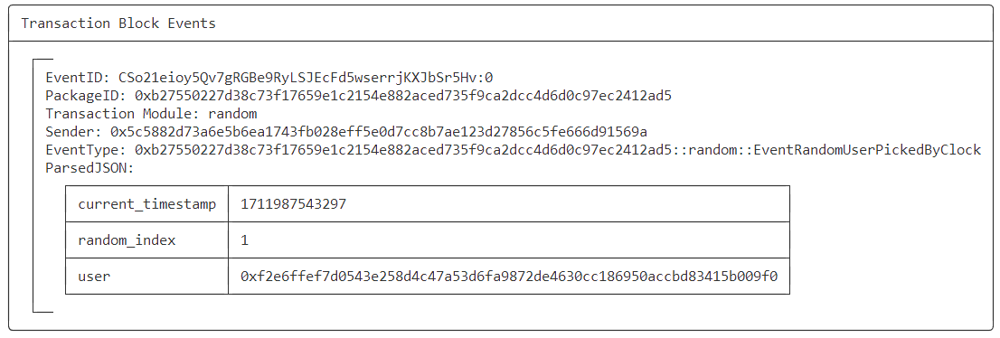
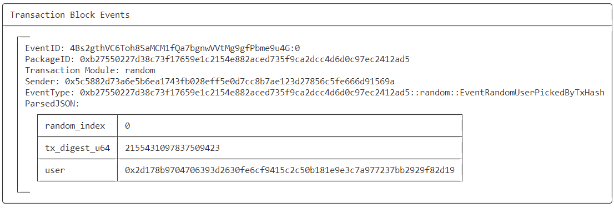
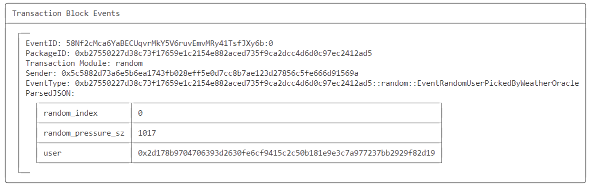
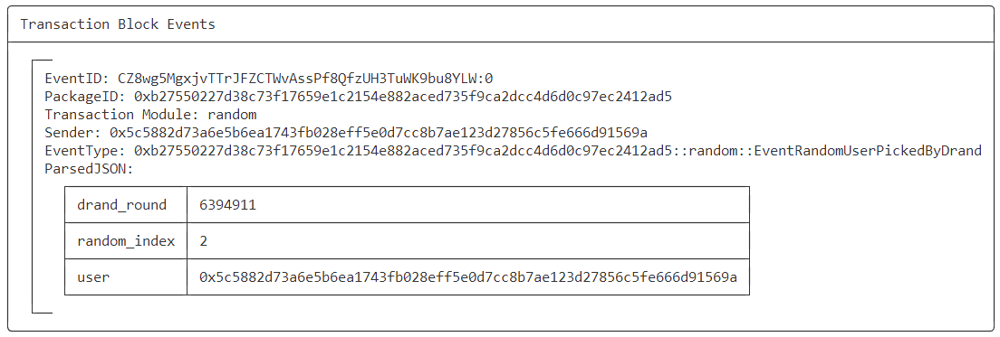

# SUI Move开发必知必会——如果获取随机数？

*rzexin 2024.04.02*

## 1 前言

随机数常用于区块链游戏或彩票抽奖类的智能合约中，被用来生成游戏结果或彩票中奖号码，以确保结果的公正性和公平性。

随机数可以从链上获得，例如时间戳、区块高度、交易哈希等，也可以通过链下的服务获得，但这两者各有不足。前者由于区块链的透明性，随机数可被预测、也有可能被矿工或验证者操控影响随机数的生成；后者通过链下预言机或第三方服务来提供随机数，可能存在中心化风险和性能问题。因此，尽管随机数在区块链上有许多重要的应用，但如何在区块链上生成一个既难以预测又难以操纵的随机数仍然是一个具有挑战性的问题。

本文并不考虑安全性，仅从技术角度出发，通过一个示例，探讨下在`SUI Move`合约中四种获取随机数的方式。

包括：

- **链上随机数**
  - **时间戳**
  - **交易哈希**
- **链下随机数**
  - **预言机（`weather-oracle`）**
  - **第三方服务（`drand`）**

## 2 前置准备

- 构造一个**幸运俱乐部（`LuckyClub`）**的合约场景，幸运俱乐部的创建者拥有管理员权限（`AdminCap`）
- 任何人都可以**加入（`join`）**该幸运俱乐部，每个地址只能加入一次，加入成功会抛出事件（`EventJoin`）
- 俱乐部创建者可以随机挑选幸运的俱乐部会员给予奖励或福利等，该挑选合约接口，将通过四种方式去进行实现

### 2.1 合约代码

```rust
    fun init(ctx: &mut TxContext) {
        transfer::share_object(LuckyClub {
            id: object::new(ctx),
            user_list: vector::empty(),
        });

        let sender = tx_context::sender(ctx);
        transfer::public_transfer(AdminCap {
            id: object::new(ctx)
        }, sender);
    }

    public entry fun join(lucky: &mut LuckyClub, ctx: &mut TxContext) {
        let sender = tx_context::sender(ctx);
        assert!(!vector::contains(&lucky.user_list, &sender), EAlreadyExisted);

        vector::push_back(&mut lucky.user_list, sender);

        let user_length = vector::length(&lucky.user_list); 

        event::emit(EventJoin { 
            sender,
            user_length,
        });
    }
```

### 2.2 测试执行

- **部署合约**

> 因为使用`weather-oracle`的缘故，可能因为代码版本比较老，故需要使用较老的`sui`，还需要跳过依赖检查，才能编译成功。

```bash
sui_1.19.1 client publish --gas-budget 100000000 --skip-dependency-verification
```

- **记录关键信息**

```bash
export PACKAGE_ID=0xb27550227d38c73f17659e1c2154e882aced735f9ca2dcc4d6d0c97ec2412ad5
export ADMIN_CAP=0x5d66dcb0421e4ac5c693e3462d232d83b33330246f262fb68f601b6e88a7aa41
export LUCKY_CLUB=0xbd2a5ce9381c752f81a4b828f1abb72bea94ad325d7a70efdbe8bf6b55784369
```

- **用户加入到俱乐部**

```bash
# 用户1加入
sui client switch --address u1
sui client call --function join --package $PACKAGE_ID --module random  --args $LUCKY_CLUB --gas-budget 10000000

# 用户2加入
sui client switch --address u2
sui client call --function join --package $PACKAGE_ID --module random  --args $LUCKY_CLUB --gas-budget 10000000

# 用户3加入
sui client switch --address jason
sui client call --function join --package $PACKAGE_ID --module random  --args $LUCKY_CLUB --gas-budget 10000000
```

- **查看当前幸运俱乐部对象**

```bash
sui client object $LUCKY_CLUB
```



## 3 方式1：使用时间戳获取随机数

### 3.1 合约代码

```rust
    public entry fun pick_random_user_by_clock(_: &AdminCap, lucky: &LuckyClub, clock: &Clock) {
        let user_length = vector::length(&lucky.user_list);
        assert!(user_length > 0, ENoUsersInList);

        let current_timestamp = clock::timestamp_ms(clock);

        let random_index = current_timestamp % user_length;
        let random_user = vector::borrow(&lucky.user_list, random_index);

        event::emit(EventRandomUserPickedByClock {
            user: *random_user,
            random_index: random_index,
            current_timestamp: current_timestamp,
        });
    }
```

### 3.2 测试执行

```bash
sui client call --function pick_random_user_by_clock --package $PACKAGE_ID --module random  --args $ADMIN_CAP $LUCKY_CLUB 0x6 --gas-budget 10000000
```

随机抽取出编号为1的幸运用户：



## 4 方式2：交易哈希

### 4.1 合约代码

```rust
    public entry fun pick_random_user_by_tx_hash(_: &AdminCap, lucky: &LuckyClub, ctx: &TxContext) {
        let user_length = vector::length(&lucky.user_list);
        assert!(user_length > 0, ENoUsersInList);

        let tx_digest = tx_context::digest(ctx);
        let tx_digest_u64= bcs::peel_u64(&mut bcs::new(*tx_digest));
        let random_index = tx_digest_u64 % user_length;
        let random_user = vector::borrow(&lucky.user_list, random_index);

        event::emit(EventRandomUserPickedByTxHash {
            user: *random_user,
            random_index: random_index,
            tx_digest_u64: tx_digest_u64,
        });
    }
```

### 4.2 测试执行

```bash
sui client call --function pick_random_user_by_tx_hash --package $PACKAGE_ID --module random  --args $ADMIN_CAP $LUCKY_CLUB --gas-budget 10000000
```

随机抽取出编号为0的幸运用户：



## 5 方式3：天气预言机

### 5.1 合约代码

```rust
    public entry fun pick_random_user_by_weather_oracle(_: &AdminCap, lucky: &LuckyClub, 
        weather_oracle: &WeatherOracle, ctx: &TxContext) {

        let user_length = vector::length(&lucky.user_list);
        assert!(user_length > 0, ENoUsersInList);

        let random_pressure_sz = oracle::weather::city_weather_oracle_pressure(weather_oracle, 1795566);

        let random_index = (random_pressure_sz as u64) % user_length;
        let random_user = vector::borrow(&lucky.user_list, random_index);

        event::emit(EventRandomUserPickedByWeatherOracle{
            user: *random_user,
            random_index: random_index,
            random_pressure_sz: random_pressure_sz,
        });
    }
```

### 5.2 测试执行

```bash
export WEATHER_ORACLE=0x1aedcca0b67b891c64ca113fce87f89835236b4c77294ba7e2db534ad49a58dc

sui client call --function pick_random_user_by_weather_oracle --package $PACKAGE_ID --module random  --args $ADMIN_CAP $LUCKY_CLUB $WEATHER_ORACLE --gas-budget 10000000
```

随机抽取出编号为0的幸运用户：



## 6 方式4：Drand随机数

### 6.1 合约代码

```rust
    public entry fun pick_random_user_by_drand(_: &AdminCap, lucky: &mut LuckyClub, 
        current_round: u64, drand_sig: vector<u8>, ctx: &TxContext) {

        assert!(lucky.base_drand_round < current_round, EInvalidDrandRound);
        verify_drand_signature(drand_sig, current_round);

        lucky.base_drand_round = current_round;

        let user_length = vector::length(&lucky.user_list);
        assert!(user_length > 0, ENoUsersInList);

        let digest = derive_randomness(drand_sig);
        let random_index = safe_selection(user_length, &digest);
        let random_user = vector::borrow(&lucky.user_list, random_index);

        event::emit(EventRandomUserPickedByDrand{
            user: *random_user,
            random_index: random_index,
            drand_round: current_round,
        });
    }
```

### 6.2 测试执行

```bash
# 获取当前轮次和随机数签名
curl -s https://drand.cloudflare.com/52db9ba70e0cc0f6eaf7803dd07447a1f5477735fd3f661792ba94600c84e971/public/latest > output.txt
export CURRENT_ROUND=`jq '.round' output.txt`
export SIGNATURE=0x`jq -r '.signature' output.txt`

sui client call --function pick_random_user_by_drand --package $PACKAGE_ID --module random  --args $ADMIN_CAP $LUCKY_CLUB $CURRENT_ROUND $SIGNATURE --gas-budget 10000000
```

随机抽取出编号为2的幸运用户：



## 7 完整合约代码

```rust
module bityoume::random {
    //==============================================================================================
    // Dependencies
    //==============================================================================================
    use sui::object::{Self, UID};
    use std::vector;
    use sui::tx_context::{Self, TxContext};
    use sui::clock::{Self, Clock};
    use sui::transfer;
    use sui::event;
    use sui::bcs;
    use oracle::weather::{WeatherOracle};
    use bityoume::drand_lib::{derive_randomness, verify_drand_signature, safe_selection};

    //==============================================================================================
    // Error codes 
    //==============================================================================================
    const EAlreadyExisted: u64 = 1;
    const ENoUsersInList: u64 = 2;
    const EInvalidDrandRound: u64 = 3;

    //==============================================================================================
    // Module Structs 
    //==============================================================================================
    struct LuckyClub has key {
        id: UID,
        user_list: vector<address>,
        base_drand_round: u64,
    }

    struct AdminCap has key, store {
        id: UID,
    }

    //==============================================================================================
    // Events
    //==============================================================================================
    struct EventJoin has copy, drop {
        sender: address,
        user_length: u64,
    }

    struct EventRandomUserPickedByClock has copy, drop {
        user: address,
        random_index: u64,
        current_timestamp: u64,
    }

    struct EventRandomUserPickedByTxHash has copy, drop {
        user: address,
        random_index: u64,
        tx_digest_u64: u64,
    }

    struct EventRandomUserPickedByWeatherOracle has copy, drop {
        user: address,
        random_index: u64,
        random_pressure_sz: u32,
    }

    struct EventRandomUserPickedByDrand has copy, drop {
        user: address,
        random_index: u64,
        drand_round: u64,
    }
    
    //==============================================================================================
    // Functions
    //==============================================================================================
    fun init(ctx: &mut TxContext) {
        transfer::share_object(LuckyClub {
            id: object::new(ctx),
            user_list: vector::empty(),
            base_drand_round: 0,
        });

        let sender = tx_context::sender(ctx);
        transfer::public_transfer(AdminCap {
            id: object::new(ctx)
        }, sender);
    }

    public entry fun join(lucky: &mut LuckyClub, ctx: &mut TxContext) {
        let sender = tx_context::sender(ctx);
        assert!(!vector::contains(&lucky.user_list, &sender), EAlreadyExisted);

        vector::push_back(&mut lucky.user_list, sender);

        let user_length = vector::length(&lucky.user_list); 

        event::emit(EventJoin { 
            sender,
            user_length,
        });
    }

    public entry fun pick_random_user_by_clock(_: &AdminCap, lucky: &LuckyClub, clock: &Clock) {
        let user_length = vector::length(&lucky.user_list);
        assert!(user_length > 0, ENoUsersInList);

        let current_timestamp = clock::timestamp_ms(clock);

        let random_index = current_timestamp % user_length;
        let random_user = vector::borrow(&lucky.user_list, random_index);

        event::emit(EventRandomUserPickedByClock {
            user: *random_user,
            random_index: random_index,
            current_timestamp: current_timestamp,
        });
    }

    public entry fun pick_random_user_by_tx_hash(_: &AdminCap, lucky: &LuckyClub, ctx: &TxContext) {
        let user_length = vector::length(&lucky.user_list);
        assert!(user_length > 0, ENoUsersInList);

        let tx_digest = tx_context::digest(ctx);
        let tx_digest_u64= bcs::peel_u64(&mut bcs::new(*tx_digest));
        let random_index = tx_digest_u64 % user_length;
        let random_user = vector::borrow(&lucky.user_list, random_index);

        event::emit(EventRandomUserPickedByTxHash {
            user: *random_user,
            random_index: random_index,
            tx_digest_u64: tx_digest_u64,
        });
    }

    public entry fun pick_random_user_by_weather_oracle(_: &AdminCap, lucky: &LuckyClub, 
        weather_oracle: &WeatherOracle, ctx: &TxContext) {

        let user_length = vector::length(&lucky.user_list);
        assert!(user_length > 0, ENoUsersInList);

        let random_pressure_sz = oracle::weather::city_weather_oracle_pressure(weather_oracle, 1795566);

        let random_index = (random_pressure_sz as u64) % user_length;
        let random_user = vector::borrow(&lucky.user_list, random_index);

        event::emit(EventRandomUserPickedByWeatherOracle{
            user: *random_user,
            random_index: random_index,
            random_pressure_sz: random_pressure_sz,
        });
    }

    public entry fun pick_random_user_by_drand(_: &AdminCap, lucky: &mut LuckyClub, 
        current_round: u64, drand_sig: vector<u8>, ctx: &TxContext) {

        assert!(lucky.base_drand_round < current_round, EInvalidDrandRound);
        verify_drand_signature(drand_sig, current_round);

        lucky.base_drand_round = current_round;

        let user_length = vector::length(&lucky.user_list);
        assert!(user_length > 0, ENoUsersInList);

        let digest = derive_randomness(drand_sig);
        let random_index = safe_selection(user_length, &digest);
        let random_user = vector::borrow(&lucky.user_list, random_index);

        event::emit(EventRandomUserPickedByDrand{
            user: *random_user,
            random_index: random_index,
            drand_round: current_round,
        });
    }
}
```

## 8 实例：抢红包中的随机金额

### 8.1 合约代码

https://github.com/movefuns/sui-red-packet/blob/main/contract/sources/red_packet.move#L187

```rust
  fun get_random(weather_oracle: &WeatherOracle, max: u64, clock: &Clock,ctx: &TxContext):u64{

    let sender = tx_context::sender(ctx);
    let tx_digest = tx_context::digest(ctx);
    let random_pressure_p = oracle::weather::city_weather_oracle_pressure(weather_oracle, 2988507);
    let random_pressure_l = oracle::weather::city_weather_oracle_pressure(weather_oracle, 88319);

    let random_vector = vector::empty<u8>();
    vector::append(&mut random_vector, address::to_bytes(copy sender));
    vector::append(&mut random_vector, u32_to_ascii(random_pressure_p));
    vector::append(&mut random_vector, u32_to_ascii(random_pressure_l));
    vector::append(&mut random_vector, u64_to_ascii(clock::timestamp_ms(clock)));
    vector::append(&mut random_vector, *copy tx_digest);

    let temp1 = blake2b256(&random_vector);
    let random_num_ex = bcs::peel_u64(&mut bcs::new(temp1));
    let random_value = ((random_num_ex % max) as u64);
    debug::print(&random_value);
    random_value
  }
}
```

### 8.2 合约说明

这个合约代码片段就是抢红包合约中计算随机金额的算法。

可见这里计算随机数同时使用到：

- **用户地址**
- **两个地址的大气压数据**
- **当前毫秒级别时间戳**
- **交易哈希**

将以上多种信息拼接到一起后，计算其`blake2b256`哈希，再计算其随机数。这样做的好处是：

- **增加随机性**：将多个不同来源的信息拼接在一起可以增加随机性。
- **减少可预测性**：通过将多个信息源混合在一起，可以降低随机数生成的可预测性。如果只使用单一信息源例如大气压，这个信息并不是实时数据，在一段时间内是不变的。将多个信息源结合在一起，可以降低这种风险。

## 9 更多

欢迎关注微信公众号：**Move中文**，开启你的 **Sui Move** 之旅！


