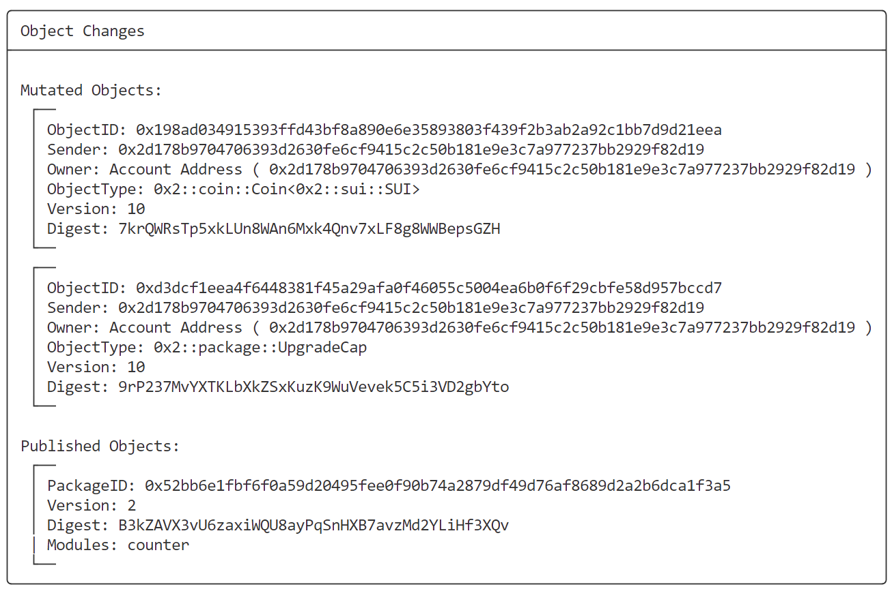

# SUI Move开发必知必会——如何进行合约升级？

*rzexin 2024.01.21*

## 1 原始合约部署

### 1.1 实现支持升级范式的合约

- **在合约当前 module 中使用常量 `VERSION` 记录当前的版本信息**

  > 可以考虑给共享 object 添加版本属性，限制只允许新版的合约进行操作，打破共享 object 的往后兼容，强迫用户选择升级

- **确保所有调用了共享 object 的 entry 函数都会检查，确保共享 object 的版本属性 `version` 与合约版本 `VERSION` 一致**

- **让执行共享 object 版本升级数据迁移的操作成为专有操作，并只允许使用 `AdminCap` 来调用**

```rust
module bityoume::counter {
    use sui::object::{Self, ID, UID};
    use sui::transfer;
    use sui::tx_context::{Self, TxContext};

    // 1. Track the current version of the module 
    const VERSION: u64 = 1;

    struct Counter has key {
        id: UID,
        
        // 2. Track the current version of the shared object
        // 在合约当前 module 中使用常量 `VERSION` 记录当前的版本信息
        version: u64,
        
        // 3. Associate the `Counter` with its `AdminCap`
        admin: ID,
        value: u64,
    }

    struct AdminCap has key {
        id: UID,
    }

    /// Not the right admin for this counter
    const ENotAdmin: u64 = 0;

    /// Calling functions from the wrong package version
    const EWrongVersion: u64 = 1;

    fun init(ctx: &mut TxContext) {
        
        // 让执行共享 object 版本升级数据迁移的操作成为专有操作，并只允许使用 `AdminCap` 来调用
        let admin = AdminCap {
            id: object::new(ctx),
        };

        transfer::share_object(Counter {
            id: object::new(ctx),
            version: VERSION,
            admin: object::id(&admin),
            value: 0,
        });

        transfer::transfer(admin, tx_context::sender(ctx));
    }

    public entry fun increment(c: &mut Counter) {
        // 4. Guard the entry of all functions that access the shared object 
        //    with a version check.
        assert!(c.version == VERSION, EWrongVersion);
        c.value = c.value + 1;
    }
}
```

### 1.2 合约部署

```bash
$ sui client publish --gas-budget 1000000000
```

### 1.3 部署信息

> 注：其中`AdminCap`在后续共享object数据迁移中用来管理权限，`UpgradeCap`是合约升级的关键权限

| 分类                             | ObjectID                                                     |
| -------------------------------- | ------------------------------------------------------------ |
| `PackageID`                      | `0x00be983705c48379a501c425ad6be42c42f16e119ac56992143729e6010f01c3` |
| `<PackageID>::counter::Counter`  | `0xdbf511026836ace95f6931971dae43e51403911a5f55f91814fcc78fcd701d92` |
| `<PackageID>::counter::AdminCap` | `0x0d586ce3e8104e5e3796f672032b1776894be8396377764997601f9b12813344` |
| `0x2::package::UpgradeCap`       | `0xd3dcf1eea4f6448381f45a29afa0f46055c5004ea6b0f6f29cbfe58d957bccd7` |


### 1.4 合约调用

```bash
export PACKAGE_ID=0x00be983705c48379a501c425ad6be42c42f16e119ac56992143729e6010f01c3
export COUNTER_ID=0xdbf511026836ace95f6931971dae43e51403911a5f55f91814fcc78fcd701d92
export ADMIN_CAP_ID=0x0d586ce3e8104e5e3796f672032b1776894be8396377764997601f9b12813344
export UPGRADE_CAP_ID=0xd3dcf1eea4f6448381f45a29afa0f46055c5004ea6b0f6f29cbfe58d957bccd7

sui client call --package $PACKAGE_ID --module counter --function increment --args $COUNTER_ID --gas-budget 5000000
```

### 1.5 查看Counter值

```bash
$ sui client object $COUNTER_ID
```


## 2 合约升级

### 2.1 升级合约编写

```rust
module bityoume::counter {
    use sui::event;
    use sui::object::{Self, ID, UID};
    use sui::transfer;
    use sui::tx_context::{Self, TxContext};

    // 1. Bump the `VERSION` of the package.
    const VERSION: u64 = 2;

    struct Counter has key {
        id: UID,
        version: u64,
        admin: ID,
        value: u64,
    }

    struct AdminCap has key {
        id: UID,
    }

    struct Progress has copy, drop {
        reached: u64,
    }

    /// Not the right admin for this counter
    const ENotAdmin: u64 = 0;

    /// Migration is not an upgrade
    const ENotUpgrade: u64 = 1;

    /// Calling functions from the wrong package version
    const EWrongVersion: u64 = 2;

    fun init(ctx: &mut TxContext) {
        let admin = AdminCap {
            id: object::new(ctx),
        };

        transfer::share_object(Counter {
            id: object::new(ctx),
            version: VERSION,
            admin: object::id(&admin),
            value: 0,
        });

        transfer::transfer(admin, tx_context::sender(ctx));
    }

    public entry fun increment(c: &mut Counter) {
        assert!(c.version == VERSION, EWrongVersion);
        c.value = c.value + 1;

        if (c.value % 10 == 0) {
            event::emit(Progress { reached: c.value })
        }
    }

    // 2. Introduce a migrate function
    entry fun migrate(c: &mut Counter, a: &AdminCap) {
        assert!(c.admin == object::id(a), ENotAdmin);
        assert!(c.version < VERSION, ENotUpgrade);
        c.version = VERSION;
    }
}
```

### 2.2 修改配置文件

对配置文件 `Move.toml` 进行编辑，`<ORIGINAL-PACKAGE-ID>` **填写之前发布合约的地址**。

```toml
[package]
name = "sui_package"
version = "0.0.1"
published-at = "0x00be983705c48379a501c425ad6be42c42f16e119ac56992143729e6010f01c3"

[addresses]
sui_package = "0x0"
```

### 2.3 运行合约升级命令

```bash
$ sui client upgrade --gas-budget 10000000 --upgrade-capability $UPGRADE_CAP_ID
```

### 2.4 部署信息

| 分类        | ObjectID                                                     |
| ----------- | ------------------------------------------------------------ |
| `PackageID` | `0x52bb6e1fbf6f0a59d20495fee0f90b74a2879df49d76af8689d2a2b6dca1f3a5` |



### 2.5 新合约迁移前调用

部署新合约后，在完成迁移之前，老合约可以正常调用，新合约若调用会触发异常，因为有版本检查。

- **新合约调用**

```bash
$ export NEW_PACKAGE_ID=0x52bb6e1fbf6f0a59d20495fee0f90b74a2879df49d76af8689d2a2b6dca1f3a5

$ sui client call --package $NEW_PACKAGE_ID --module counter --function increment --args $COUNTER_ID --gas-budget 5000000
```

- **触发异常**

```bash
Error executing transaction: Failure {
    error: "MoveAbort(MoveLocation { module: ModuleId { address: 00be983705c48379a501c425ad6be42c42f16e119ac56992143729e6010f01c3, name: Identifier(\"counter\") }, function: 1, instruction: 10, function_name: Some(\"increment\") }, 2) in command 0",
}
```


### 2.6 合约迁移

```bash
$ sui client call --package $NEW_PACKAGE_ID --module counter --function migrate --args $COUNTER_ID $ADMIN_CAP_ID --gas-budget 5000000
```

### 2.7 合约迁移后调用

- **旧合约调用失败**

```bash
$ sui client call --package $PACKAGE_ID --module counter --function increment --args $COUNTER_ID --gas-budget 5000000
Error executing transaction: Failure {
    error: "MoveAbort(MoveLocation { module: ModuleId { address: 00be983705c48379a501c425ad6be42c42f16e119ac56992143729e6010f01c3, name: Identifier(\"counter\") }, function: 1, instruction: 10, function_name: Some(\"increment\") }, 1) in command 0",
}
```

- ### 新合约调用成功

```bash
$ sui client call --package $NEW_PACKAGE_ID --module counter --function increment --args $COUNTER_ID --gas-budget 5000000
```


> 可见版本信息也发生了变化。

### 2.8 事件触发

根据合约逻辑当计数器增长到10的倍数时，将会触发合约事件。


## 3 参考资料

https://intro-zh.sui-book.com/advanced-topics/upgrade_packages/lessons/2_%E6%95%B0%E6%8D%AE%E8%BF%81%E7%A7%BB.html

## 4 更多

欢迎关注微信公众号：**Move中文**，开启你的 **Sui Move** 之旅！

