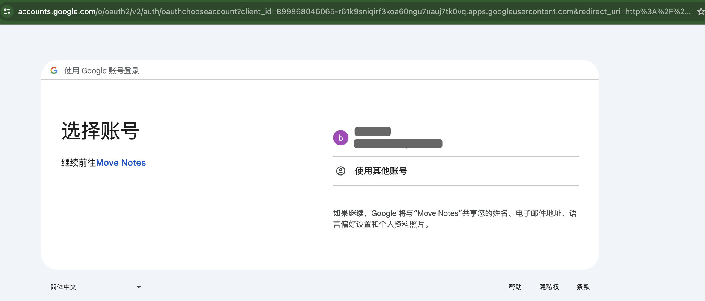
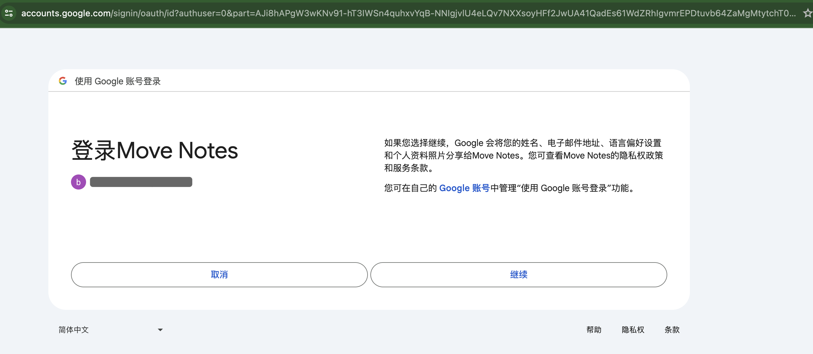

## 4 实践篇

将`zkLogin`集成到前端应用的核心流程如下：

-   在应用中创建临时密钥对

-   应用提示用户使用与临时公钥对应的随机数完成 `OAuth` 登录流程

-   应用收到`JWT`后，去获取零知识证明

-   应用根据`JWT`获取唯一的用户盐值，并计算`zkLogin Sui`地址

-   应用使用临时私钥签名交易

-   应用提交带有临时签名和零知识证明的交易到节点

接下来将通过代码展开介绍具体实现细节。

### 4.1 获取随机数

```tsx
import { Ed25519Keypair } from "@mysten/sui.js/keypairs/ed25519";
import { generateNonce, generateRandomness} from "@mysten/zklogin";

async function getNonce() {
  const { epoch } = await SUI_CLIENT.getLatestSuiSystemState();

  // 设置临时密钥对的过期时间(2天后过期)
  const maxEpoch = Number(epoch) + 2;

  // 创建临时密钥对
  const ephemeralKeyPair = new Ed25519Keypair();

  // 本地生成随机数
  const randomness = generateRandomness();

  // 生成Nonce
  const nonce = generateNonce(
    ephemeralKeyPair.getPublicKey(),
    maxEpoch,
    randomness
  );
  console.log("Nonce: ", { nonce });

  // 创建并存储jwtData后续会使用
  const jwtData = {
    maxEpoch,
    nonce,
    randomness,
    ephemeralKeyPair,
  };
  console.log("JWT Data: ", { jwtData });
  sessionStorage.setItem("jwt_data", JSON.stringify(jwtData));

  return nonce;
}
```

-   **Nonce示例**

```
QjLb9zrqXv5ZtYNrYUQAvsV9aWQ
```

-   **JWT Data示例**

```json
{
	"maxEpoch": 81,
	"nonce": "QjLb9zrqXv5ZtYNrYUQAvsV9aWQ",
	"randomness": "272374730697089327731405285391353007171",
	"ephemeralKeyPair": {
		"keypair": {
			"publicKey": {"0":253,"1":122,"2":42,"3":206,"4":200,"5":151,"6":161,"7":167,"8":103,"9":67,"10":228,"11":190,"12":225,"13":179,"14":209,"15":75,"16":251,"17":236,"18":214,"19":97,"20":60,"21":42,"22":124,"23":164,"24":89,"25":251,"26":178,"27":243,"28":166,"29":135,"30":77,"31":28},
			"secretKey":{"0":150,"1":13,"2":84,"3":28,"4":101,"5":45,"6":138,"7":181,"8":219,"9":56,"10":24,"11":5,"12":2,"13":187,"14":100,"15":32,"16":80,"17":29,"18":195,"19":117,"20":43,"21":59,"22":92,"23":120,"24":132,"25":44,"26":52,"27":71,"28":233,"29":113,"30":234,"31":211,"32":253,"33":122,"34":42,"35":206,"36":200,"37":151,"38":161,"39":167,"40":103,"41":67,"42":228,"43":190,"44":225,"45":179,"46":209,"47":75,"48":251,"49":236,"50":214,"51":97,"52":60,"53":42,"54":124,"55":164,"56":89,"57":251,"58":178,"59":243,"60":166,"61":135,"62":77,"63":28}
			}
   }
}
```

### 4.2 获取`JWT`

```tsx
async function getJWT(nonce: string) {
    const params = new URLSearchParams({
      client_id: CLIENT_ID,
      redirect_uri: REDIRECT_URL,
      response_type: "id_token",
      scope: "openid email",
      nonce: nonce,
    });

    console.log({ params });
  
    try {
      // 获取OpenId提供者信息
      const { data } = await axios.get(OPENID_PROVIDER_URL);
      console.log("openid provider info:", { data });
      
      // 构造OAuth认证URL
      const authUrl = `${data.authorization_endpoint}?${params}`;
      console.log("authUrl: ", { authUrl });
      
      // 触发OAuth认证流程
      window.location.href = authUrl;
      
    } catch (error) {
      console.error("Error initiating Google login:", error);
    }
}
```

-   **OpenId提供方信息**

>   主要是取得其中的`authorization_endpoint`信息

```json
{
    "data": {
        "issuer": "https://accounts.google.com",
        "authorization_endpoint": "https://accounts.google.com/o/oauth2/v2/auth",
        "device_authorization_endpoint": "https://oauth2.googleapis.com/device/code",
        "token_endpoint": "https://oauth2.googleapis.com/token",
        "userinfo_endpoint": "https://openidconnect.googleapis.com/v1/userinfo",
        "revocation_endpoint": "https://oauth2.googleapis.com/revoke",
        "jwks_uri": "https://www.googleapis.com/oauth2/v3/certs",
        "response_types_supported": [
            "code",
            "token",
            "id_token",
            "code token",
            "code id_token",
            "token id_token",
            "code token id_token",
            "none"
        ],
        "subject_types_supported": [
            "public"
        ],
        "id_token_signing_alg_values_supported": [
            "RS256"
        ],
        "scopes_supported": [
            "openid",
            "email",
            "profile"
        ],
        "token_endpoint_auth_methods_supported": [
            "client_secret_post",
            "client_secret_basic"
        ],
        "claims_supported": [
            "aud",
            "email",
            "email_verified",
            "exp",
            "family_name",
            "given_name",
            "iat",
            "iss",
            "name",
            "picture",
            "sub"
        ],
        "code_challenge_methods_supported": [
            "plain",
            "S256"
        ],
        "grant_types_supported": [
            "authorization_code",
            "refresh_token",
            "urn:ietf:params:oauth:grant-type:device_code",
            "urn:ietf:params:oauth:grant-type:jwt-bearer"
        ]
    }
}
```

-   **authUrl示例**

```bash
https://accounts.google.com/o/oauth2/v2/auth?client_id=899868046065-r61k9sniqirf3koa60ngu7uauj7tk0vq.apps.googleusercontent.com&redirect_uri=http%3A%2F%2Flocalhost%3A8080&response_type=id_token&scope=openid+email&nonce=QjLb9zrqXv5ZtYNrYUQAvsV9aWQ
```

-   **触发OAuth认证流程**

>   将会弹出谷歌账户登录页面进行授权认证。





-   **获得`JWT`**

>   一旦用户点击【继续】，确认使用谷歌账号登录后，便会得到回调，在回调信息中便包含了`JWT`信息

```bash
http://localhost:8080/#id_token=eyJhbGciOiJSUzI1NiIsImtpZCI6IjY3MTk2NzgzNTFhNWZhZWRjMmU3MDI3NGJiZWE2MmRhMmE4YzRhMTIiLCJ0eXAiOiJKV1QifQ.eyJpc3MiOiJodHRwczovL2FjY291bnRzLmdvb2dsZS5jb20iLCJhenAiOiI4OTk4NjgwNDYwNjUtcjYxazlzbmlxaXJmM2tvYTYwbmd1N3VhdWo3dGswdnEuYXBwcy5nb29nbGV1c2VyY29udGVudC5jb20iLCJhdWQiOiI4OTk4NjgwNDYwNjUtcjYxazlzbmlxaXJmM2tvYTYwbmd1N3VhdWo3dGswdnEuYXBwcy5nb29nbGV1c2VyY29udGVudC5jb20iLCJzdWIiOiIxMTAwMDM2ODIzMzUyMTQxOTczMTUiLCJlbWFpbCI6InhpYW9iYW5jbHViQGdtYWlsLmNvbSIsImVtYWlsX3ZlcmlmaWVkIjp0cnVlLCJub25jZSI6IjRyXzJkOWpyb3hvNTZUcGp5bTgzVG9KWkV6ZyIsIm5iZiI6MTcxNjk4MTA1OCwiaWF0IjoxNzE2OTgxMzU4LCJleHAiOjE3MTY5ODQ5NTgsImp0aSI6ImQyNTdhOTczZmJlZDAxMThmYWRkMTA4YWM0OTdhNTg0YWU2YWViOWQifQ.OOnzpGsMx2CvFouRRTuzTS6oJihJbVmjt5Mc3fYPNCKwo4fam9iw_S6CqUPdfwujpjp64lfEU0LeoOvC8u80JO4Ij4oRNICZ_gPHCXpw-zbEkQ4CenQq9fqjqmqECAl4RPe_3IhmnFb_7Ag8gbtDwEDtueXWLVoBq5MA1F05TRkU-SXRfQAJb_TXhoMB5kzCvOHNElJji8em2CIN26pFQaPzzzhWmDEStFteqMoxb0h-u9ERrB0kfITSZnrEI3ACAp6O3kUTYs9qO3uvg6zQCwbxaAU7WK1Wwf2uFdaFJiG0xK832PdVWdetwQD_fPtalr0JuMqm9YQwVu8cHMRFJg&authuser=0&prompt=consent&version_info=CmxfU1ZJX0VJT2wydl9kc29ZREdBNGlQMDFCUlVSSVpsOXhYMHR4ZGtOaE4yMVhSWFI0VldKUVVYTlVWR0pGWkRadFZUUnZaM1ZYY3pWcFJTMUdjRGMwTkcxbVdYZDZiM0JhU3kxUVNWWnlid18
```


